# RPG 项目 CommonUI 系统设计方案

> 基于 Lyra (Warrior) 架构，结合 RPG 项目现有 GAS/属性系统，设计完整的 UI 框架。

---

## 一、系统架构总览

### 1.1 架构分层图

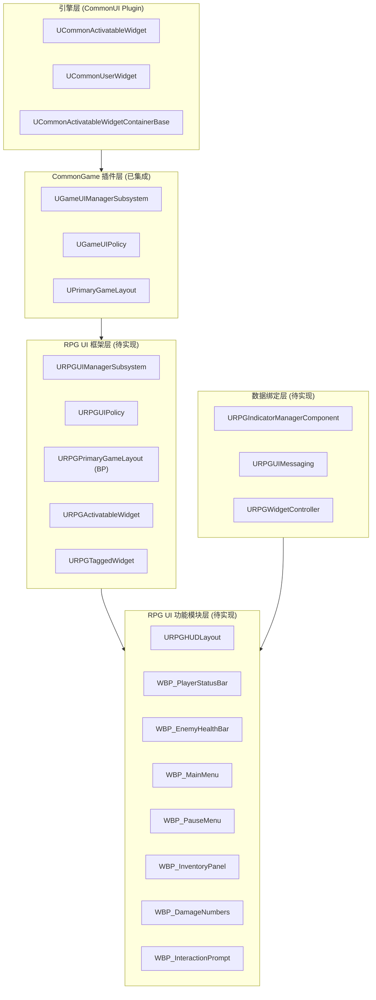

### 1.2 整体数据流

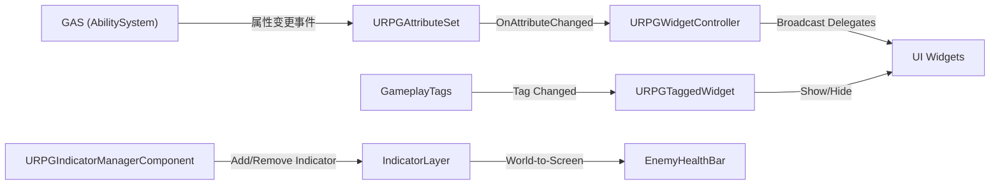

---

## 二、核心类图

### 2.1 UI 框架核心类

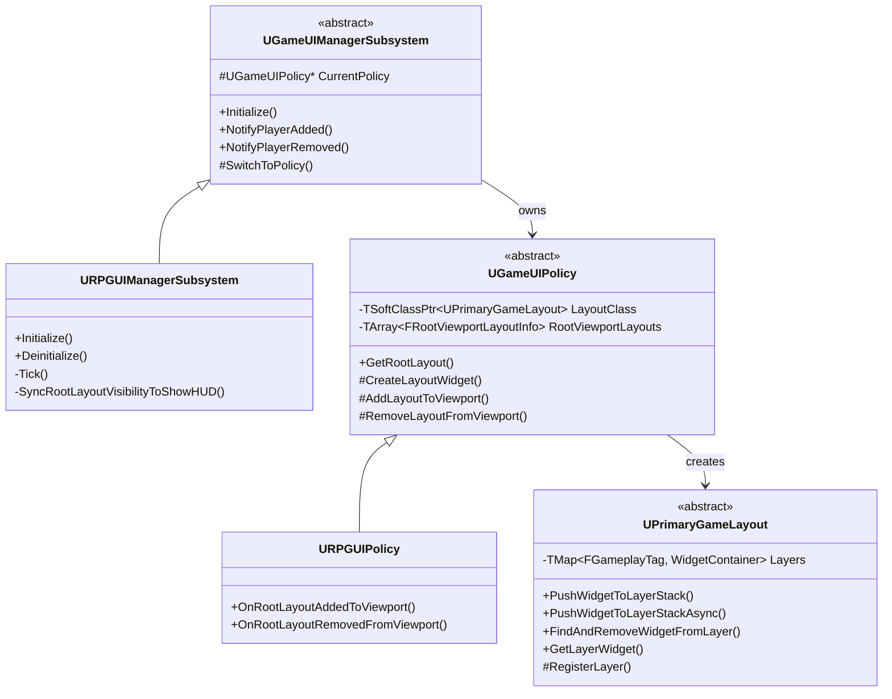

### 2.2 Widget 基类继承体系

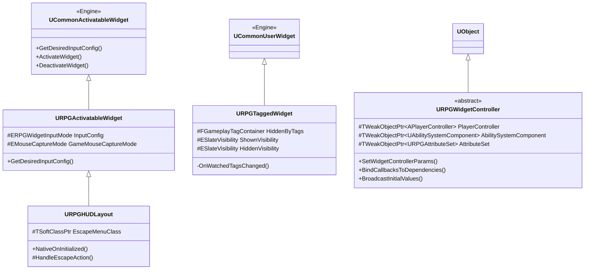

### 2.3 数据绑定 - WidgetController 体系

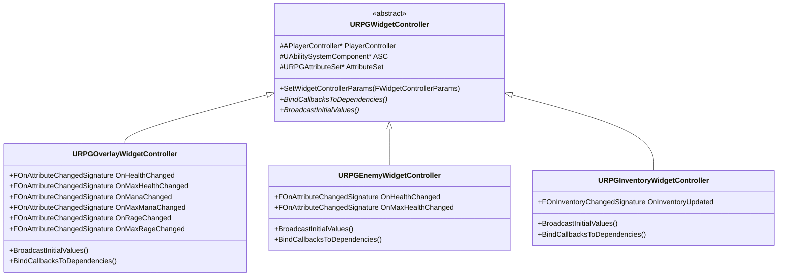

---

## 三、UI Layer (层级) 设计

遵循 Lyra 的 GameplayTag 驱动层级系统，在 `UPrimaryGameLayout` 中注册以下层：

| Layer Tag | 用途 | Z-Order | 示例 Widget |
|-----------|------|---------|------------|
| `UI.Layer.Game` | 游戏内 HUD，始终可见 | 0 (底层) | HUDLayout, PlayerStatusBar, EnemyHealthBar |
| `UI.Layer.GameMenu` | 游戏内弹出菜单 | 10 | InventoryPanel, CharacterPanel, SkillTree |
| `UI.Layer.Menu` | 暂停/系统菜单 | 20 | PauseMenu, SettingsMenu |
| `UI.Layer.Modal` | 模态对话框 | 30 | ConfirmDialog, LootDialog |

### 层级管理流程

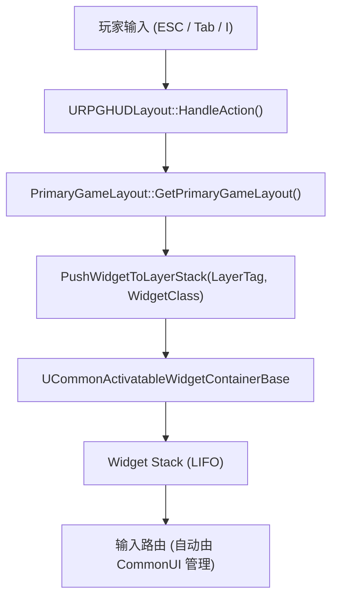

---

## 四、功能模块详细设计

### 4.1 主界面 HUD (URPGHUDLayout)

**职责**：作为 Game 层的根布局 Widget，承载所有 HUD 子控件的插槽。

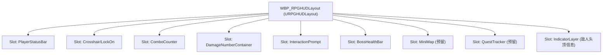

**类定义规划**：

```cpp
// URPGHUDLayout : public URPGActivatableWidget
// - 处理 ESC 打开暂停菜单
// - 管理 HUD 子控件的 Slot
// - 蓝图子类 WBP_RPGHUDLayout 中布局具体 UI 元素
```

### 4.2 玩家状态栏 (PlayerStatusBar)

**数据来源**：`URPGAttributeSet` 中的 CurrentHealth / MaxHealth / CurrentMana / MaxMana / CurrentRage / MaxRage

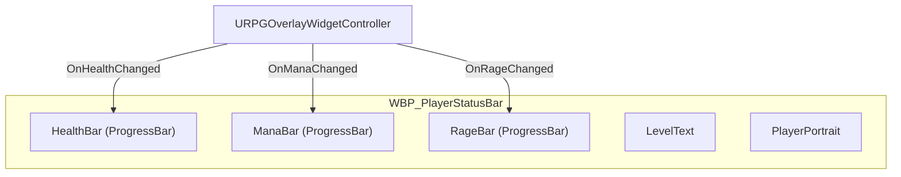

**数据绑定流程**：

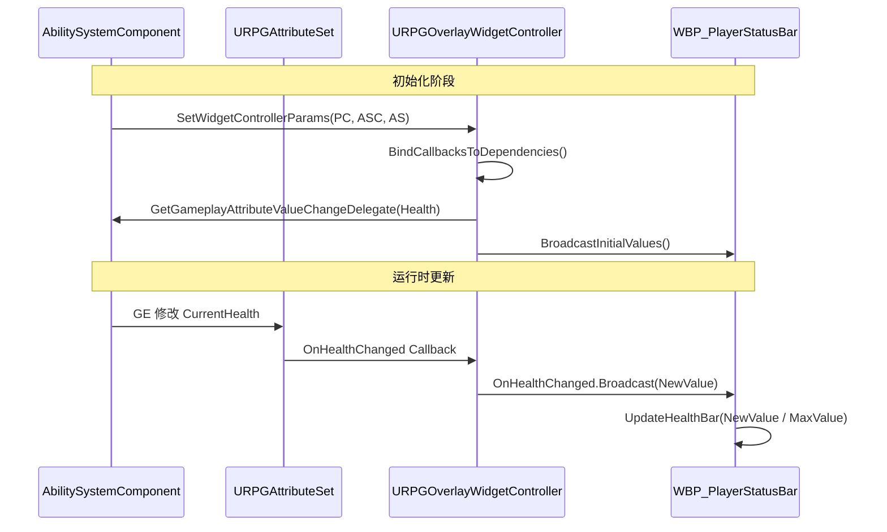

### 4.3 敌人血条 (EnemyHealthBar) - Indicator System

**核心思路**：复用 Lyra 的 IndicatorSystem，将敌人血条作为 WorldSpace 指示器渲染到屏幕上。

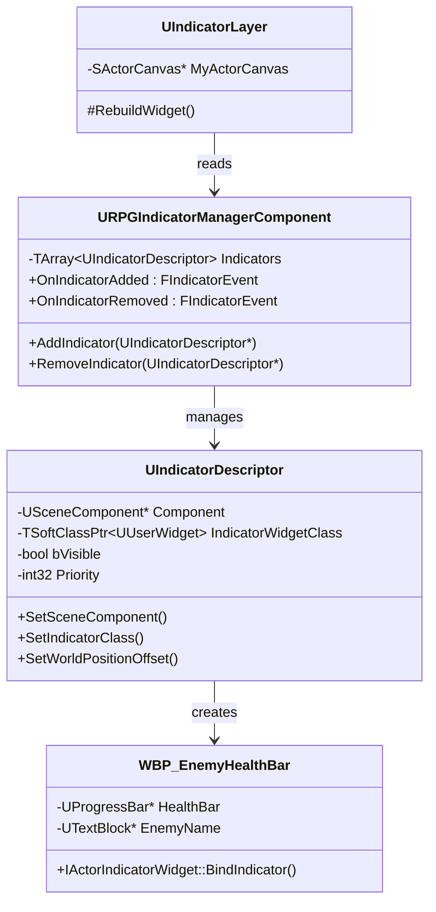

**敌人血条创建流程**：

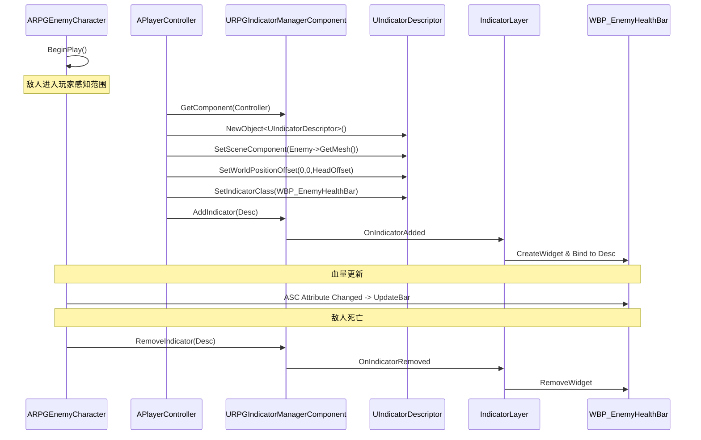

### 4.4 伤害数字 (DamageNumbers)

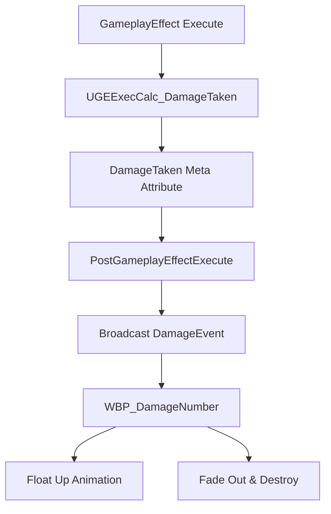

### 4.5 暂停菜单 (PauseMenu)

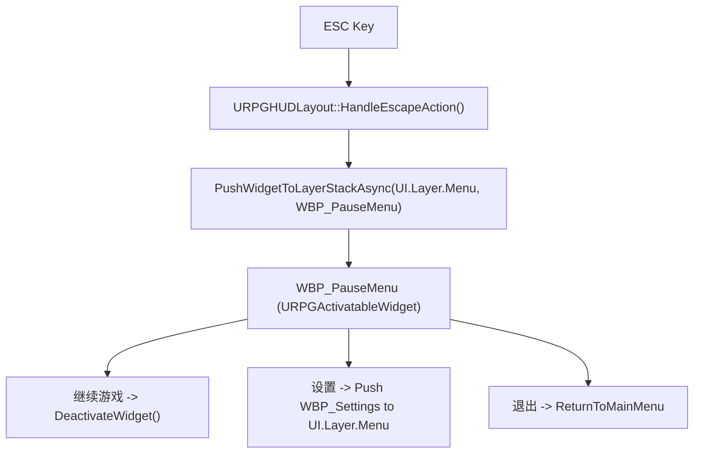

### 4.6 库存系统 (InventoryPanel) - 预留扩展

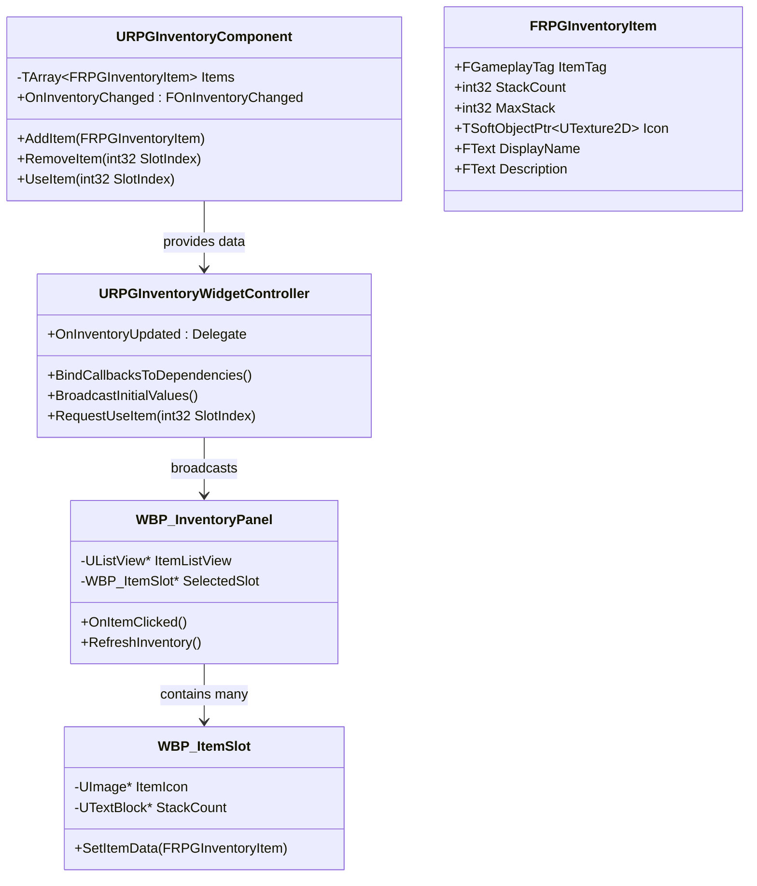

### 4.7 交互提示 (InteractionPrompt)

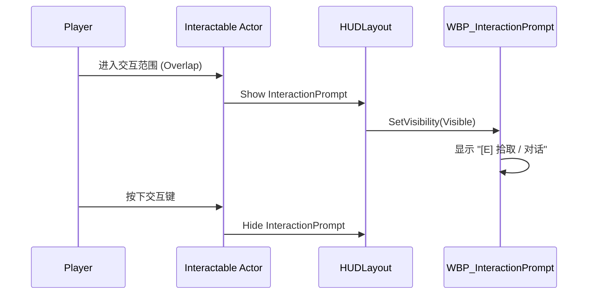

---

## 五、GameplayTag 规划

在现有 `RPGGameplayTags` 基础上新增 UI 相关 Tag：

```
UI.Layer.Game              // 游戏 HUD 层
UI.Layer.GameMenu          // 游戏内菜单层 (库存/角色面板)
UI.Layer.Menu              // 系统菜单层 (暂停/设置)  
UI.Layer.Modal             // 模态弹窗层 (确认对话框)

UI.HUD.Hidden.Dead         // 死亡时隐藏 HUD (配合 TaggedWidget)
UI.HUD.Hidden.InMenu       // 菜单打开时隐藏部分 HUD
UI.HUD.Hidden.Cinematic    // 过场动画时隐藏 HUD
```

---

## 六、完整初始化流程

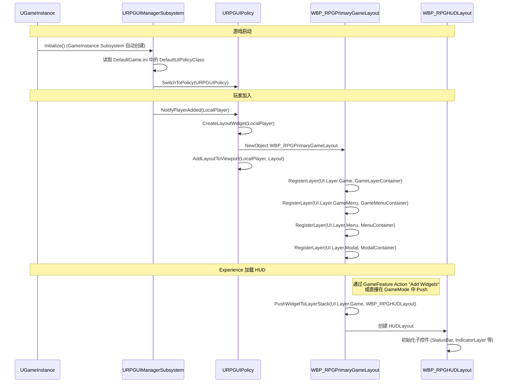

---

## 七、文件/目录结构规划

```
Source/RPG/
├── Public/
│   └── UI/
│       ├── Foundation/                    // UI 基础类
│       │   ├── RPGActivatableWidget.h     // 输入模式控制基类
│       │   ├── RPGTaggedWidget.h          // Tag 驱动显隐基类
│       │   └── RPGWidgetController.h      // 数据绑定控制器基类
│       │
│       ├── HUD/                           // HUD 相关
│       │   └── RPGHUDLayout.h             // HUD 根布局
│       │
│       ├── IndicatorSystem/               // 指示器系统 (敌人血条等)
│       │   ├── RPGIndicatorManagerComponent.h
│       │   └── RPGIndicatorDescriptor.h   // (如需扩展)
│       │
│       ├── WidgetController/              // Widget 数据控制器
│       │   ├── RPGOverlayWidgetController.h
│       │   ├── RPGEnemyWidgetController.h
│       │   └── RPGInventoryWidgetController.h
│       │
│       ├── Subsystem/                     // UI 子系统 (已存在)
│       │   └── RPGUIManagerSubsystem.h
│       │
│       └── Policy/                        // UI 策略
│           └── RPGUIPolicy.h
│
├── Private/
│   └── UI/
│       ├── Foundation/
│       │   ├── RPGActivatableWidget.cpp
│       │   ├── RPGTaggedWidget.cpp
│       │   └── RPGWidgetController.cpp
│       ├── HUD/
│       │   └── RPGHUDLayout.cpp
│       ├── IndicatorSystem/
│       │   └── RPGIndicatorManagerComponent.cpp
│       ├── WidgetController/
│       │   ├── RPGOverlayWidgetController.cpp
│       │   ├── RPGEnemyWidgetController.cpp
│       │   └── RPGInventoryWidgetController.cpp
│       ├── Subsystem/
│       │   └── RPGUIManagerSubsystem.cpp  // (已存在)
│       └── Policy/
│           └── RPGUIPolicy.cpp

Content/RPG/
├── UI/
│   ├── Foundation/
│   │   └── WBP_RPGPrimaryGameLayout.uasset   // PrimaryGameLayout 蓝图子类
│   ├── HUD/
│   │   ├── WBP_RPGHUDLayout.uasset            // HUD 根布局
│   │   ├── WBP_PlayerStatusBar.uasset          // 玩家状态栏
│   │   ├── WBP_ComboCounter.uasset             // 连击计数
│   │   └── WBP_DamageNumber.uasset             // 伤害数字
│   ├── Indicator/
│   │   ├── WBP_EnemyHealthBar.uasset           // 敌人血条
│   │   └── WBP_InteractionPrompt.uasset        // 交互提示
│   ├── Menu/
│   │   ├── WBP_PauseMenu.uasset                // 暂停菜单
│   │   ├── WBP_MainMenu.uasset                 // 主菜单
│   │   └── WBP_SettingsMenu.uasset             // 设置菜单
│   ├── GameMenu/
│   │   ├── WBP_InventoryPanel.uasset            // 库存面板
│   │   ├── WBP_ItemSlot.uasset                  // 道具槽
│   │   ├── WBP_CharacterPanel.uasset            // 角色面板 (预留)
│   │   └── WBP_SkillTree.uasset                 // 技能树 (预留)
│   └── Shared/
│       ├── WBP_ProgressBar.uasset               // 通用进度条
│       ├── WBP_RPGButton.uasset                 // 通用按钮
│       └── WBP_ConfirmDialog.uasset             // 确认对话框
```

---

## 八、配置要求

### 8.1 DefaultGame.ini

```ini
[/Script/CommonGame.GameUIManagerSubsystem]
DefaultUIPolicyClass=/Script/RPG.RPGUIPolicy
```

### 8.2 DefaultGameplayTags.ini 新增

```ini
+GameplayTagList=(Tag="UI.Layer.Game",DevComment="Game HUD Layer")
+GameplayTagList=(Tag="UI.Layer.GameMenu",DevComment="In-Game Menu Layer")
+GameplayTagList=(Tag="UI.Layer.Menu",DevComment="System Menu Layer")
+GameplayTagList=(Tag="UI.Layer.Modal",DevComment="Modal Dialog Layer")
+GameplayTagList=(Tag="UI.HUD.Hidden.Dead",DevComment="Hide HUD when dead")
+GameplayTagList=(Tag="UI.HUD.Hidden.InMenu",DevComment="Hide HUD in menus")
+GameplayTagList=(Tag="UI.HUD.Hidden.Cinematic",DevComment="Hide HUD in cinematics")
```

---

## 九、实施阶段规划

### 阶段一：基础框架搭建
1. 创建 `URPGActivatableWidget` / `URPGTaggedWidget` 基类
2. 创建 `URPGUIPolicy`，配置 `DefaultGame.ini`
3. 创建 `WBP_RPGPrimaryGameLayout` 蓝图，注册四个 Layer
4. 扩展 `URPGUIManagerSubsystem` (添加 Tick / HUD 可见性同步)
5. 注册 UI 相关 GameplayTags
6. **验证**：启动游戏，确认 PrimaryGameLayout 正确创建并添加到 Viewport

### 阶段二：HUD 与玩家状态栏
1. 创建 `URPGWidgetController` 基类和 `URPGOverlayWidgetController`
2. 创建 `URPGHUDLayout` C++ 类
3. 创建 `WBP_RPGHUDLayout` 蓝图 (布局各 Slot)
4. 创建 `WBP_PlayerStatusBar`，绑定 HP/Mana/Rage
5. 将 HUDLayout Push 到 `UI.Layer.Game`
6. **验证**：属性变更时 StatusBar 实时更新

### 阶段三：敌人血条 (Indicator System)
1. 创建 `URPGIndicatorManagerComponent`
2. 将 Lyra 的 `IndicatorLayer` / `SActorCanvas` / `IndicatorDescriptor` 适配到 RPG
3. 在 `WBP_RPGHUDLayout` 中添加 `IndicatorLayer` 控件
4. 创建 `WBP_EnemyHealthBar` (实现 `IActorIndicatorWidget`)
5. 敌人 BeginPlay 时注册 Indicator，死亡时移除
6. **验证**：敌人头顶正确显示血条，受击时实时更新，死亡后消失

### 阶段四：菜单系统
1. 创建 `WBP_PauseMenu` (Push 到 `UI.Layer.Menu`)
2. HUDLayout 的 ESC 处理逻辑
3. 创建 `WBP_SettingsMenu`
4. 创建 `WBP_ConfirmDialog` (Push 到 `UI.Layer.Modal`)
5. **验证**：ESC 打开暂停菜单，输入模式正确切换，返回后恢复游戏输入

### 阶段五：伤害数字与交互提示
1. 伤害数字组件 (`WBP_DamageNumber`)
2. 伤害数字对象池管理
3. 交互提示 (`WBP_InteractionPrompt`)
4. **验证**：攻击敌人时弹出伤害数字，靠近可交互物体时显示提示

### 阶段六：库存系统 (扩展)
1. 创建 `URPGInventoryComponent`
2. 创建 `URPGInventoryWidgetController`
3. 创建 `WBP_InventoryPanel` + `WBP_ItemSlot`
4. 按键绑定 (I 键) Push 到 `UI.Layer.GameMenu`
5. **验证**：打开/关闭库存，物品显示和操作正常

---

## 十、关键设计原则

1. **遵循 Warrior (Lyra) 架构**：所有 UI 基础设施严格参照 Lyra 的 CommonGame 插件模式
2. **C++ 定义骨架，蓝图负责布局**：C++ 类处理逻辑和数据绑定，蓝图处理视觉布局
3. **WidgetController 解耦**：Widget 不直接访问 ASC/AttributeSet，通过 WidgetController 中转
4. **GameplayTag 驱动**：层级管理、显隐控制全部通过 GameplayTag 驱动
5. **Indicator System 复用**：世界空间 UI (敌人血条、交互提示) 统一使用 Indicator System
6. **渐进式实施**：按阶段推进，每个阶段独立可验证
