# 4 详细设计

## 4.1 系统总体架构设计

本课题基于Unreal Engine 5.6引擎开发第三人称角色扮演游戏，系统采用组件化架构（Component-Based Architecture）与事件驱动通信机制，实现高内聚低耦合的模块化设计。系统总体架构分为五个层次：表现层（Presentation Layer）、控制层（Control Layer）、逻辑层（Logic Layer）、数据层（Data Layer）和基础设施层（Infrastructure Layer）。

系统总体架构如图4.1所示。在游戏启动并初始化各层级组件后，表现层负责渲染游戏画面、播放动画效果、显示UI界面。控制层作为系统的中枢，负责接收玩家输入、协调各模块之间的工作流和信息传递。逻辑层实现游戏核心业务逻辑，包括健康系统、战斗系统、武器系统、UI桥接层、动画系统和能力系统。数据层管理游戏状态数据、玩家属性、角色配置和游戏模式。基础设施层提供底层支撑服务，包括UI管理器、导航系统、输入系统和AI感知系统。

在角色系统中，ABaseCharacter作为所有角色的基类，实现IAbilitySystemInterface、IPawnCombatInterface、IPawnUIInterface和IPawnDeathInterface四个接口，提供AbilitySystemComponent、AttributeSet、HealthComponent和MotionWarpingComponent四大核心引用。ARPGPlayerCharacter继承自ABaseCharacter，添加相机系统（CameraBoom/FollowCamera）、输入配置（DataAsset_InputConfig）、角色配置（DataAsset_CharacterConfig）、土狼时间跳跃系统（CoyoteTime）、平滑转向控制和战斗组件（PlayerCombatComponent/PlayerUIComponent）。ARPGEnemyCharacter同样继承自ABaseCharacter，持有独立的RPGAbilitySystemComponent和RPGAttributeSet（不通过PlayerState），添加行为树管理、敌人配置、启动数据和战斗组件（EnemyCombatComponent/EnemyUIComponent）。

在能力系统中，玩家的ASC和AttributeSet由ARPGPlayerState持有（保证网络复制和数据持久化），敌人的ASC和AttributeSet由ARPGEnemyCharacter自身持有（无需持久化）。这种差异化设计既满足了网络同步需求，又避免了不必要的复杂度。玩家通过PossessedBy和OnRep_PlayerState两条路径初始化ASC的ActorInfo，确保服务端和客户端都能正确设置能力系统。

战斗系统通过PawnCombatComponent管理武器注册和碰撞检测。当武器碰撞盒检测到重叠时，通过FOnTargetInteractDelegate委托通知CombatComponent，CombatComponent的OnHitTargetActor方法处理命中逻辑（维护OverlappedActors避免重复命中）。PlayerCombatComponent扩展了连招管理系统，通过ERPGComboType分通道管理轻击和重击的连招计数，连招窗口通过定时器控制自动过期重置。

UI系统通过三层委托链实现数据到表现的传递：HealthComponent.OnHealthChanged → PawnUIComponent.OnHealthChangedDynamic → PawnUIComponent.OnHealthChangedForUI → HUDWidget.OnHealthChangedDynamic → UpdateHealth。这种链式订阅实现了完全的层间解耦，任何中间层的替换不影响其他层的工作。

## 4.2 健康系统模块详细设计

### 4.2.1 健康系统架构设计

健康系统模块负责管理角色的生命值、死亡状态、复活逻辑等健康相关数据。该系统采用分层继承架构与观察者模式，通过动态多播委托实现事件广播，支持UI组件和其他模块订阅健康状态变化。

健康系统的核心组件包括URPGHealthComponent（健康基类）、URPGPlayerHealthComponent（玩家健康组件）和URPGEnemyHealthComponent（敌人健康组件）。URPGHealthComponent继承自UPawnExtensionComponentBase，提供通用的健康数据管理功能。该组件通过InitializeWithAbilitySystem方法与Ability System Component（ASC）绑定，使用ASC的GetGameplayAttributeValueChangeDelegate方法监听CurrentHealth和MaxHealth属性的变化，将ASC的FOnAttributeChangeData回调转换为自定义的动态多播委托广播。

当ASC的健康属性发生变化时，触发OnHealthAttributeChanged回调，URPGHealthComponent更新内部缓存的CurrentHealth值，并通过OnHealthChanged委托广播事件（参数为NewHealth和OldHealth）。委托采用DECLARE_DYNAMIC_MULTICAST_DELEGATE_TwoParams宏声明，支持蓝图订阅和C++ AddUniqueDynamic绑定。当CurrentHealth降至0以下且bIsDead为false时，调用StartDeath方法进入死亡状态机。

URPGPlayerHealthComponent继承自URPGHealthComponent，添加无敌状态控制（bIsInvincible/InvincibleDuration）和复活机制（Revive方法，接受HealthPercent参数指定复活时恢复的生命比例）。StartDeath和FinishDeath方法重写实现玩家特有的死亡逻辑。

URPGEnemyHealthComponent继承自URPGHealthComponent，添加死亡动画控制（bPlayDeathAnimation/DeathAnimationDuration）和自动销毁配置（bDestroyOnDeath/DestroyDelay）。敌人死亡时可选择是否播放死亡动画，并在延迟后自动销毁Actor。

### 4.2.2 健康系统类图

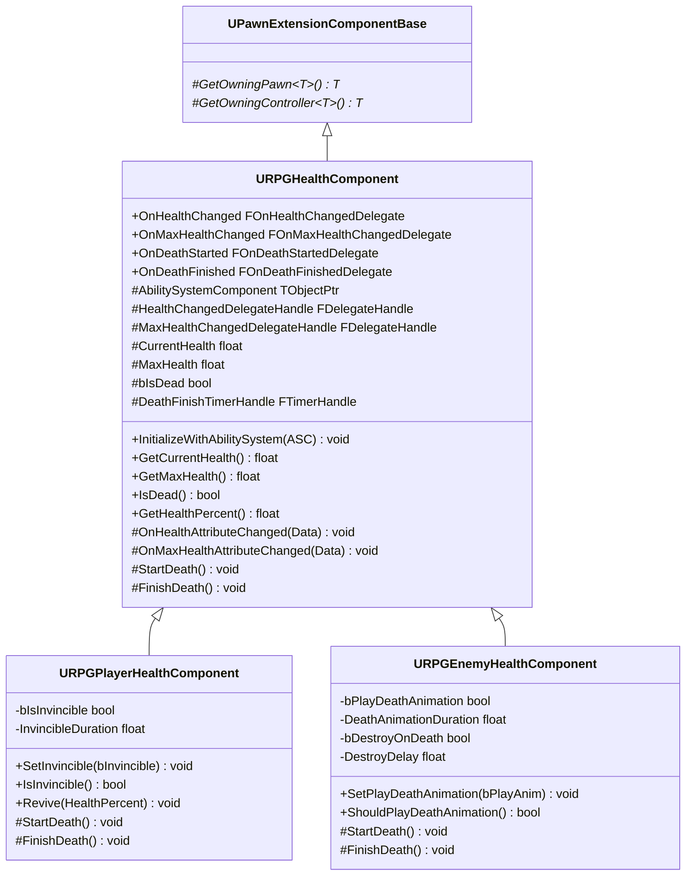
```mermaid
classDiagram
    class UPawnExtensionComponentBase {
        #GetOwningPawn~T~() T*
        #GetOwningController~T~() T*
    }
    
    class URPGHealthComponent {
        +InitializeWithAbilitySystem(ASC) void
        +GetCurrentHealth() float
        +GetMaxHealth() float
        +IsDead() bool
        +GetHealthPercent() float
        +OnHealthChanged FOnHealthChangedDelegate
        +OnMaxHealthChanged FOnMaxHealthChangedDelegate
        +OnDeathStarted FOnDeathStartedDelegate
        +OnDeathFinished FOnDeathFinishedDelegate
        #OnHealthAttributeChanged(Data) void
        #OnMaxHealthAttributeChanged(Data) void
        #StartDeath() void
        #FinishDeath() void
        #AbilitySystemComponent TObjectPtr
        #HealthChangedDelegateHandle FDelegateHandle
        #MaxHealthChangedDelegateHandle FDelegateHandle
        #CurrentHealth float
        #MaxHealth float
        #bIsDead bool
        #DeathFinishTimerHandle FTimerHandle
    }
    
    class URPGPlayerHealthComponent {
        +SetInvincible(bInvincible) void
        +IsInvincible() bool
        +Revive(HealthPercent) void
        #StartDeath() void
        #FinishDeath() void
        -bIsInvincible bool
        -InvincibleDuration float
    }
    
    class URPGEnemyHealthComponent {
        +SetPlayDeathAnimation(bPlayAnim) void
        +ShouldPlayDeathAnimation() bool
        #StartDeath() void
        #FinishDeath() void
        -bPlayDeathAnimation bool
        -DeathAnimationDuration float
        -bDestroyOnDeath bool
        -DestroyDelay float
    }
    
    UPawnExtensionComponentBase <|-- URPGHealthComponent
    URPGHealthComponent <|-- URPGPlayerHealthComponent
    URPGHealthComponent <|-- URPGEnemyHealthComponent
```

**图4.1 健康系统详细类图**

### 4.2.3 健康变化事件广播时序图

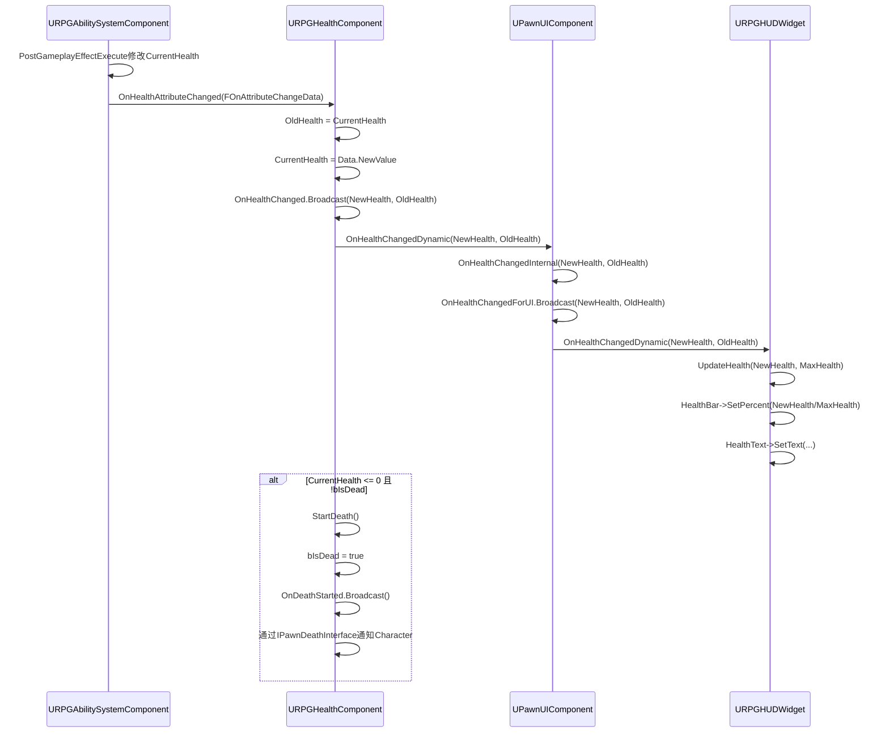
```mermaid
sequenceDiagram
    participant ASC as URPGAbilitySystemComponent
    participant Health as URPGHealthComponent
    participant PUI as UPawnUIComponent
    participant HUD as URPGHUDWidget
    
    ASC->>ASC: PostGameplayEffectExecute修改CurrentHealth
    ASC->>Health: OnHealthAttributeChanged(FOnAttributeChangeData)
    Health->>Health: OldHealth = CurrentHealth
    Health->>Health: CurrentHealth = Data.NewValue
    Health->>Health: OnHealthChanged.Broadcast(NewHealth, OldHealth)
    Health->>PUI: OnHealthChangedDynamic(NewHealth, OldHealth)
    PUI->>PUI: OnHealthChangedInternal(NewHealth, OldHealth)
    PUI->>PUI: OnHealthChangedForUI.Broadcast(NewHealth, OldHealth)
    PUI->>HUD: OnHealthChangedDynamic(NewHealth, OldHealth)
    HUD->>HUD: UpdateHealth(NewHealth, MaxHealth)
    HUD->>HUD: HealthBar->SetPercent(NewHealth/MaxHealth)
    HUD->>HUD: HealthText->SetText(...)
    alt CurrentHealth <= 0 且 !bIsDead
        Health->>Health: StartDeath()
        Health->>Health: bIsDead = true
        Health->>Health: OnDeathStarted.Broadcast()
        Health->>Health: 通过IPawnDeathInterface通知Character
    end
```

**图4.2 健康变化事件广播时序图**

### 4.2.4 核心代码实现

委托声明：

```cpp
// RPGHealthComponent.h
DECLARE_DYNAMIC_MULTICAST_DELEGATE_TwoParams(FOnHealthChangedDelegate, float, NewHealth, float, OldHealth);
DECLARE_DYNAMIC_MULTICAST_DELEGATE_TwoParams(FOnMaxHealthChangedDelegate, float, NewMaxHealth, float, OldMaxHealth);
DECLARE_DYNAMIC_MULTICAST_DELEGATE(FOnDeathStartedDelegate);
DECLARE_DYNAMIC_MULTICAST_DELEGATE(FOnDeathFinishedDelegate);
```

属性变化回调：

```cpp
void URPGHealthComponent::OnHealthAttributeChanged(const FOnAttributeChangeData& Data)
{
    float OldHealth = CurrentHealth;
    CurrentHealth = Data.NewValue;
    OnHealthChanged.Broadcast(CurrentHealth, OldHealth);
    
    if (CurrentHealth <= 0.0f && !bIsDead)
    {
        StartDeath();
    }
}
```

## 4.3 UI系统模块详细设计

### 4.3.1 UI系统架构设计

UI系统模块采用CommonUI框架和四层栈架构，通过URPGUIManagerSubsystem统一管理UI生命周期。UI系统通过UPawnUIComponent基类作为数据桥接层，实现健康系统与UI Widget的解耦。

URPGUIManagerSubsystem继承自UGameUIManagerSubsystem，作为GameInstance级全局Subsystem。该系统通过GameplayTag标签管理四层栈：RPGCommonUI_WidgetStack_Modal（模态层，屏蔽下层交互）、RPGCommonUI_WidgetStack_GameMenu（游戏菜单层）、RPGCommonUI_WidgetStack_GameHUD（游戏HUD层，始终显示）、RPGCommonUI_WidgetStack_Frontend（前端层，主菜单等）。提供PushSoftWidgetToStackAsync方法实现Widget的异步加载和推送，支持EAsyncPushWidgetState回调（OnCreatedBeforePush和AfterPush两个阶段）。

UPawnUIComponent是UI桥接层基类（Abstract），继承自UPawnExtensionComponentBase。该组件在BeginPlay时通过SubscribeToHealthComponent方法订阅HealthComponent的四个委托事件（OnHealthChanged/OnMaxHealthChanged/OnDeathStarted/OnDeathFinished），在EndPlay时通过UnsubscribeFromHealthComponent解除订阅。委托回调采用UFUNCTION标记的动态委托函数（OnHealthChangedDynamic/OnMaxHealthChangedDynamic/OnDeathStartedDynamic/OnDeathFinishedDynamic），内部调用虚函数（OnHealthChangedInternal等）允许子类重写，最终通过自有委托（OnHealthChangedForUI等）转发给Widget。

URPGPlayerUIComponent继承UPawnUIComponent，添加法力值管理（FOnManaChangedDelegate OnManaChangedForUI）和武器变化通知（FOnCurrentWeaponChangedDelegate OnCurrentWeaponChangedForUI）。URPGEnemyUIComponent继承UPawnUIComponent，添加血条可见性控制（MaxHealthBarDistance距离检测、bHideHealthBarWhenFull满血隐藏）和显示信息（DisplayName、EnemyLevel）。

URPGHUDWidget继承自URPGWidget_ActivatableBase（继承UCommonActivatableWidget），在NativeOnActivated时获取PlayerCharacter的PlayerUIComponent并订阅事件，在NativeOnDeactivated时清理所有委托绑定。Widget通过BindWidget元数据绑定UI元素（HealthBar/ManaBar/HealthText/ManaText/WeaponIcon），提供BP_OnPlayerUIComponentInitialized蓝图实现事件供蓝图扩展。

### 4.3.2 UI系统类图

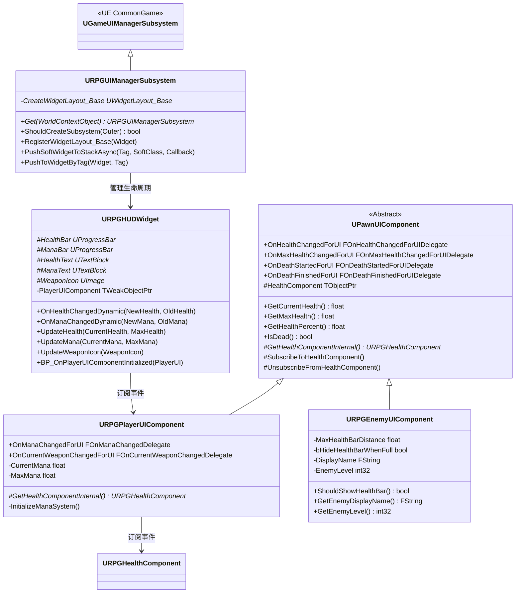
```mermaid
classDiagram
    class UGameUIManagerSubsystem {
        <<UE CommonGame>>
    }
    
    class URPGUIManagerSubsystem {
        +Get(WorldContextObject) URPGUIManagerSubsystem*
        +ShouldCreateSubsystem(Outer) bool
        +RegisterWidgetLayout_Base(Widget)
        +PushSoftWidgetToStackAsync(Tag, SoftClass, Callback)
        +PushToWidgetByTag(Widget, Tag)
        -CreateWidgetLayout_Base UWidgetLayout_Base*
    }
    
    class UPawnUIComponent {
        <<Abstract>>
        +GetCurrentHealth() float
        +GetMaxHealth() float
        +GetHealthPercent() float
        +IsDead() bool
        +OnHealthChangedForUI FOnHealthChangedForUIDelegate
        +OnMaxHealthChangedForUI FOnMaxHealthChangedForUIDelegate
        +OnDeathStartedForUI FOnDeathStartedForUIDelegate
        +OnDeathFinishedForUI FOnDeathFinishedForUIDelegate
        #GetHealthComponentInternal() URPGHealthComponent*
        #SubscribeToHealthComponent()
        #UnsubscribeFromHealthComponent()
        #HealthComponent TObjectPtr
    }
    
    class URPGPlayerUIComponent {
        +OnManaChangedForUI FOnManaChangedDelegate
        +OnCurrentWeaponChangedForUI FOnCurrentWeaponChangedDelegate
        #GetHealthComponentInternal() URPGHealthComponent*
        -InitializeManaSystem()
        -CurrentMana float
        -MaxMana float
    }
    
    class URPGEnemyUIComponent {
        +ShouldShowHealthBar() bool
        +GetEnemyDisplayName() FString
        +GetEnemyLevel() int32
        -MaxHealthBarDistance float
        -bHideHealthBarWhenFull bool
        -DisplayName FString
        -EnemyLevel int32
    }
    
    class URPGHUDWidget {
        +OnHealthChangedDynamic(NewHealth, OldHealth)
        +OnManaChangedDynamic(NewMana, OldMana)
        +UpdateHealth(CurrentHealth, MaxHealth)
        +UpdateMana(CurrentMana, MaxMana)
        +UpdateWeaponIcon(WeaponIcon)
        +BP_OnPlayerUIComponentInitialized(PlayerUI)
        #HealthBar UProgressBar*
        #ManaBar UProgressBar*
        #HealthText UTextBlock*
        #ManaText UTextBlock*
        #WeaponIcon UImage*
        -PlayerUIComponent TWeakObjectPtr
    }
    
    UGameUIManagerSubsystem <|-- URPGUIManagerSubsystem
    UPawnUIComponent <|-- URPGPlayerUIComponent
    UPawnUIComponent <|-- URPGEnemyUIComponent
    URPGUIManagerSubsystem --> URPGHUDWidget : 管理生命周期
    URPGHUDWidget --> URPGPlayerUIComponent : 订阅事件
    URPGPlayerUIComponent --> URPGHealthComponent : 订阅事件
```

**图4.3 UI系统详细类图**

### 4.3.3 UI事件订阅时序图

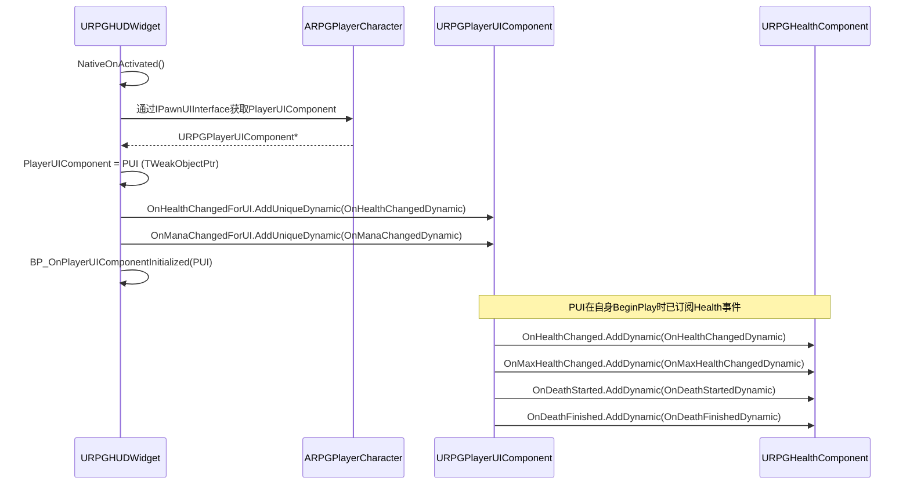
```mermaid
sequenceDiagram
    participant HUD as URPGHUDWidget
    participant Char as ARPGPlayerCharacter
    participant PUI as URPGPlayerUIComponent
    participant Health as URPGHealthComponent
    
    HUD->>HUD: NativeOnActivated()
    HUD->>Char: 通过IPawnUIInterface获取PlayerUIComponent
    Char-->>HUD: URPGPlayerUIComponent*
    HUD->>HUD: PlayerUIComponent = PUI (TWeakObjectPtr)
    HUD->>PUI: OnHealthChangedForUI.AddUniqueDynamic(OnHealthChangedDynamic)
    HUD->>PUI: OnManaChangedForUI.AddUniqueDynamic(OnManaChangedDynamic)
    HUD->>HUD: BP_OnPlayerUIComponentInitialized(PUI)
    Note over PUI,Health: PUI在自身BeginPlay时已订阅Health事件
    PUI->>Health: OnHealthChanged.AddDynamic(OnHealthChangedDynamic)
    PUI->>Health: OnMaxHealthChanged.AddDynamic(OnMaxHealthChangedDynamic)
    PUI->>Health: OnDeathStarted.AddDynamic(OnDeathStartedDynamic)
    PUI->>Health: OnDeathFinished.AddDynamic(OnDeathFinishedDynamic)
```

**图4.4 UI事件订阅时序图**

## 4.4 战斗系统模块详细设计

### 4.4.1 战斗系统架构设计

战斗系统模块负责管理角色的武器注册、碰撞检测、连招计数和命中处理。战斗系统采用分层组件架构，UPawnCombatComponent作为基类提供通用武器管理功能，UPlayerCombatComponent添加玩家特有的连招管理系统，UEnemyCombatComponent重写敌人的命中检测逻辑。

UPawnCombatComponent通过CharacterCarriedWeaponMap（TMap<FGameplayTag, ARPGWeaponBase*>）管理角色携带的所有武器，以GameplayTag作为键标识不同武器。RegisterSpawnWeapon方法在武器生成后将其注册到Map中，可选参数bRegisterAsEquippedWeapon同时设置CurrentEquippedWeaponTag。ToggleWeaponCollision方法控制武器碰撞盒的开关，支持三种模式（CurrentEquippedWeapon/LeftHand/RightHand）。OnHitTargetActor和OnWeaponPullerFromTargetActor为虚函数，由子类重写实现差异化的命中和拔出逻辑。OverlappedActors数组用于在一次攻击周期内防止重复命中同一目标。

UPlayerCombatComponent的连招管理系统通过TMap<ERPGComboType, int32> ComboCounts分通道存储轻击和重击的连招计数。AdvanceComboCount方法递增连招计数并在达到MaxComboCount时循环回0。SwitchComboType方法在攻击类型切换时重置对方通道计数器。StartComboWindowTimer方法启动定时器，在WindowTime过期后调用OnComboWindowTimerExpired重置对应通道的连招计数。GetPlayerCurrentEquippedWeaponDamageAtLevel方法通过FScalableFloat获取当前武器在指定等级的基础伤害值。

### 4.4.2 战斗系统类图

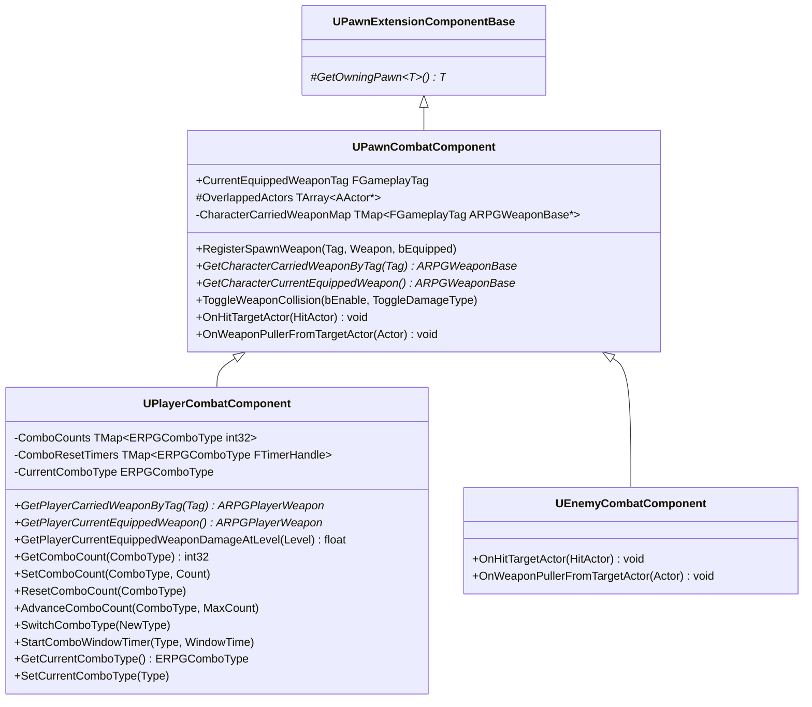
```mermaid
classDiagram
    class UPawnExtensionComponentBase {
        #GetOwningPawn~T~() T*
    }
    
    class UPawnCombatComponent {
        +RegisterSpawnWeapon(Tag, Weapon, bEquipped)
        +GetCharacterCarriedWeaponByTag(Tag) ARPGWeaponBase*
        +GetCharacterCurrentEquippedWeapon() ARPGWeaponBase*
        +ToggleWeaponCollision(bEnable, ToggleDamageType)
        +OnHitTargetActor(HitActor) void
        +OnWeaponPullerFromTargetActor(Actor) void
        +CurrentEquippedWeaponTag FGameplayTag
        #OverlappedActors TArray~AActor*~
        -CharacterCarriedWeaponMap TMap~FGameplayTag ARPGWeaponBase*~
    }
    
    class UPlayerCombatComponent {
        +GetPlayerCarriedWeaponByTag(Tag) ARPGPlayerWeapon*
        +GetPlayerCurrentEquippedWeapon() ARPGPlayerWeapon*
        +GetPlayerCurrentEquippedWeaponDamageAtLevel(Level) float
        +GetComboCount(ComboType) int32
        +SetComboCount(ComboType, Count)
        +ResetComboCount(ComboType)
        +AdvanceComboCount(ComboType, MaxCount)
        +SwitchComboType(NewType)
        +StartComboWindowTimer(Type, WindowTime)
        +GetCurrentComboType() ERPGComboType
        +SetCurrentComboType(Type)
        -ComboCounts TMap~ERPGComboType int32~
        -ComboResetTimers TMap~ERPGComboType FTimerHandle~
        -CurrentComboType ERPGComboType
    }
    
    class UEnemyCombatComponent {
        +OnHitTargetActor(HitActor) void
        +OnWeaponPullerFromTargetActor(Actor) void
    }
    
    UPawnExtensionComponentBase <|-- UPawnCombatComponent
    UPawnCombatComponent <|-- UPlayerCombatComponent
    UPawnCombatComponent <|-- UEnemyCombatComponent
```

**图4.5 战斗系统详细类图**

### 4.4.3 攻击命中流程时序图

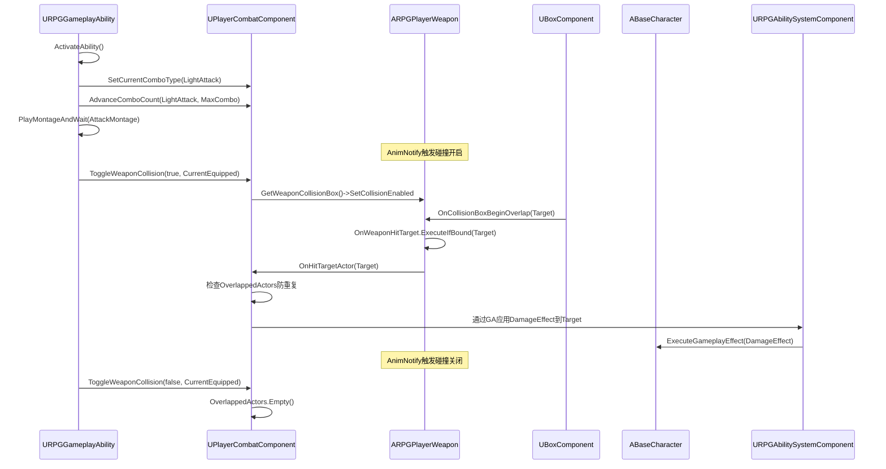
```mermaid
sequenceDiagram
    participant GA as URPGGameplayAbility
    participant Combat as UPlayerCombatComponent
    participant Weapon as ARPGPlayerWeapon
    participant CollisionBox as UBoxComponent
    participant Target as ABaseCharacter
    participant ASC as URPGAbilitySystemComponent
    
    GA->>GA: ActivateAbility()
    GA->>Combat: SetCurrentComboType(LightAttack)
    GA->>Combat: AdvanceComboCount(LightAttack, MaxCombo)
    GA->>GA: PlayMontageAndWait(AttackMontage)
    Note over Weapon: AnimNotify触发碰撞开启
    GA->>Combat: ToggleWeaponCollision(true, CurrentEquipped)
    Combat->>Weapon: GetWeaponCollisionBox()->SetCollisionEnabled
    CollisionBox->>Weapon: OnCollisionBoxBeginOverlap(Target)
    Weapon->>Weapon: OnWeaponHitTarget.ExecuteIfBound(Target)
    Weapon->>Combat: OnHitTargetActor(Target)
    Combat->>Combat: 检查OverlappedActors防重复
    Combat->>ASC: 通过GA应用DamageEffect到Target
    ASC->>Target: ExecuteGameplayEffect(DamageEffect)
    Note over Weapon: AnimNotify触发碰撞关闭
    GA->>Combat: ToggleWeaponCollision(false, CurrentEquipped)
    Combat->>Combat: OverlappedActors.Empty()
```

**图4.6 攻击命中流程时序图**

## 4.5 武器系统模块详细设计

### 4.5.1 武器系统架构设计

武器系统模块负责管理武器实体的创建、碰撞检测和能力授予。ARPGWeaponBase作为武器基类继承自AActor，包含WeaponMesh（UStaticMeshComponent，武器外观）和WeaponCollisionBox（UBoxComponent，攻击判定区域）。碰撞盒通过OnCollisionBoxBeginOverlap和OnCollisionBoxEndOverlap回调检测目标重叠，并通过FOnTargetInteractDelegate委托（DECLARE_DELEGATE_OneParam）通知CombatComponent。

ARPGPlayerWeapon继承ARPGWeaponBase，持有FRPGPlayerWeaponData结构和GrantAbilitySpecHandles数组。FRPGPlayerWeaponData是武器的完整配置数据，包含：WeaponAnimLayerToLink（指定武器对应的URPGItemAnimLayersBase动画层子类）、EquipWeaponMontage/UnequipWeaponMontage（装备/卸下动画蒙太奇）、WeaponInputMappingContext（武器专属输入映射上下文，装备时添加到Enhanced Input）、DefaultWeaponAbilities（武器授予的能力集合，为FRPGPlayerAbilitySet数组，每项包含InputTag和AbilityToGrant）、WeaponBaseDamage（FScalableFloat，支持等级缩放的基础伤害）、SoftWeaponIconTexture（武器图标软引用）。

武器装备流程：玩家触发装备能力（如RPGPlayerAbility_EquipSword）→ 能力从CombatComponent获取武器引用 → 播放EquipWeaponMontage → AnimNotify触发时将武器附加到手部插槽 → 调用ASC的GrantPlayerWeaponAbility授予武器能力 → 将AbilitySpecHandles保存到武器的GrantAbilitySpecHandles → 添加WeaponInputMappingContext到Enhanced Input → 调用AnimInstance的LinkAnimLayer链接武器动画层。

### 4.5.2 武器系统类图

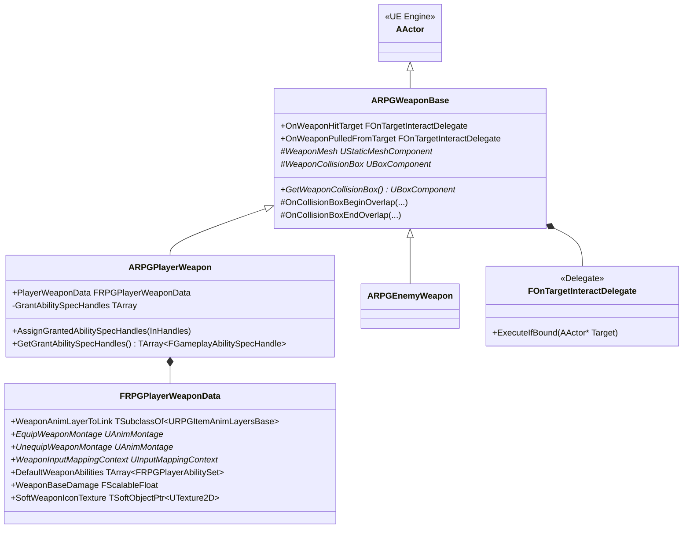
```mermaid
classDiagram
    class AActor {
        <<UE Engine>>
    }
    
    class ARPGWeaponBase {
        +OnWeaponHitTarget FOnTargetInteractDelegate
        +OnWeaponPulledFromTarget FOnTargetInteractDelegate
        +GetWeaponCollisionBox() UBoxComponent*
        #WeaponMesh UStaticMeshComponent*
        #WeaponCollisionBox UBoxComponent*
        #OnCollisionBoxBeginOverlap(...)
        #OnCollisionBoxEndOverlap(...)
    }
    
    class ARPGPlayerWeapon {
        +PlayerWeaponData FRPGPlayerWeaponData
        +AssignGrantedAbilitySpecHandles(InHandles)
        +GetGrantAbilitySpecHandles() TArray~FGameplayAbilitySpecHandle~
        -GrantAbilitySpecHandles TArray
    }
    
    class ARPGEnemyWeapon {
    }
    
    class FRPGPlayerWeaponData {
        +WeaponAnimLayerToLink TSubclassOf~URPGItemAnimLayersBase~
        +EquipWeaponMontage UAnimMontage*
        +UnequipWeaponMontage UAnimMontage*
        +WeaponInputMappingContext UInputMappingContext*
        +DefaultWeaponAbilities TArray~FRPGPlayerAbilitySet~
        +WeaponBaseDamage FScalableFloat
        +SoftWeaponIconTexture TSoftObjectPtr~UTexture2D~
    }
    
    class FOnTargetInteractDelegate {
        <<Delegate>>
        +ExecuteIfBound(AActor* Target)
    }
    
    AActor <|-- ARPGWeaponBase
    ARPGWeaponBase <|-- ARPGPlayerWeapon
    ARPGWeaponBase <|-- ARPGEnemyWeapon
    ARPGPlayerWeapon *-- FRPGPlayerWeaponData
    ARPGWeaponBase *-- FOnTargetInteractDelegate
```

**图4.7 武器系统详细类图**

### 4.5.3 武器装备流程时序图

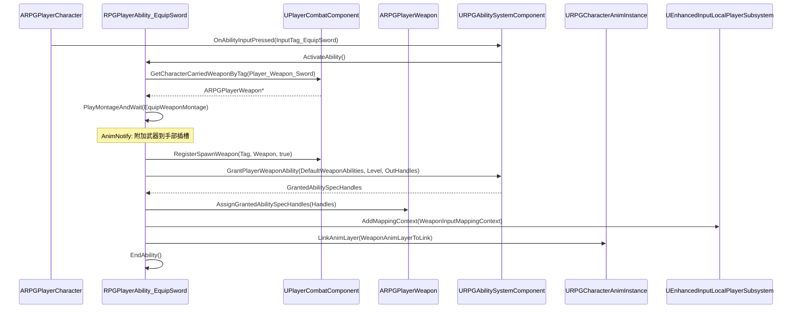
```mermaid
sequenceDiagram
    participant Player as ARPGPlayerCharacter
    participant GA as RPGPlayerAbility_EquipSword
    participant Combat as UPlayerCombatComponent
    participant Weapon as ARPGPlayerWeapon
    participant ASC as URPGAbilitySystemComponent
    participant Anim as URPGCharacterAnimInstance
    participant Input as UEnhancedInputLocalPlayerSubsystem
    
    Player->>ASC: OnAbilityInputPressed(InputTag_EquipSword)
    ASC->>GA: ActivateAbility()
    GA->>Combat: GetCharacterCarriedWeaponByTag(Player_Weapon_Sword)
    Combat-->>GA: ARPGPlayerWeapon*
    GA->>GA: PlayMontageAndWait(EquipWeaponMontage)
    Note over GA: AnimNotify: 附加武器到手部插槽
    GA->>Combat: RegisterSpawnWeapon(Tag, Weapon, true)
    GA->>ASC: GrantPlayerWeaponAbility(DefaultWeaponAbilities, Level, OutHandles)
    ASC-->>GA: GrantedAbilitySpecHandles
    GA->>Weapon: AssignGrantedAbilitySpecHandles(Handles)
    GA->>Input: AddMappingContext(WeaponInputMappingContext)
    GA->>Anim: LinkAnimLayer(WeaponAnimLayerToLink)
    GA->>GA: EndAbility()
```

**图4.8 武器装备流程时序图**

## 4.6 能力系统(GAS)模块详细设计

### 4.6.1 能力系统架构设计

能力系统模块基于UE5的Gameplay Ability System（GAS）实现，提供属性管理、能力授予/激活、GameplayEffect应用等功能。系统核心组件包括URPGAbilitySystemComponent（扩展ASC）、URPGAttributeSet（四类属性集）和URPGGameplayAbility（能力基类）。

URPGAbilitySystemComponent扩展UAbilitySystemComponent，添加三个核心功能：（1）OnAbilityInputPressed/OnAbilityInputReleased方法接收GameplayTag形式的输入标签，遍历已授予的能力找到匹配InputTag的能力并激活/取消；（2）GrantPlayerWeaponAbility方法批量授予武器能力，接收FRPGPlayerAbilitySet数组和等级参数，返回OutGrantedAbilitySpecHandles用于后续移除；（3）TryActivateAbilityByTag方法通过AbilityTag直接激活能力，用于AI行为树的BTTask_ActivateAbilityByTag任务节点。

URPGAttributeSet继承UAttributeSet，定义四类属性，每个属性使用FGameplayAttributeData类型并通过ATTRIBUTE_ACCESSORS宏生成访问器。主属性（Primary）包含Strength（力量，影响物理攻击力）、Intelligence（智力，影响魔法攻击力）、Vitality（体质，影响生命值）、Agility（敏捷，影响闪避/暴击）。次属性（Secondary）包含Armor（护甲）、CriticalHitChance（暴击率0-100）、CriticalHitDamage（暴击倍数，基础1.0）、HealthRegeneration（生命回复/秒）、ManaRegeneration（法力回复/秒）。核心属性（Vital）包含CurrentHealth/MaxHealth、CurrentRage/MaxRage、CurrentMana/MaxMana。元属性（Meta）包含DamageTaken（受到伤害，用于伤害计算中间值）、IncomingXP（获得经验）、AttackPower（攻击力）、DefensePower（防御力）。所有核心和主要属性通过ReplicatedUsing支持网络复制。

属性变更通过三个回调处理：PreAttributeChange在属性修改前调用，用于值钳制（如确保CurrentHealth不超过MaxHealth）；PostAttributeChange在属性修改后调用，触发UI更新委托；PostGameplayEffectExecute在GameplayEffect执行后调用，用于处理DamageTaken元属性的伤害计算逻辑（应用护甲减伤、暴击倍率等）。

URPGGameplayAbility继承UGameplayAbility，提供ERPGAbilityActivationPolicy枚举（OnTriggered：输入触发激活；OnGive：授予时立即激活）。基类提供GetPawnCombatComponentFromActorInfo和GetRPGAbilitySystemComponentFromActorInfo辅助方法，以及NativeApplyEffectSpecHandleToTarget/BP_ApplyEffectSpecHandleToTarget伤害应用方法。URPGEnemyGameplayAbility继承URPGGameplayAbility，添加GetEnemyCharacterFromActorInfo和GetEnemyCombatComponentFromActorInfo敌人特有辅助方法。

### 4.6.2 能力系统类图


```mermaid
classDiagram
    class UAbilitySystemComponent {
        <<UE GAS>>
    }
    
    class URPGAbilitySystemComponent {
        +OnAbilityInputPressed(InputTag)
        +OnAbilityInputReleased(InputTag)
        +GrantPlayerWeaponAbility(AbilitySet, Level, OutHandles)
        +RemovedGrantPlayerWeaponAbility(Handles)
        +TryActivateAbilityByTag(Tag) bool
    }
    
    class UAttributeSet {
        <<UE GAS>>
    }
    
    class URPGAttributeSet {
        +Strength FGameplayAttributeData
        +Intelligence FGameplayAttributeData
        +Vitality FGameplayAttributeData
        +Agility FGameplayAttributeData
        +Armor FGameplayAttributeData
        +CriticalHitChance FGameplayAttributeData
        +CriticalHitDamage FGameplayAttributeData
        +HealthRegeneration FGameplayAttributeData
        +ManaRegeneration FGameplayAttributeData
        +CurrentHealth FGameplayAttributeData
        +MaxHealth FGameplayAttributeData
        +CurrentRage FGameplayAttributeData
        +MaxRage FGameplayAttributeData
        +CurrentMana FGameplayAttributeData
        +MaxMana FGameplayAttributeData
        +DamageTaken FGameplayAttributeData
        +IncomingXP FGameplayAttributeData
        +AttackPower FGameplayAttributeData
        +DefensePower FGameplayAttributeData
        +OnHealthChanged FOnAttributeValueChanged
        +OnManaChanged FOnAttributeValueChanged
        +PreAttributeChange(Attribute, NewValue)
        +PostAttributeChange(Attribute, OldValue, NewValue)
        +PostGameplayEffectExecute(Data)
    }
    
    class UGameplayAbility {
        <<UE GAS>>
    }
    
    class URPGGameplayAbility {
        +GetPawnCombatComponentFromActorInfo() UPawnCombatComponent*
        +GetRPGAbilitySystemComponentFromActorInfo() URPGAbilitySystemComponent*
        +NativeApplyEffectSpecHandleToTarget(Target, Handle)
        +BP_ApplyEffectSpecHandleToTarget(Target, Handle, OutSuccess)
        #AbilityActivationPolicy ERPGAbilityActivationPolicy
        #OnGiveAbility(ActorInfo, Spec)
        #EndAbility(...)
    }
    
    class URPGEnemyGameplayAbility {
        +GetEnemyCharacterFromActorInfo() ARPGEnemyCharacter*
        +GetEnemyCombatComponentFromActorInfo() UEnemyCombatComponent*
    }
    
    UAbilitySystemComponent <|-- URPGAbilitySystemComponent
    UAttributeSet <|-- URPGAttributeSet
    UGameplayAbility <|-- URPGGameplayAbility
    URPGGameplayAbility <|-- URPGEnemyGameplayAbility
```

**图4.9 能力系统详细类图**

### 4.6.3 能力激活与伤害计算时序图

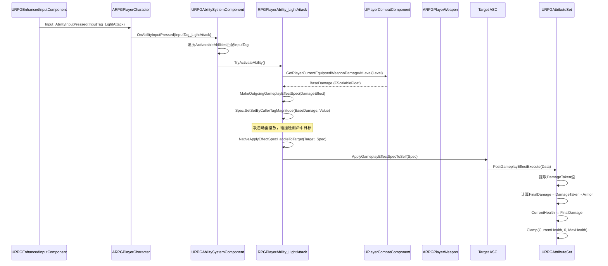
```mermaid
sequenceDiagram
    participant Input as URPGEnhancedInputComponent
    participant Char as ARPGPlayerCharacter
    participant ASC as URPGAbilitySystemComponent
    participant GA as RPGPlayerAbility_LightAttack
    participant Combat as UPlayerCombatComponent
    participant Weapon as ARPGPlayerWeapon
    participant TargetASC as Target ASC
    participant AttrSet as URPGAttributeSet
    
    Input->>Char: Input_AbilityInputPressed(InputTag_LightAttack)
    Char->>ASC: OnAbilityInputPressed(InputTag_LightAttack)
    ASC->>ASC: 遍历ActivatableAbilities匹配InputTag
    ASC->>GA: TryActivateAbility()
    GA->>Combat: GetPlayerCurrentEquippedWeaponDamageAtLevel(Level)
    Combat-->>GA: BaseDamage (FScalableFloat)
    GA->>GA: MakeOutgoingGameplayEffectSpec(DamageEffect)
    GA->>GA: Spec.SetSetByCallerTagMagnitude(BaseDamage, Value)
    Note over GA: 攻击动画播放，碰撞检测命中目标
    GA->>GA: NativeApplyEffectSpecHandleToTarget(Target, Spec)
    GA->>TargetASC: ApplyGameplayEffectSpecToSelf(Spec)
    TargetASC->>AttrSet: PostGameplayEffectExecute(Data)
    AttrSet->>AttrSet: 提取DamageTaken值
    AttrSet->>AttrSet: 计算FinalDamage = DamageTaken - Armor
    AttrSet->>AttrSet: CurrentHealth -= FinalDamage
    AttrSet->>AttrSet: Clamp(CurrentHealth, 0, MaxHealth)
```

**图4.10 能力激活与伤害计算时序图**

## 4.7 动画系统模块详细设计

### 4.7.1 动画系统架构设计

动画模块采用三层动画实例架构：URPGBaseAnimInstance提供基础运动参数计算和GAS系统引用，URPGCharacterAnimInstance实现角色动画状态管理（移动状态、跳跃状态机、步态系统、Linked Anim Layers），URPGItemAnimLayersBase实现武器动画层的数据同步。

URPGBaseAnimInstance在NativeInitializeAnimation中缓存OwningCharacter、MovementComponent和AbilitySystemComponent引用。NativeUpdateAnimation每帧计算运动参数：GroundSpeed（水平速度Size2D）、Direction（移动方向角度）、Velocity（速度向量）、VerticalSpeed（垂直速度）、bIsMoving/bIsFalling/bIsGrounded状态标志。DoesOwnerHaveTag方法（标记BlueprintThreadSafe）提供线程安全的GameplayTag查询。

URPGCharacterAnimInstance在NativeThreadSafeUpdateAnimation中（线程安全版本）执行三个更新步骤：UpdateMovementState（通过速度阈值WalkSpeedThreshold/RunSpeedThreshold/SprintSpeedThreshold计算bIsIdle/bIsWalking/bIsRunning/bIsSprinting布尔状态）、UpdateGaitAmount（计算GaitAmount步态比例，范围0.0-3.0，驱动BlendSpace混合）、UpdateJumpState（管理跳跃状态机）。

跳跃状态机通过EJumpState枚举（None/Start/Loop/Land）管理四个跳跃阶段。HandleJumpStart检测VerticalSpeed超过JumpStartVerticalSpeedThreshold且非地面状态时进入Start。HandleJumpLoop在Start阶段持续一定时间后自动转为Loop。HandleJumpLand通过TimeSinceGrounded和bWasFallingLastFrame检测落地，配置LandDetectionDelay防止瞬时触地误判。bCanJumpStart/bCanJumpLoop/bCanJumpLand布尔变量供动画蓝图Transition Rule使用，bJumpAnimationFinished由动画通知回调OnJumpAnimationFinished设置。

Linked Anim Layers机制通过LinkAnimLayer(TSubclassOf<UAnimInstance>)方法实现运行时动画层切换。当玩家装备武器时，CharacterAnimInstance链接武器对应的URPGItemAnimLayersBase子类。URPGItemAnimLayersBase在NativeInitializeAnimation中缓存PlayerCombatComponent引用，NativeUpdateAnimation每帧通过SyncFromCombatComponent同步战斗数据：WeaponType（武器类型枚举）、CombatState（战斗状态）、ComboIndex（连招索引）、MaxComboCount、bIsInComboWindow、AttackSpeedMultiplier、bIsAttacking。

### 4.7.2 动画系统类图

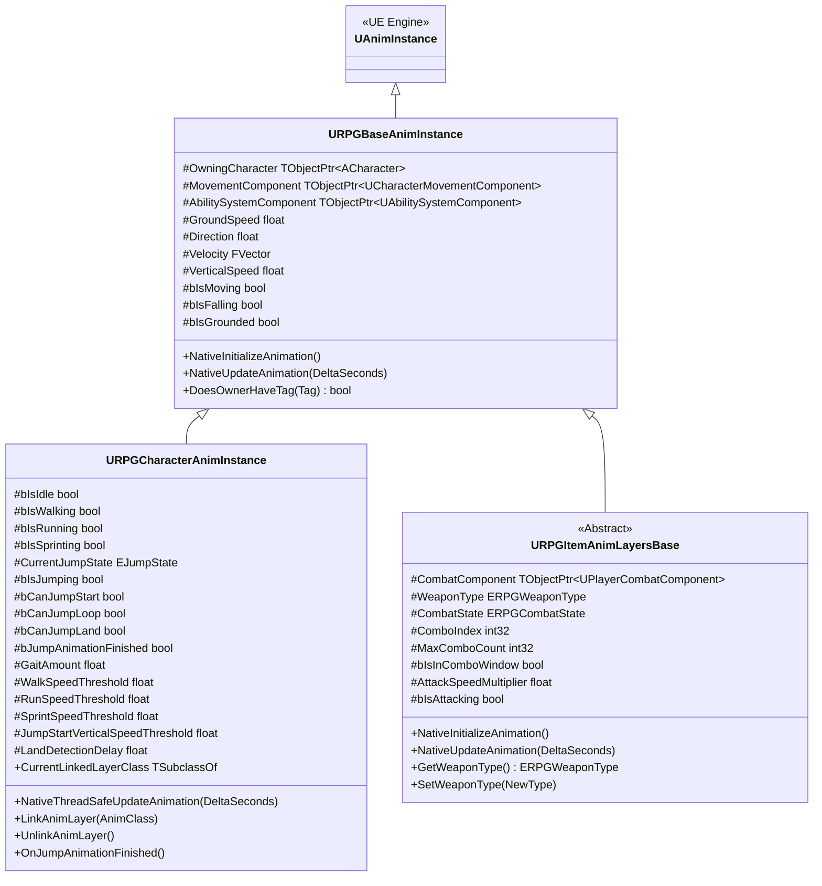
```mermaid
classDiagram
    class UAnimInstance {
        <<UE Engine>>
    }
    
    class URPGBaseAnimInstance {
        +NativeInitializeAnimation()
        +NativeUpdateAnimation(DeltaSeconds)
        +DoesOwnerHaveTag(Tag) bool
        #OwningCharacter TObjectPtr~ACharacter~
        #MovementComponent TObjectPtr~UCharacterMovementComponent~
        #AbilitySystemComponent TObjectPtr~UAbilitySystemComponent~
        #GroundSpeed float
        #Direction float
        #Velocity FVector
        #VerticalSpeed float
        #bIsMoving bool
        #bIsFalling bool
        #bIsGrounded bool
    }
    
    class URPGCharacterAnimInstance {
        +NativeThreadSafeUpdateAnimation(DeltaSeconds)
        +LinkAnimLayer(AnimClass)
        +UnlinkAnimLayer()
        +OnJumpAnimationFinished()
        #bIsIdle bool
        #bIsWalking bool
        #bIsRunning bool
        #bIsSprinting bool
        #CurrentJumpState EJumpState
        #bIsJumping bool
        #bCanJumpStart bool
        #bCanJumpLoop bool
        #bCanJumpLand bool
        #bJumpAnimationFinished bool
        #GaitAmount float
        #WalkSpeedThreshold float
        #RunSpeedThreshold float
        #SprintSpeedThreshold float
        #JumpStartVerticalSpeedThreshold float
        #LandDetectionDelay float
        +CurrentLinkedLayerClass TSubclassOf
    }
    
    class URPGItemAnimLayersBase {
        <<Abstract>>
        +NativeInitializeAnimation()
        +NativeUpdateAnimation(DeltaSeconds)
        +GetWeaponType() ERPGWeaponType
        +SetWeaponType(NewType)
        #CombatComponent TObjectPtr~UPlayerCombatComponent~
        #WeaponType ERPGWeaponType
        #CombatState ERPGCombatState
        #ComboIndex int32
        #MaxComboCount int32
        #bIsInComboWindow bool
        #AttackSpeedMultiplier float
        #bIsAttacking bool
    }
    
    UAnimInstance <|-- URPGBaseAnimInstance
    URPGBaseAnimInstance <|-- URPGCharacterAnimInstance
    URPGBaseAnimInstance <|-- URPGItemAnimLayersBase
```

**图4.11 动画系统详细类图**

### 4.7.3 动画状态机工作时序图

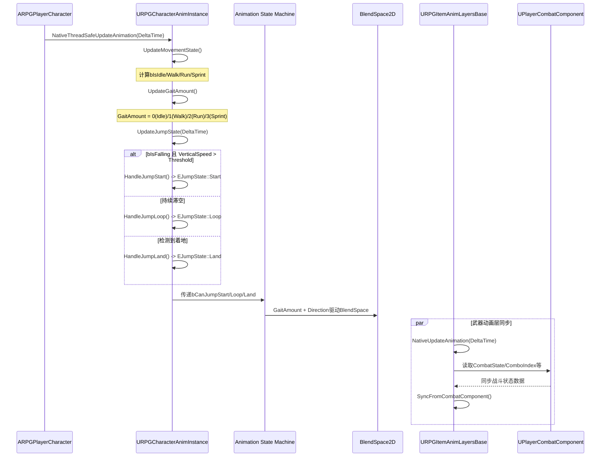
```mermaid
sequenceDiagram
    participant Char as ARPGPlayerCharacter
    participant Anim as URPGCharacterAnimInstance
    participant SM as Animation State Machine
    participant BS as BlendSpace2D
    participant Layer as URPGItemAnimLayersBase
    participant Combat as UPlayerCombatComponent
    
    Char->>Anim: NativeThreadSafeUpdateAnimation(DeltaTime)
    Anim->>Anim: UpdateMovementState()
    Note over Anim: 计算bIsIdle/Walk/Run/Sprint
    Anim->>Anim: UpdateGaitAmount()
    Note over Anim: GaitAmount = 0(Idle)/1(Walk)/2(Run)/3(Sprint)
    Anim->>Anim: UpdateJumpState(DeltaTime)
    alt bIsFalling 且 VerticalSpeed > Threshold
        Anim->>Anim: HandleJumpStart() -> EJumpState::Start
    else 持续滞空
        Anim->>Anim: HandleJumpLoop() -> EJumpState::Loop
    else 检测到着地
        Anim->>Anim: HandleJumpLand() -> EJumpState::Land
    end
    Anim->>SM: 传递bCanJumpStart/Loop/Land
    SM->>BS: GaitAmount + Direction驱动BlendSpace
    
    par 武器动画层同步
        Layer->>Layer: NativeUpdateAnimation(DeltaTime)
        Layer->>Combat: 读取CombatState/ComboIndex等
        Combat-->>Layer: 同步战斗状态数据
        Layer->>Layer: SyncFromCombatComponent()
    end
```

**图4.12 动画状态机工作时序图**

## 4.8 控制器模块详细设计

### 4.8.1 控制器架构设计

控制模块包含两条独立的继承链。玩家控制器链：APlayerController → ARPGBaseController（实现IGenericTeamAgentInterface）→ ARPGPlayerController。AI控制器链：AAIController → ARPGEnemyAIController（独立实现团队系统）。两者不共享继承关系，但都通过IGenericTeamAgentInterface/GetTeamAttitudeTowards实现团队识别。

ARPGPlayerController在构造函数中设置PlayerTeamId = FGenericTeamId(0)（中立团队）。BeginPlay中完成UI初始化。GetGenericTeamId返回PlayerTeamId供AI感知系统使用。

ARPGEnemyAIController在构造函数中通过InitializePerception方法初始化AI感知系统。创建BehaviorTreeComponent和BlackboardComponent子对象。配置EnemySightConfig（UAISenseConfig_Sight）的参数：SightRadius（默认视觉半径）、LoseSightRadius（丢失视觉半径，大于SightRadius）、PeripheralVisionAngle（边缘视野角度）、PerceptionMaxAge（感知信息有效期）、bDetectEnemies（是否检测敌人）。创建EnemyPerceptionComponent并注册SightConfig。

GetTeamAttitudeTowards方法通过IGenericTeamAgentInterface获取Other的TeamId，与自身EnemyTeamId比较返回Hostile/Friendly/Neutral态度。OnTargetPerceptionUpdated和OnEnemyPerceptionUpdated处理感知回调，将感知到的Actor存入PerceivedActors缓存（TMap<AActor*, float>记录感知时间），UpdateNearestTarget方法将最近目标写入Blackboard。RunBehaviorTreeWithBlackboard方法由EnemyCharacter在PossessedBy中调用，初始化并运行行为树。

### 4.8.2 控制器类图

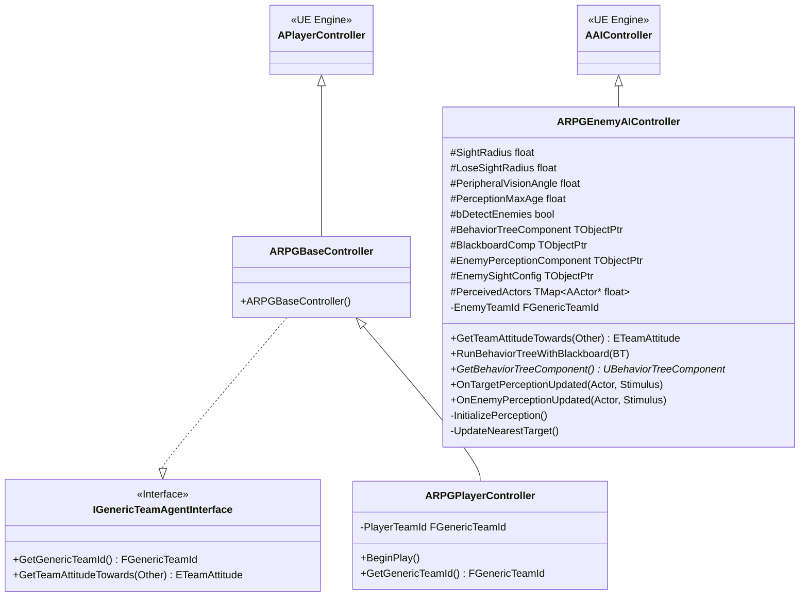
```mermaid
classDiagram
    class APlayerController {
        <<UE Engine>>
    }
    
    class AAIController {
        <<UE Engine>>
    }
    
    class IGenericTeamAgentInterface {
        <<Interface>>
        +GetGenericTeamId() FGenericTeamId
        +GetTeamAttitudeTowards(Other) ETeamAttitude
    }
    
    class ARPGBaseController {
        +ARPGBaseController()
    }
    
    class ARPGPlayerController {
        +BeginPlay()
        +GetGenericTeamId() FGenericTeamId
        -PlayerTeamId FGenericTeamId
    }
    
    class ARPGEnemyAIController {
        +GetTeamAttitudeTowards(Other) ETeamAttitude
        +RunBehaviorTreeWithBlackboard(BT)
        +GetBehaviorTreeComponent() UBehaviorTreeComponent*
        +OnTargetPerceptionUpdated(Actor, Stimulus)
        +OnEnemyPerceptionUpdated(Actor, Stimulus)
        #SightRadius float
        #LoseSightRadius float
        #PeripheralVisionAngle float
        #PerceptionMaxAge float
        #bDetectEnemies bool
        #BehaviorTreeComponent TObjectPtr
        #BlackboardComp TObjectPtr
        #EnemyPerceptionComponent TObjectPtr
        #EnemySightConfig TObjectPtr
        #PerceivedActors TMap~AActor* float~
        -InitializePerception()
        -UpdateNearestTarget()
        -EnemyTeamId FGenericTeamId
    }
    
    APlayerController <|-- ARPGBaseController
    ARPGBaseController ..|> IGenericTeamAgentInterface
    ARPGBaseController <|-- ARPGPlayerController
    AAIController <|-- ARPGEnemyAIController
```

**图4.13 控制器详细类图**

## 4.9 AI模块详细设计

### 4.9.1 AI系统架构设计

AI模块通过ARPGEnemyAIController协调行为树、黑板和感知系统。ARPGEnemyCharacter在PossessedBy中获取AI控制器引用并调用RunBehaviorTreeWithBlackboard启动行为树。行为树通过自定义Task、Service和Decorator节点实现敌人行为逻辑。

自定义行为树任务（BTTask）：
- BTTask_RotateToFaceTarget：平滑旋转朝向目标Actor。使用FRotateToFaceTargetTaskMemory存储OwningPawn和TargetActor弱引用，通过AnglePrecision（角度精度）和RotationInterpSpeed（旋转插值速度）控制旋转行为，使用InTargetToFaceKey从黑板读取目标。
- BTTask_ActivateAbilityByTag：通过GameplayTag激活ASC能力，用于触发攻击等行为。
- BTTask_FindRandomPatrolPoint：在导航网格上找到随机巡逻点，写入黑板。
- BTTask_FindStrafingPoint_EQS：使用环境查询系统（EQS）找到适合侧移的位置点。
- BTTask_SetMovementSpeed：设置AI角色的移动速度（巡逻/追逐/冲刺等不同速度）。

自定义行为树服务（BTService）：
- BTService_FindNearestPlayer：定期查找最近的玩家并更新黑板的TargetActor键。
- BTService_OrientToTargetActor：持续使AI朝向目标Actor（与Task版本不同，Service在后台持续运行）。

自定义行为树装饰器（BTDecorator）：
- BTDecorator_RandomChance：基于随机概率决定子节点是否执行，用于增加AI行为的不可预测性。

### 4.9.2 AI行为树结构

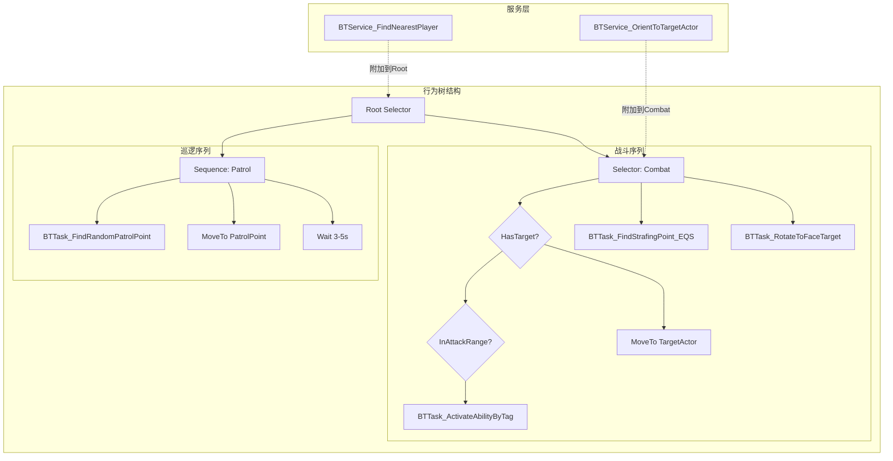
```mermaid
graph TB
    subgraph 行为树结构
        Root[Root Selector]
        
        subgraph 战斗序列
            CombatSel[Selector: Combat]
            HasTarget{HasTarget?}
            InRange{InAttackRange?}
            Attack[BTTask_ActivateAbilityByTag]
            Chase[MoveTo TargetActor]
            Strafe[BTTask_FindStrafingPoint_EQS]
            Rotate[BTTask_RotateToFaceTarget]
        end
        
        subgraph 巡逻序列
            PatrolSeq[Sequence: Patrol]
            FindPoint[BTTask_FindRandomPatrolPoint]
            MoveTo[MoveTo PatrolPoint]
            Wait[Wait 3-5s]
        end
    end
    
    subgraph 服务层
        S1[BTService_FindNearestPlayer]
        S2[BTService_OrientToTargetActor]
    end
    
    Root --> CombatSel
    Root --> PatrolSeq
    CombatSel --> HasTarget
    HasTarget --> InRange
    InRange --> Attack
    HasTarget --> Chase
    CombatSel --> Strafe
    CombatSel --> Rotate
    PatrolSeq --> FindPoint
    PatrolSeq --> MoveTo
    PatrolSeq --> Wait
    S1 -.附加到Root.-> Root
    S2 -.附加到Combat.-> CombatSel
```

**图4.14 AI行为树结构图**

### 4.9.3 AI感知与目标追踪时序图

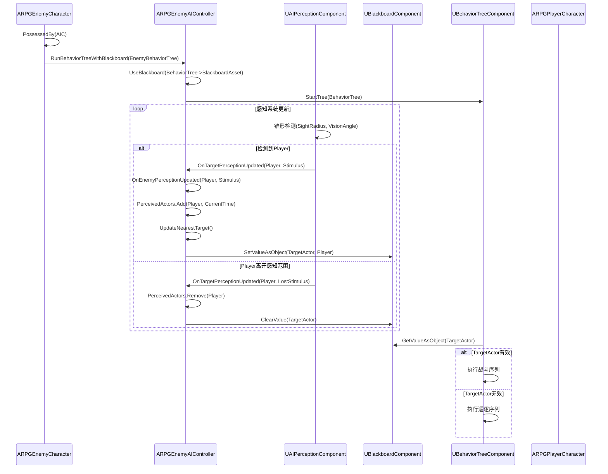
```mermaid
sequenceDiagram
    participant Enemy as ARPGEnemyCharacter
    participant AIC as ARPGEnemyAIController
    participant Perception as UAIPerceptionComponent
    participant BB as UBlackboardComponent
    participant BT as UBehaviorTreeComponent
    participant Player as ARPGPlayerCharacter
    
    Enemy->>Enemy: PossessedBy(AIC)
    Enemy->>AIC: RunBehaviorTreeWithBlackboard(EnemyBehaviorTree)
    AIC->>AIC: UseBlackboard(BehaviorTree->BlackboardAsset)
    AIC->>BT: StartTree(BehaviorTree)
    
    loop 感知系统更新
        Perception->>Perception: 锥形检测(SightRadius, VisionAngle)
        alt 检测到Player
            Perception->>AIC: OnTargetPerceptionUpdated(Player, Stimulus)
            AIC->>AIC: OnEnemyPerceptionUpdated(Player, Stimulus)
            AIC->>AIC: PerceivedActors.Add(Player, CurrentTime)
            AIC->>AIC: UpdateNearestTarget()
            AIC->>BB: SetValueAsObject(TargetActor, Player)
        else Player离开感知范围
            Perception->>AIC: OnTargetPerceptionUpdated(Player, LostStimulus)
            AIC->>AIC: PerceivedActors.Remove(Player)
            AIC->>BB: ClearValue(TargetActor)
        end
    end
    
    BT->>BB: GetValueAsObject(TargetActor)
    alt TargetActor有效
        BT->>BT: 执行战斗序列
    else TargetActor无效
        BT->>BT: 执行巡逻序列
    end
```

**图4.15 AI感知与目标追踪时序图**

## 4.10 输入模块详细设计

### 4.10.1 输入系统架构设计

输入模块基于UE5增强输入系统（Enhanced Input System）构建，通过URPGEnhancedInputComponent提供GameplayTag驱动的输入绑定机制。该组件继承自UEnhancedInputComponent，提供两个核心模板方法：BindNativeInputAction用于绑定原生输入动作（如移动、视角），BindAbilityInputAction用于批量绑定能力输入动作（如攻击、翻滚）。

输入配置通过UDataAsset_InputConfig数据资产集中管理。该数据资产包含三个核心属性：DefaultMappingContext（默认输入映射上下文）、NativeInputActions（原生输入动作映射数组）和AbilityInputActions（能力输入动作映射数组）。每个映射条目由FRPGInputActionConfig结构体定义，包含InputTag（FGameplayTag类型的输入标签）和InputAction（UInputAction指针）两个字段，通过IsValid()方法验证配置有效性。

### 4.10.2 输入绑定机制

BindNativeInputAction模板方法接受输入配置资产、目标GameplayTag、触发事件类型和回调函数。其内部通过FindNativeInputActionByTag在NativeInputActions数组中按Tag查找对应的UInputAction，然后调用父类BindAction完成绑定。此方法用于移动（InputTag_Move）、视角（InputTag_Look）等需要持续触发的原生输入。

BindAbilityInputAction模板方法遍历InputConfig中的AbilityInputActions数组，对每个有效配置项同时绑定Started（按下）和Completed（释放）两个触发事件，将InputTag作为附加参数传递给回调函数。这使得单一回调函数能够根据传入的Tag区分不同能力输入，实现统一的能力输入调度。

### 4.10.3 输入模块类图

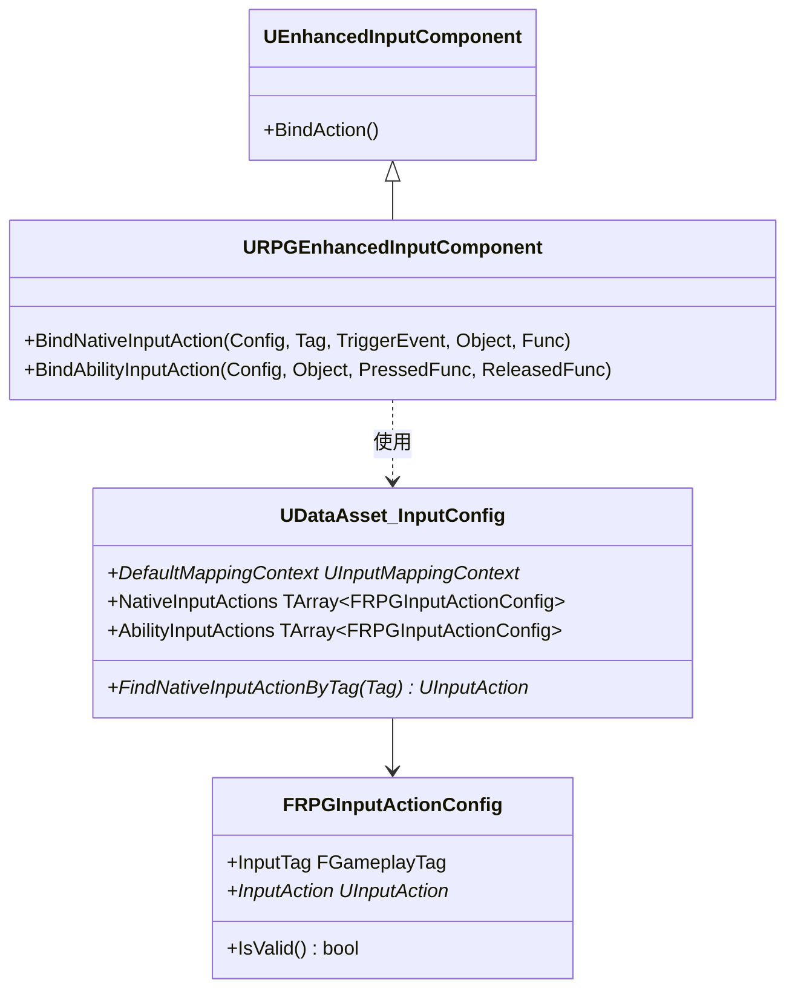
```mermaid
classDiagram
    class UEnhancedInputComponent {
        +BindAction()
    }
    
    class URPGEnhancedInputComponent {
        +BindNativeInputAction(Config, Tag, TriggerEvent, Object, Func)
        +BindAbilityInputAction(Config, Object, PressedFunc, ReleasedFunc)
    }
    
    class UDataAsset_InputConfig {
        +DefaultMappingContext UInputMappingContext*
        +NativeInputActions TArray~FRPGInputActionConfig~
        +AbilityInputActions TArray~FRPGInputActionConfig~
        +FindNativeInputActionByTag(Tag) UInputAction*
    }
    
    class FRPGInputActionConfig {
        +InputTag FGameplayTag
        +InputAction UInputAction*
        +IsValid() bool
    }
    
    UEnhancedInputComponent <|-- URPGEnhancedInputComponent
    UDataAsset_InputConfig --> FRPGInputActionConfig
    URPGEnhancedInputComponent ..> UDataAsset_InputConfig : 使用
```

**图4.16 输入模块类图**

### 4.10.4 输入绑定时序图

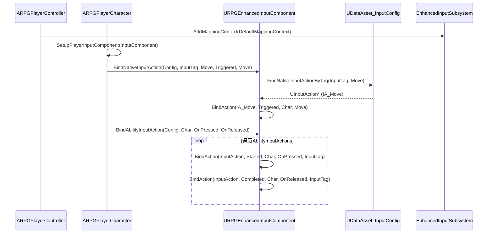
```mermaid
sequenceDiagram
    participant PC as ARPGPlayerController
    participant Char as ARPGPlayerCharacter
    participant EIC as URPGEnhancedInputComponent
    participant Config as UDataAsset_InputConfig
    participant EIS as EnhancedInputSubsystem
    
    PC->>EIS: AddMappingContext(DefaultMappingContext)
    Char->>Char: SetupPlayerInputComponent(InputComponent)
    Char->>EIC: BindNativeInputAction(Config, InputTag_Move, Triggered, Move)
    EIC->>Config: FindNativeInputActionByTag(InputTag_Move)
    Config-->>EIC: UInputAction* (IA_Move)
    EIC->>EIC: BindAction(IA_Move, Triggered, Char, Move)
    
    Char->>EIC: BindAbilityInputAction(Config, Char, OnPressed, OnReleased)
    loop 遍历AbilityInputActions
        EIC->>EIC: BindAction(InputAction, Started, Char, OnPressed, InputTag)
        EIC->>EIC: BindAction(InputAction, Completed, Char, OnReleased, InputTag)
    end
```

**图4.17 输入绑定时序图**

## 4.11 数据资产系统详细设计

### 4.11.1 数据资产架构设计

数据资产系统采用继承体系实现角色启动配置的统一管理。UDataAsset_StartUpDataBase作为启动数据基类，定义了三个核心配置数组：ActiveOnGivenAbilities（授予时立即激活的能力，如被动技能）、ReactiveAbilities（响应式能力，授予但不自动激活，等待输入触发）和StartUpGameplayEffect（启动时应用的GameplayEffect，如初始属性设置）。基类提供GiveToAbilitySystemComponent虚函数，子类可覆写以扩展授予逻辑。内部通过GrantAbilities辅助方法统一处理能力授予。

UDataAsset_PlayerStartUpData继承基类，新增PlayerStartUpAbilitySet数组（FRPGPlayerAbilitySet结构体数组）。该结构体将InputTag与AbilityToGrant（TSubclassOf<URPGPlayerGameplayAbility>）绑定，实现输入标签到能力类的映射。覆写GiveToAbilitySystemComponent时，除调用基类逻辑外，还处理玩家特有的输入绑定能力授予。

UDataAsset_EnemyStartUpData同样继承基类，当前未添加额外字段，完全复用基类的ActiveOnGivenAbilities和ReactiveAbilities配置。其设计预留了敌人特有启动逻辑的扩展点。

### 4.11.2 角色配置数据资产

UDataAsset_CharacterConfig定义玩家角色的基础信息和属性配置。包含CharacterName（角色名称）、CharacterClass（ERPGCharacterClass职业枚举）、CharacterDescription（角色描述）和BaseAttributes（FCharacterBaseAttributes结构体）。通过ApplyAttributesToASC方法将配置的属性值通过GameplayEffect应用到AbilitySystemComponent。

UDataAsset_EnemyConfig与玩家配置对称设计，包含EnemyName、EnemyType（EEnemyType枚举：Normal/Elite/Boss/Minion）、EnemyDescription和BaseAttributes（FEnemyBaseAttributes结构体）。敌人属性结构体针对敌人特点设计，包含MaxHealth、AttackPower、DefensePower等战斗属性，以及Armor、MagicResistance、StaggerResistance、PoisonResistance、BleedResistance等抗性属性，并附带GoldDrop和EXPDrop掉落配置。

### 4.11.3 数据资产继承类图

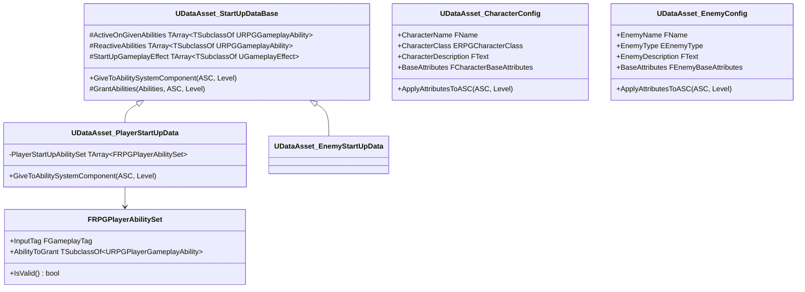
```mermaid
classDiagram
    class UDataAsset_StartUpDataBase {
        +GiveToAbilitySystemComponent(ASC, Level)
        #ActiveOnGivenAbilities TArray~TSubclassOf URPGGameplayAbility~
        #ReactiveAbilities TArray~TSubclassOf URPGGameplayAbility~
        #StartUpGameplayEffect TArray~TSubclassOf UGameplayEffect~
        #GrantAbilities(Abilities, ASC, Level)
    }
    
    class UDataAsset_PlayerStartUpData {
        +GiveToAbilitySystemComponent(ASC, Level)
        -PlayerStartUpAbilitySet TArray~FRPGPlayerAbilitySet~
    }
    
    class UDataAsset_EnemyStartUpData {
    }
    
    class UDataAsset_CharacterConfig {
        +ApplyAttributesToASC(ASC, Level)
        +CharacterName FName
        +CharacterClass ERPGCharacterClass
        +CharacterDescription FText
        +BaseAttributes FCharacterBaseAttributes
    }
    
    class UDataAsset_EnemyConfig {
        +ApplyAttributesToASC(ASC, Level)
        +EnemyName FName
        +EnemyType EEnemyType
        +EnemyDescription FText
        +BaseAttributes FEnemyBaseAttributes
    }
    
    class FRPGPlayerAbilitySet {
        +InputTag FGameplayTag
        +AbilityToGrant TSubclassOf~URPGPlayerGameplayAbility~
        +IsValid() bool
    }
    
    UDataAsset_StartUpDataBase <|-- UDataAsset_PlayerStartUpData
    UDataAsset_StartUpDataBase <|-- UDataAsset_EnemyStartUpData
    UDataAsset_PlayerStartUpData --> FRPGPlayerAbilitySet
```

**图4.18 数据资产继承类图**

## 4.12 用例图

### 4.12.1 玩家核心用例

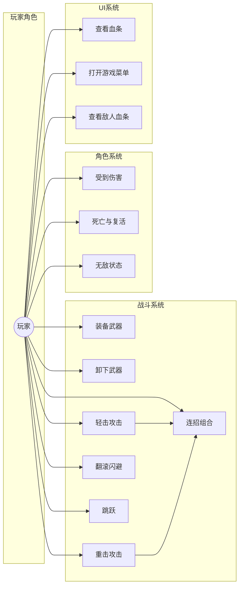
```mermaid
graph LR
    subgraph 玩家角色
        Player((玩家))
    end
    
    subgraph 战斗系统
        UC1[装备武器]
        UC2[卸下武器]
        UC3[轻击攻击]
        UC4[重击攻击]
        UC5[连招组合]
        UC6[翻滚闪避]
        UC7[跳跃]
    end
    
    subgraph 角色系统
        UC8[受到伤害]
        UC9[死亡与复活]
        UC10[无敌状态]
    end
    
    subgraph UI系统
        UC11[查看血条]
        UC12[打开游戏菜单]
        UC13[查看敌人血条]
    end
    
    Player --> UC1
    Player --> UC2
    Player --> UC3
    Player --> UC4
    Player --> UC5
    Player --> UC6
    Player --> UC7
    Player --> UC8
    Player --> UC9
    Player --> UC10
    Player --> UC11
    Player --> UC12
    Player --> UC13
    UC3 --> UC5
    UC4 --> UC5
```

**图4.19 玩家核心用例图**

### 4.12.2 敌人AI用例

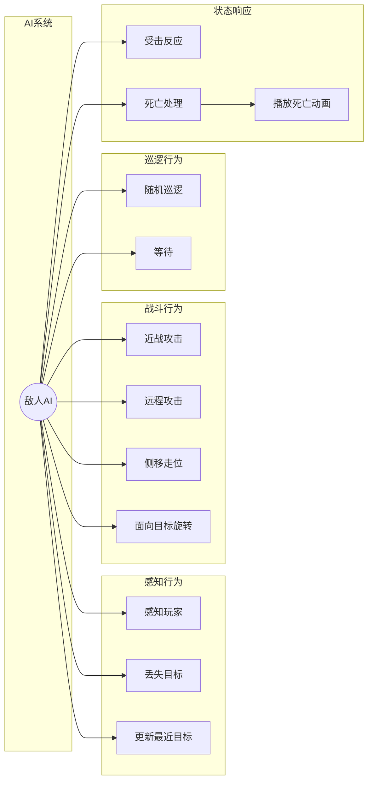
```mermaid
graph LR
    subgraph AI系统
        Enemy((敌人AI))
    end
    
    subgraph 感知行为
        UC1[感知玩家]
        UC2[丢失目标]
        UC3[更新最近目标]
    end
    
    subgraph 战斗行为
        UC4[近战攻击]
        UC5[远程攻击]
        UC6[侧移走位]
        UC7[面向目标旋转]
    end
    
    subgraph 巡逻行为
        UC8[随机巡逻]
        UC9[等待]
    end
    
    subgraph 状态响应
        UC10[受击反应]
        UC11[死亡处理]
        UC12[播放死亡动画]
    end
    
    Enemy --> UC1
    Enemy --> UC2
    Enemy --> UC3
    Enemy --> UC4
    Enemy --> UC5
    Enemy --> UC6
    Enemy --> UC7
    Enemy --> UC8
    Enemy --> UC9
    Enemy --> UC10
    Enemy --> UC11
    UC11 --> UC12
```

**图4.20 敌人AI用例图**

## 4.13 系统架构图

### 4.13.1 完整模块关系架构

```mermaid
graph TB
    subgraph 控制器层
        PC[ARPGPlayerController]
        AIC[ARPGEnemyAIController]
    end
    
    subgraph 角色层
        PlayerChar[ARPGPlayerCharacter]
        EnemyChar[ARPGEnemyCharacter]
        BaseChar[ABaseCharacter]
    end
    
    subgraph 组件层
        PawnExt[UPawnExtensionComponentBase]
        HealthComp[URPGHealthComponent]
        CombatComp[UPawnCombatComponent]
        UIComp[UPawnUIComponent]
        InputComp[URPGEnhancedInputComponent]
    end
    
    subgraph GAS层
        ASC[URPGAbilitySystemComponent]
        AttrSet[URPGAttributeSet]
        Abilities[URPGGameplayAbility]
        Effects[GameplayEffects]
    end
    
    subgraph 武器系统
        WeaponBase[ARPGWeaponBase]
        PlayerWeapon[ARPGPlayerWeapon]
        EnemyWeapon[ARPGEnemyWeapon]
    end
    
    subgraph 数据资产层
        StartUpData[UDataAsset_StartUpDataBase]
        InputConfig[UDataAsset_InputConfig]
        CharConfig[UDataAsset_CharacterConfig]
        EnemyConfig[UDataAsset_EnemyConfig]
    end
    
    subgraph UI层
        UIManager[URPGUIManagerSubsystem]
        HUD[URPGHUDWidget]
        EnemyBar[URPGEnemyHealthBarWidget]
    end
    
    subgraph AI层
        BT[BehaviorTree]
        BB[Blackboard]
        Perception[AIPerception]
    end
    
    PC --> PlayerChar
    AIC --> EnemyChar
    BaseChar --> PlayerChar
    BaseChar --> EnemyChar
    
    PlayerChar --> PawnExt
    PlayerChar --> HealthComp
    PlayerChar --> CombatComp
    PlayerChar --> UIComp
    PlayerChar --> InputComp
    
    EnemyChar --> HealthComp
    EnemyChar --> CombatComp
    EnemyChar --> UIComp
    
    PlayerChar --> ASC
    ASC --> AttrSet
    ASC --> Abilities
    Abilities --> Effects
    
    CombatComp --> WeaponBase
    WeaponBase --> PlayerWeapon
    WeaponBase --> EnemyWeapon
    
    StartUpData --> ASC
    InputConfig --> InputComp
    CharConfig --> Effects
    EnemyConfig --> Effects
    
    UIComp --> UIManager
    UIManager --> HUD
    UIManager --> EnemyBar
    
    AIC --> BT
    AIC --> BB
    AIC --> Perception
```

**图4.21 系统完整模块关系架构图**

## 4.14 配置表

### 4.14.1 玩家属性配置表（FCharacterBaseAttributes）

| 属性分类 | 属性名 | 类型 | 默认值 | 说明 |
|---------|--------|------|--------|------|
| Primary | Strength | float | 10.0 | 力量，影响物理攻击力 |
| Primary | Intelligence | float | 10.0 | 智力，影响魔法攻击力/法力值 |
| Primary | Vitality | float | 10.0 | 体质，影响生命值 |
| Primary | Agility | float | 10.0 | 敏捷，影响闪避/暴击 |
| Secondary | Armor | float | 0.0 | 护甲，减少物理伤害 |
| Secondary | CriticalHitChance | float | 5.0 | 暴击率(0-100) |
| Secondary | CriticalHitDamage | float | 1.5 | 暴击伤害倍数(最小1.0) |
| Secondary | HealthRegeneration | float | 0.0 | 生命恢复/秒 |
| Secondary | ManaRegeneration | float | 0.0 | 法力恢复/秒 |
| Vital | MaxHealth | float | 100.0 | 最大生命值(最小1.0) |
| Vital | MaxRage | float | 50.0 | 最大怒气值(最小1.0) |
| Vital | MaxMana | float | 80.0 | 最大法力值(最小1.0) |
| Vital | AttackPower | float | 10.0 | 攻击力 |
| Vital | DefensePower | float | 5.0 | 防御力 |

### 4.14.2 敌人属性配置表（FEnemyBaseAttributes）

| 属性分类 | 属性名 | 类型 | 默认值 | 说明 |
|---------|--------|------|--------|------|
| Vital | MaxHealth | float | 100.0 | 最大生命值 |
| Combat | AttackPower | float | 10.0 | 攻击力 |
| Combat | DefensePower | float | 5.0 | 防御力 |
| Resistance | Armor | float | 0.0 | 护甲减伤 |
| Resistance | MagicResistance | float | 0.0 | 魔法抗性 |
| Resistance | StaggerResistance | float | 0.0 | 硬直抗性（类魂机制） |
| Resistance | PoisonResistance | float | 0.0 | 毒素抗性 |
| Resistance | BleedResistance | float | 0.0 | 流血抗性 |
| Drop | GoldDrop | int32 | 10 | 击杀掉落金币 |
| Drop | EXPDrop | int32 | 50 | 击杀掉落经验 |

### 4.14.3 GAS运行时属性配置表（URPGAttributeSet）

| 属性分类 | 属性名 | 网络同步 | 说明 |
|---------|--------|---------|------|
| Primary | Strength | Replicated | 力量 |
| Primary | Intelligence | Replicated | 智力 |
| Primary | Vitality | Replicated | 体质 |
| Primary | Agility | Replicated | 敏捷 |
| Secondary | Armor | Replicated | 护甲 |
| Secondary | CriticalHitChance | Replicated | 暴击率 |
| Secondary | CriticalHitDamage | Replicated | 暴击伤害 |
| Secondary | HealthRegeneration | Replicated | 生命恢复 |
| Secondary | ManaRegeneration | Replicated | 法力恢复 |
| Vital | CurrentHealth | Replicated | 当前生命值 |
| Vital | MaxHealth | Replicated | 最大生命值 |
| Vital | CurrentRage | Replicated | 当前怒气值 |
| Vital | MaxRage | Replicated | 最大怒气值 |
| Vital | CurrentMana | Replicated | 当前法力值 |
| Vital | MaxMana | Replicated | 最大法力值 |
| Meta | DamageTaken | 非同步 | 受到伤害（临时计算用） |
| Meta | IncomingXP | 非同步 | 获得经验（临时计算用） |
| Meta | AttackPower | Replicated | 攻击力（兼容保留） |
| Meta | DefensePower | Replicated | 防御力（兼容保留） |

### 4.14.4 GameplayTags配置表

| 标签分类 | 标签名 | 用途 |
|---------|--------|------|
| Input | InputTag_Move | 移动输入 |
| Input | InputTag_Look | 视角输入 |
| Input | InputTag_EquipSword | 装备剑输入 |
| Input | InputTag_UnequipSword | 卸下剑输入 |
| Input | InputTag_LightAttack_Sword | 剑轻击输入 |
| Input | InputTag_HeavyAttack_Sword | 剑重击输入 |
| Input | InputTag_Roll | 翻滚输入 |
| Input | InputTag_Jump | 跳跃输入 |
| Player.Ability | Player_Ability_Equip_Sword | 装备剑能力 |
| Player.Ability | Player_Ability_Unequip_Sword | 卸下剑能力 |
| Player.Ability | Player_Ability_Attack_Light_Sword | 剑轻击能力 |
| Player.Ability | Player_Ability_Attack_Heavy_Sword | 剑重击能力 |
| Player.Ability | Player_Ability_HitPause | 顿帧能力 |
| Player.Ability | Player_Ability_Roll | 翻滚能力 |
| Player.Ability | Player_Ability_Jump | 跳跃能力 |
| Player.Weapon | Player_Weapon_Sword | 剑武器标识 |
| Player.Event | Player_Event_Equip_Sword | 装备剑事件 |
| Player.Event | Player_Event_Unequip_Sword | 卸下剑事件 |
| Player.Event | Player_Event_HitPause | 顿帧事件 |
| Player.Event | Player_Event_Jump_Finished | 跳跃结束事件 |
| Player.Status | Player_Status_JumpToFinish | 跳跃即将结束 |
| Player.Status | Player_Status_Jumping | 跳跃中 |
| Player.Status | Player_Status_Rolling | 翻滚中 |
| Player.SetByCaller | Player_SetByCaller_AttackType_Light | 轻击类型标记 |
| Player.SetByCaller | Player_SetByCaller_AttackType_Heavy | 重击类型标记 |
| Enemy.Ability | Enemy_Ability_Melee | 敌人近战能力 |
| Enemy.Ability | Enemy_Ability_Ranged | 敌人远程能力 |
| Enemy.Weapon | Enemy_Weapon | 敌人武器标识 |
| Enemy.Status | Enemy_Status_Strafing | 敌人侧移状态 |
| Enemy.Status | Enemy_Status_UnderAttack | 敌人受击状态 |
| Shared.Ability | Shared_Ability_HitReact | 受击反应能力 |
| Shared.Ability | Shared_Ability_Death | 死亡能力 |
| Shared.Event | Shared_Event_MeleeHit | 近战命中事件 |
| Shared.Event | Shared_Event_HitReact | 受击反应事件 |
| Shared.Event | Shared_Event_ComboWindow_Open | 连招窗口开启 |
| Shared.Event | Shared_Event_ComboWindow_Close | 连招窗口关闭 |
| Shared.Event | Shared_Event_Melee_CollisionEnable | 近战碰撞开启 |
| Shared.Event | Shared_Event_Melee_CollisionDisable | 近战碰撞关闭 |
| Shared.SetByCaller | Shared_SetByCaller_BaseDamage | 基础伤害值 |
| Shared.Status | Shared_Status_Dead | 死亡状态 |
| Shared.Status | Shared_Status_HitReact_Front | 正面受击 |
| Shared.Status | Shared_Status_HitReact_Back | 背面受击 |
| Shared.Status | Shared_Status_HitReact_Left | 左侧受击 |
| Shared.Status | Shared_Status_HitReact_Right | 右侧受击 |
| UI | RPGCommonUI_WidgetStack_Modal | 模态弹窗层 |
| UI | RPGCommonUI_WidgetStack_GameMenu | 游戏菜单层 |
| UI | RPGCommonUI_WidgetStack_GameHUD | 游戏HUD层 |
| UI | RPGCommonUI_WidgetStack_Frontend | 前端界面层 |

### 4.14.5 枚举类型配置表

| 枚举名 | 枚举值 | 说明 |
|--------|--------|------|
| ERPGWeaponType | None/Sword1H/Sword2H/Bow/Staff/DualBlade/Spear | 武器类型 |
| ERPGCharacterClass | None/RPG(战士)/Mage/Archer/Assassin/Paladin | 角色职业 |
| ERPGCombatState | Idle/Combat/Attacking/Blocking/Dodging/Stunned/Dead | 战斗状态 |
| ERPGComboType | LightAttack/HeavyAttack | 连招攻击类型通道 |
| EEnemyType | Normal/Elite/Boss/Minion | 敌人类型 |
| EEnemyHitReactDirection | Front/Back/Left/Right | 敌人受击方向 |
| ERPGConfirmType | Yes/No | 通用确认类型 |
| ERPGValidType | Valid/InValid | 通用有效性类型 |
| ERPGSuccessType | Successful/Failed | 通用成功类型 |
