# 4 详细设计

## 4.1 系统总体架构设计

本课题基于Unreal Engine 5.6引擎开发第三人称角色扮演游戏，系统采用组件化架构（Component-Based Architecture）与事件驱动通信机制，实现高内聚低耦合的模块化设计。系统总体架构分为五个层次：表现层（Presentation Layer）、控制层（Control Layer）、逻辑层（Logic Layer）、数据层（Data Layer）和基础设施层（Infrastructure Layer）。

系统总体架构如图4.1所示。在游戏启动并初始化各层级组件后，表现层负责渲染游戏画面、播放动画效果、显示UI界面。控制层作为系统的中枢，负责接收玩家输入、协调各模块之间的工作流和信息传递。逻辑层实现游戏核心业务逻辑，包括健康系统、UI桥接层、动画系统和能力系统。数据层管理游戏状态数据、玩家属性和游戏模式配置。基础设施层提供底层支撑服务，包括UI管理器、导航系统、输入系统和AI感知系统。

在角色控制模块中，控制层接收玩家的输入指令（如移动、跳跃、攻击），并将这些指令传递给逻辑层的相应组件进行处理。输入系统通过Enhanced Input框架将原始输入信号转换为游戏逻辑可用的输入动作，支持输入死区配置、输入优先级管理和输入防抖功能。当玩家按下移动键时，输入系统将移动向量传递给PlayerController，PlayerController再调用Character的移动组件执行角色移动逻辑。

健康系统模块负责管理角色的生命值、死亡状态、复活逻辑等健康相关数据。该系统采用分层继承架构，URPGHealthComponent作为基类提供通用的健康数据管理功能，URPGPlayerHealthComponent和URPGEnemyHealthComponent分别实现玩家和敌人特有的健康逻辑。健康系统通过动态多播委托（Dynamic Multicast Delegate）广播状态变化事件，当角色受到伤害时，HealthComponent更新生命值并触发OnHealthChanged委托，所有订阅该委托的组件（如UIComponent）都会收到通知并执行相应逻辑。

UI系统模块采用CommonUI框架和四层栈架构，通过URPGUIManagerSubsystem统一管理UI生命周期。当游戏开始时，PlayerController在BeginPlay方法中调用ShowHUD方法，UIManager创建URPGHUDWidget实例并推送到Game层。HUDWidget通过URPGPlayerUIComponent订阅健康系统的委托事件，当收到健康变化通知时，自动更新HealthBar进度条和HealthText文本显示。这种三层分离架构（数据组件→UI组件→UI Widget）实现了高内聚低耦合的设计目标。

动画系统模块通过Animation Blueprint实现动画逻辑，通过AnimInstance类提供动画数据接口。动画模块读取角色的移动速度、方向、状态等属性，驱动动画状态机的状态转换。当角色从Idle状态切换到Walk状态时，State Machine根据移动速度阈值判断转换条件，通过2D BlendSpace实现移动方向的动画混合。动画模块通过根运动（Root Motion）同步机制确保动画播放与角色物理移动的一致性，避免滑步现象。

AI模块采用行为树（Behavior Tree）和黑板（Blackboard）架构，通过ARPGEnemyAIController控制AI行为逻辑。当玩家进入AI感知范围时，AIPerceptionComponent触发OnTargetPerceptionUpdated回调，将玩家位置写入黑板。行为树读取黑板数据执行相应的行为节点，如MoveTo节点实现寻路，Attack节点执行攻击。AI模块通过URPGEnemyHealthComponent获取敌人健康状态，当血量过低时触发逃跑行为。

在游戏运行过程中，各模块通过事件驱动机制实现松耦合通信。当玩家受到伤害时，健康系统广播事件，UI系统更新显示，动画系统播放受击动画，AI系统调整行为策略。这种事件驱动架构避免了模块间的直接引用，提升了系统的可维护性和可扩展性。游戏结束时，系统会回收资源并进行状态清理，释放内存并重置各组件状态，为下一局游戏做好准备。

## 4.2 健康系统模块详细设计

### 4.2.1 健康系统架构设计

健康系统模块负责管理角色的生命值、死亡状态、复活逻辑等健康相关数据。该系统采用分层继承架构与观察者模式，通过动态多播委托实现事件广播，支持UI组件和其他模块订阅健康状态变化。

健康系统的核心组件包括URPGHealthComponent（健康基类）、URPGPlayerHealthComponent（玩家健康组件）和URPGEnemyHealthComponent（敌人健康组件）。URPGHealthComponent继承自UPawnExtensionComponentBase，提供通用的健康数据管理功能，包括获取当前生命值、获取最大生命值、判断是否死亡、计算生命值百分比等。该组件通过InitializeWithAbilitySystem方法与Ability System Component（ASC）绑定，监听ASC的健康属性变化。

当ASC的健康属性发生变化时，触发OnHealthAttributeChanged回调，URPGHealthComponent更新CurrentHealth和MaxHealth属性，并通过OnHealthChanged委托广播健康变化事件。委托采用DECLARE_DYNAMIC_MULTICAST_DELEGATE_TwoParams宏声明，支持蓝图订阅。委托回调函数必须标记为UFUNCTION()，否则会导致编译错误。

URPGPlayerHealthComponent继承自URPGHealthComponent，添加玩家特有的功能，包括复活机制和无敌状态控制。复活机制通过Revive方法实现，将CurrentHealth设置为MaxHealth的一定比例（如50%），将bIsDead设置为false，触发OnHealthChanged委托更新UI显示。无敌状态通过SetInvincible和IsInvincible方法实现，无敌状态下玩家不受伤害，健康属性变化被忽略，用于实现无敌帧（Invincibility Frames）机制。

URPGEnemyHealthComponent继承自URPGHealthComponent，添加敌人特有的功能，包括死亡动画触发和掉落物生成。在FinishDeath方法中播放敌人死亡动画，死亡动画通过动画蒙太奇实现，支持不同的死亡类型。掉落物的类型和数量通过配置表定义，支持随机掉落概率。

健康系统与UIComponent之间采用观察者模式通信。UIComponent订阅HealthComponent的委托事件，而非继承关系。当健康状态变化时，HealthComponent广播事件，UIComponent收到通知后更新UI显示。这种设计实现了数据层与表现层的解耦，提升了系统的可维护性。

### 4.2.2 健康系统类图

健康系统详细类图如图4.2所示。

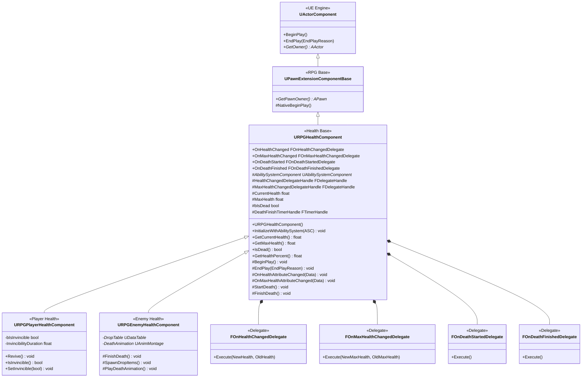
```mermaid
classDiagram
    class UActorComponent {
        <<UE Engine>>
        +BeginPlay()
        +EndPlay(EndPlayReason)
        +GetOwner() AActor*
    }
    
    class UPawnExtensionComponentBase {
        <<RPG Base>>
        +GetPawnOwner() APawn*
        #NativeBeginPlay()
    }
    
    class URPGHealthComponent {
        <<Health Base>>
        +URPGHealthComponent()
        +InitializeWithAbilitySystem(ASC) void
        +GetCurrentHealth() float
        +GetMaxHealth() float
        +IsDead() bool
        +GetHealthPercent() float
        +OnHealthChanged FOnHealthChangedDelegate
        +OnMaxHealthChanged FOnMaxHealthChangedDelegate
        +OnDeathStarted FOnDeathStartedDelegate
        +OnDeathFinished FOnDeathFinishedDelegate
        #BeginPlay() void
        #EndPlay(EndPlayReason) void
        #OnHealthAttributeChanged(Data) void
        #OnMaxHealthAttributeChanged(Data) void
        #StartDeath() void
        #FinishDeath() void
        #AbilitySystemComponent UAbilitySystemComponent*
        #HealthChangedDelegateHandle FDelegateHandle
        #MaxHealthChangedDelegateHandle FDelegateHandle
        #CurrentHealth float
        #MaxHealth float
        #bIsDead bool
        #DeathFinishTimerHandle FTimerHandle
    }
    
    class URPGPlayerHealthComponent {
        <<Player Health>>
        +Revive() void
        +IsInvincible() bool
        +SetInvincible(bool) void
        -bIsInvincible bool
        -InvincibilityDuration float
    }
    
    class URPGEnemyHealthComponent {
        <<Enemy Health>>
        #FinishDeath() void
        #SpawnDropItems() void
        #PlayDeathAnimation() void
        -DropTable UDataTable*
        -DeathAnimation UAnimMontage*
    }
    
    class FOnHealthChangedDelegate {
        <<Delegate>>
        +Execute(NewHealth, OldHealth)
    }
    
    class FOnMaxHealthChangedDelegate {
        <<Delegate>>
        +Execute(NewMaxHealth, OldMaxHealth)
    }
    
    class FOnDeathStartedDelegate {
        <<Delegate>>
        +Execute()
    }
    
    class FOnDeathFinishedDelegate {
        <<Delegate>>
        +Execute()
    }
    
    UActorComponent <|-- UPawnExtensionComponentBase
    UPawnExtensionComponentBase <|-- URPGHealthComponent
    URPGHealthComponent <|-- URPGPlayerHealthComponent
    URPGHealthComponent <|-- URPGEnemyHealthComponent
    URPGHealthComponent *-- FOnHealthChangedDelegate
    URPGHealthComponent *-- FOnMaxHealthChangedDelegate
    URPGHealthComponent *-- FOnDeathStartedDelegate
    URPGHealthComponent *-- FOnDeathFinishedDelegate
```

**图4.1 健康系统详细类图**

### 4.2.3 健康组件初始化流程

健康组件初始化流程如图4.3所示。

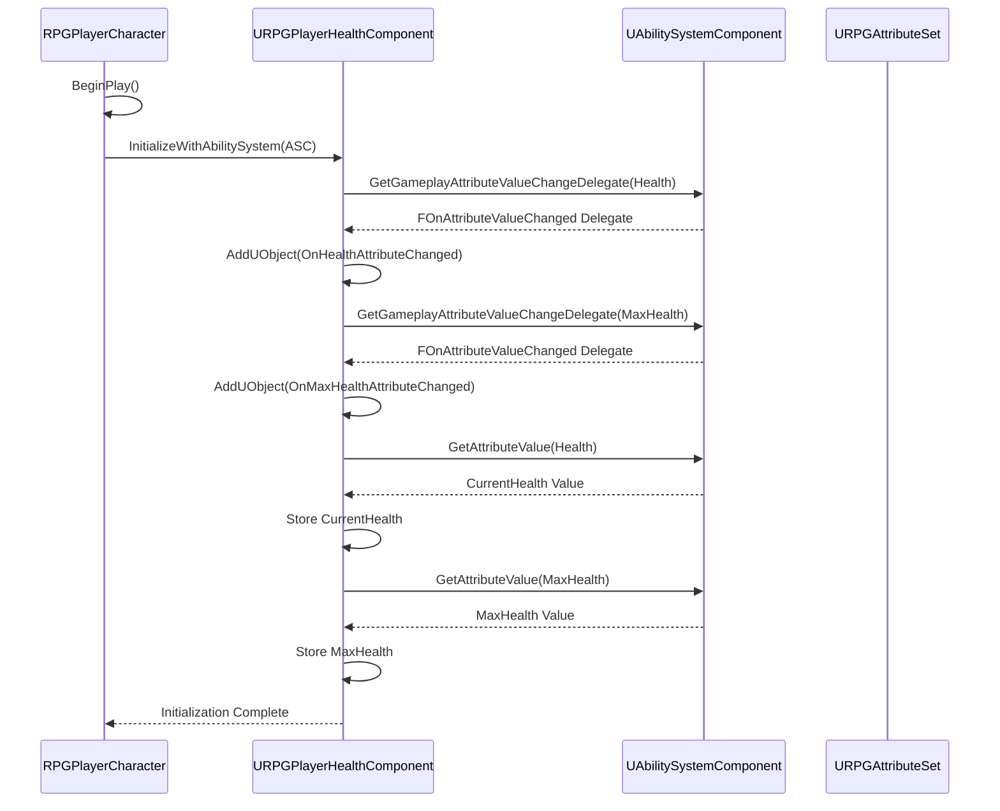
```mermaid
sequenceDiagram
    participant Char as RPGPlayerCharacter
    participant Health as URPGPlayerHealthComponent
    participant ASC as UAbilitySystemComponent
    participant AttributeSet as URPGAttributeSet
    
    Char->>Char: BeginPlay()
    Char->>Health: InitializeWithAbilitySystem(ASC)
    Health->>ASC: GetGameplayAttributeValueChangeDelegate(Health)
    ASC-->>Health: FOnAttributeValueChanged Delegate
    Health->>Health: AddUObject(OnHealthAttributeChanged)
    Health->>ASC: GetGameplayAttributeValueChangeDelegate(MaxHealth)
    ASC-->>Health: FOnAttributeValueChanged Delegate
    Health->>Health: AddUObject(OnMaxHealthAttributeChanged)
    Health->>ASC: GetAttributeValue(Health)
    ASC-->>Health: CurrentHealth Value
    Health->>Health: Store CurrentHealth
    Health->>ASC: GetAttributeValue(MaxHealth)
    ASC-->>Health: MaxHealth Value
    Health->>Health: Store MaxHealth
    Health-->>Char: Initialization Complete
```

**图4.2 健康组件初始化时序图**

### 4.2.4 健康变化事件广播流程

健康变化事件广播流程如图4.4所示。

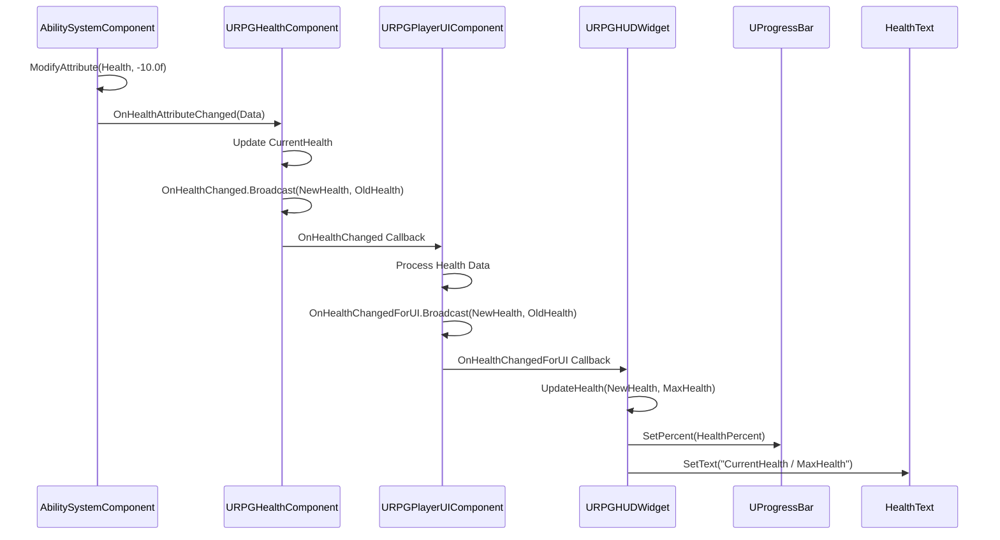
```mermaid
sequenceDiagram
    participant ASC as AbilitySystemComponent
    participant Health as URPGHealthComponent
    participant UI as URPGPlayerUIComponent
    participant HUD as URPGHUDWidget
    participant HealthBar as UProgressBar
    
    ASC->>ASC: ModifyAttribute(Health, -10.0f)
    ASC->>Health: OnHealthAttributeChanged(Data)
    Health->>Health: Update CurrentHealth
    Health->>Health: OnHealthChanged.Broadcast(NewHealth, OldHealth)
    Health->>UI: OnHealthChanged Callback
    UI->>UI: Process Health Data
    UI->>UI: OnHealthChangedForUI.Broadcast(NewHealth, OldHealth)
    UI->>HUD: OnHealthChangedForUI Callback
    HUD->>HUD: UpdateHealth(NewHealth, MaxHealth)
    HUD->>HealthBar: SetPercent(HealthPercent)
    HUD->>HealthText: SetText("CurrentHealth / MaxHealth")
```

**图4.3 健康变化事件广播时序图**

### 4.2.5 死亡流程设计

死亡流程设计如图4.5所示。

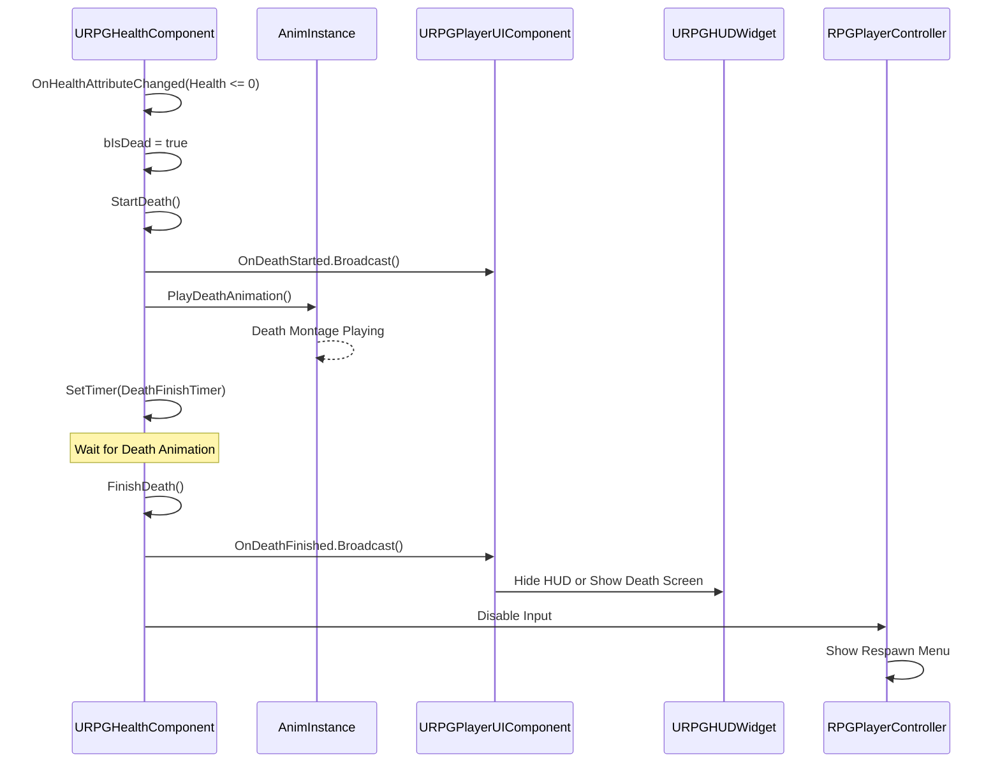
```mermaid
sequenceDiagram
    participant Health as URPGHealthComponent
    participant Anim as AnimInstance
    participant UI as URPGPlayerUIComponent
    participant HUD as URPGHUDWidget
    participant Controller as RPGPlayerController
    
    Health->>Health: OnHealthAttributeChanged(Health <= 0)
    Health->>Health: bIsDead = true
    Health->>Health: StartDeath()
    Health->>UI: OnDeathStarted.Broadcast()
    Health->>Anim: PlayDeathAnimation()
    Anim-->>Anim: Death Montage Playing
    Health->>Health: SetTimer(DeathFinishTimer)
    Note over Health: Wait for Death Animation
    Health->>Health: FinishDeath()
    Health->>UI: OnDeathFinished.Broadcast()
    UI->>HUD: Hide HUD or Show Death Screen
    Health->>Controller: Disable Input
    Controller->>Controller: Show Respawn Menu
```

**图4.4 死亡流程时序图**

### 4.2.6 核心代码实现

URPGHealthComponent的委托声明与绑定：

```cpp
// RPGHealthComponent.h
DECLARE_DYNAMIC_MULTICAST_DELEGATE_TwoParams(FOnHealthChangedDelegate, float, NewHealth, float, OldHealth);
DECLARE_DYNAMIC_MULTICAST_DELEGATE_TwoParams(FOnMaxHealthChangedDelegate, float, NewMaxHealth, float, OldMaxHealth);
DECLARE_DYNAMIC_MULTICAST_DELEGATE(FOnDeathStartedDelegate);
DECLARE_DYNAMIC_MULTICAST_DELEGATE(FOnDeathFinishedDelegate);

class RPG_API URPGHealthComponent : public UPawnExtensionComponentBase
{
    GENERATED_BODY()

public:
    UPROPERTY(BlueprintAssignable, Category="Health|Events")
    FOnHealthChangedDelegate OnHealthChanged;
    
    UPROPERTY(BlueprintAssignable, Category="Health|Events")
    FOnMaxHealthChangedDelegate OnMaxHealthChanged;
    
    UPROPERTY(BlueprintAssignable, Category="Health|Events")
    FOnDeathStartedDelegate OnDeathStarted;
    
    UPROPERTY(BlueprintAssignable, Category="Health|Events")
    FOnDeathFinishedDelegate OnDeathFinished;

    UFUNCTION(BlueprintCallable, Category="Health")
    virtual void InitializeWithAbilitySystem(UAbilitySystemComponent* ASC);

protected:
    virtual void OnHealthAttributeChanged(const FOnAttributeChangeData& Data);
    virtual void OnMaxHealthAttributeChanged(const FOnAttributeChangeData& Data);
    virtual void StartDeath();
    virtual void FinishDeath();

private:
    UPROPERTY()
    UAbilitySystemComponent* AbilitySystemComponent;
    
    FDelegateHandle HealthChangedDelegateHandle;
    FDelegateHandle MaxHealthChangedDelegateHandle;
    
    float CurrentHealth;
    float MaxHealth;
    bool bIsDead;
    
    FTimerHandle DeathFinishTimerHandle;
};
```

URPGHealthComponent的初始化实现：

```cpp
// RPGHealthComponent.cpp
void URPGHealthComponent::InitializeWithAbilitySystem(UAbilitySystemComponent* ASC)
{
    if (!ASC)
    {
        UE_LOG(LogTemp, Error, TEXT("URPGHealthComponent::InitializeWithAbilitySystem - ASC is null"));
        return;
    }
    
    AbilitySystemComponent = ASC;
    
    // 监听健康属性变化
    FGameplayAttribute HealthAttribute = UAbilitySystemBlueprintLibrary::MakeAttributeFromName(TEXT("Health"));
    HealthChangedDelegateHandle = ASC->GetGameplayAttributeValueChangeDelegate(HealthAttribute)
        .AddUObject(this, &URPGHealthComponent::OnHealthAttributeChanged);
    
    // 监听最大健康属性变化
    FGameplayAttribute MaxHealthAttribute = UAbilitySystemBlueprintLibrary::MakeAttributeFromName(TEXT("MaxHealth"));
    MaxHealthChangedDelegateHandle = ASC->GetGameplayAttributeValueChangeDelegate(MaxHealthAttribute)
        .AddUObject(this, &URPGHealthComponent::OnMaxHealthAttributeChanged);
    
    // 初始化当前值
    CurrentHealth = ASC->GetNumericAttribute(HealthAttribute);
    MaxHealth = ASC->GetNumericAttribute(MaxHealthAttribute);
    bIsDead = false;
}
```

属性变化回调实现：

```cpp
void URPGHealthComponent::OnHealthAttributeChanged(const FOnAttributeChangeData& Data)
{
    float OldHealth = CurrentHealth;
    CurrentHealth = Data.NewValue;
    
    // 广播健康变化事件
    OnHealthChanged.Broadcast(CurrentHealth, OldHealth);
    
    // 检查是否死亡
    if (CurrentHealth <= 0.0f && !bIsDead)
    {
        StartDeath();
    }
}
```

死亡流程实现：

```cpp
void URPGHealthComponent::StartDeath()
{
    if (bIsDead)
    {
        return;
    }
    
    bIsDead = true;
    
    // 广播死亡开始事件
    OnDeathStarted.Broadcast();
    
    // 播放死亡动画（由子类实现）
    APawn* PawnOwner = GetPawnOwner();
    if (PawnOwner)
    {
        UAnimInstance* AnimInstance = PawnOwner->GetAnimInstance();
        if (AnimInstance)
        {
            // 触发死亡动画
            AnimInstance->Montage_Play(DeathAnimation);
        }
    }
    
    // 设置定时器，在动画结束后完成死亡
    float DeathAnimationDuration = DeathAnimation ? DeathAnimation->GetPlayLength() : 2.0f;
    GetWorld()->GetTimerManager().SetTimer(
        DeathFinishTimerHandle,
        this,
        &URPGHealthComponent::FinishDeath,
        DeathAnimationDuration,
        false
    );
}

void URPGHealthComponent::FinishDeath()
{
    // 广播死亡完成事件
    OnDeathFinished.Broadcast();
    
    // 销毁角色或执行其他逻辑（由子类实现）
    APawn* PawnOwner = GetPawnOwner();
    if (PawnOwner)
    {
        PawnOwner->Destroy();
    }
}
```

URPGPlayerHealthComponent的复活实现：

```cpp
// RPGPlayerHealthComponent.cpp
void URPGPlayerHealthComponent::Revive()
{
    if (!bIsDead)
    {
        UE_LOG(LogTemp, Warning, TEXT("Player is not dead, cannot revive"));
        return;
    }
    
    bIsDead = false;
    CurrentHealth = MaxHealth * 0.5f;  // 复活时恢复50%生命值
    
    // 更新ASC属性
    if (AbilitySystemComponent)
    {
        FGameplayAttribute HealthAttribute = UAbilitySystemBlueprintLibrary::MakeAttributeFromName(TEXT("Health"));
        AbilitySystemComponent->SetNumericAttributeBase(HealthAttribute, CurrentHealth);
    }
    
    // 广播健康变化事件
    OnHealthChanged.Broadcast(CurrentHealth, 0.0f);
}
```

## 4.3 UI系统模块详细设计

### 4.3.1 UI系统架构设计

UI系统模块负责管理游戏的所有UI界面，采用CommonUI框架和四层栈架构，通过URPGUIManagerSubsystem统一管理UI生命周期。UI系统通过URPGPlayerUIComponent作为数据桥接层，实现健康系统与UI Widget的解耦。

UI系统的核心组件包括URPGUIManagerSubsystem（UI管理器）、URPGHUDWidget（HUD显示）、URPGMainMenuWidget（主菜单）和URPGPlayerUIComponent（玩家UI桥接）。URPGUIManagerSubsystem继承自UGameUIManagerSubsystem，作为GameInstance级全局Subsystem，统一管理四层栈UI的生命周期（创建、激活、停用、销毁）。

四层栈架构包括Game层、Menu层、Modal层和Overlay层。Game层用于显示主游戏界面，如HUD、得分显示、小地图等，始终显示在游戏场景中，为玩家提供核心游戏信息。Menu层用于显示玩家专属的交互界面，如主菜单、设置界面等，仅在玩家触发相关操作时显示。Modal层用于显示模态对话框，如设置菜单、暂停界面、确认对话框等，显示时会屏蔽下层UI的交互。Overlay层用于显示覆盖层，如加载提示、错误提示、成就通知等，通常具有较短的显示时间。

URPGHUDWidget是Game层的核心Widget，负责显示玩家的生命值、法力值、武器图标等关键信息。该Widget继承自UCommonActivatableWidget，通过UPROPERTY(BlueprintReadOnly, meta = (BindWidget))标记UI元素，与蓝图Widget绑定。在NativeOnActivated方法中，HUDWidget获取URPGPlayerUIComponent引用，订阅OnHealthChanged、OnManaChanged等委托事件。当收到委托回调时，更新对应的UI元素，如HealthBar进度条、HealthText文本。

URPGPlayerUIComponent作为数据桥接层，订阅URPGHealthComponent的OnHealthChanged委托，将健康数据转换为UI可用的格式。当收到健康变化事件时，触发OnHealthChangedForUI委托，通知HUD Widget更新显示。该组件还管理玩家的法力值数据，通过CurrentMana和MaxMana属性管理法力值，提供UpdateMana方法更新法力值，触发OnManaChangedForUI委托通知HUD Widget。

UI系统通过接口（Interface）和委托（Delegate）实现与数据层的解耦。URPGHUDWidget不直接引用URPGHealthComponent，而是通过URPGPlayerUIComponent获取数据。URPGPlayerUIComponent实现IPawnUIInterface接口，提供健康数据查询方法。通过接口抽象，HUD Widget可以处理任何实现IPawnUIInterface的组件，不依赖具体的组件类型。当需要添加新的UI数据源时，只需实现接口即可，无需修改HUD Widget代码。

在Widget停用时（NativeOnDeactivated），必须清理委托绑定，避免悬空指针和无效回调。清理方法为调用RemoveAll方法移除所有绑定到当前对象的委托回调，并重置PlayerUIComponent引用。这种生命周期管理机制确保了内存安全和避免内存泄漏。

### 4.3.2 UI系统类图

UI系统详细类图如图4.6所示。

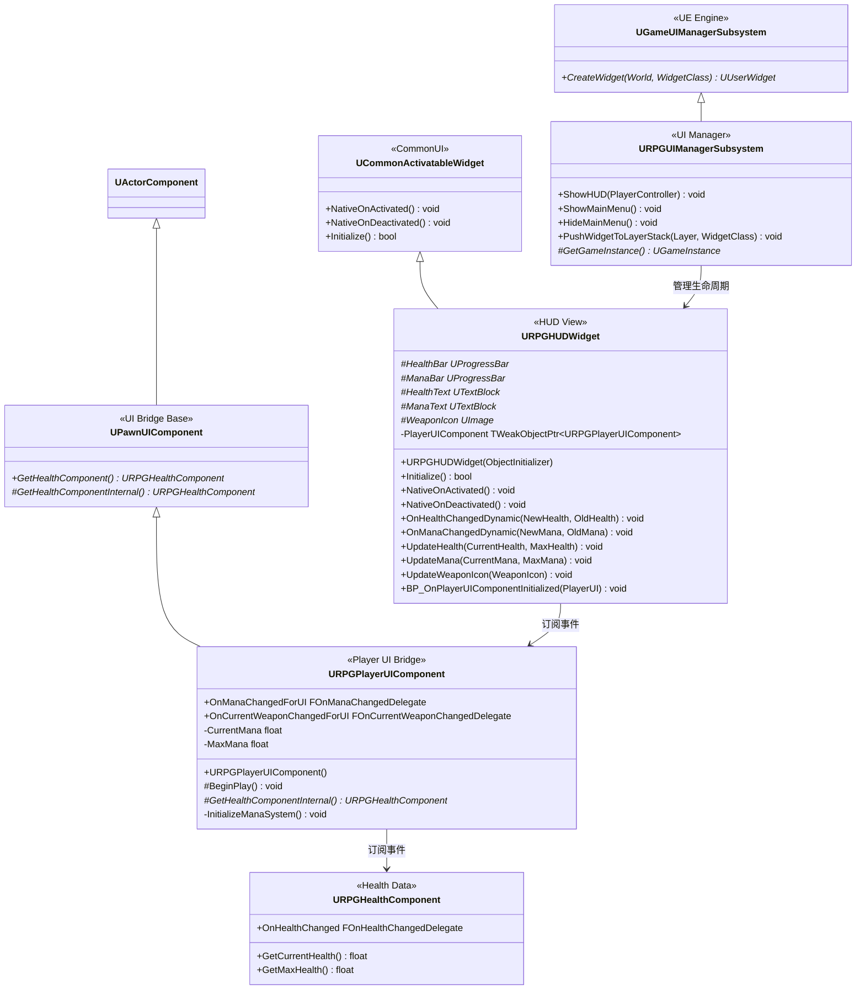
```mermaid
classDiagram
    class UGameUIManagerSubsystem {
        <<UE Engine>>
        +CreateWidget(World, WidgetClass) UUserWidget*
    }
    
    class URPGUIManagerSubsystem {
        <<UI Manager>>
        +ShowHUD(PlayerController) void
        +ShowMainMenu() void
        +HideMainMenu() void
        +PushWidgetToLayerStack(Layer, WidgetClass) void
        #GetGameInstance() UGameInstance*
    }
    
    class UCommonActivatableWidget {
        <<CommonUI>>
        +NativeOnActivated() void
        +NativeOnDeactivated() void
        +Initialize() bool
    }
    
    class URPGHUDWidget {
        <<HUD View>>
        +URPGHUDWidget(ObjectInitializer)
        +Initialize() bool
        +NativeOnActivated() void
        +NativeOnDeactivated() void
        +OnHealthChangedDynamic(NewHealth, OldHealth) void
        +OnManaChangedDynamic(NewMana, OldMana) void
        +UpdateHealth(CurrentHealth, MaxHealth) void
        +UpdateMana(CurrentMana, MaxMana) void
        +UpdateWeaponIcon(WeaponIcon) void
        +BP_OnPlayerUIComponentInitialized(PlayerUI) void
        #HealthBar UProgressBar*
        #ManaBar UProgressBar*
        #HealthText UTextBlock*
        #ManaText UTextBlock*
        #WeaponIcon UImage*
        -PlayerUIComponent TWeakObjectPtr~URPGPlayerUIComponent~
    }
    
    class UPawnUIComponent {
        <<UI Bridge Base>>
        +GetHealthComponent() URPGHealthComponent*
        #GetHealthComponentInternal() URPGHealthComponent*
    }
    
    class URPGPlayerUIComponent {
        <<Player UI Bridge>>
        +URPGPlayerUIComponent()
        +OnManaChangedForUI FOnManaChangedDelegate
        +OnCurrentWeaponChangedForUI FOnCurrentWeaponChangedDelegate
        #BeginPlay() void
        #GetHealthComponentInternal() URPGHealthComponent*
        -InitializeManaSystem() void
        -CurrentMana float
        -MaxMana float
    }
    
    class URPGHealthComponent {
        <<Health Data>>
        +OnHealthChanged FOnHealthChangedDelegate
        +GetCurrentHealth() float
        +GetMaxHealth() float
    }
    
    UGameUIManagerSubsystem <|-- URPGUIManagerSubsystem
    UCommonActivatableWidget <|-- URPGHUDWidget
    UActorComponent <|-- UPawnUIComponent
    UPawnUIComponent <|-- URPGPlayerUIComponent
    URPGUIManagerSubsystem --> URPGHUDWidget : 管理生命周期
    URPGHUDWidget --> URPGPlayerUIComponent : 订阅事件
    URPGPlayerUIComponent --> URPGHealthComponent : 订阅事件
```

**图4.5 UI系统详细类图**

### 4.3.3 HUD显示流程

HUD显示流程如图4.7所示。

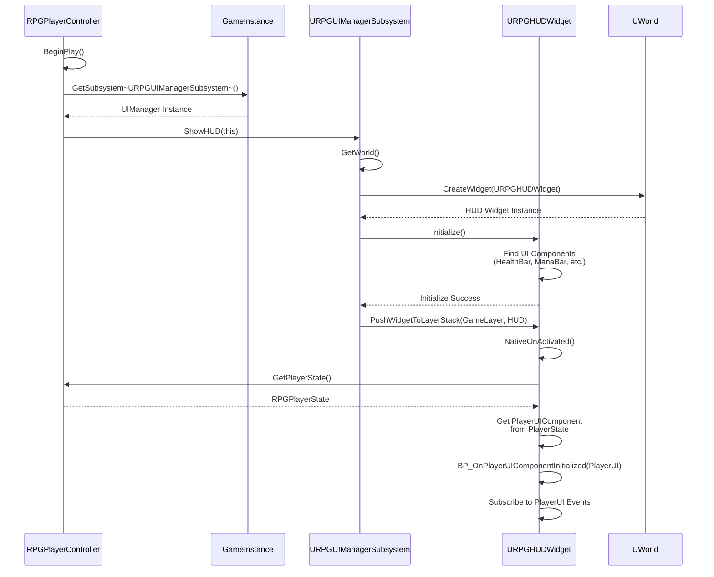
```mermaid
sequenceDiagram
    participant PC as RPGPlayerController
    participant GI as GameInstance
    participant UIS as URPGUIManagerSubsystem
    participant HUD as URPGHUDWidget
    participant World as UWorld
    
    PC->>PC: BeginPlay()
    PC->>GI: GetSubsystem~URPGUIManagerSubsystem~()
    GI-->>PC: UIManager Instance
    PC->>UIS: ShowHUD(this)
    UIS->>UIS: GetWorld()
    UIS->>World: CreateWidget(URPGHUDWidget)
    World-->>UIS: HUD Widget Instance
    UIS->>HUD: Initialize()
    HUD->>HUD: Find UI Components<br/>(HealthBar, ManaBar, etc.)
    HUD-->>UIS: Initialize Success
    UIS->>HUD: PushWidgetToLayerStack(GameLayer, HUD)
    HUD->>HUD: NativeOnActivated()
    HUD->>PC: GetPlayerState()
    PC-->>HUD: RPGPlayerState
    HUD->>HUD: Get PlayerUIComponent<br/>from PlayerState
    HUD->>HUD: BP_OnPlayerUIComponentInitialized(PlayerUI)
    HUD->>HUD: Subscribe to PlayerUI Events
```

**图4.6 HUD显示流程时序图**

### 4.3.4 UI事件订阅流程

UI事件订阅流程如图4.8所示。

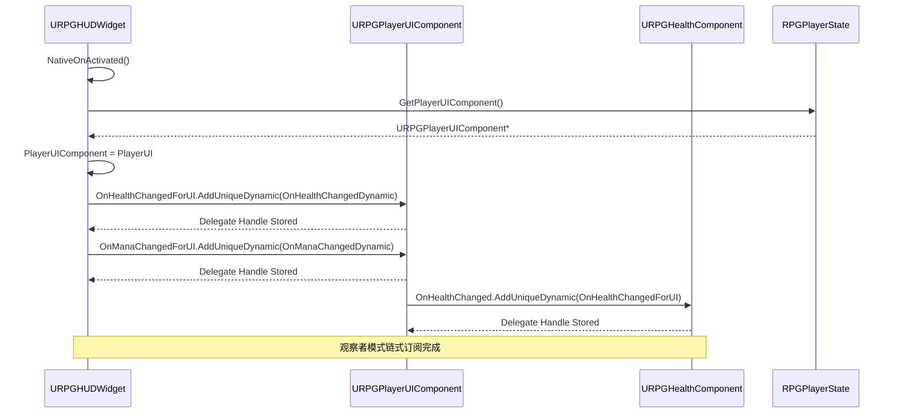
```mermaid
sequenceDiagram
    participant HUD as URPGHUDWidget
    participant PlayerUI as URPGPlayerUIComponent
    participant Health as URPGHealthComponent
    participant PlayerState as RPGPlayerState
    
    HUD->>HUD: NativeOnActivated()
    HUD->>PlayerState: GetPlayerUIComponent()
    PlayerState-->>HUD: URPGPlayerUIComponent*
    HUD->>HUD: PlayerUIComponent = PlayerUI
    HUD->>PlayerUI: OnHealthChangedForUI.AddUniqueDynamic(OnHealthChangedDynamic)
    PlayerUI-->>HUD: Delegate Handle Stored
    HUD->>PlayerUI: OnManaChangedForUI.AddUniqueDynamic(OnManaChangedDynamic)
    PlayerUI-->>HUD: Delegate Handle Stored
    PlayerUI->>Health: OnHealthChanged.AddUniqueDynamic(OnHealthChangedForUI)
    Health-->>PlayerUI: Delegate Handle Stored
    Note over HUD,Health: 观察者模式链式订阅完成
```

**图4.7 UI事件订阅时序图**

### 4.3.5 UI事件清理流程

UI事件清理流程如图4.9所示。

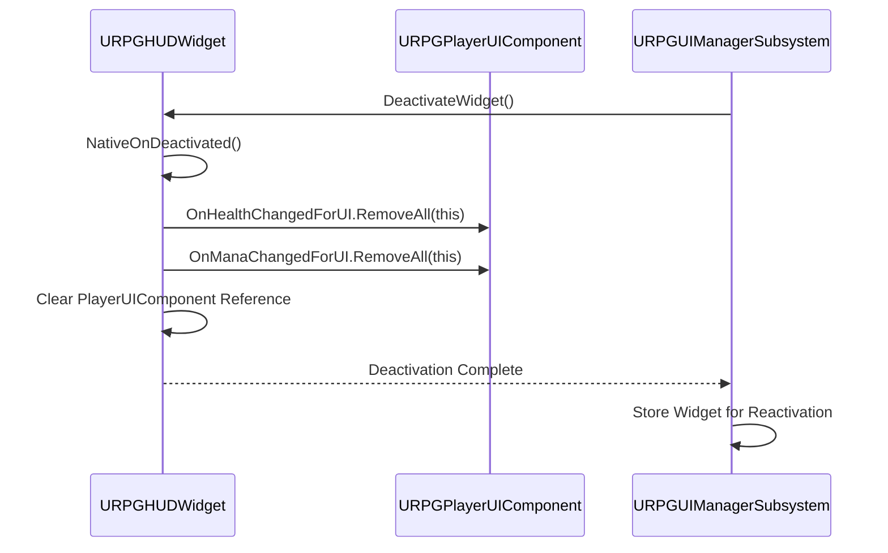
```mermaid
sequenceDiagram
    participant HUD as URPGHUDWidget
    participant PlayerUI as URPGPlayerUIComponent
    participant UIManager as URPGUIManagerSubsystem
    
    UIManager->>HUD: DeactivateWidget()
    HUD->>HUD: NativeOnDeactivated()
    HUD->>PlayerUI: OnHealthChangedForUI.RemoveAll(this)
    HUD->>PlayerUI: OnManaChangedForUI.RemoveAll(this)
    HUD->>HUD: Clear PlayerUIComponent Reference
    HUD-->>UIManager: Deactivation Complete
    UIManager->>UIManager: Store Widget for Reactivation
```

**图4.8 UI事件清理时序图**

### 4.3.6 核心代码实现

URPGUIManagerSubsystem的ShowHUD实现：

```cpp
// RPGUIManagerSubsystem.cpp
void URPGUIManagerSubsystem::ShowHUD(APlayerController* PlayerController)
{
    if (!PlayerController)
    {
        UE_LOG(LogTemp, Error, TEXT("URPGUIManagerSubsystem::ShowHUD - PlayerController is null"));
        return;
    }
    
    UWorld* World = GetWorld();
    if (!World)
    {
        return;
    }
    
    // 创建HUD Widget
    TSubclassOf<UCommonActivatableWidget> HUDWidgetClass = LoadClass<UCommonActivatableWidget>(
        nullptr, 
        TEXT("/Game/UI/WBP_HUD.WBP_HUD_C")
    );
    
    if (!HUDWidgetClass)
    {
        UE_LOG(LogTemp, Error, TEXT("Failed to load HUD Widget class"));
        return;
    }
    
    // 推送到Game层
    PushWidgetToLayerStack(EUIStackLayer::Game, HUDWidgetClass, PlayerController);
}
```

URPGHUDWidget的初始化和事件订阅：

```cpp
// RPGHUDWidget.cpp
bool URPGHUDWidget::Initialize()
{
    if (!Super::Initialize())
    {
        return false;
    }
    
    // 确保所有BindWidget组件已绑定
    if (!HealthBar || !ManaBar || !HealthText || !ManaText || !WeaponIcon)
    {
        UE_LOG(LogTemp, Error, TEXT("URPGHUDWidget::Initialize - Missing UI components"));
        return false;
    }
    
    return true;
}

void URPGHUDWidget::NativeOnActivated()
{
    Super::NativeOnActivated();
    
    // 获取PlayerUIComponent并订阅事件
    APlayerController* PC = GetOwningPlayer();
    if (PC && PC->GetPlayerState<ARPGPlayerState>())
    {
        ARPGPlayerState* PlayerState = PC->GetPlayerState<ARPGPlayerState>();
        URPGPlayerUIComponent* PlayerUI = PlayerState->GetPlayerUIComponent();
        
        if (PlayerUI)
        {
            PlayerUIComponent = PlayerUI;
            
            // 订阅健康变化事件
            PlayerUI->OnHealthChangedForUI.AddUniqueDynamic(this, &URPGHUDWidget::OnHealthChangedDynamic);
            
            // 订阅法力值变化事件
            PlayerUI->OnManaChangedForUI.AddUniqueDynamic(this, &URPGHUDWidget::OnManaChangedDynamic);
            
            // 调用蓝图实现事件
            BP_OnPlayerUIComponentInitialized(PlayerUI);
        }
    }
}

void URPGHUDWidget::NativeOnDeactivated()
{
    Super::NativeOnDeactivated();
    
    // 清理委托绑定
    if (PlayerUIComponent.IsValid())
    {
        PlayerUIComponent->OnHealthChangedForUI.RemoveAll(this);
        PlayerUIComponent->OnManaChangedForUI.RemoveAll(this);
        PlayerUIComponent.Reset();
    }
}
```

事件回调实现：

```cpp
void URPGHUDWidget::OnHealthChangedDynamic(float NewHealth, float OldHealth)
{
    UpdateHealth(NewHealth, PlayerUIComponent->GetMaxHealth());
}

void URPGHUDWidget::OnManaChangedDynamic(float NewMana, float OldMana)
{
    UpdateMana(NewMana, PlayerUIComponent->GetMaxMana());
}

void URPGHUDWidget::UpdateHealth(float CurrentHealth, float MaxHealth)
{
    if (HealthBar && MaxHealth > 0.0f)
    {
        float HealthPercent = CurrentHealth / MaxHealth;
        HealthBar->SetPercent(HealthPercent);
    }
    
    if (HealthText)
    {
        FString HealthString = FString::Printf(TEXT("%.0f / %.0f"), CurrentHealth, MaxHealth);
        HealthText->SetText(FText::FromString(HealthString));
    }
}
```

URPGPlayerUIComponent的事件订阅：

```cpp
// RPGPlayerUIComponent.cpp
void URPGPlayerUIComponent::BeginPlay()
{
    Super::BeginPlay();
    
    // 获取健康组件并订阅事件
    URPGHealthComponent* HealthComp = GetHealthComponentInternal();
    if (HealthComp)
    {
        HealthComp->OnHealthChanged.AddUniqueDynamic(this, &URPGPlayerUIComponent::OnHealthChangedForUI);
    }
    
    // 初始化法力系统
    InitializeManaSystem();
}

URPGHealthComponent* URPGPlayerUIComponent::GetHealthComponentInternal() const
{
    APawn* PawnOwner = GetPawnOwner();
    if (PawnOwner)
    {
        return PawnOwner->FindComponentByClass<URPGPlayerHealthComponent>();
    }
    return nullptr;
}
```

## 4.3 控制器模块详细设计

### 4.3.1 控制器类图

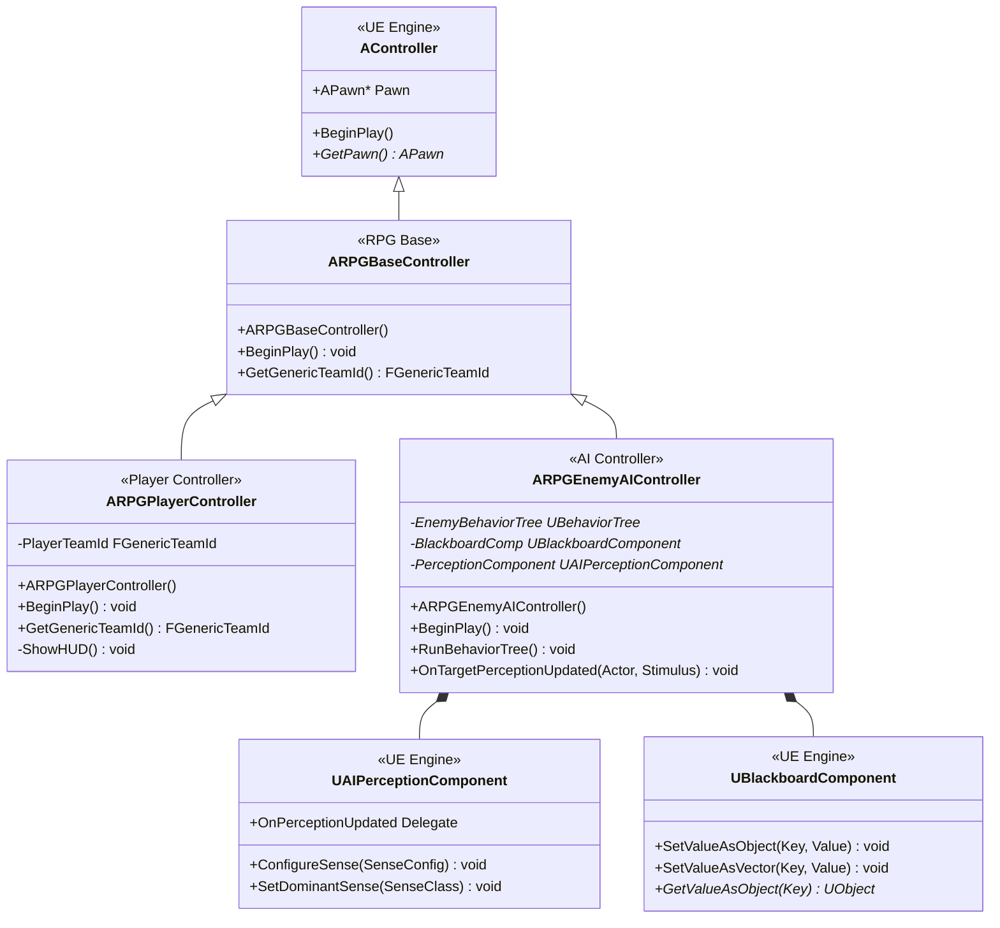
```mermaid
classDiagram
    class AController {
        <<UE Engine>>
        +APawn* Pawn
        +BeginPlay()
        +GetPawn() APawn*
    }
    
    class ARPGBaseController {
        <<RPG Base>>
        +ARPGBaseController()
        +BeginPlay() void
        +GetGenericTeamId() FGenericTeamId
    }
    
    class ARPGPlayerController {
        <<Player Controller>>
        +ARPGPlayerController()
        +BeginPlay() void
        +GetGenericTeamId() FGenericTeamId
        -ShowHUD() void
        -PlayerTeamId FGenericTeamId
    }
    
    class ARPGEnemyAIController {
        <<AI Controller>>
        +ARPGEnemyAIController()
        +BeginPlay() void
        +RunBehaviorTree() void
        +OnTargetPerceptionUpdated(Actor, Stimulus) void
        -EnemyBehaviorTree UBehaviorTree*
        -BlackboardComp UBlackboardComponent*
        -PerceptionComponent UAIPerceptionComponent*
    }
    
    class UAIPerceptionComponent {
        <<UE Engine>>
        +ConfigureSense(SenseConfig) void
        +SetDominantSense(SenseClass) void
        +OnPerceptionUpdated Delegate
    }
    
    class UBlackboardComponent {
        <<UE Engine>>
        +SetValueAsObject(Key, Value) void
        +SetValueAsVector(Key, Value) void
        +GetValueAsObject(Key) UObject*
    }
    
    AController <|-- ARPGBaseController
    ARPGBaseController <|-- ARPGPlayerController
    ARPGBaseController <|-- ARPGEnemyAIController
    ARPGEnemyAIController *-- UAIPerceptionComponent
    ARPGEnemyAIController *-- UBlackboardComponent
```

**图4.9 控制器详细类图**

### 4.3.2 PlayerController初始化时序图

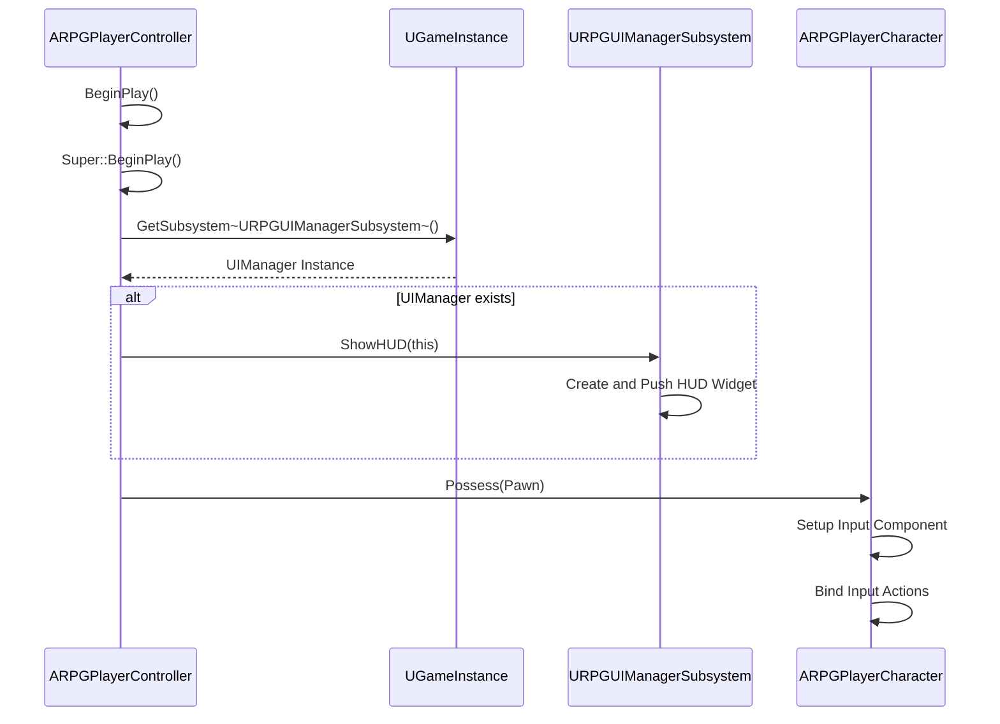
```mermaid
sequenceDiagram
    participant PC as ARPGPlayerController
    participant GI as UGameInstance
    participant UIS as URPGUIManagerSubsystem
    participant Pawn as ARPGPlayerCharacter
    
    PC->>PC: BeginPlay()
    PC->>PC: Super::BeginPlay()
    PC->>GI: GetSubsystem~URPGUIManagerSubsystem~()
    GI-->>PC: UIManager Instance
    alt UIManager exists
        PC->>UIS: ShowHUD(this)
        UIS->>UIS: Create and Push HUD Widget
    end
    PC->>Pawn: Possess(Pawn)
    Pawn->>Pawn: Setup Input Component
    Pawn->>Pawn: Bind Input Actions
```

**图4.10 PlayerController初始化时序图**

### 4.3.3 AIController感知与行为树时序图

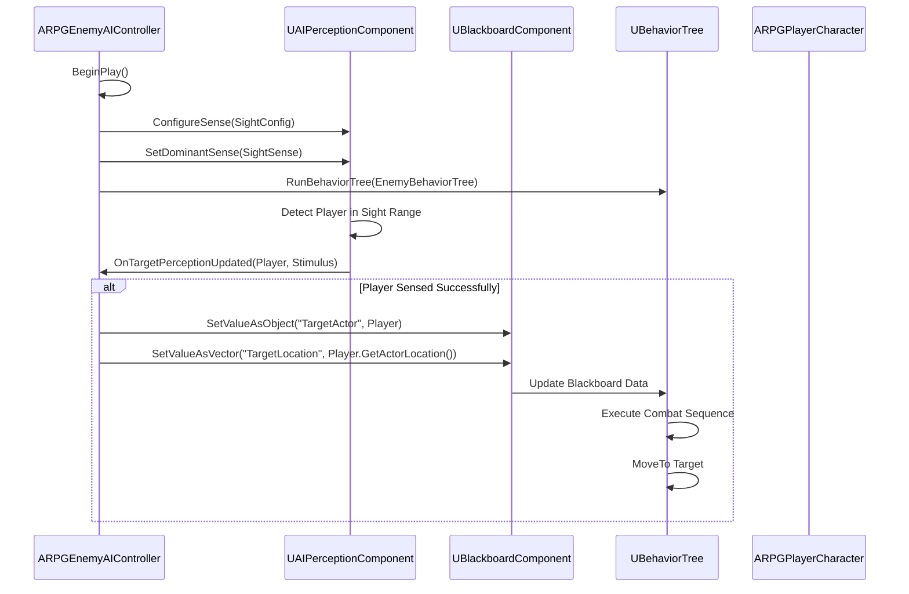
```mermaid
sequenceDiagram
    participant AIC as ARPGEnemyAIController
    participant Perception as UAIPerceptionComponent
    participant BB as UBlackboardComponent
    participant BT as UBehaviorTree
    participant Player as ARPGPlayerCharacter
    
    AIC->>AIC: BeginPlay()
    AIC->>Perception: ConfigureSense(SightConfig)
    AIC->>Perception: SetDominantSense(SightSense)
    AIC->>BT: RunBehaviorTree(EnemyBehaviorTree)
    
    Perception->>Perception: Detect Player in Sight Range
    Perception->>AIC: OnTargetPerceptionUpdated(Player, Stimulus)
    alt Player Sensed Successfully
        AIC->>BB: SetValueAsObject("TargetActor", Player)
        AIC->>BB: SetValueAsVector("TargetLocation", Player.GetActorLocation())
        BB->>BT: Update Blackboard Data
        BT->>BT: Execute Combat Sequence
        BT->>BT: MoveTo Target
    end
```

**图4.11 AIController感知与行为树时序图**

### 4.3.4 核心代码实现

ARPGPlayerController实现：

```cpp
// RPGPlayerController.cpp
ARPGPlayerController::ARPGPlayerController()
{
    PlayerTeamId = FGenericTeamId(0);  // 玩家团队ID为0（中立）
}

void ARPGPlayerController::BeginPlay()
{
    Super::BeginPlay();
    
    // 显示HUD
    if (URPGUIManagerSubsystem* UIManager = GetGameInstance()->GetSubsystem<URPGUIManagerSubsystem>())
    {
        UIManager->ShowHUD(this);
    }
}

FGenericTeamId ARPGPlayerController::GetGenericTeamId() const
{
    return PlayerTeamId;
}
```

ARPGEnemyAIController实现：

```cpp
// RPGEnemyAIController.cpp
void ARPGEnemyAIController::BeginPlay()
{
    Super::BeginPlay();
    
    // 配置AI感知
    UAIPerceptionComponent* PerceptionComponent = FindComponentByClass<UAIPerceptionComponent>();
    if (PerceptionComponent)
    {
        PerceptionComponent->OnTargetPerceptionUpdated.AddDynamic(this, &ARPGEnemyAIController::OnTargetPerceptionUpdated);
    }
    
    // 运行行为树
    if (EnemyBehaviorTree)
    {
        RunBehaviorTree(EnemyBehaviorTree);
    }
}

void ARPGEnemyAIController::OnTargetPerceptionUpdated(AActor* Actor, FAIStimulus Stimulus)
{
    if (Stimulus.WasSuccessfullySensed() && Actor->ActorHasTag(TEXT("Player")))
    {
        // 将玩家信息写入黑板
        if (UBlackboardComponent* Blackboard = GetBlackboardComponent())
        {
            Blackboard->SetValueAsObject(TEXT("TargetActor"), Actor);
            Blackboard->SetValueAsVector(TEXT("TargetLocation"), Actor->GetActorLocation());
        }
    }
    else if (!Stimulus.WasSuccessfullySensed())
    {
        // 失去目标，清除黑板数据
        if (UBlackboardComponent* Blackboard = GetBlackboardComponent())
        {
            Blackboard->ClearValue(TEXT("TargetActor"));
            Blackboard->ClearValue(TEXT("TargetLocation"));
        }
    }
}
```

## 4.4 动画模块详细设计

### 4.4.1 动画模块类图

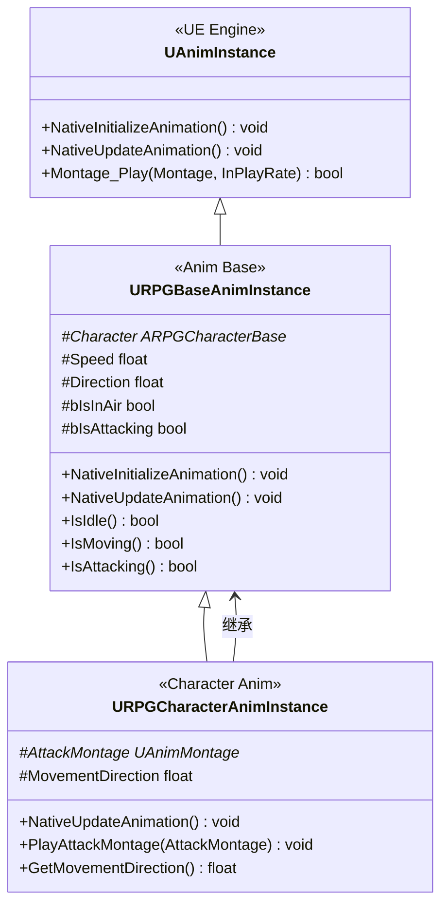
```mermaid
classDiagram
    class UAnimInstance {
        <<UE Engine>>
        +NativeInitializeAnimation() void
        +NativeUpdateAnimation() void
        +Montage_Play(Montage, InPlayRate) bool
    }
    
    class URPGBaseAnimInstance {
        <<Anim Base>>
        +NativeInitializeAnimation() void
        +NativeUpdateAnimation() void
        +IsIdle() bool
        +IsMoving() bool
        +IsAttacking() bool
        #Character ARPGCharacterBase*
        #Speed float
        #Direction float
        #bIsInAir bool
        #bIsAttacking bool
    }
    
    class URPGCharacterAnimInstance {
        <<Character Anim>>
        +NativeUpdateAnimation() void
        +PlayAttackMontage(AttackMontage) void
        +GetMovementDirection() float
        #AttackMontage UAnimMontage*
        #MovementDirection float
    }
    
    UAnimInstance <|-- URPGBaseAnimInstance
    URPGBaseAnimInstance <|-- URPGCharacterAnimInstance
    URPGCharacterAnimInstance --> URPGBaseAnimInstance : 继承
```

**图4.12 动画模块类图**

### 4.4.2 动画状态机工作时序图

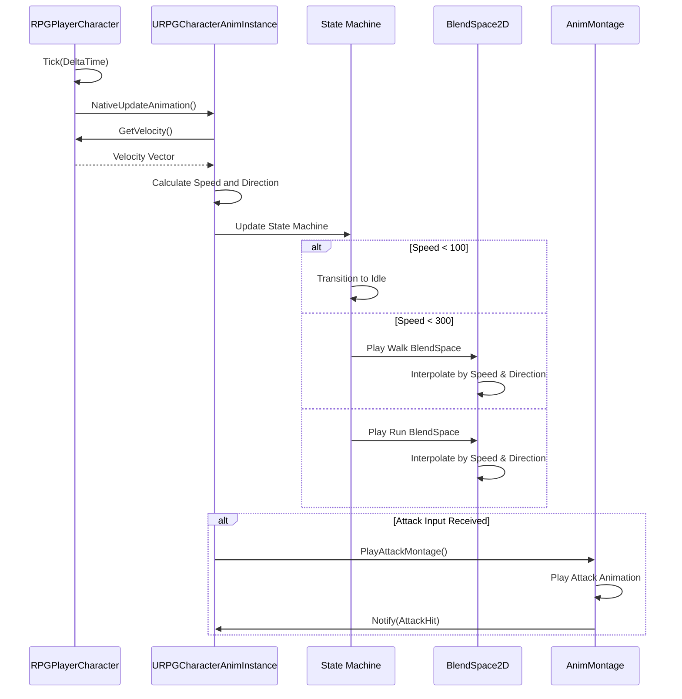
```mermaid
sequenceDiagram
    participant Char as RPGPlayerCharacter
    participant Anim as URPGCharacterAnimInstance
    participant SM as State Machine
    participant BlendSpace as BlendSpace2D
    participant Montage as AnimMontage
    
    Char->>Char: Tick(DeltaTime)
    Char->>Anim: NativeUpdateAnimation()
    Anim->>Char: GetVelocity()
    Char-->>Anim: Velocity Vector
    Anim->>Anim: Calculate Speed and Direction
    Anim->>SM: Update State Machine
    alt Speed < 100
        SM->>SM: Transition to Idle
    else Speed < 300
        SM->>BlendSpace: Play Walk BlendSpace
        BlendSpace->>BlendSpace: Interpolate by Speed & Direction
    else
        SM->>BlendSpace: Play Run BlendSpace
        BlendSpace->>BlendSpace: Interpolate by Speed & Direction
    end
    alt Attack Input Received
        Anim->>Montage: PlayAttackMontage()
        Montage->>Montage: Play Attack Animation
        Montage->>Anim: Notify(AttackHit)
    end
```

**图4.13 动画状态机工作时序图**

### 4.4.3 核心代码实现

URPGBaseAnimInstance实现：

```cpp
// RPGBaseAnimInstance.cpp
void URPGBaseAnimInstance::NativeInitializeAnimation()
{
    Super::NativeInitializeAnimation();
    
    // 获取角色引用
    APawn* PawnOwner = TryGetPawnOwner();
    if (PawnOwner)
    {
        Character = Cast<ARPGCharacterBase>(PawnOwner);
    }
}

void URPGBaseAnimInstance::NativeUpdateAnimation()
{
    Super::NativeUpdateAnimation();
    
    if (!Character)
    {
        return;
    }
    
    // 更新移动速度
    FVector Velocity = Character->GetVelocity();
    Speed = Velocity.Size2D();
    
    // 更新移动方向
    if (Speed > 0.0f)
    {
        FVector ForwardVector = Character->GetActorForwardVector();
        Direction = FVector::DotProduct(Velocity.GetSafeNormal(), ForwardVector);
    }
    else
    {
        Direction = 0.0f;
    }
    
    // 更新空中状态
    bIsInAir = !Character->GetMovementComponent()->IsMovingOnGround();
}
```

URPGCharacterAnimInstance实现：

```cpp
// RPGCharacterAnimInstance.cpp
void URPGCharacterAnimInstance::NativeUpdateAnimation()
{
    Super::NativeUpdateAnimation();
    
    // 计算移动方向
    MovementDirection = GetMovementDirection();
}

float URPGCharacterAnimInstance::GetMovementDirection()
{
    if (Speed <= 0.0f)
    {
        return 0.0f;
    }
    
    APawn* PawnOwner = TryGetPawnOwner();
    if (!PawnOwner)
    {
        return 0.0f;
    }
    
    FVector Velocity = PawnOwner->GetVelocity();
    FVector ForwardVector = PawnOwner->GetActorForwardVector();
    
    float DotProduct = FVector::DotProduct(Velocity.GetSafeNormal2D(), ForwardVector);
    
    if (DotProduct > 0.0f)
    {
        return 0.0f;  // 前进
    }
    else
    {
        return 180.0f;  // 后退
    }
}

void URPGCharacterAnimInstance::PlayAttackMontage(UAnimMontage* AttackMontage)
{
    if (AttackMontage)
    {
        Montage_Play(AttackMontage, 1.0f);
    }
}
```

## 4.5 系统整体用例图

### 4.5.1 玩家用例图

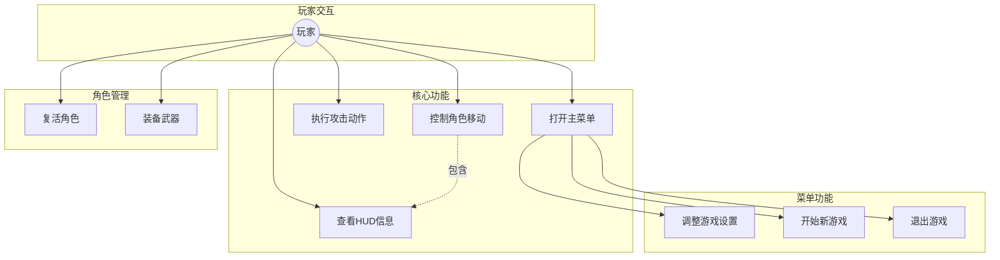
```mermaid
graph TB
    subgraph 玩家交互
        Player((玩家))
    end
    
    subgraph 核心功能
        UC1[控制角色移动]
        UC2[执行攻击动作]
        UC3[查看HUD信息]
        UC4[打开主菜单]
    end
    
    subgraph 菜单功能
        UC5[调整游戏设置]
        UC6[开始新游戏]
        UC7[退出游戏]
    end
    
    subgraph 角色管理
        UC8[复活角色]
        UC9[装备武器]
    end
    
    Player --> UC1
    Player --> UC2
    Player --> UC3
    Player --> UC4
    Player --> UC8
    Player --> UC9
    
    UC4 --> UC5
    UC4 --> UC6
    UC4 --> UC7
    UC1 -.包含.-> UC3
```

**图4.14 玩家用例图**

### 4.5.2 AI敌人用例图

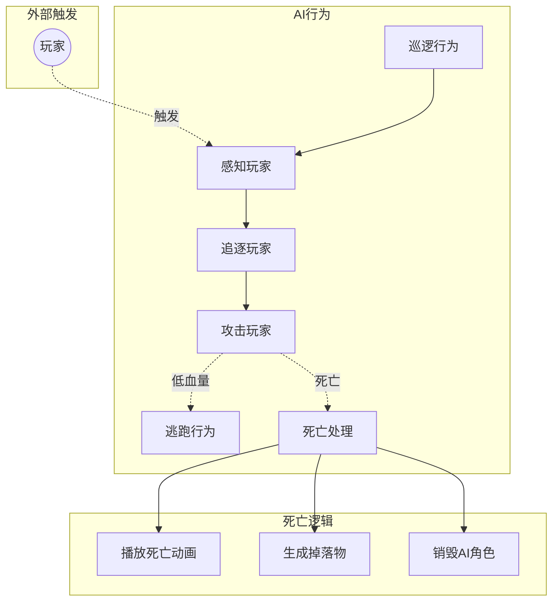
```mermaid
graph TB
    subgraph 外部触发
        Player((玩家))
    end
    
    subgraph AI行为
        UC1[巡逻行为]
        UC2[感知玩家]
        UC3[追逐玩家]
        UC4[攻击玩家]
        UC5[逃跑行为]
        UC6[死亡处理]
    end
    
    subgraph 死亡逻辑
        UC7[播放死亡动画]
        UC8[生成掉落物]
        UC9[销毁AI角色]
    end
    
    Player -.触发.-> UC2
    UC2 --> UC3
    UC3 --> UC4
    UC4 -.低血量.-> UC5
    UC4 -.死亡.-> UC6
    UC6 --> UC7
    UC6 --> UC8
    UC6 --> UC9
    UC1 --> UC2
```

**图4.15 AI敌人用例图**

### 4.5.3 系统管理用例图

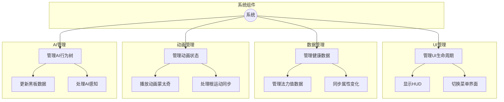
```mermaid
graph TB
    subgraph 系统组件
        System((系统))
    end
    
    subgraph UI管理
        UC1[管理UI生命周期]
        UC2[显示HUD]
        UC3[切换菜单界面]
    end
    
    subgraph 数据管理
        UC4[管理健康数据]
        UC5[管理法力值数据]
        UC6[同步属性变化]
    end
    
    subgraph 动画管理
        UC7[管理动画状态]
        UC8[播放动画蒙太奇]
        UC9[处理根运动同步]
    end
    
    subgraph AI管理
        UC10[管理AI行为树]
        UC11[更新黑板数据]
        UC12[处理AI感知]
    end
    
    System --> UC1
    System --> UC4
    System --> UC7
    System --> UC10
    
    UC1 --> UC2
    UC1 --> UC3
    UC4 --> UC5
    UC4 --> UC6
    UC7 --> UC8
    UC7 --> UC9
    UC10 --> UC11
    UC10 --> UC12
```

**图4.16 系统管理用例图**

## 4.6 系统整体架构图

### 4.6.1 完整系统架构图

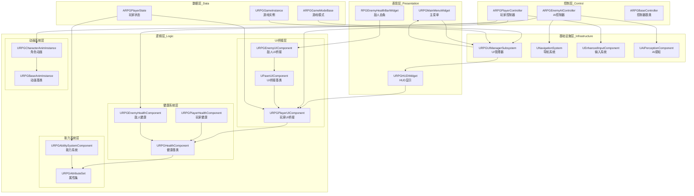
```mermaid
graph TB
    subgraph 表现层_Presentation
        HUD[URPGHUDWidget<br/>HUD显示]
        MM[URPGMainMenuWidget<br/>主菜单]
        EHB[RPGEnemyHealthBarWidget<br/>敌人血条]
    end
    
    subgraph 控制层_Control
        PC[ARPGPlayerController<br/>玩家控制器]
        EAC[ARPGEnemyAIController<br/>AI控制器]
        BC[ARPGBaseController<br/>控制器基类]
    end
    
    subgraph 逻辑层_Logic
        subgraph UI桥接层
            PUI[URPGPlayerUIComponent<br/>玩家UI桥接]
            EUI[URPGEnemyUIComponent<br/>敌人UI桥接]
            PUIComp[UPawnUIComponent<br/>UI桥接基类]
        end
        
        subgraph 健康系统层
            PHC[URPGPlayerHealthComponent<br/>玩家健康]
            EHC[URPGEnemyHealthComponent<br/>敌人健康]
            HC[URPGHealthComponent<br/>健康基类]
        end
        
        subgraph 动画系统层
            CAI[URPGCharacterAnimInstance<br/>角色动画]
            BAI[URPGBaseAnimInstance<br/>动画基类]
        end
        
        subgraph 能力系统层
            ASC[URPGAbilitySystemComponent<br/>能力系统]
            AS[URPGAttributeSet<br/>属性集]
        end
    end
    
    subgraph 数据层_Data
        PS[ARPGPlayerState<br/>玩家状态]
        GM[ARPGGameModeBase<br/>游戏模式]
        GI[URPGGameInstance<br/>游戏实例]
    end
    
    subgraph 基础设施层_Infrastructure
        UIS[URPGUIManagerSubsystem<br/>UI管理器]
        NS[UNavigationSystem<br/>导航系统]
        IS[UEnhancedInputComponent<br/>输入系统]
        AP[UAIPerceptionComponent<br/>AI感知]
    end
    
    HUD --> PUI
    MM --> UIS
    EHB --> EUI
    PC --> PUI
    PC --> CAI
    EAC --> EHC
    EAC --> AP
    PUI --> HC
    PUIComp --> PUI
    EUI --> PUIComp
    PHC --> HC
    EHC --> HC
    HC --> AS
    ASC --> AS
    CAI --> BAI
    PS --> PUI
    PS --> ASC
    GM --> UIS
    GI --> UIS
    UIS --> HUD
    UIS --> MM
    PC --> IS
    EAC --> NS
```

**图4.17 系统完整架构图**

### 4.6.2 数据流图

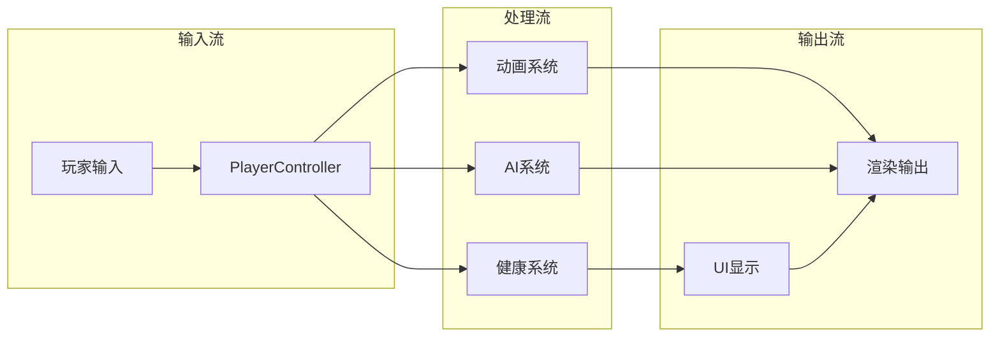
```mermaid
graph LR
    subgraph 输入流
        Input[玩家输入]
        PC[PlayerController]
    end
    
    subgraph 处理流
        Anim[动画系统]
        Health[健康系统]
        AI[AI系统]
    end
    
    subgraph 输出流
        UI[UI显示]
        Render[渲染输出]
    end
    
    Input --> PC
    PC --> Anim
    PC --> Health
    PC --> AI
    Anim --> Render
    Health --> UI
    AI --> Render
    UI --> Render
```

**图4.18 系统数据流图**

## 4.7 关键交互流程详细设计

### 4.7.1 玩家受击完整流程时序图

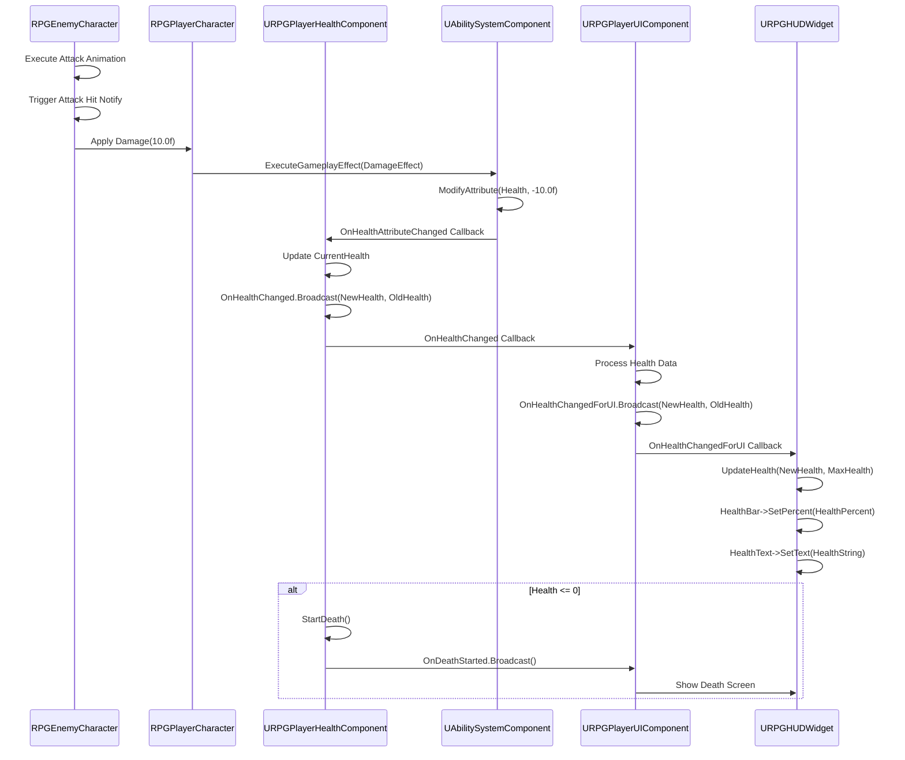
```mermaid
sequenceDiagram
    participant Enemy as RPGEnemyCharacter
    participant Player as RPGPlayerCharacter
    participant Health as URPGPlayerHealthComponent
    participant ASC as UAbilitySystemComponent
    participant PUI as URPGPlayerUIComponent
    participant HUD as URPGHUDWidget
    
    Enemy->>Enemy: Execute Attack Animation
    Enemy->>Enemy: Trigger Attack Hit Notify
    Enemy->>Player: Apply Damage(10.0f)
    Player->>ASC: ExecuteGameplayEffect(DamageEffect)
    ASC->>ASC: ModifyAttribute(Health, -10.0f)
    ASC->>Health: OnHealthAttributeChanged Callback
    Health->>Health: Update CurrentHealth
    Health->>Health: OnHealthChanged.Broadcast(NewHealth, OldHealth)
    Health->>PUI: OnHealthChanged Callback
    PUI->>PUI: Process Health Data
    PUI->>PUI: OnHealthChangedForUI.Broadcast(NewHealth, OldHealth)
    PUI->>HUD: OnHealthChangedForUI Callback
    HUD->>HUD: UpdateHealth(NewHealth, MaxHealth)
    HUD->>HUD: HealthBar->SetPercent(HealthPercent)
    HUD->>HUD: HealthText->SetText(HealthString)
    alt Health <= 0
        Health->>Health: StartDeath()
        Health->>PUI: OnDeathStarted.Broadcast()
        PUI->>HUD: Show Death Screen
    end
```

**图4.19 玩家受击完整流程时序图**

### 4.7.2 UI界面切换时序图

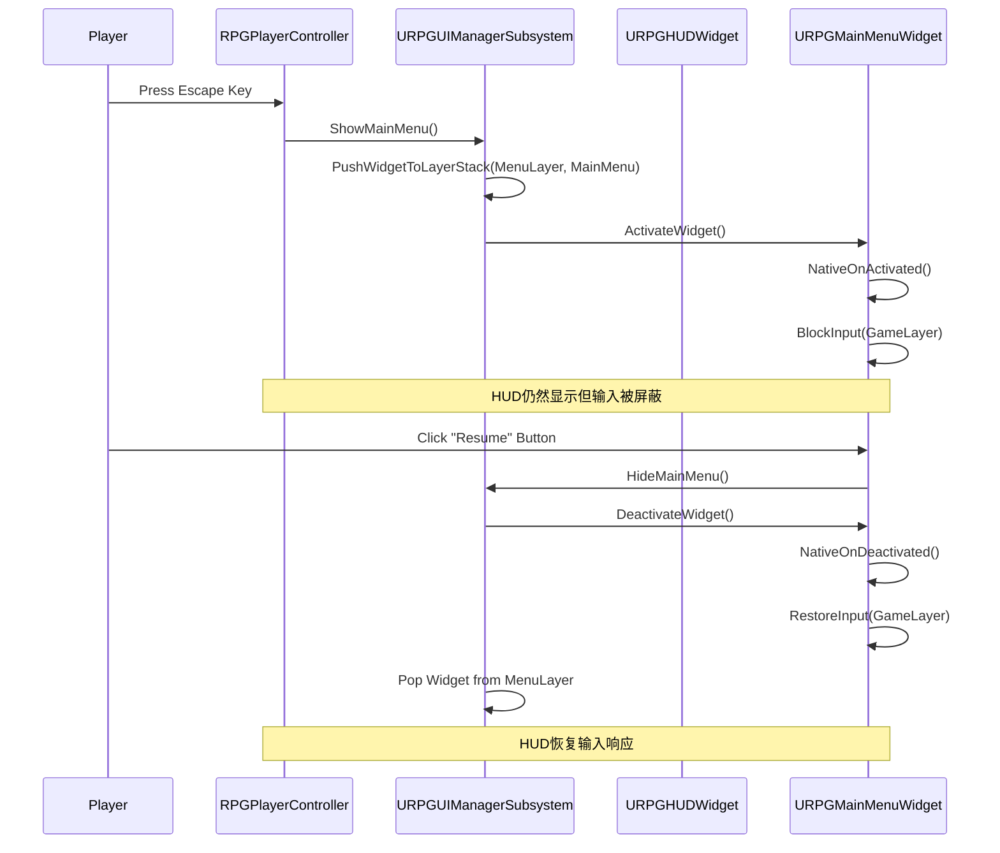
```mermaid
sequenceDiagram
    participant Player as Player
    participant PC as RPGPlayerController
    participant UIS as URPGUIManagerSubsystem
    participant HUD as URPGHUDWidget
    participant MM as URPGMainMenuWidget
    
    Player->>PC: Press Escape Key
    PC->>UIS: ShowMainMenu()
    UIS->>UIS: PushWidgetToLayerStack(MenuLayer, MainMenu)
    UIS->>MM: ActivateWidget()
    MM->>MM: NativeOnActivated()
    MM->>MM: BlockInput(GameLayer)
    Note over PC,MM: HUD仍然显示但输入被屏蔽
    
    Player->>MM: Click "Resume" Button
    MM->>UIS: HideMainMenu()
    UIS->>MM: DeactivateWidget()
    MM->>MM: NativeOnDeactivated()
    MM->>MM: RestoreInput(GameLayer)
    UIS->>UIS: Pop Widget from MenuLayer
    Note over PC,MM: HUD恢复输入响应
```

**图4.20 UI界面切换时序图**

## 4.8 配置与资源管理详细设计

### 4.8.1 输入映射配置表

| Input Action | 类型 | 键位映射 | 修饰符 | 触发器 |
|-------------|------|---------|-------|-------|
| Move | Axis2D | WASD / Left Stick | Dead Zone, Scale | Triggered |
| Jump | Boolean | Space / Face Button Bottom | None | Pressed |
| Attack | Boolean | Mouse Left / Right Trigger | None | Pressed |
| Menu | Boolean | Escape / Start | None | Pressed |

### 4.8.2 健康属性配置表

| 属性名 | 类型 | 初始值 | 最小值 | 最大值 | 说明 |
|-------|------|-------|-------|-------|------|
| Health | Float | 100.0 | 0.0 | 999.0 | 当前生命值 |
| MaxHealth | Float | 100.0 | 1.0 | 999.0 | 最大生命值 |
| Mana | Float | 50.0 | 0.0 | 999.0 | 当前法力值 |
| MaxMana | Float | 50.0 | 1.0 | 999.0 | 最大法力值 |

### 4.8.3 UI层栈配置表

| 层级 | Widget类型 | 输入屏蔽 | 显示时机 | 移除时机 |
|------|-----------|---------|---------|---------|
| Game | URPGHUDWidget | 否 | 游戏开始 | 游戏结束 |
| Menu | URPGMainMenuWidget | 是 | 按Escape | 点击Resume/Exit |
| Modal | 设置/确认对话框 | 是 | 点击设置按钮 | 点击关闭按钮 |
| Overlay | 加载提示/通知 | 否 | 触发事件 | 事件结束 |
