> 文档版本: v1.1  
> 最后更新: 2026-05-07  
> 修订说明: 增量同步至当前代码实现；删除旧有 cpp 代码块改用文字/类图/时序图表达；新增 4.15 对象池与 4.16 CommonUI 基础设施详细设计；所有核心模块补齐关键路径时序图，涵盖死亡状态机、Widget 异步加载、连招通道切换、武器装卸对称、ASC 启动与 HitReact、AnimLayer 链接、Gruntling 控制器初始化、对象池回收、输入→GA 激活、StartUpData 授予等路径。

# 4 详细设计

## 4.1 系统总体架构设计

本课题基于Unreal Engine 5.6引擎开发第三人称角色扮演游戏，系统采用组件化架构（Component-Based Architecture）与事件驱动通信机制，实现高内聚低耦合的模块化设计。系统总体架构分为五个层次：表现层（Presentation Layer）、控制层（Control Layer）、逻辑层（Logic Layer）、数据层（Data Layer）和基础设施层（Infrastructure Layer）。

系统总体架构如图4.1所示。在游戏启动并初始化各层级组件后，表现层负责渲染游戏画面、播放动画效果、显示UI界面。控制层作为系统的中枢，负责接收玩家输入、协调各模块之间的工作流和信息传递。逻辑层实现游戏核心业务逻辑，包括健康系统、战斗系统、武器系统、UI桥接层、动画系统和能力系统。数据层管理游戏状态数据、玩家属性、角色配置和游戏模式。基础设施层提供底层支撑服务，包括UI管理器、导航系统、输入系统和AI感知系统。

在角色系统中，ABaseCharacter作为所有角色的基类，实现IAbilitySystemInterface、IPawnCombatInterface、IPawnUIInterface和IPawnDeathInterface四个接口，提供AbilitySystemComponent、AttributeSet、HealthComponent和MotionWarpingComponent四大核心引用。ARPGPlayerCharacter继承自ABaseCharacter，添加相机系统（CameraBoom/FollowCamera）、输入配置（DataAsset_InputConfig）、角色配置（DataAsset_CharacterConfig）、土狼时间跳跃系统（CoyoteTime）、平滑转向控制和战斗组件（PlayerCombatComponent/PlayerUIComponent）。ARPGEnemyCharacter同样继承自ABaseCharacter，持有独立的RPGAbilitySystemComponent和RPGAttributeSet（不通过PlayerState），添加行为树管理、敌人配置、启动数据和战斗组件（EnemyCombatComponent/EnemyUIComponent）。

在能力系统中，玩家的ASC和AttributeSet由ARPGPlayerState持有（保证网络复制和数据持久化），敌人的ASC和AttributeSet由ARPGEnemyCharacter自身持有（无需持久化）。这种差异化设计既满足了网络同步需求，又避免了不必要的复杂度。玩家通过PossessedBy和OnRep_PlayerState两条路径初始化ASC的ActorInfo，确保服务端和客户端都能正确设置能力系统。

战斗系统通过PawnCombatComponent管理武器注册和碰撞检测。当武器碰撞盒检测到重叠时，通过FOnTargetInteractDelegate委托通知CombatComponent，CombatComponent的OnHitTargetActor方法处理命中逻辑（维护OverlappedActors避免重复命中）。PlayerCombatComponent扩展了连招管理系统，通过ERPGComboType分通道管理轻击和重击的连招计数，连招窗口通过定时器控制自动过期重置。

UI系统通过三层委托链实现数据到表现的传递：HealthComponent.OnHealthChanged → PawnUIComponent.OnHealthChangedDynamic → PawnUIComponent.OnHealthChangedForUI → HUDWidget.OnHealthChangedDynamic → UpdateHealth。这种链式订阅实现了完全的层间解耦，任何中间层的替换不影响其他层的工作。

## 4.2 健康系统模块详细设计

### 4.2.1 健康系统架构设计

健康系统模块负责管理角色的生命值、死亡状态、复活逻辑等健康相关数据。该系统采用分层继承架构与观察者模式，通过动态多播委托实现事件广播，支持UI组件和其他模块订阅健康状态变化。

健康系统的核心组件包括URPGHealthComponent（健康基类）、URPGPlayerHealthComponent（玩家健康组件）和URPGEnemyHealthComponent（敌人健康组件）。URPGHealthComponent继承自UPawnExtensionComponentBase，提供通用的健康数据管理功能。该组件通过InitializeWithAbilitySystem方法与Ability System Component（ASC）绑定，使用ASC的GetGameplayAttributeValueChangeDelegate方法监听CurrentHealth和MaxHealth属性的变化，将ASC的FOnAttributeChangeData回调转换为自定义的动态多播委托广播。

当ASC的健康属性发生变化时，触发OnHealthAttributeChanged回调，URPGHealthComponent更新内部缓存的CurrentHealth值，并通过OnHealthChanged委托广播事件（参数为NewHealth和OldHealth）。委托采用DECLARE_DYNAMIC_MULTICAST_DELEGATE_TwoParams宏声明，支持蓝图订阅和C++ AddUniqueDynamic绑定。当CurrentHealth降至0以下且bIsDead为false时，调用StartDeath方法进入死亡状态机。

URPGPlayerHealthComponent继承自URPGHealthComponent，添加无敌状态控制（bIsInvincible/InvincibleDuration）和复活机制（Revive方法，接受HealthPercent参数指定复活时恢复的生命比例）。StartDeath和FinishDeath方法重写实现玩家特有的死亡逻辑。

URPGEnemyHealthComponent继承自URPGHealthComponent，添加死亡动画控制（bPlayDeathAnimation/DeathAnimationDuration）和自动销毁配置（bDestroyOnDeath/DestroyDelay）。敌人死亡时可选择是否播放死亡动画，并在延迟后自动销毁Actor。

### 4.2.2 健康系统类图

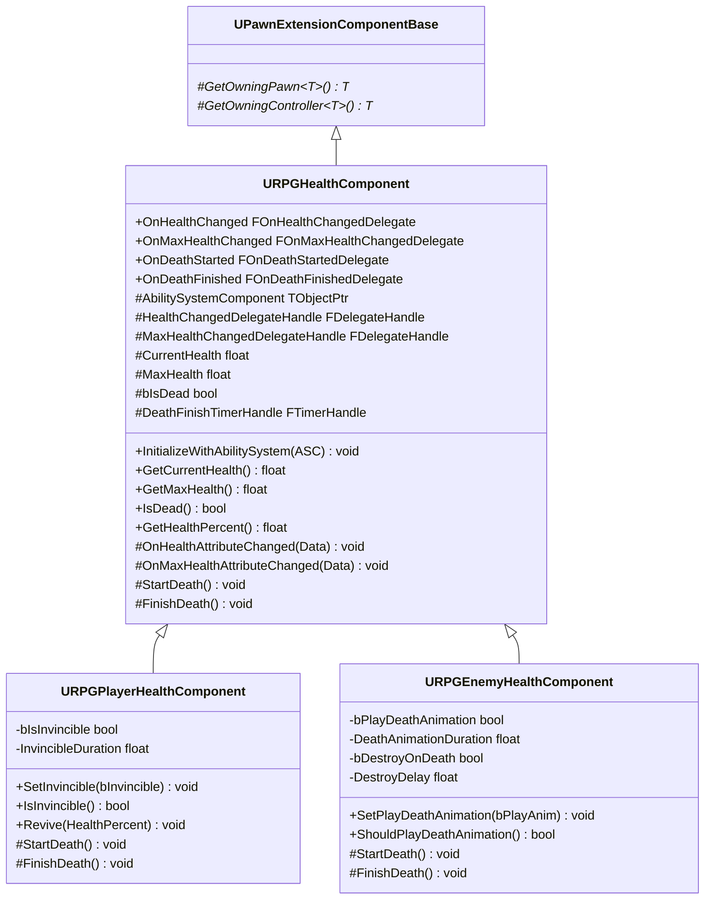
```mermaid
classDiagram
    class UPawnExtensionComponentBase {
        #GetOwningPawn~T~() T*
        #GetOwningController~T~() T*
    }
    
    class URPGHealthComponent {
        +InitializeWithAbilitySystem(ASC) void
        +GetCurrentHealth() float
        +GetMaxHealth() float
        +IsDead() bool
        +GetHealthPercent() float
        +OnHealthChanged FOnHealthChangedDelegate
        +OnMaxHealthChanged FOnMaxHealthChangedDelegate
        +OnDeathStarted FOnDeathStartedDelegate
        +OnDeathFinished FOnDeathFinishedDelegate
        #OnHealthAttributeChanged(Data) void
        #OnMaxHealthAttributeChanged(Data) void
        #StartDeath() void
        #FinishDeath() void
        #AbilitySystemComponent TObjectPtr
        #HealthChangedDelegateHandle FDelegateHandle
        #MaxHealthChangedDelegateHandle FDelegateHandle
        #CurrentHealth float
        #MaxHealth float
        #bIsDead bool
        #DeathFinishTimerHandle FTimerHandle
    }
    
    class URPGPlayerHealthComponent {
        +SetInvincible(bInvincible) void
        +IsInvincible() bool
        +Revive(HealthPercent) void
        #StartDeath() void
        #FinishDeath() void
        -bIsInvincible bool
        -InvincibleDuration float
    }
    
    class URPGEnemyHealthComponent {
        +SetPlayDeathAnimation(bPlayAnim) void
        +ShouldPlayDeathAnimation() bool
        #StartDeath() void
        #FinishDeath() void
        -bPlayDeathAnimation bool
        -DeathAnimationDuration float
        -bDestroyOnDeath bool
        -DestroyDelay float
    }
    
    UPawnExtensionComponentBase <|-- URPGHealthComponent
    URPGHealthComponent <|-- URPGPlayerHealthComponent
    URPGHealthComponent <|-- URPGEnemyHealthComponent
```

**图4.1 健康系统详细类图**

### 4.2.3 健康变化事件广播时序图

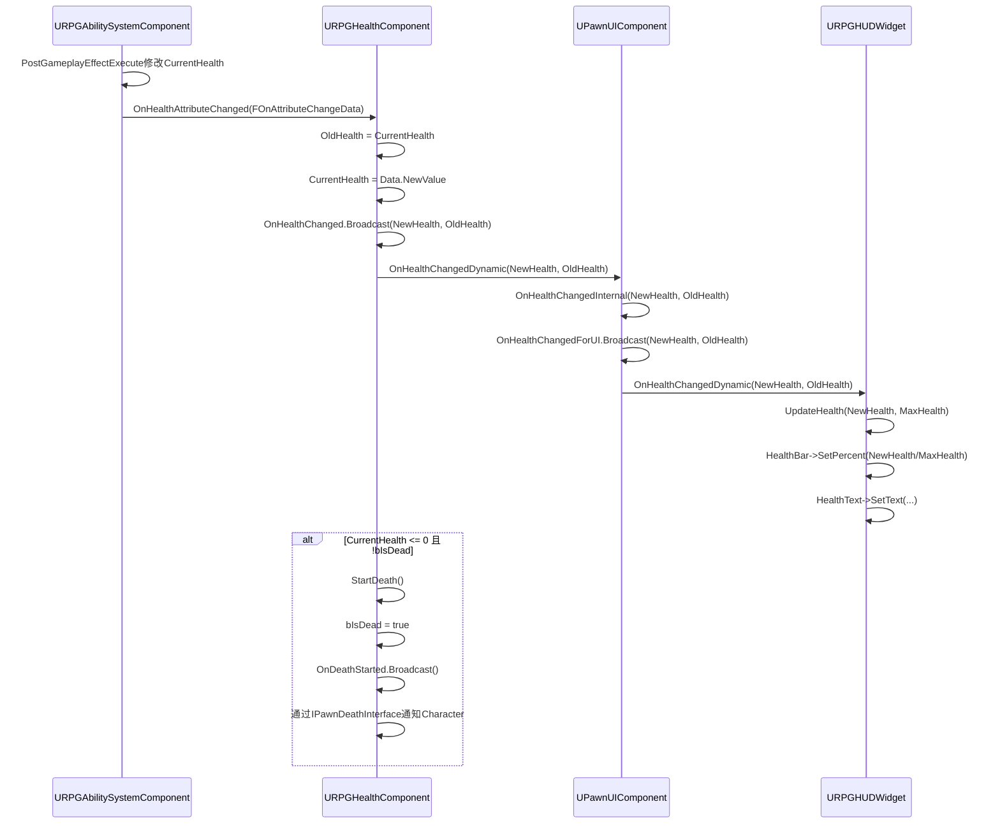
```mermaid
sequenceDiagram
    participant ASC as URPGAbilitySystemComponent
    participant Health as URPGHealthComponent
    participant PUI as UPawnUIComponent
    participant HUD as URPGHUDWidget
    
    ASC->>ASC: PostGameplayEffectExecute修改CurrentHealth
    ASC->>Health: OnHealthAttributeChanged(FOnAttributeChangeData)
    Health->>Health: OldHealth = CurrentHealth
    Health->>Health: CurrentHealth = Data.NewValue
    Health->>Health: OnHealthChanged.Broadcast(NewHealth, OldHealth)
    Health->>PUI: OnHealthChangedDynamic(NewHealth, OldHealth)
    PUI->>PUI: OnHealthChangedInternal(NewHealth, OldHealth)
    PUI->>PUI: OnHealthChangedForUI.Broadcast(NewHealth, OldHealth)
    PUI->>HUD: OnHealthChangedDynamic(NewHealth, OldHealth)
    HUD->>HUD: UpdateHealth(NewHealth, MaxHealth)
    HUD->>HUD: HealthBar->SetPercent(NewHealth/MaxHealth)
    HUD->>HUD: HealthText->SetText(...)
    alt CurrentHealth <= 0 且 !bIsDead
        Health->>Health: StartDeath()
        Health->>Health: bIsDead = true
        Health->>Health: OnDeathStarted.Broadcast()
        Health->>Health: 通过IPawnDeathInterface通知Character
    end
```

**图4.2 健康变化事件广播时序图**

### 4.2.4 死亡状态机时序图

健康组件的死亡流程分两阶段：StartDeath阶段立即标记bIsDead并广播OnDeathStarted，供角色、AI控制器、UI和战斗组件同步清理状态；FinishDeath阶段在延时后（玩家等待复活或敌人等待动画结束）广播OnDeathFinished，触发实例回收或角色复活逻辑。玩家专属的无敌状态在StartDeath前拦截伤害：当bIsInvincible为true时，PostGameplayEffectExecute会直接返回，CurrentHealth不受到修改。由于死亡开始与结束通过两个独立委托广播，订阅方（UI、AI控制器、对象池）能按需选择在哪个阶段做响应，避免时序耦合。

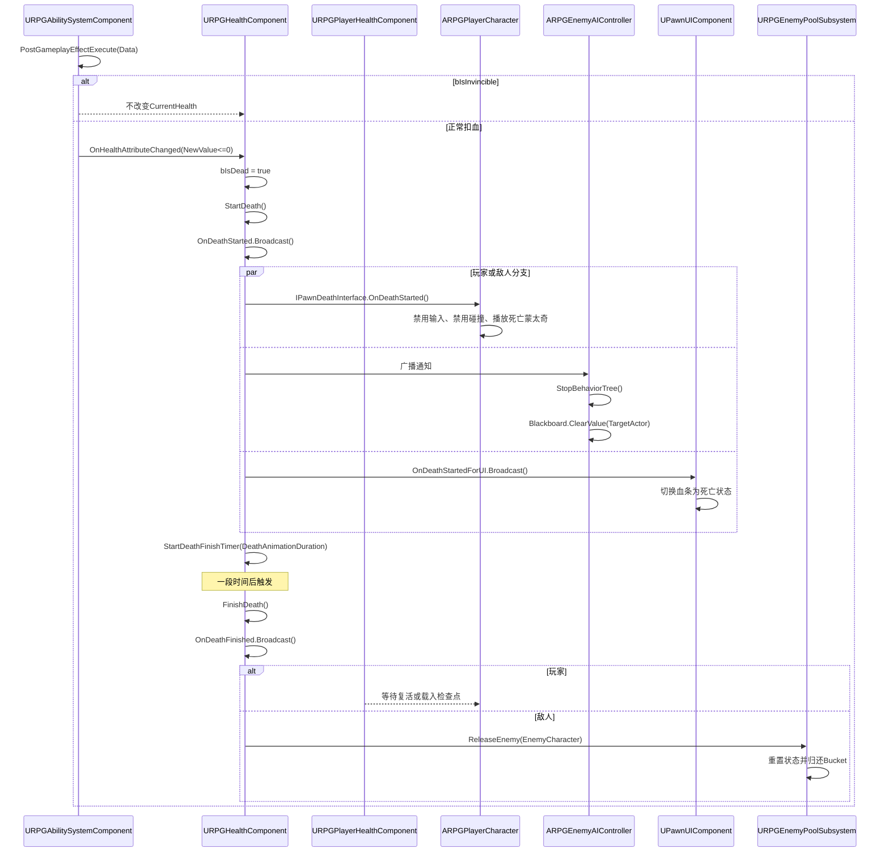
```mermaid
sequenceDiagram
    participant ASC as URPGAbilitySystemComponent
    participant Health as URPGHealthComponent
    participant PHC as URPGPlayerHealthComponent
    participant Char as ARPGPlayerCharacter
    participant AIC as ARPGEnemyAIController
    participant UI as UPawnUIComponent
    participant Pool as URPGEnemyPoolSubsystem
    
    ASC->>ASC: PostGameplayEffectExecute(Data)
    alt bIsInvincible
        ASC-->>Health: 不改变CurrentHealth
    else 正常扣血
        ASC->>Health: OnHealthAttributeChanged(NewValue<=0)
        Health->>Health: bIsDead = true
        Health->>Health: StartDeath()
        Health->>Health: OnDeathStarted.Broadcast()
        par 玩家或敌人分支
            Health->>Char: IPawnDeathInterface.OnDeathStarted()
            Char->>Char: 禁用输入、禁用碰撞、播放死亡蒙太奇
        and
            Health->>AIC: 广播通知
            AIC->>AIC: StopBehaviorTree()
            AIC->>AIC: Blackboard.ClearValue(TargetActor)
        and
            Health->>UI: OnDeathStartedForUI.Broadcast()
            UI->>UI: 切换血条为死亡状态
        end
        Health->>Health: StartDeathFinishTimer(DeathAnimationDuration)
        Note over Health: 一段时间后触发
        Health->>Health: FinishDeath()
        Health->>Health: OnDeathFinished.Broadcast()
        alt 玩家
            PHC-->>Char: 等待复活或载入检查点
        else 敌人
            Health->>Pool: ReleaseEnemy(EnemyCharacter)
            Pool->>Pool: 重置状态并归还Bucket
        end
    end
```

**图4.22 死亡状态机时序图**

### 4.2.5 健康系统架构图

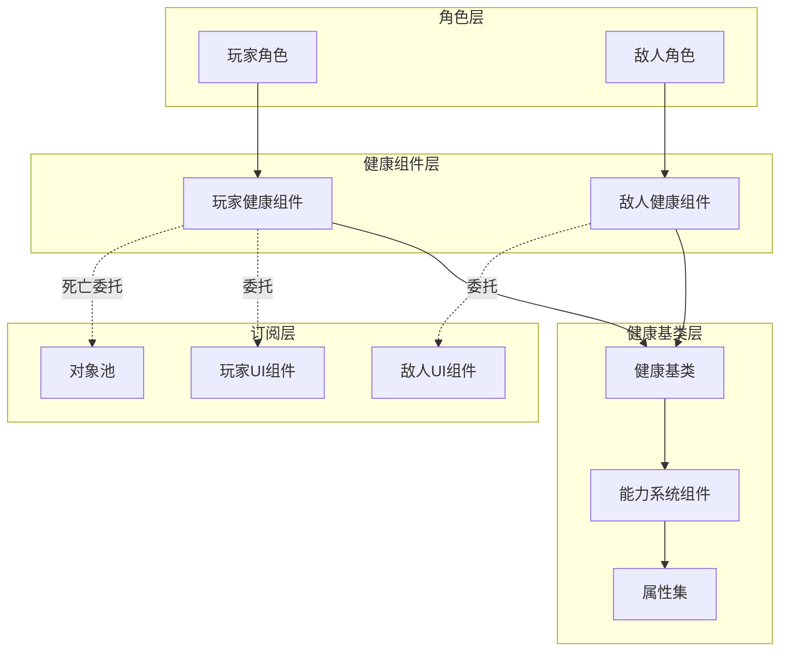
```mermaid
graph TB
    subgraph 角色层
        Player[玩家角色]
        Enemy[敌人角色]
    end
    
    subgraph 健康组件层
        PHealth[玩家健康组件]
        EHealth[敌人健康组件]
    end
    
    subgraph 健康基类层
        HealthBase[健康基类]
        ASC[能力系统组件]
        AttrSet[属性集]
    end
    
    subgraph 订阅层
        PUI[玩家UI组件]
        EUI[敌人UI组件]
        Pool[对象池]
    end
    
    Player --> PHealth
    Enemy --> EHealth
    PHealth --> HealthBase
    EHealth --> HealthBase
    HealthBase --> ASC
    ASC --> AttrSet
    
    PHealth -.委托.-> PUI
    EHealth -.委托.-> EUI
    PHealth -.死亡委托.-> Pool
```

**图4.3 健康系统架构图**

图4.3展示了健康系统的分层架构与事件驱动机制。角色层包含玩家角色和敌人角色，分别持有专属的健康组件实例。健康组件层包含玩家健康组件和敌人健康组件，两者均继承自健康基类，实现差异化的死亡逻辑和状态管理。玩家健康组件添加无敌状态控制和复活机制，敌人健康组件添加死亡动画控制和自动销毁配置。健康基类层提供通用的健康数据管理功能，通过InitializeWithAbilitySystem方法与能力系统组件绑定，监听属性集的健康属性变化。订阅层包含玩家UI组件、敌人UI组件和对象池，通过动态多播委托订阅健康状态变化。核心数据流为：ASC属性变化 → 健康组件监听 → 委托广播 → 订阅方响应。玩家UI组件订阅健康变化委托，转发给HUD控件更新血条显示；敌人UI组件订阅健康变化委托，根据距离控制血条可见性；对象池订阅死亡完成委托，在敌人死亡后回收实例。该架构实现了健康管理与UI显示、对象池的完全解耦，任何中间层的替换不影响其他层的工作。通过分层继承设计，玩家和敌人可以独立扩展健康相关的特殊功能，同时保持核心健康管理逻辑的统一性。动态多播委托机制确保事件广播的高效性和灵活性，支持C++和蓝图双向订阅。

## 4.3 UI系统模块详细设计

### 4.3.1 UI系统架构设计

UI系统模块采用CommonUI框架和四层栈架构，通过URPGUIManagerSubsystem统一管理UI生命周期。UI系统通过UPawnUIComponent基类作为数据桥接层，实现健康系统与UI Widget的解耦。

URPGUIManagerSubsystem继承自UGameUIManagerSubsystem，作为GameInstance级全局Subsystem。该系统通过GameplayTag标签管理四层栈：RPGCommonUI_WidgetStack_Modal（模态层，屏蔽下层交互）、RPGCommonUI_WidgetStack_GameMenu（游戏菜单层）、RPGCommonUI_WidgetStack_GameHUD（游戏HUD层，始终显示）、RPGCommonUI_WidgetStack_Frontend（前端层，主菜单等）。提供PushSoftWidgetToStackAsync方法实现Widget的异步加载和推送，支持EAsyncPushWidgetState回调（OnCreatedBeforePush和AfterPush两个阶段）。

UPawnUIComponent是UI桥接层基类（Abstract），继承自UPawnExtensionComponentBase。该组件在BeginPlay时通过SubscribeToHealthComponent方法订阅HealthComponent的四个委托事件（OnHealthChanged/OnMaxHealthChanged/OnDeathStarted/OnDeathFinished），在EndPlay时通过UnsubscribeFromHealthComponent解除订阅。委托回调采用UFUNCTION标记的动态委托函数（OnHealthChangedDynamic/OnMaxHealthChangedDynamic/OnDeathStartedDynamic/OnDeathFinishedDynamic），内部调用虚函数（OnHealthChangedInternal等）允许子类重写，最终通过自有委托（OnHealthChangedForUI等）转发给Widget。

URPGPlayerUIComponent继承UPawnUIComponent，添加法力值管理（FOnManaChangedDelegate OnManaChangedForUI）和武器变化通知（FOnCurrentWeaponChangedDelegate OnCurrentWeaponChangedForUI）。URPGEnemyUIComponent继承UPawnUIComponent，添加血条可见性控制（MaxHealthBarDistance距离检测、bHideHealthBarWhenFull满血隐藏）和显示信息（DisplayName、EnemyLevel）。

URPGHUDWidget继承自URPGWidget_ActivatableBase（继承UCommonActivatableWidget），在NativeOnActivated时获取PlayerCharacter的PlayerUIComponent并订阅事件，在NativeOnDeactivated时清理所有委托绑定。Widget通过BindWidget元数据绑定UI元素（HealthBar/ManaBar/HealthText/ManaText/WeaponIcon），提供BP_OnPlayerUIComponentInitialized蓝图实现事件供蓝图扩展。

### 4.3.2 UI系统类图

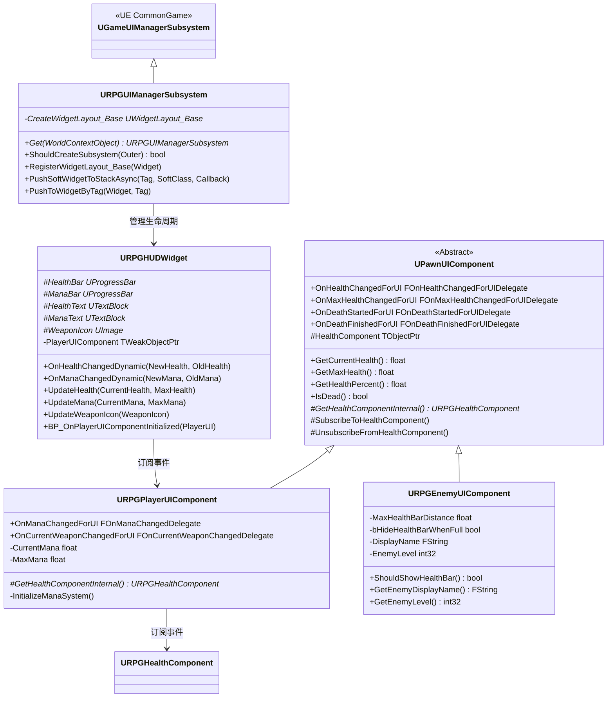
```mermaid
classDiagram
    class UGameUIManagerSubsystem {
        <<UE CommonGame>>
    }
    
    class URPGUIManagerSubsystem {
        +Get(WorldContextObject) URPGUIManagerSubsystem*
        +ShouldCreateSubsystem(Outer) bool
        +RegisterWidgetLayout_Base(Widget)
        +PushSoftWidgetToStackAsync(Tag, SoftClass, Callback)
        +PushToWidgetByTag(Widget, Tag)
        -CreateWidgetLayout_Base UWidgetLayout_Base*
    }
    
    class UPawnUIComponent {
        <<Abstract>>
        +GetCurrentHealth() float
        +GetMaxHealth() float
        +GetHealthPercent() float
        +IsDead() bool
        +OnHealthChangedForUI FOnHealthChangedForUIDelegate
        +OnMaxHealthChangedForUI FOnMaxHealthChangedForUIDelegate
        +OnDeathStartedForUI FOnDeathStartedForUIDelegate
        +OnDeathFinishedForUI FOnDeathFinishedForUIDelegate
        #GetHealthComponentInternal() URPGHealthComponent*
        #SubscribeToHealthComponent()
        #UnsubscribeFromHealthComponent()
        #HealthComponent TObjectPtr
    }
    
    class URPGPlayerUIComponent {
        +OnManaChangedForUI FOnManaChangedDelegate
        +OnCurrentWeaponChangedForUI FOnCurrentWeaponChangedDelegate
        #GetHealthComponentInternal() URPGHealthComponent*
        -InitializeManaSystem()
        -CurrentMana float
        -MaxMana float
    }
    
    class URPGEnemyUIComponent {
        +ShouldShowHealthBar() bool
        +GetEnemyDisplayName() FString
        +GetEnemyLevel() int32
        -MaxHealthBarDistance float
        -bHideHealthBarWhenFull bool
        -DisplayName FString
        -EnemyLevel int32
    }
    
    class URPGHUDWidget {
        +OnHealthChangedDynamic(NewHealth, OldHealth)
        +OnManaChangedDynamic(NewMana, OldMana)
        +UpdateHealth(CurrentHealth, MaxHealth)
        +UpdateMana(CurrentMana, MaxMana)
        +UpdateWeaponIcon(WeaponIcon)
        +BP_OnPlayerUIComponentInitialized(PlayerUI)
        #HealthBar UProgressBar*
        #ManaBar UProgressBar*
        #HealthText UTextBlock*
        #ManaText UTextBlock*
        #WeaponIcon UImage*
        -PlayerUIComponent TWeakObjectPtr
    }
    
    UGameUIManagerSubsystem <|-- URPGUIManagerSubsystem
    UPawnUIComponent <|-- URPGPlayerUIComponent
    UPawnUIComponent <|-- URPGEnemyUIComponent
    URPGUIManagerSubsystem --> URPGHUDWidget : 管理生命周期
    URPGHUDWidget --> URPGPlayerUIComponent : 订阅事件
    URPGPlayerUIComponent --> URPGHealthComponent : 订阅事件
```

**图4.3 UI系统详细类图**

### 4.3.3 UI事件订阅时序图

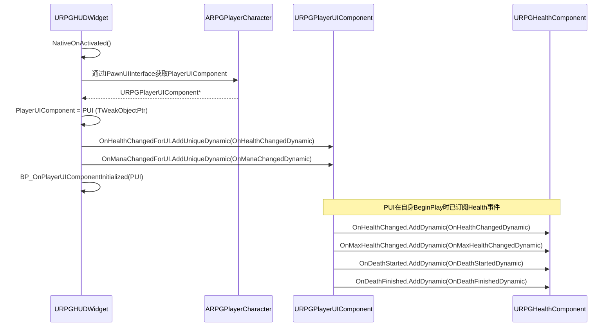
```mermaid
sequenceDiagram
    participant HUD as URPGHUDWidget
    participant Char as ARPGPlayerCharacter
    participant PUI as URPGPlayerUIComponent
    participant Health as URPGHealthComponent
    
    HUD->>HUD: NativeOnActivated()
    HUD->>Char: 通过IPawnUIInterface获取PlayerUIComponent
    Char-->>HUD: URPGPlayerUIComponent*
    HUD->>HUD: PlayerUIComponent = PUI (TWeakObjectPtr)
    HUD->>PUI: OnHealthChangedForUI.AddUniqueDynamic(OnHealthChangedDynamic)
    HUD->>PUI: OnManaChangedForUI.AddUniqueDynamic(OnManaChangedDynamic)
    HUD->>HUD: BP_OnPlayerUIComponentInitialized(PUI)
    Note over PUI,Health: PUI在自身BeginPlay时已订阅Health事件
    PUI->>Health: OnHealthChanged.AddDynamic(OnHealthChangedDynamic)
    PUI->>Health: OnMaxHealthChanged.AddDynamic(OnMaxHealthChangedDynamic)
    PUI->>Health: OnDeathStarted.AddDynamic(OnDeathStartedDynamic)
    PUI->>Health: OnDeathFinished.AddDynamic(OnDeathFinishedDynamic)
```

**图4.4 UI事件订阅时序图**

### 4.3.4 Widget异步加载成功路径时序图

当游戏逻辑调用URPGUIManagerSubsystem::PushSoftWidgetToStackAsync请求推送Widget时，系统通过UAssetManager的StreamableManager发起异步加载。加载完成后依次触发CreatedBeforePush阶段回调（用于Widget构造后的初始化数据准备）和AfterPush阶段回调（Widget已加入对应GameplayTag栈且完成ActivateWidget）。整个流程无阻塞，支持在Widget加载期间显示加载占位。

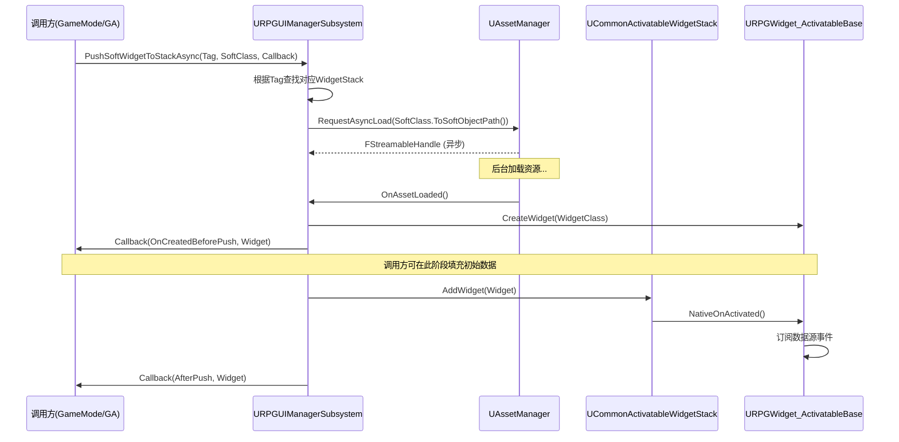
```mermaid
sequenceDiagram
    participant Caller as 调用方(GameMode/GA)
    participant UIMgr as URPGUIManagerSubsystem
    participant AM as UAssetManager
    participant Stack as UCommonActivatableWidgetStack
    participant Widget as URPGWidget_ActivatableBase

    Caller->>UIMgr: PushSoftWidgetToStackAsync(Tag, SoftClass, Callback)
    UIMgr->>UIMgr: 根据Tag查找对应WidgetStack
    UIMgr->>AM: RequestAsyncLoad(SoftClass.ToSoftObjectPath())
    AM-->>UIMgr: FStreamableHandle (异步)
    Note over AM: 后台加载资源...
    AM->>UIMgr: OnAssetLoaded()
    UIMgr->>Widget: CreateWidget(WidgetClass)
    UIMgr->>Caller: Callback(OnCreatedBeforePush, Widget)
    Note over Caller,Widget: 调用方可在此阶段填充初始数据
    UIMgr->>Stack: AddWidget(Widget)
    Stack->>Widget: NativeOnActivated()
    Widget->>Widget: 订阅数据源事件
    UIMgr->>Caller: Callback(AfterPush, Widget)
```

**图4.23 Widget异步加载成功路径时序图**

### 4.3.5 Widget异步加载失败与取消时序图

StreamableManager在资源路径无效、软引用为空或外部显式取消加载时返回失败。URPGUIManagerSubsystem对失败分支做短路处理：不创建Widget、不进入Stack、以ErrorState回传EAsyncPushWidgetState，调用方可据此显示错误提示或降级到默认UI。

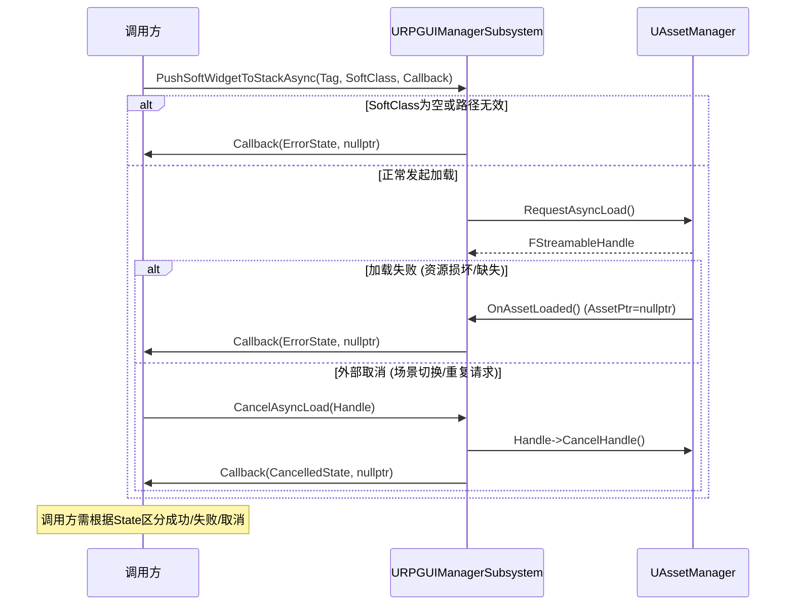
```mermaid
sequenceDiagram
    participant Caller as 调用方
    participant UIMgr as URPGUIManagerSubsystem
    participant AM as UAssetManager

    Caller->>UIMgr: PushSoftWidgetToStackAsync(Tag, SoftClass, Callback)
    alt SoftClass为空或路径无效
        UIMgr->>Caller: Callback(ErrorState, nullptr)
    else 正常发起加载
        UIMgr->>AM: RequestAsyncLoad()
        AM-->>UIMgr: FStreamableHandle
        alt 加载失败 (资源损坏/缺失)
            AM->>UIMgr: OnAssetLoaded() (AssetPtr=nullptr)
            UIMgr->>Caller: Callback(ErrorState, nullptr)
        else 外部取消 (场景切换/重复请求)
            Caller->>UIMgr: CancelAsyncLoad(Handle)
            UIMgr->>AM: Handle->CancelHandle()
            UIMgr->>Caller: Callback(CancelledState, nullptr)
        end
    end
    Note over Caller: 调用方需根据State区分成功/失败/取消
```

**图4.24 Widget异步加载失败与取消时序图**

### 4.3.6 UI系统架构图

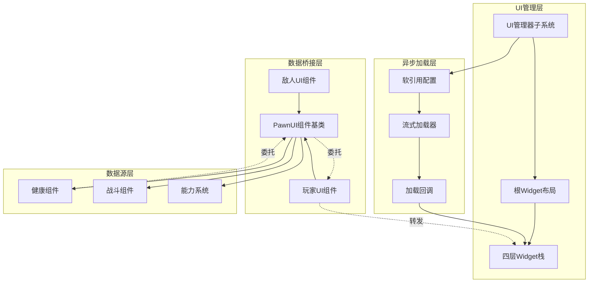
```mermaid
graph TB
    subgraph UI管理层
        UIMgr[UI管理器子系统]
        Layout[根Widget布局]
        Stacks[四层Widget栈]
    end
    
    subgraph 异步加载层
        SoftRef[软引用配置]
        Stream[流式加载器]
        Callback[加载回调]
    end
    
    subgraph 数据桥接层
        PUIBase[PawnUI组件基类]
        PUI[玩家UI组件]
        EUI[敌人UI组件]
    end
    
    subgraph 数据源层
        Health[健康组件]
        Combat[战斗组件]
        ASC[能力系统]
    end
    
    UIMgr --> Layout
    Layout --> Stacks
    UIMgr --> SoftRef
    SoftRef --> Stream
    Stream --> Callback
    Callback --> Stacks
    
    PUI --> PUIBase
    EUI --> PUIBase
    PUIBase --> Health
    PUIBase --> Combat
    PUIBase --> ASC
    
    Health -.委托.-> PUIBase
    PUIBase -.委托.-> PUI
    PUI -.转发.-> Stacks
```

**图4.4 UI系统架构图**

图4.4展示了UI系统的四层架构与完整数据流向。UI管理层包含UI管理器子系统、根Widget布局和四层Widget栈，负责UI生命周期管理和栈调度。UI管理器子系统作为GameInstance级别的全局管理器，提供Widget的异步加载、推入栈、弹出栈等核心方法。根Widget布局容纳四个独立的Widget栈：模态栈（Modal，置顶且拦截输入，用于确认弹窗）、游戏菜单栈（GameMenu，暂停菜单和设置界面）、游戏HUD栈（GameHUD，游戏中HUD显示，包含玩家血条和敌人血条）、前端栈（Frontend，Loading界面和主菜单）。异步加载层通过软引用配置和流式加载器实现Widget的按需加载，避免资源常驻内存。软引用配置存储Widget类的软路径，流式加载器负责后台异步加载资源，加载完成后通过回调实例化Widget并推入对应栈。数据桥接层包含PawnUI组件基类、玩家UI组件和敌人UI组件，订阅数据源层的健康组件、战斗组件和能力系统的状态变化委托，将底层数据转换为UI友好的格式并转发给UI控件。玩家UI组件处理玩家状态更新和HUD数据刷新，敌人UI组件添加距离检测和血条可见性控制，根据玩家与敌人的距离动态显示/隐藏血条。数据源层提供健康组件、战斗组件和能力系统作为数据源，通过动态多播委托广播状态变化。核心数据流为：数据源层通过委托通知PawnUI组件 → PawnUI组件转换数据并转发给UI控件 → UI控件更新显示。UI管理层通过软引用异步加载Widget并推入对应栈，栈通过输入路由控制交互优先级。该架构实现了数据源、桥接层和UI显示的三层分离，支持灵活的UI扩展和性能优化。通过CommonUI框架的四层栈设计，不同层级的UI可以独立管理输入路由和显示优先级，避免UI层级混乱。数据桥接层的引入彻底解耦了健康系统与UI控件的直接依赖，任何中间层的替换不影响其他层的工作。

### 4.3.7 数据桥接层通信时序图

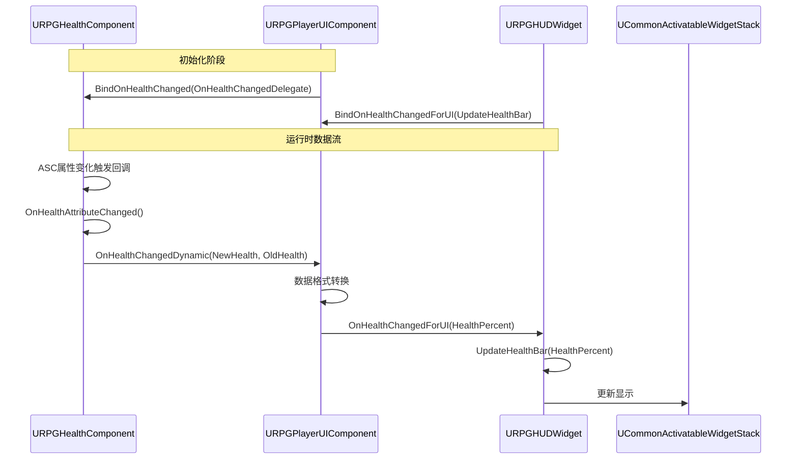
```mermaid
sequenceDiagram
    participant Health as URPGHealthComponent
    participant PUI as URPGPlayerUIComponent
    participant Widget as URPGHUDWidget
    participant Stack as UCommonActivatableWidgetStack
    
    Note over Health,PUI: 初始化阶段
    PUI->>Health: BindOnHealthChanged(OnHealthChangedDelegate)
    Widget->>PUI: BindOnHealthChangedForUI(UpdateHealthBar)
    
    Note over Health,Widget: 运行时数据流
    Health->>Health: ASC属性变化触发回调
    Health->>Health: OnHealthAttributeChanged()
    Health->>PUI: OnHealthChangedDynamic(NewHealth, OldHealth)
    PUI->>PUI: 数据格式转换
    PUI->>Widget: OnHealthChangedForUI(HealthPercent)
    Widget->>Widget: UpdateHealthBar(HealthPercent)
    Widget->>Stack: 更新显示
```

**图4.5 数据桥接层通信时序图**

图4.5展示了健康数据从健康组件通过PawnUI组件传递到UIWidget的完整三层委托链通信流程。初始化阶段，PawnUI组件订阅健康组件的OnHealthChangedDynamic委托，UIWidget订阅PawnUI组件的OnHealthChangedForUI委托，形成委托链。运行时数据流阶段，当ASC的属性变化触发健康组件的OnHealthAttributeChanged回调时，健康组件更新内部缓存的CurrentHealth值，并通过OnHealthChangedDynamic委托广播新生命值和旧生命值。PawnUI组件接收到委托回调后，执行数据格式转换逻辑，将原始健康值计算为健康百分比（HealthPercent = NewHealth / MaxHealth），然后通过OnHealthChangedForUI委托转发给UIWidget。UIWidget接收到健康百分比后，调用UpdateHealthBar方法更新血条显示的百分比，同时更新血条文本显示。最后，Widget栈接收更新请求并重新渲染UI显示。该三层委托链设计的核心优势在于完全的层间解耦：健康组件只负责广播健康变化，不关心谁订阅；PawnUI组件负责数据转换，将底层数据转换为UI友好的格式；UIWidget只负责显示更新，不关心数据来源。任何中间层的替换不影响其他层的工作，例如可以将PawnUI组件替换为网络同步组件，或者将UIWidget替换为不同的血条控件，而无需修改其他层的代码。通过动态多播委托的AddUniqueDynamic绑定方式，确保同一个订阅方不会被重复绑定，避免事件重复触发。在Widget被Deactivate时，通过RemoveDynamic对称解除委托绑定，遵守「注册与清理严格对称」原则，避免悬空委托和内存泄漏。

## 4.4 战斗系统模块详细设计

### 4.4.1 战斗系统架构设计

战斗系统模块负责管理角色的武器注册、碰撞检测、连招计数、命中处理和受击反应。战斗系统采用分层组件架构，UPawnCombatComponent作为基类提供通用武器管理功能，UPlayerCombatComponent添加玩家特有的连招管理系统，UEnemyCombatComponent重写敌人的命中检测逻辑。

UPawnCombatComponent通过CharacterCarriedWeaponMap（TMap<FGameplayTag, ARPGWeaponBase*>）管理角色携带的所有武器，以GameplayTag作为键标识不同武器。RegisterSpawnWeapon方法在武器生成后将其注册到Map中，可选参数bRegisterAsEquippedWeapon同时设置CurrentEquippedWeaponTag。ToggleWeaponCollision方法控制武器碰撞盒的开关，支持三种模式（CurrentEquippedWeapon/LeftHand/RightHand）。OnHitTargetActor和OnWeaponPullerFromTargetActor为虚函数，由子类重写实现差异化的命中和拔出逻辑。OverlappedActors数组用于在一次攻击周期内防止重复命中同一目标。

UPlayerCombatComponent的连招管理系统通过TMap<ERPGComboType, int32> ComboCounts分通道存储轻击和重击的连招计数。AdvanceComboCount方法递增连招计数并在达到MaxComboCount时循环回0。SwitchComboType方法在攻击类型切换时重置对方通道计数器。StartComboWindowTimer方法启动定时器，在WindowTime过期后调用OnComboWindowTimerExpired重置对应通道的连招计数。GetPlayerCurrentEquippedWeaponDamageAtLevel方法通过FScalableFloat获取当前武器在指定等级的基础伤害值。

武器Actor通过骨骼插槽挂载系统实现武器与角色的动态绑定。武器装备时，ARPGPlayerWeapon通过USkeletalMeshComponent::AttachToComponent方法附加到角色手部骨骼插槽（如"weapon_r_hand_socket"），通过AttachmentRules控制位置、旋转和缩放的对齐方式。武器卸下时，通过DetachFromComponent解除绑定并隐藏武器Actor。骨骼插槽挂载确保武器始终跟随角色手部动画，实现攻击动画中的精确武器定位。

HitReact能力采用三层继承架构：URPGSharedAbility_HitReact作为共享基类实现通用的受击逻辑（应用击退效果、播放受击动画），URPGPlayerAbility_HitReactBase和URPGEnemyAbility_HitReactBase分别派生玩家和敌人特有的受击能力。受击方向判定通过计算攻击者位置与受击者朝向的角度差实现，分为Front（正面）、Back（背面）、Left（左侧）、Right（右侧）四个方向，不同方向播放对应的受击动画蒙太奇。动画混合通过Montage_SetPosition和BlendInTime/BlendOutTime参数实现受击动画与其他动作的平滑过渡，避免动画突变。

### 4.4.2 战斗系统类图

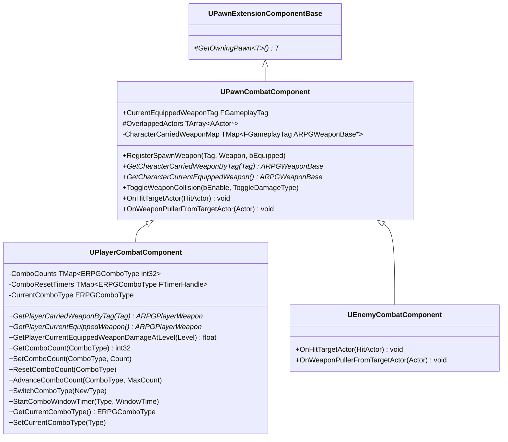
```mermaid
classDiagram
    class UPawnExtensionComponentBase {
        #GetOwningPawn~T~() T*
    }
    
    class UPawnCombatComponent {
        +RegisterSpawnWeapon(Tag, Weapon, bEquipped)
        +GetCharacterCarriedWeaponByTag(Tag) ARPGWeaponBase*
        +GetCharacterCurrentEquippedWeapon() ARPGWeaponBase*
        +ToggleWeaponCollision(bEnable, ToggleDamageType)
        +OnHitTargetActor(HitActor) void
        +OnWeaponPullerFromTargetActor(Actor) void
        +CurrentEquippedWeaponTag FGameplayTag
        #OverlappedActors TArray~AActor*~
        -CharacterCarriedWeaponMap TMap~FGameplayTag ARPGWeaponBase*~
    }
    
    class UPlayerCombatComponent {
        +GetPlayerCarriedWeaponByTag(Tag) ARPGPlayerWeapon*
        +GetPlayerCurrentEquippedWeapon() ARPGPlayerWeapon*
        +GetPlayerCurrentEquippedWeaponDamageAtLevel(Level) float
        +GetComboCount(ComboType) int32
        +SetComboCount(ComboType, Count)
        +ResetComboCount(ComboType)
        +AdvanceComboCount(ComboType, MaxCount)
        +SwitchComboType(NewType)
        +StartComboWindowTimer(Type, WindowTime)
        +GetCurrentComboType() ERPGComboType
        +SetCurrentComboType(Type)
        -ComboCounts TMap~ERPGComboType int32~
        -ComboResetTimers TMap~ERPGComboType FTimerHandle~
        -CurrentComboType ERPGComboType
    }
    
    class UEnemyCombatComponent {
        +OnHitTargetActor(HitActor) void
        +OnWeaponPullerFromTargetActor(Actor) void
    }
    
    UPawnExtensionComponentBase <|-- UPawnCombatComponent
    UPawnCombatComponent <|-- UPlayerCombatComponent
    UPawnCombatComponent <|-- UEnemyCombatComponent
```

**图4.5 战斗系统详细类图**

图4.5展示了战斗系统的三层组件继承架构。UPawnExtensionComponentBase作为基类提供获取OwningPawn的模板方法。UPawnCombatComponent继承自UPawnExtensionComponentBase，实现第一层战斗逻辑：通过CharacterCarriedWeaponMap管理角色携带的所有武器，提供武器注册（RegisterSpawnWeapon）、武器获取（GetCharacterCarriedWeaponByTag）、碰撞切换（ToggleWeaponCollision）和命中处理（OnHitTargetActor/OnWeaponPullerFromTargetActor）等核心功能。UPlayerCombatComponent继承自UPawnCombatComponent，实现第二层玩家特有逻辑：连招管理系统通过ComboCounts分通道存储连招计数，通过ComboResetTimers管理连招窗口定时器，通过CurrentComboType追踪当前连招类型，提供连招计数递增（AdvanceComboCount）、通道切换（SwitchComboCount）、定时器启动（StartComboWindowTimer）等方法。UEnemyCombatComponent同样继承自UPawnCombatComponent，重写OnHitTargetActor和OnWeaponPullerFromTargetActor实现敌人特有的命中处理逻辑。三层架构通过继承实现代码复用，UPawnCombatComponent提供通用武器管理，UPlayerCombatComponent和UEnemyCombatComponent分别处理玩家和敌人的差异化逻辑。

### 4.4.3 攻击命中流程时序图

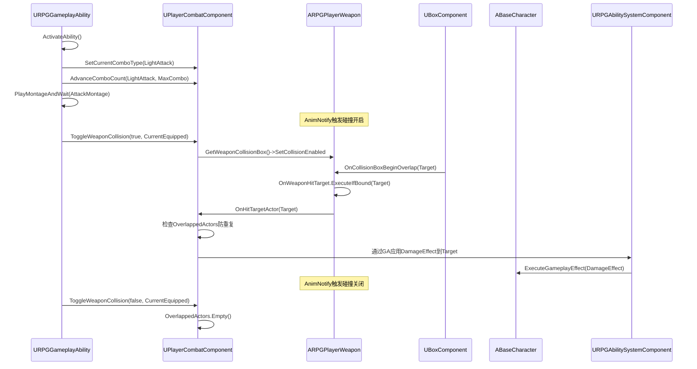
```mermaid
sequenceDiagram
    participant GA as URPGGameplayAbility
    participant Combat as UPlayerCombatComponent
    participant Weapon as ARPGPlayerWeapon
    participant CollisionBox as UBoxComponent
    participant Target as ABaseCharacter
    participant ASC as URPGAbilitySystemComponent
    
    GA->>GA: ActivateAbility()
    GA->>Combat: SetCurrentComboType(LightAttack)
    GA->>Combat: AdvanceComboCount(LightAttack, MaxCombo)
    GA->>GA: PlayMontageAndWait(AttackMontage)
    Note over Weapon: AnimNotify触发碰撞开启
    GA->>Combat: ToggleWeaponCollision(true, CurrentEquipped)
    Combat->>Weapon: GetWeaponCollisionBox()->SetCollisionEnabled
    CollisionBox->>Weapon: OnCollisionBoxBeginOverlap(Target)
    Weapon->>Weapon: OnWeaponHitTarget.ExecuteIfBound(Target)
    Weapon->>Combat: OnHitTargetActor(Target)
    Combat->>Combat: 检查OverlappedActors防重复
    Combat->>ASC: 通过GA应用DamageEffect到Target
    ASC->>Target: ExecuteGameplayEffect(DamageEffect)
    Note over Weapon: AnimNotify触发碰撞关闭
    GA->>Combat: ToggleWeaponCollision(false, CurrentEquipped)
    Combat->>Combat: OverlappedActors.Empty()
```

**图4.6 攻击命中流程时序图**

图4.6展示了攻击命中的完整流程。URPGGameplayAbility激活后，首先通过SetCurrentComboType设置连招类型，通过AdvanceComboCount递增连招计数，然后调用PlayMontageAndWait播放攻击蒙太奇。动画播放到特定帧时，AnimNotify触发碰撞开启，能力调用ToggleWeaponCollision(true)开启武器碰撞盒，内部调用GetWeaponCollisionBox()->SetCollisionEnabled启用碰撞检测。当武器碰撞盒与目标角色重叠时，触发OnCollisionBoxBeginOverlap回调，执行武器上绑定的OnWeaponHitTarget委托，委托回调战斗组件的OnHitTargetActor方法。战斗组件首先检查OverlappedActors数组防止重复命中同一目标，然后通过ASC应用DamageEffect到目标角色，执行伤害计算和属性修改。攻击动画结束时，AnimNotify触发碰撞关闭，能力调用ToggleWeaponCollision(false)关闭碰撞盒，并清空OverlappedActors数组为下次攻击做准备。该流程通过AnimNotify精确控制碰撞盒的开关时机，确保攻击判定与动画播放同步，通过OverlappedActors数组防止一次攻击多次命中，通过委托机制实现武器与战斗组件的松耦合通信。

### 4.4.4 连招通道切换时序图

连招系统按ERPGComboType（LightAttack/HeavyAttack）分通道维护计数器。当玩家从轻击切换到重击（或反向）时，SwitchComboType将重置对方通道计数以避免连招跳跳。每次攻击成功命中后启动该通道的ComboResetTimers，超过WindowTime未进入下一招则自动重置该通道计数。

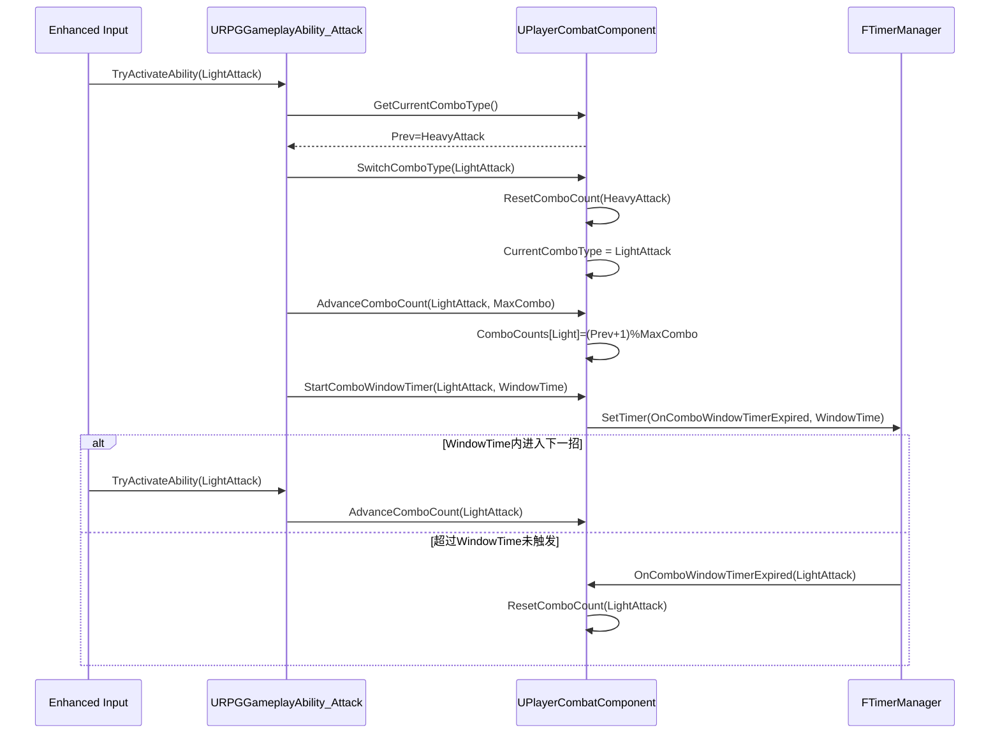
```mermaid
sequenceDiagram
    participant Input as Enhanced Input
    participant GA as URPGGameplayAbility_Attack
    participant Combat as UPlayerCombatComponent
    participant Timer as FTimerManager

    Input->>GA: TryActivateAbility(LightAttack)
    GA->>Combat: GetCurrentComboType()
    Combat-->>GA: Prev=HeavyAttack
    GA->>Combat: SwitchComboType(LightAttack)
    Combat->>Combat: ResetComboCount(HeavyAttack)
    Combat->>Combat: CurrentComboType = LightAttack
    GA->>Combat: AdvanceComboCount(LightAttack, MaxCombo)
    Combat->>Combat: ComboCounts[Light]=(Prev+1)%MaxCombo
    GA->>Combat: StartComboWindowTimer(LightAttack, WindowTime)
    Combat->>Timer: SetTimer(OnComboWindowTimerExpired, WindowTime)
    alt WindowTime内进入下一招
        Input->>GA: TryActivateAbility(LightAttack)
        GA->>Combat: AdvanceComboCount(LightAttack)
    else 超过WindowTime未触发
        Timer->>Combat: OnComboWindowTimerExpired(LightAttack)
        Combat->>Combat: ResetComboCount(LightAttack)
    end
```

**图4.25 连招通道切换时序图**

图4.25展示了连招通道的切换逻辑和定时器管理机制。当玩家输入触发攻击能力时，能力首先调用GetCurrentComboType获取当前连招类型，如果与目标类型不同则调用SwitchComboType切换通道。SwitchComboType内部调用ResetComboCount重置对方通道的连招计数，避免连招跳段，然后设置CurrentComboType为新的连招类型。切换完成后，调用AdvanceComboCount递增当前通道的连招计数，通过(Prev+1)%MaxCombo实现循环计数。随后调用StartComboWindowTimer启动连招窗口定时器，设置TimerManager在WindowTime后调用OnComboWindowTimerExpired回调。如果在窗口期内玩家再次输入攻击，AdvanceComboCount继续递增连招计数并重置定时器；如果超过窗口期未输入，定时器到期触发OnComboWindowTimerExpired，重置当前通道的连招计数，连招中断。该设计通过分通道管理实现轻击和重击的独立连招计数，通过定时器控制连招窗口期，通过通道切换时的互斥重置保证连招逻辑的正确性。

### 4.4.5 战斗系统架构图

战斗系统采用四层架构设计，能力层负责能力激活和蒙太奇播放，战斗组件层处理武器管理和连招逻辑，武器层管理武器Actor和碰撞检测，连招管理层维护连招计数器和定时器。能力层通过GameplayAbility激活攻击流程，战斗组件层通过UPawnCombatComponent统一管理武器，UPlayerCombatComponent扩展连招管理，武器层通过ARPGWeaponBase实现碰撞检测，连招管理层通过TMap分通道存储连招数据并通过FTimerManager控制窗口期。四层架构通过委托机制和函数调用实现数据流转，确保攻击判定、连招管理和伤害应用的精确同步。

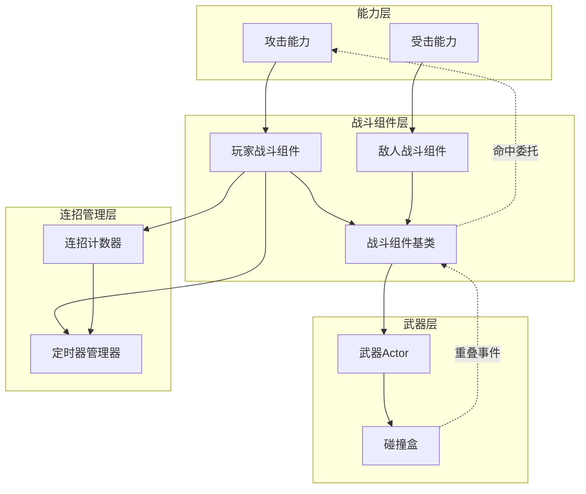
```mermaid
graph TB
    subgraph 能力层
        AttackGA[攻击能力]
        HitReactGA[受击能力]
    end
    
    subgraph 战斗组件层
        CombatBase[战斗组件基类]
        PCombat[玩家战斗组件]
        ECombat[敌人战斗组件]
    end
    
    subgraph 武器层
        Weapon[武器Actor]
        Collision[碰撞盒]
    end
    
    subgraph 连招管理层
        ComboMap[连招计数器]
        Timer[定时器管理器]
    end
    
    AttackGA --> PCombat
    HitReactGA --> ECombat
    PCombat --> CombatBase
    ECombat --> CombatBase
    CombatBase --> Weapon
    Weapon --> Collision
    
    PCombat --> ComboMap
    PCombat --> Timer
    ComboMap --> Timer
    
    Collision -.重叠事件.-> CombatBase
    CombatBase -.命中委托.-> AttackGA
```

**图4.6 战斗系统架构图**

图4.6展示了战斗系统的分层架构与核心数据流。能力层包含攻击能力和受击能力，攻击能力由玩家触发执行连招攻击，受击能力在敌人被命中时播放受击动画。战斗组件层包含战斗组件基类、玩家战斗组件和敌人战斗组件，采用分层继承架构。战斗组件基类提供通用的武器管理功能，通过CharacterCarriedWeaponMap管理角色携带的所有武器，支持武器注册、碰撞切换和命中处理。玩家战斗组件扩展连招管理系统，通过TMap<ERPGComboType, int32>分通道存储轻击和重击的连招计数，支持连招窗口定时器控制和通道切换时重置对方通道计数器。敌人战斗组件重写命中检测逻辑，实现敌人特有的命中处理策略。武器层包含武器Actor和碰撞盒，武器Actor通过WeaponMesh展示外观，通过WeaponCollisionBox检测攻击命中。碰撞盒通过OnCollisionBoxBeginOverlap和OnCollisionBoxEndOverlap回调检测目标重叠，并通过FOnTargetInteractDelegate委托通知战斗组件。连招管理层包含连招计数器和定时器管理器，连招计数器按攻击类型分通道维护，定时器管理器控制连招窗口的过期重置。核心数据流为：攻击能力触发 → 战斗组件设置连招类型 → 播放攻击蒙太奇 → AnimNotify开启武器碰撞 → 碰撞盒检测到重叠 → 触发命中委托 → 战斗组件处理命中逻辑 → 应用伤害效果。连招管理的数据流为：玩家输入 → 切换连招通道 → 重置对方通道计数 → 递增当前通道计数 → 启动连招窗口定时器 → 窗口期内进入下一招继续连招或窗口期过期重置计数。该架构通过分层组件设计实现玩家和敌人战斗逻辑的复用与扩展，通过连招通道管理实现复杂的连招系统，通过武器碰撞检测实现精确的攻击判定，通过委托机制实现模块间的松耦合通信。

## 4.5 武器系统模块详细设计

### 4.5.1 武器系统架构设计

武器系统模块负责管理武器实体的创建、碰撞检测和能力授予。ARPGWeaponBase作为武器基类继承自AActor，包含WeaponMesh（UStaticMeshComponent，武器外观）和WeaponCollisionBox（UBoxComponent，攻击判定区域）。碰撞盒通过OnCollisionBoxBeginOverlap和OnCollisionBoxEndOverlap回调检测目标重叠，并通过FOnTargetInteractDelegate委托（DECLARE_DELEGATE_OneParam）通知CombatComponent。

ARPGPlayerWeapon继承ARPGWeaponBase，持有FRPGPlayerWeaponData结构和GrantAbilitySpecHandles数组。FRPGPlayerWeaponData是武器的完整配置数据，包含：WeaponAnimLayerToLink（指定武器对应的URPGItemAnimLayersBase动画层子类）、EquipWeaponMontage/UnequipWeaponMontage（装备/卸下动画蒙太奇）、WeaponInputMappingContext（武器专属输入映射上下文，装备时添加到Enhanced Input）、DefaultWeaponAbilities（武器授予的能力集合，为FRPGPlayerAbilitySet数组，每项包含InputTag和AbilityToGrant）、WeaponBaseDamage（FScalableFloat，支持等级缩放的基础伤害）、SoftWeaponIconTexture（武器图标软引用）。

武器装备流程：玩家触发装备能力（如RPGPlayerAbility_EquipSword）→ 能力从CombatComponent获取武器引用 → 播放EquipWeaponMontage → AnimNotify触发时将武器附加到手部插槽 → 调用ASC的GrantPlayerWeaponAbility授予武器能力 → 将AbilitySpecHandles保存到武器的GrantAbilitySpecHandles → 添加WeaponInputMappingContext到Enhanced Input → 调用AnimInstance的LinkAnimLayer链接武器动画层。

### 4.5.2 武器系统类图

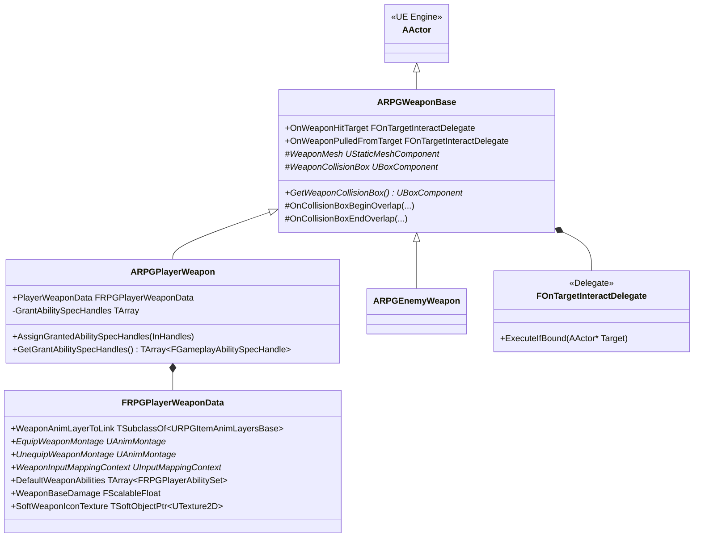
```mermaid
classDiagram
    class AActor {
        <<UE Engine>>
    }
    
    class ARPGWeaponBase {
        +OnWeaponHitTarget FOnTargetInteractDelegate
        +OnWeaponPulledFromTarget FOnTargetInteractDelegate
        +GetWeaponCollisionBox() UBoxComponent*
        #WeaponMesh UStaticMeshComponent*
        #WeaponCollisionBox UBoxComponent*
        #OnCollisionBoxBeginOverlap(...)
        #OnCollisionBoxEndOverlap(...)
    }
    
    class ARPGPlayerWeapon {
        +PlayerWeaponData FRPGPlayerWeaponData
        +AssignGrantedAbilitySpecHandles(InHandles)
        +GetGrantAbilitySpecHandles() TArray~FGameplayAbilitySpecHandle~
        -GrantAbilitySpecHandles TArray
    }
    
    class ARPGEnemyWeapon {
    }
    
    class FRPGPlayerWeaponData {
        +WeaponAnimLayerToLink TSubclassOf~URPGItemAnimLayersBase~
        +EquipWeaponMontage UAnimMontage*
        +UnequipWeaponMontage UAnimMontage*
        +WeaponInputMappingContext UInputMappingContext*
        +DefaultWeaponAbilities TArray~FRPGPlayerAbilitySet~
        +WeaponBaseDamage FScalableFloat
        +SoftWeaponIconTexture TSoftObjectPtr~UTexture2D~
    }
    
    class FOnTargetInteractDelegate {
        <<Delegate>>
        +ExecuteIfBound(AActor* Target)
    }
    
    AActor <|-- ARPGWeaponBase
    ARPGWeaponBase <|-- ARPGPlayerWeapon
    ARPGWeaponBase <|-- ARPGEnemyWeapon
    ARPGPlayerWeapon *-- FRPGPlayerWeaponData
    ARPGWeaponBase *-- FOnTargetInteractDelegate
```

**图4.7 武器系统详细类图**

### 4.5.3 武器装备流程时序图

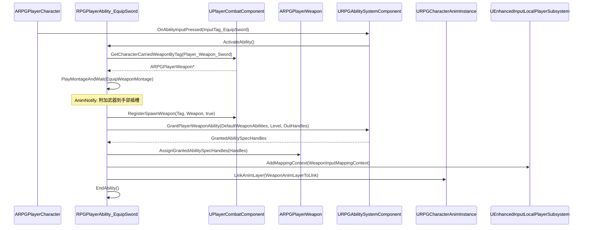
```mermaid
sequenceDiagram
    participant Player as ARPGPlayerCharacter
    participant GA as RPGPlayerAbility_EquipSword
    participant Combat as UPlayerCombatComponent
    participant Weapon as ARPGPlayerWeapon
    participant ASC as URPGAbilitySystemComponent
    participant Anim as URPGCharacterAnimInstance
    participant Input as UEnhancedInputLocalPlayerSubsystem
    
    Player->>ASC: OnAbilityInputPressed(InputTag_EquipSword)
    ASC->>GA: ActivateAbility()
    GA->>Combat: GetCharacterCarriedWeaponByTag(Player_Weapon_Sword)
    Combat-->>GA: ARPGPlayerWeapon*
    GA->>GA: PlayMontageAndWait(EquipWeaponMontage)
    Note over GA: AnimNotify: 附加武器到手部插槽
    GA->>Combat: RegisterSpawnWeapon(Tag, Weapon, true)
    GA->>ASC: GrantPlayerWeaponAbility(DefaultWeaponAbilities, Level, OutHandles)
    ASC-->>GA: GrantedAbilitySpecHandles
    GA->>Weapon: AssignGrantedAbilitySpecHandles(Handles)
    GA->>Input: AddMappingContext(WeaponInputMappingContext)
    GA->>Anim: LinkAnimLayer(WeaponAnimLayerToLink)
    GA->>GA: EndAbility()
```

**图4.8 武器装备流程时序图**

### 4.5.4 武器卸下流程时序图

武器卸下能力（如RPGPlayerAbility_UnequipSword）与装备能力对称，以「Grant的反操作」为核心思想。流程按逆序清理在装备期间注入的全部状态：Unlink动画层、移除武器输入映射、按GrantAbilitySpecHandles批量移除ASC上的能力句柄、播放UnequipWeaponMontage后将武器从手部插槽分离。CombatComponent的CurrentEquippedWeaponTag清空但武器实例仍保留在CharacterCarriedWeaponMap中以便后续重新装备。

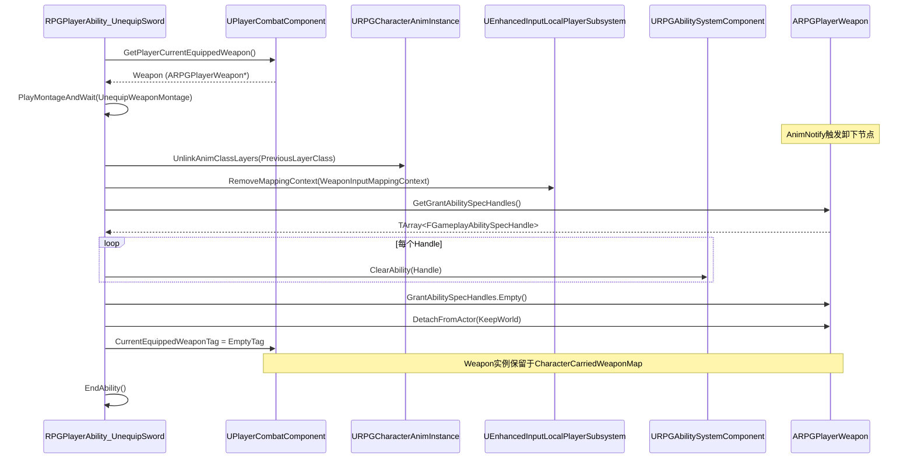
```mermaid
sequenceDiagram
    participant GA as RPGPlayerAbility_UnequipSword
    participant Combat as UPlayerCombatComponent
    participant Anim as URPGCharacterAnimInstance
    participant Input as UEnhancedInputLocalPlayerSubsystem
    participant ASC as URPGAbilitySystemComponent
    participant Weapon as ARPGPlayerWeapon

    GA->>Combat: GetPlayerCurrentEquippedWeapon()
    Combat-->>GA: Weapon (ARPGPlayerWeapon*)
    GA->>GA: PlayMontageAndWait(UnequipWeaponMontage)
    Note over Weapon: AnimNotify触发卸下节点
    GA->>Anim: UnlinkAnimClassLayers(PreviousLayerClass)
    GA->>Input: RemoveMappingContext(WeaponInputMappingContext)
    GA->>Weapon: GetGrantAbilitySpecHandles()
    Weapon-->>GA: TArray<FGameplayAbilitySpecHandle>
    loop 每个Handle
        GA->>ASC: ClearAbility(Handle)
    end
    GA->>Weapon: GrantAbilitySpecHandles.Empty()
    GA->>Weapon: DetachFromActor(KeepWorld)
    GA->>Combat: CurrentEquippedWeaponTag = EmptyTag
    Note over Combat,Weapon: Weapon实例保留于CharacterCarriedWeaponMap
    GA->>GA: EndAbility()
```

**图4.26 武器卸下流程时序图**

### 4.5.4 武器系统架构图

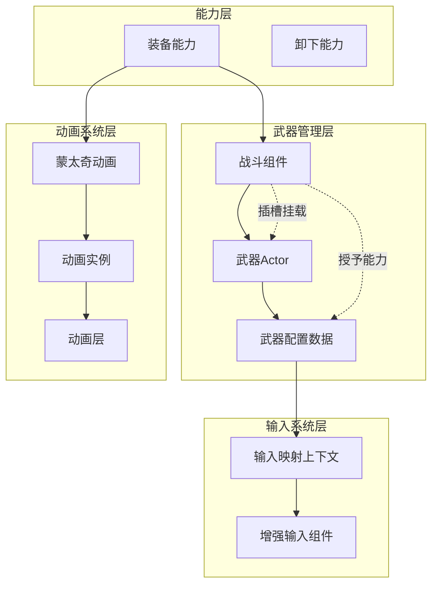
```mermaid
graph TB
    subgraph 能力层
        EquipGA[装备能力]
        UnequipGA[卸下能力]
    end
    
    subgraph 武器管理层
        Combat[战斗组件]
        Weapon[武器Actor]
        Data[武器配置数据]
    end
    
    subgraph 动画系统层
        AnimInstance[动画实例]
        AnimLayer[动画层]
        Montage[蒙太奇动画]
    end
    
    subgraph 输入系统层
        InputMapping[输入映射上下文]
        EnhancedInput[增强输入组件]
    end
    
    EquipGA --> Combat
    Combat --> Weapon
    Weapon --> Data
    
    EquipGA --> Montage
    Montage --> AnimInstance
    AnimInstance --> AnimLayer
    
    Data --> InputMapping
    InputMapping --> EnhancedInput
    
    Combat -.插槽挂载.-> Weapon
    Combat -.授予能力.-> Data
```

**图4.7 武器系统架构图**

图4.7展示了武器系统的完整架构与装备/卸下对称设计。能力层包含装备能力和卸下能力，两者采用对称的设计模式。装备能力负责将武器挂载到角色手部插槽、授予武器能力、添加输入映射上下文和链接动画层；卸下能力执行相反的操作，移除动画层、移除输入映射上下文、清除授予的能力和卸下武器Actor。武器管理层包含战斗组件、武器Actor和武器配置数据。战斗组件通过CharacterCarriedWeaponMap管理角色携带的所有武器，支持武器注册、当前装备武器标记和武器引用获取。武器Actor继承自AActor，包含WeaponMesh（武器外观）和WeaponCollisionBox（攻击判定区域），通过插槽挂载系统附加到角色的手部骨骼。武器配置数据结构FRPGPlayerWeaponData包含武器的完整配置：武器动画层类、装备/卸下动画蒙太奇、武器专属输入映射上下文、默认武器能力集合、武器基础伤害（支持等级缩放）和武器图标软引用。动画系统层包含动画实例、动画层和蒙太奇动画。装备能力播放装备动画蒙太奇，通过AnimNotify触发时将武器附加到手部插槽，然后通过LinkAnimClassLayers链接武器专属的动画层，使武器攻击动画与角色动画系统无缝集成。输入系统层包含输入映射上下文和增强输入组件。武器配置数据中的WeaponInputMappingContext在装备时添加到增强输入组件，使武器拥有专属的输入绑定（如轻击、重击、格挡等），卸下时移除该映射上下文。核心数据流为：装备能力触发 → 战斗组件获取武器引用 → 播放装备动画 → AnimNotify触发武器挂载到插槽 → 授予武器能力并保存Handle → 添加武器输入映射上下文 → 链接武器动画层。卸下流程相反：播放卸下动画 → 移除动画层 → 移除输入映射上下文 → 清除授予的能力 → 卸下武器Actor。该架构通过装备/卸下能力的对称设计，确保资源的正确授予和清理，避免内存泄漏和状态不一致。武器配置数据的数据驱动设计使策划可以轻松调整武器属性而无需修改代码，支持游戏平衡性的快速迭代。

## 4.6 能力系统(GAS)模块详细设计

### 4.6.1 能力系统架构设计

能力系统模块基于UE5的Gameplay Ability System（GAS）实现，提供属性管理、能力授予/激活、GameplayEffect应用等功能。系统核心组件包括URPGAbilitySystemComponent（扩展ASC）、URPGAttributeSet（四类属性集）和URPGGameplayAbility（能力基类）。

URPGAbilitySystemComponent扩展UAbilitySystemComponent，添加三个核心功能：（1）OnAbilityInputPressed/OnAbilityInputReleased方法接收GameplayTag形式的输入标签，遍历已授予的能力找到匹配InputTag的能力并激活/取消；（2）GrantPlayerWeaponAbility方法批量授予武器能力，接收FRPGPlayerAbilitySet数组和等级参数，返回OutGrantedAbilitySpecHandles用于后续移除；（3）TryActivateAbilityByTag方法通过AbilityTag直接激活能力，用于AI行为树的BTTask_ActivateAbilityByTag任务节点。

URPGAttributeSet继承UAttributeSet，定义四类属性，每个属性使用FGameplayAttributeData类型并通过ATTRIBUTE_ACCESSORS宏生成访问器。主属性（Primary）包含Strength（力量，影响物理攻击力）、Intelligence（智力，影响魔法攻击力）、Vitality（体质，影响生命值）、Agility（敏捷，影响闪避/暴击）。次属性（Secondary）包含Armor（护甲）、CriticalHitChance（暴击率0-100）、CriticalHitDamage（暴击倍数，基础1.0）、HealthRegeneration（生命回复/秒）、ManaRegeneration（法力回复/秒）。核心属性（Vital）包含CurrentHealth/MaxHealth、CurrentRage/MaxRage、CurrentMana/MaxMana。元属性（Meta）包含DamageTaken（受到伤害，用于伤害计算中间值）、IncomingXP（获得经验）、AttackPower（攻击力）、DefensePower（防御力）。所有核心和主要属性通过ReplicatedUsing支持网络复制。

属性变更通过三个回调处理：PreAttributeChange在属性修改前调用，用于值钳制（如确保CurrentHealth不超过MaxHealth）；PostAttributeChange在属性修改后调用，触发UI更新委托；PostGameplayEffectExecute在GameplayEffect执行后调用，用于处理DamageTaken元属性的伤害计算逻辑（应用护甲减伤、暴击倍率等）。

URPGGameplayAbility继承UGameplayAbility，提供ERPGAbilityActivationPolicy枚举（OnTriggered：输入触发激活；OnGive：授予时立即激活）。基类提供GetPawnCombatComponentFromActorInfo和GetRPGAbilitySystemComponentFromActorInfo辅助方法，以及NativeApplyEffectSpecHandleToTarget/BP_ApplyEffectSpecHandleToTarget伤害应用方法。URPGEnemyGameplayAbility继承URPGGameplayAbility，添加GetEnemyCharacterFromActorInfo和GetEnemyCombatComponentFromActorInfo敌人特有辅助方法。

### 4.6.2 能力系统类图

能力系统采用GAS框架的三层扩展架构，URPGAbilitySystemComponent扩展ASC提供输入处理和能力授予功能，URPGAttributeSet定义四类属性（主属性、次属性、核心属性、元属性）实现属性管理和伤害计算，URPGGameplayAbility扩展能力基类提供辅助方法和伤害应用接口。三层架构通过继承UE GAS原生类实现，保留GAS的核心功能同时添加项目特有的逻辑，确保与GAS框架的兼容性和扩展性。

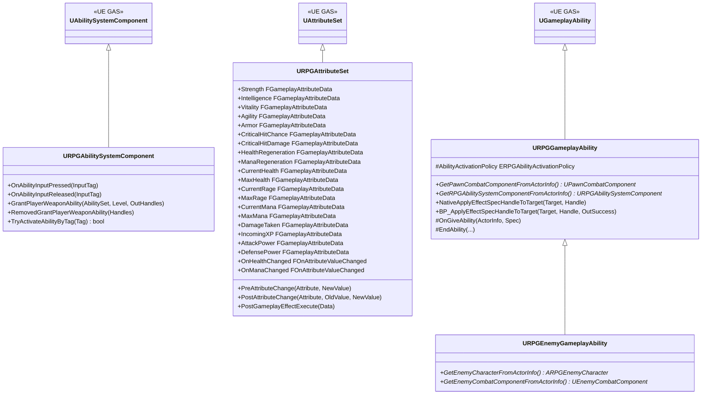
```mermaid
classDiagram
    class UAbilitySystemComponent {
        <<UE GAS>>
    }
    
    class URPGAbilitySystemComponent {
        +OnAbilityInputPressed(InputTag)
        +OnAbilityInputReleased(InputTag)
        +GrantPlayerWeaponAbility(AbilitySet, Level, OutHandles)
        +RemovedGrantPlayerWeaponAbility(Handles)
        +TryActivateAbilityByTag(Tag) bool
    }
    
    class UAttributeSet {
        <<UE GAS>>
    }
    
    class URPGAttributeSet {
        +Strength FGameplayAttributeData
        +Intelligence FGameplayAttributeData
        +Vitality FGameplayAttributeData
        +Agility FGameplayAttributeData
        +Armor FGameplayAttributeData
        +CriticalHitChance FGameplayAttributeData
        +CriticalHitDamage FGameplayAttributeData
        +HealthRegeneration FGameplayAttributeData
        +ManaRegeneration FGameplayAttributeData
        +CurrentHealth FGameplayAttributeData
        +MaxHealth FGameplayAttributeData
        +CurrentRage FGameplayAttributeData
        +MaxRage FGameplayAttributeData
        +CurrentMana FGameplayAttributeData
        +MaxMana FGameplayAttributeData
        +DamageTaken FGameplayAttributeData
        +IncomingXP FGameplayAttributeData
        +AttackPower FGameplayAttributeData
        +DefensePower FGameplayAttributeData
        +OnHealthChanged FOnAttributeValueChanged
        +OnManaChanged FOnAttributeValueChanged
        +PreAttributeChange(Attribute, NewValue)
        +PostAttributeChange(Attribute, OldValue, NewValue)
        +PostGameplayEffectExecute(Data)
    }
    
    class UGameplayAbility {
        <<UE GAS>>
    }
    
    class URPGGameplayAbility {
        +GetPawnCombatComponentFromActorInfo() UPawnCombatComponent*
        +GetRPGAbilitySystemComponentFromActorInfo() URPGAbilitySystemComponent*
        +NativeApplyEffectSpecHandleToTarget(Target, Handle)
        +BP_ApplyEffectSpecHandleToTarget(Target, Handle, OutSuccess)
        #AbilityActivationPolicy ERPGAbilityActivationPolicy
        #OnGiveAbility(ActorInfo, Spec)
        #EndAbility(...)
    }
    
    class URPGEnemyGameplayAbility {
        +GetEnemyCharacterFromActorInfo() ARPGEnemyCharacter*
        +GetEnemyCombatComponentFromActorInfo() UEnemyCombatComponent*
    }
    
    UAbilitySystemComponent <|-- URPGAbilitySystemComponent
    UAttributeSet <|-- URPGAttributeSet
    UGameplayAbility <|-- URPGGameplayAbility
    URPGGameplayAbility <|-- URPGEnemyGameplayAbility
```

**图4.9 能力系统详细类图**

### 4.6.3 能力激活与伤害计算时序图

能力激活流程从增强输入组件触发开始，通过URPGEnhancedInputComponent调用ASC的OnAbilityInputPressed方法，传入GameplayTag形式的输入标签。ASC遍历ActivatableAbilities.Items数组，查找匹配InputTag的FGameplayAbilitySpec，找到后调用TryActivateAbility激活能力。能力激活后，通过UPlayerCombatComponent获取当前武器的基础伤害值（FScalableFloat支持等级缩放），创建OutgoingGameplayEffectSpec并设置SetByCallerTag的Magnitude为伤害值。当武器碰撞盒检测到目标重叠时，调用NativeApplyEffectSpecHandleToTarget将Spec应用到目标的ASC。目标的ASC调用ApplyGameplayEffectSpecToSelf执行Effect，触发PostGameplayEffectExecute回调。URPGAttributeSet在回调中提取DamageTaken元属性值，计算最终伤害（FinalDamage = DamageTaken - Armor），从CurrentHealth中扣除，并通过Clamp确保生命值不低于0。该流程通过GAS的EffectSpec机制实现伤害数据的传递，通过SetByCallerTag动态设置伤害值，通过AttributeSet的回调处理伤害计算和属性更新。

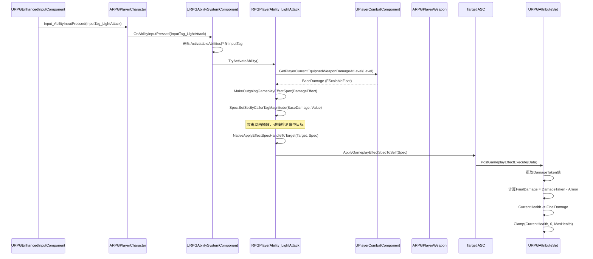
```mermaid
sequenceDiagram
    participant Input as URPGEnhancedInputComponent
    participant Char as ARPGPlayerCharacter
    participant ASC as URPGAbilitySystemComponent
    participant GA as RPGPlayerAbility_LightAttack
    participant Combat as UPlayerCombatComponent
    participant Weapon as ARPGPlayerWeapon
    participant TargetASC as Target ASC
    participant AttrSet as URPGAttributeSet
    
    Input->>Char: Input_AbilityInputPressed(InputTag_LightAttack)
    Char->>ASC: OnAbilityInputPressed(InputTag_LightAttack)
    ASC->>ASC: 遍历ActivatableAbilities匹配InputTag
    ASC->>GA: TryActivateAbility()
    GA->>Combat: GetPlayerCurrentEquippedWeaponDamageAtLevel(Level)
    Combat-->>GA: BaseDamage (FScalableFloat)
    GA->>GA: MakeOutgoingGameplayEffectSpec(DamageEffect)
    GA->>GA: Spec.SetSetByCallerTagMagnitude(BaseDamage, Value)
    Note over GA: 攻击动画播放，碰撞检测命中目标
    GA->>GA: NativeApplyEffectSpecHandleToTarget(Target, Spec)
    GA->>TargetASC: ApplyGameplayEffectSpecToSelf(Spec)
    TargetASC->>AttrSet: PostGameplayEffectExecute(Data)
    AttrSet->>AttrSet: 提取DamageTaken值
    AttrSet->>AttrSet: 计算FinalDamage = DamageTaken - Armor
    AttrSet->>AttrSet: CurrentHealth -= FinalDamage
    AttrSet->>AttrSet: Clamp(CurrentHealth, 0, MaxHealth)
```

**图4.10 能力激活与伤害计算时序图**

图4.10展示了从输入触发到伤害计算的完整流程。URPGEnhancedInputComponent接收玩家输入，调用ARPGPlayerCharacter的Input_AbilityInputPressed方法，传入InputTag_LightAttack。角色将输入转发到URPGAbilitySystemComponent的OnAbilityInputPressed方法，ASC遍历ActivatableAbilities.Items数组查找匹配InputTag_LightAttack的Spec，找到后调用RPGPlayerAbility_LightAttack的TryActivateAbility。能力激活后，调用UPlayerCombatComponent的GetPlayerCurrentEquippedWeaponDamageAtLevel获取当前武器的基础伤害值（FScalableFloat根据等级缩放），创建OutgoingGameplayEffectSpec并通过SetSetByCallerTagMagnitude设置伤害值。攻击动画播放期间，武器碰撞盒检测到目标重叠，能力调用NativeApplyEffectSpecHandleToTarget将Spec应用到目标的ASC。目标ASC调用ApplyGameplayEffectSpecToSelf执行Effect，触发URPGAttributeSet的PostGameplayEffectExecute回调。回调中提取DamageTaken元属性值，计算FinalDamage = DamageTaken - Armor，从CurrentHealth中扣除，最后通过Clamp确保CurrentHealth在[0, MaxHealth]范围内。该流程通过GAS的EffectSpec和SetByCallerTag机制实现动态伤害计算，通过AttributeSet的回调确保属性变更的正确性和一致性。

### 4.6.4 ASC启动与能力授予时序图

ASC初始化后需要一次性授予StartUpData配置的启动能力与启动效果。玩家端ASC挂载在ARPGPlayerState上，通过PossessedBy（服务端）和OnRep_PlayerState（客户端）两条路径完成InitAbilityActorInfo，随后按StartUpData中的FRPGPlayerAbilitySet批量调用GrantPlayerWeaponAbility注册能力句柄。敌人ASC在ARPGEnemyCharacter自身，OnPossess后一次性授予StartUpAbilities和StartUpGameplayEffects。

```mermaid
sequenceDiagram
    participant GM as ARPGGameMode
    participant PS as ARPGPlayerState
    participant Char as ARPGPlayerCharacter
    participant ASC as URPGAbilitySystemComponent
    participant Data as URPGDataAsset_StartUpDataBase

    GM->>Char: PossessedBy(PlayerController)
    Char->>PS: GetPlayerState<ARPGPlayerState>()
    Char->>ASC: InitAbilityActorInfo(PS, Char)
    Note over ASC: OwnerActor=PS, AvatarActor=Char
    Char->>Data: GiveToAbilitySystemComponent(ASC)
    loop StartUpAbilitySets每项
        Data->>ASC: GiveAbility(FGameplayAbilitySpec(AbilityClass, Level))
        ASC-->>Data: FGameplayAbilitySpecHandle
    end
    loop StartUpGameplayEffects每项
        Data->>ASC: ApplyGameplayEffectToSelf(EffectClass, Level, Context)
    end
    alt 客户端另一条路径
        PS->>Char: OnRep_PlayerState()
        Char->>ASC: InitAbilityActorInfo（幂等保护）
    end
```

**图4.27 ASC启动与能力授予时序图**

图4.27展示了ASC的初始化和能力授予流程。游戏开始时，ARPGGameMode在PossessedBy中调用ARPGPlayerCharacter的PossessedBy方法，角色通过GetPlayerState获取ARPGPlayerState实例，调用ASC的InitAbilityActorInfo初始化ActorInfo（OwnerActor=PlayerState，AvatarActor=Character）。初始化完成后，调用URPGDataAsset_StartUpDataBase的GiveToAbilitySystemComponent方法，遍历StartUpAbilitySets数组，对每个FRPGPlayerAbilitySet调用ASC的GiveAbility授予能力，返回FGameplayAbilitySpecHandle用于后续管理。随后遍历StartUpGameplayEffects数组，调用ApplyGameplayEffectToSelf应用启动GameplayEffect（如初始属性设置）。在客户端，OnRep_PlayerState回调提供另一条初始化路径，通过幂等保护确保InitAbilityActorInfo不会被重复调用。敌人ASC的初始化流程类似，在ARPGEnemyCharacter的OnPossess中调用InitAbilityActorInfo，然后授予StartUpAbilities和StartUpGameplayEffects。该流程确保ASC在游戏开始时正确初始化，所有启动能力和效果被正确授予和应用，为玩家和敌人提供一致的能力系统基础。

### 4.6.5 HitReact方向判定与动画时序图

HitReact能力采用GameplayEvent触发机制，当角色受到伤害时，ExecCalc_Damage计算最终伤害并通过ApplyDamageEffect应用到目标的ASC。ASC在应用DamageEffect后触发GameplayEvent（HitReact.Trigger），ASC遍历匹配该EventTag的能力并尝试激活。URPGGameplayAbility_HitReact被激活后，从EventData.Context中取出攻击者Actor，通过向量运算计算受击方向：首先计算攻击者相对于受击者的位置向量（AttackerLoc - SelfLoc）并归一化，然后计算Dot Product（Forward·Direction）判断前后，计算Cross Product（Forward×Direction）判断左右。根据Dot和Cross的值将受击方向分类为Front（Dot>0.5）、Back（Dot<-0.5）、Right（Cross.Z>0）、Left（其他）四个方向，并在ASC上添加对应的LooseGameplayTag（HitReact.Front/Back/Left/Right）。角色的AnimBP通过GameplayTag匹配节点监听这些Tag，播放对应的HitReactMontage（如HitReactFront/HitReactBack）。动画播放完成后，OnCompleted或OnInterrupted回调触发，HitReact能力移除所有方向Tag并调用EndAbility结束能力。该设计通过向量运算实现精确的受击方向判定，通过GameplayTag驱动动画状态机，确保受击动画与攻击方向一致。

```mermaid
sequenceDiagram
    participant Attacker as 攻击者
    participant ExecCalc as GEExecCalc_Damage
    participant ASC as URPGAbilitySystemComponent(被击方)
    participant HR as URPGGameplayAbility_HitReact
    participant Anim as URPGBaseAnimInstance

    ExecCalc->>ASC: ApplyDamageEffect(伤害上下文)
    ASC->>ASC: 触发GameplayEvent(HitReact.Trigger)
    ASC->>HR: TryActivateAbilityByEvent(Trigger, EventData)
    HR->>HR: 从EventData.Context取出攻击者Actor
    HR->>HR: 计算Dot=Forward·(AttackerLoc-SelfLoc).Normalize
    HR->>HR: 计算Cross=Forward×(AttackerLoc-SelfLoc)
    alt Dot>0.5
        HR->>ASC: AddLooseGameplayTag(HitReact.Front)
    else Dot<-0.5
        HR->>ASC: AddLooseGameplayTag(HitReact.Back)
    else Cross.Z>0
        HR->>ASC: AddLooseGameplayTag(HitReact.Right)
    else
        HR->>ASC: AddLooseGameplayTag(HitReact.Left)
    end
    HR->>Anim: PlayMontageAndWait(方向对应的HitReactMontage)
    Anim-->>HR: OnCompleted/OnInterrupted
    HR->>ASC: RemoveLooseGameplayTag(HitReact.*)
    HR->>HR: EndAbility()
```

**图4.28 HitReact方向判定与动画时序图**

图4.28展示了HitReact能力的完整工作流程。ExecCalc_Damage在伤害计算完成后，通过ApplyDamageEffect将DamageEffect应用到目标的ASC，ASC在执行Effect后触发GameplayEvent（HitReact.Trigger）。ASC遍历ActivatableAbilities查找匹配该EventTag的能力，找到URPGGameplayAbility_HitReact后调用TryActivateAbilityByEvent激活。能力激活后，从EventData.Context中提取攻击者Actor，计算受击方向：位置向量Direction = (AttackerLoc - SelfLoc).Normalize，Dot Product = Forward·Direction判断前后（Dot>0.5为Front，Dot<-0.5为Back），Cross Product = Forward×Direction判断左右（Cross.Z>0为Right，否则为Left）。根据方向分类结果，ASC添加对应的LooseGameplayTag（HitReact.Front/Back/Left/Right）。URPGBaseAnimInstance通过GameplayTag匹配节点检测到Tag后，调用PlayMontageAndWait播放对应的HitReactMontage。动画播放完成后，OnCompleted或OnInterrupted回调触发，HitReact能力移除所有HitReact.*方向的LooseGameplayTag，调用EndAbility结束能力。该设计通过GameplayEvent实现伤害与受击反应的解耦，通过向量运算实现精确的方向判定，通过GameplayTag驱动动画状态机实现方向匹配的受击动画。

## 4.7 动画系统模块详细设计

### 4.7.1 动画系统架构设计

动画系统采用三层动画实例架构与Linked Anim Layers机制，实现角色动画状态管理与武器动画层的动态切换。URPGBaseAnimInstance作为基类提供基础运动参数计算（GroundSpeed、Direction、Velocity、VerticalSpeed）和GAS系统引用，通过NativeUpdateAnimation每帧更新运动状态标志（bIsMoving/bIsFalling/bIsGrounded）。URPGCharacterAnimInstance在NativeThreadSafeUpdateAnimation（线程安全版本）中执行三个核心更新步骤：UpdateMovementState通过速度阈值计算移动状态（bIsIdle/bIsWalking/bIsRunning/bIsSprinting）、UpdateGaitAmount计算步态比例（GaitAmount范围0.0-3.0）驱动BlendSpace混合、UpdateJumpState管理跳跃状态机（EJumpState枚举：None/Start/Loop/Land）。

跳跃状态机通过C++层计算状态变量（bCanJumpStart/bCanJumpLoop/bCanJumpLand），蓝图状态机的Transition Rule读取这些变量实现状态切换。HandleJumpStart检测VerticalSpeed超过JumpStartVerticalSpeedThreshold且非地面状态时进入Start阶段，HandleJumpLoop在Start阶段持续后自动转为Loop，HandleJumpLand通过TimeSinceGrounded和bWasFallingLastFrame检测落地，配置LandDetectionDelay防止瞬时触地误判。

Linked Anim Layers机制通过LinkAnimLayer(TSubclassOf<UAnimInstance>)实现运行时武器动画层切换。当玩家装备武器时，CharacterAnimInstance链接武器对应的URPGItemAnimLayersBase子类（如SwordAnimLayers/AxeAnimLayers），该层通过SyncFromCombatComponent每帧同步战斗数据（WeaponType、CombatState、ComboIndex、MaxComboCount、bIsInComboWindow、AttackSpeedMultiplier、bIsAttacking），实现武器动画与战斗状态的精确同步。Unlink时对称恢复默认层，右手角色如同时持有副武器可维持两层链接并存。

### 4.7.2 动画系统类图

```mermaid
classDiagram
    class UAnimInstance {
        <<UE Engine>>
    }
    
    class URPGBaseAnimInstance {
        +NativeInitializeAnimation()
        +NativeUpdateAnimation(DeltaSeconds)
        +DoesOwnerHaveTag(Tag) bool
        #OwningCharacter TObjectPtr~ACharacter~
        #MovementComponent TObjectPtr~UCharacterMovementComponent~
        #AbilitySystemComponent TObjectPtr~UAbilitySystemComponent~
        #GroundSpeed float
        #Direction float
        #Velocity FVector
        #VerticalSpeed float
        #bIsMoving bool
        #bIsFalling bool
        #bIsGrounded bool
    }
    
    class URPGCharacterAnimInstance {
        +NativeThreadSafeUpdateAnimation(DeltaSeconds)
        +LinkAnimLayer(AnimClass)
        +UnlinkAnimLayer()
        +OnJumpAnimationFinished()
        #bIsIdle bool
        #bIsWalking bool
        #bIsRunning bool
        #bIsSprinting bool
        #CurrentJumpState EJumpState
        #bIsJumping bool
        #bCanJumpStart bool
        #bCanJumpLoop bool
        #bCanJumpLand bool
        #bJumpAnimationFinished bool
        #GaitAmount float
        #WalkSpeedThreshold float
        #RunSpeedThreshold float
        #SprintSpeedThreshold float
        #JumpStartVerticalSpeedThreshold float
        #LandDetectionDelay float
        +CurrentLinkedLayerClass TSubclassOf
    }
    
    class URPGItemAnimLayersBase {
        <<Abstract>>
        +NativeInitializeAnimation()
        +NativeUpdateAnimation(DeltaSeconds)
        +GetWeaponType() ERPGWeaponType
        +SetWeaponType(NewType)
        #CombatComponent TObjectPtr~UPlayerCombatComponent~
        #WeaponType ERPGWeaponType
        #CombatState ERPGCombatState
        #ComboIndex int32
        #MaxComboCount int32
        #bIsInComboWindow bool
        #AttackSpeedMultiplier float
        #bIsAttacking bool
    }
    
    UAnimInstance <|-- URPGBaseAnimInstance
    URPGBaseAnimInstance <|-- URPGCharacterAnimInstance
    URPGBaseAnimInstance <|-- URPGItemAnimLayersBase
```

**图4.11 动画系统详细类图**

图4.11展示了动画系统的三层继承架构。UAnimInstance作为UE引擎基类，提供动画实例的基础功能。URPGBaseAnimInstance继承自UAnimInstance，实现第一层抽象：缓存角色引用（OwningCharacter、MovementComponent、AbilitySystemComponent）和计算基础运动参数（GroundSpeed、Direction、Velocity、VerticalSpeed），通过DoesOwnerHaveTag方法提供线程安全的GameplayTag查询。URPGCharacterAnimInstance继承自URPGBaseAnimInstance，实现第二层具体逻辑：管理移动状态（bIsIdle/bIsWalking/bIsRunning/bIsSprinting）、跳跃状态机（EJumpState枚举）、步态系统（GaitAmount）和武器动画层链接（CurrentLinkedLayerClass）。URPGItemAnimLayersBase同样继承自URPGBaseAnimInstance，实现第三层武器动画层：缓存PlayerCombatComponent引用，通过SyncFromCombatComponent同步战斗数据（WeaponType、CombatState、ComboIndex等），子类如SwordAnimLayers和AxeAnimLayers实现具体武器的动画逻辑。三层架构通过继承实现代码复用，URPGBaseAnimInstance提供通用功能，URPGCharacterAnimInstance和URPGItemAnimLayersBase分别处理角色动画和武器动画，职责清晰且易于扩展。

### 4.7.3 动画状态机工作时序图

```mermaid
sequenceDiagram
    participant Char as ARPGPlayerCharacter
    participant Anim as URPGCharacterAnimInstance
    participant SM as Animation State Machine
    participant BS as BlendSpace2D
    participant Layer as URPGItemAnimLayersBase
    participant Combat as UPlayerCombatComponent
    
    Char->>Anim: NativeThreadSafeUpdateAnimation(DeltaTime)
    Anim->>Anim: UpdateMovementState()
    Note over Anim: 计算bIsIdle/Walk/Run/Sprint
    Anim->>Anim: UpdateGaitAmount()
    Note over Anim: GaitAmount = 0(Idle)/1(Walk)/2(Run)/3(Sprint)
    Anim->>Anim: UpdateJumpState(DeltaTime)
    alt bIsFalling 且 VerticalSpeed > Threshold
        Anim->>Anim: HandleJumpStart() -> EJumpState::Start
    else 持续滞空
        Anim->>Anim: HandleJumpLoop() -> EJumpState::Loop
    else 检测到着地
        Anim->>Anim: HandleJumpLand() -> EJumpState::Land
    end
    Anim->>SM: 传递bCanJumpStart/Loop/Land
    SM->>BS: GaitAmount + Direction驱动BlendSpace
    
    par 武器动画层同步
        Layer->>Layer: NativeUpdateAnimation(DeltaTime)
        Layer->>Combat: 读取CombatState/ComboIndex等
        Combat-->>Layer: 同步战斗状态数据
        Layer->>Layer: SyncFromCombatComponent()
    end
```

**图4.12 动画状态机工作时序图**

图4.12展示了动画状态机的每帧工作流程。ARPGPlayerCharacter的Mesh组件每帧调用URPGCharacterAnimInstance的NativeThreadSafeUpdateAnimation方法，在动画线程中执行三个核心更新步骤。UpdateMovementState通过比较GroundSpeed与速度阈值（WalkSpeedThreshold、RunSpeedThreshold、SprintSpeedThreshold）计算移动状态布尔变量，UpdateGaitAmount根据速度映射计算步态比例（0.0=Idle、1.0=Walk、2.0=Run、3.0=Sprint），UpdateJumpState根据VerticalSpeed和地面检测更新跳跃状态机。跳跃状态机的三种过渡条件：当bIsFalling且VerticalSpeed超过阈值时调用HandleJumpStart进入EJumpState::Start，持续滞空时调用HandleJumpLoop进入EJumpState::Loop，检测到着地时调用HandleJumpLand进入EJumpState::Land。状态机通过bCanJumpStart/bCanJumpLoop/bCanJumpLand布尔变量驱动蓝图Transition Rule的过渡判断。同时，武器动画层（URPGItemAnimLayersBase）在NativeUpdateAnimation中通过SyncFromCombatComponent同步PlayerCombatComponent的战斗状态数据（CombatState、ComboIndex、MaxComboCount等），确保武器动画与战斗系统保持精确同步。GaitAmount和Direction最终传递给BlendSpace2D节点，驱动站立/行走/奔跑/冲刺动画的平滑混合。

### 4.7.4 LinkAnimClassLayers武器动画层链接时序图

当玩家装备武器时，通过AnimInstance的LinkAnimClassLayers机制动态切换为该武器专属的URPGItemAnimLayersBase子类（如SwordAnimLayers/AxeAnimLayers）。此过程不需重建AnimBP，仅需查询AnimLayerInterface接口的函数映射表。Unlink时对称恢复默认层。右手角色如同时持有副武器，可维持两层链接并存。

```mermaid
sequenceDiagram
    participant GA as RPGPlayerAbility_EquipSword
    participant Char as ARPGPlayerCharacter
    participant Anim as URPGCharacterAnimInstance
    participant LayerClass as URPGItemAnimLayersBase(Sword)
    participant Weapon as ARPGPlayerWeapon

    GA->>Weapon: GetPlayerWeaponData()
    Weapon-->>GA: WeaponAnimLayerToLink (TSubclassOf)
    GA->>Char: GetMesh()->GetAnimInstance()
    Char-->>GA: URPGCharacterAnimInstance*
    alt 首次或当前无关联层
        GA->>Anim: LinkAnimClassLayers(WeaponAnimLayerToLink)
        Anim->>LayerClass: 创建子图实例
        Anim->>Anim: 将Layer实例加入LinkedAnimInstances
    end
    Note over Anim,LayerClass: 在StateMachine中寻找并替换上色动画节点
    GA->>GA: EndAbility()
    Note over GA,Anim: 武器卸下时执行UnlinkAnimClassLayers
```

**图4.29 LinkAnimClassLayers武器动画层链接时序图**

图4.29展示了武器动画层的动态链接流程。当玩家激活装备能力（RPGPlayerAbility_EquipSword）时，能力从ARPGPlayerWeapon获取WeaponAnimLayerToLink（TSubclassOf<URPGItemAnimLayersBase>），如SwordAnimLayers类。能力通过Character的GetMesh()->GetAnimInstance()获取URPGCharacterAnimInstance实例，调用LinkAnimClassLayers方法传入武器动画层类。UE引擎在动画状态机中查找并替换上色（Layered blend per bone）动画节点，创建武器动画层实例并加入LinkedAnimInstances数组。武器动画层实例在NativeInitializeAnimation中缓存PlayerCombatComponent引用，随后在NativeUpdateAnimation中通过SyncFromCombatComponent同步战斗数据。当武器被卸下时，执行对称的UnlinkAnimClassLayers操作恢复默认动画层。该机制的优势在于不需要重建整个AnimBP，仅需通过AnimLayerInterface接口的函数映射表切换动画层，支持右手角色同时维持主副武器两层链接并存，实现武器切换时的动画无缝过渡。

## 4.8 控制器模块详细设计

### 4.8.1 控制器架构设计

控制模块包含两条独立的继承链。玩家控制器链：APlayerController → ARPGBaseController（实现IGenericTeamAgentInterface）→ ARPGPlayerController。AI控制器链：AAIController → ARPGEnemyAIController（独立实现团队系统）。两者不共享继承关系，但都通过IGenericTeamAgentInterface/GetTeamAttitudeTowards实现团队识别。

ARPGPlayerController在构造函数中设置PlayerTeamId = FGenericTeamId(0)（中立团队）。BeginPlay中完成UI初始化。GetGenericTeamId返回PlayerTeamId供AI感知系统使用。

ARPGEnemyAIController在构造函数中通过InitializePerception方法初始化AI感知系统。创建BehaviorTreeComponent和BlackboardComponent子对象。配置EnemySightConfig（UAISenseConfig_Sight）的参数：SightRadius（默认视觉半径）、LoseSightRadius（丢失视觉半径，大于SightRadius）、PeripheralVisionAngle（边缘视野角度）、PerceptionMaxAge（感知信息有效期）、bDetectEnemies（是否检测敌人）。创建EnemyPerceptionComponent并注册SightConfig。

GetTeamAttitudeTowards方法通过IGenericTeamAgentInterface获取Other的TeamId，与自身EnemyTeamId比较返回Hostile/Friendly/Neutral态度。OnTargetPerceptionUpdated和OnEnemyPerceptionUpdated处理感知回调，将感知到的Actor存入PerceivedActors缓存（TMap<AActor*, float>记录感知时间），UpdateNearestTarget方法将最近目标写入Blackboard。RunBehaviorTreeWithBlackboard方法由EnemyCharacter在PossessedBy中调用，初始化并运行行为树。

### 4.8.2 控制器类图

```mermaid
classDiagram
    class APlayerController {
        <<UE Engine>>
    }
    
    class AAIController {
        <<UE Engine>>
    }
    
    class IGenericTeamAgentInterface {
        <<Interface>>
        +GetGenericTeamId() FGenericTeamId
        +GetTeamAttitudeTowards(Other) ETeamAttitude
    }
    
    class ARPGBaseController {
        +ARPGBaseController()
    }
    
    class ARPGPlayerController {
        +BeginPlay()
        +GetGenericTeamId() FGenericTeamId
        -PlayerTeamId FGenericTeamId
    }
    
    class ARPGEnemyAIController {
        +GetTeamAttitudeTowards(Other) ETeamAttitude
        +RunBehaviorTreeWithBlackboard(BT)
        +GetBehaviorTreeComponent() UBehaviorTreeComponent*
        +OnTargetPerceptionUpdated(Actor, Stimulus)
        +OnEnemyPerceptionUpdated(Actor, Stimulus)
        #SightRadius float
        #LoseSightRadius float
        #PeripheralVisionAngle float
        #PerceptionMaxAge float
        #bDetectEnemies bool
        #BehaviorTreeComponent TObjectPtr
        #BlackboardComp TObjectPtr
        #EnemyPerceptionComponent TObjectPtr
        #EnemySightConfig TObjectPtr
        #PerceivedActors TMap~AActor* float~
        -InitializePerception()
        -UpdateNearestTarget()
        -EnemyTeamId FGenericTeamId
    }
    
    APlayerController <|-- ARPGBaseController
    ARPGBaseController ..|> IGenericTeamAgentInterface
    ARPGBaseController <|-- ARPGPlayerController
    AAIController <|-- ARPGEnemyAIController
```

**图4.13 控制器详细类图**

### 4.8.3 Gruntling AIController OnPossess初始化时序图

Gruntling作为基础敌人类型，其控制器的OnPossess流程集中体现了敌人AI的完整启动链：感知配置最终绑定、行为树与黑板关联、团队ID注入、AttitudeSolver注册。这里的InitializePerception已在构造函数创建Config和Component，OnPossess仅负责将其与Pawn联动。

```mermaid
sequenceDiagram
    participant World as UWorld
    participant AIC as ARPGEnemyAIController
    participant Pawn as ARPGEnemyCharacter(Gruntling)
    participant Percp as UAIPerceptionComponent
    participant BT as UBehaviorTreeComponent
    participant BB as UBlackboardComponent

    World->>AIC: Spawn AIController
    AIC->>AIC: InitializePerception() [构造函数]
    AIC->>Percp: ConfigureSense(EnemySightConfig)
    AIC->>Percp: SetDominantSense(UAISense_Sight)
    AIC->>Percp: OnTargetPerceptionUpdated.AddDynamic
    World->>AIC: Possess(Pawn)
    AIC->>Pawn: OnPossess(Pawn)
    Pawn-->>AIC: GetEnemyBehaviorTree()
    AIC->>BT: UseBlackboard(BT.BlackboardAsset, BB)
    AIC->>BT: StartTree(BT)
    AIC->>AIC: SetGenericTeamId(EnemyTeamId)
    AIC->>Percp: ForceUpdateAllSenses()
    Note over AIC,Percp: 此后EnemyCharacter鉴定为Hostile
```

**图4.30 Gruntling AIController OnPossess初始化时序图**

## 4.9 AI模块详细设计

### 4.9.1 AI系统架构设计

AI模块通过ARPGEnemyAIController协调行为树、黑板和感知系统，实现敌人的智能行为。ARPGEnemyCharacter在PossessedBy中获取AI控制器引用并调用RunBehaviorTreeWithBlackboard启动行为树。行为树通过自定义Task、Service和Decorator节点实现敌人行为逻辑，黑板（Blackboard）作为数据共享中心存储目标Actor、巡逻点、战斗状态等关键数据。

自定义行为树任务（BTTask）：
- BTTask_RotateToFaceTarget：平滑旋转朝向目标Actor。使用FRotateToFaceTargetTaskMemory存储OwningPawn和TargetActor弱引用，通过AnglePrecision（角度精度）和RotationInterpSpeed（旋转插值速度）控制旋转行为，使用InTargetToFaceKey从黑板读取目标。
- BTTask_ActivateAbilityByTag：通过GameplayTag激活ASC能力，用于触发攻击等行为。
- BTTask_FindRandomPatrolPoint：在导航网格上找到随机巡逻点，写入黑板。
- BTTask_FindStrafingPoint_EQS：使用环境查询系统（EQS）找到适合侧移的位置点。
- BTTask_SetMovementSpeed：设置AI角色的移动速度（巡逻/追逐/冲刺等不同速度）。

自定义行为树服务（BTService）：
- BTService_FindNearestPlayer：定期查找最近的玩家并更新黑板的TargetActor键。
- BTService_OrientToTargetActor：持续使AI朝向目标Actor（与Task版本不同，Service在后台持续运行）。

自定义行为树装饰器（BTDecorator）：
- BTDecorator_RandomChance：基于随机概率决定子节点是否执行，用于增加AI行为的不可预测性。

敌人行为模式通过黑板数据流驱动：BTService_FindNearestPlayer持续感知并更新TargetActor，行为树根据TargetActor的有效性在战斗序列和巡逻序列之间切换。战斗序列中，InAttackRange装饰器检查攻击距离，BTDecorator_RandomChance增加行为随机性，BTTask_ActivateAbilityByTag触发攻击能力。巡逻序列中，BTTask_FindRandomPatrolPoint生成新巡逻点，MoveTo节点控制移动到目标位置，Wait节点实现停留等待。

### 4.9.2 AI行为树结构

敌人AI行为树采用双序列架构（战斗序列+巡逻序列），通过黑板数据流实现行为模式的动态切换。行为树的根节点为选择器（Selector），优先执行战斗序列，当战斗条件不满足时回退到巡逻序列。战斗序列包含目标检测、距离判断、攻击执行、追逐移动和侧移旋转五个分支，通过装饰器（Decorator）控制执行条件。巡逻序列包含巡逻点查找、移动和等待三个步骤，采用顺序执行模式。服务层（Service）提供后台运行的目标查找和朝向更新功能，确保AI始终能够感知环境并做出响应。该设计通过黑板的TargetActor键实现状态共享，感知系统更新TargetActor，行为树根据TargetActor的有效性选择执行路径，实现感知与决策的解耦。

```mermaid
graph TB
    subgraph 行为树结构
        Root[Root Selector]
        
        subgraph 战斗序列
            CombatSel[Selector: Combat]
            HasTarget{HasTarget?}
            InRange{InAttackRange?}
            Attack[BTTask_ActivateAbilityByTag]
            Chase[MoveTo TargetActor]
            Strafe[BTTask_FindStrafingPoint_EQS]
            Rotate[BTTask_RotateToFaceTarget]
        end
        
        subgraph 巡逻序列
            PatrolSeq[Sequence: Patrol]
            FindPoint[BTTask_FindRandomPatrolPoint]
            MoveTo[MoveTo PatrolPoint]
            Wait[Wait 3-5s]
        end
    end
    
    subgraph 服务层
        S1[BTService_FindNearestPlayer]
        S2[BTService_OrientToTargetActor]
    end
    
    Root --> CombatSel
    Root --> PatrolSeq
    CombatSel --> HasTarget
    HasTarget --> InRange
    InRange --> Attack
    HasTarget --> Chase
    CombatSel --> Strafe
    CombatSel --> Rotate
    PatrolSeq --> FindPoint
    PatrolSeq --> MoveTo
    PatrolSeq --> Wait
    S1 -.附加到Root.-> Root
    S2 -.附加到Combat.-> CombatSel
```

**图4.14 AI行为树结构图**

图4.14展示了敌人AI行为树的双序列结构。根节点（Root Selector）采用选择器逻辑，优先执行战斗序列，当战斗序列失败时回退到巡逻序列。战斗序列（Combat Selector）包含三个分支：首先检查HasTarget装饰器判断黑板TargetActor是否有效，如果有效则进入InAttackRange检查，在攻击范围内执行BTTask_ActivateAbilityByTag触发攻击能力；如果不在攻击范围则执行MoveTo追逐目标；侧移（Strafe）和旋转（Rotate）作为独立分支增加战斗的灵活性。巡逻序列（Patrol Sequence）采用顺序逻辑，依次执行BTTask_FindRandomPatrolPoint查找新巡逻点、MoveTo移动到目标位置、Wait停留3-5秒。服务层包含两个后台运行的Service：BTService_FindNearestPlayer附加到根节点，定期扫描并更新最近的玩家目标；BTService_OrientToTargetActor附加到战斗序列，持续使AI朝向目标Actor。黑板数据流驱动行为树的分支选择：TargetActor有效时进入战斗序列，无效时进入巡逻序列，实现敌人行为的动态切换。

### 4.9.3 AI感知与目标追踪时序图

AI感知系统基于UE的AIPerceptionComponent实现多通道环境感知，通过视觉、听觉和伤害感知三种感知通道检测周围目标。视觉感知采用锥形检测区域（SightRadius定义最大检测距离，PeripheralVisionAngle定义视野角度），持续扫描范围内的Actor。当检测到目标时，触发OnTargetPerceptionUpdated回调，AI控制器将目标信息写入黑板的TargetActor键。感知系统通过PerceivedActors缓存（TMap<AActor*, float>）维护所有感知到的目标及其时间戳，UpdateNearestTarget方法计算距离最近的目标作为当前追踪对象。当目标离开感知范围或超出感知有效期（PerceptionMaxAge）时，从缓存中移除并清除黑板数据。行为树通过读取黑板的TargetActor键获取当前目标，实现感知系统与行为决策的数据同步。该设计通过黑板作为中间层，使感知系统独立于行为树运行，两者通过TargetActor键实现松耦合的数据交换。

```mermaid
sequenceDiagram
    participant Enemy as ARPGEnemyCharacter
    participant AIC as ARPGEnemyAIController
    participant Perception as UAIPerceptionComponent
    participant BB as UBlackboardComponent
    participant BT as UBehaviorTreeComponent
    participant Player as ARPGPlayerCharacter
    
    Enemy->>Enemy: PossessedBy(AIC)
    Enemy->>AIC: RunBehaviorTreeWithBlackboard(EnemyBehaviorTree)
    AIC->>AIC: UseBlackboard(BehaviorTree->BlackboardAsset)
    AIC->>BT: StartTree(BehaviorTree)
    
    loop 感知系统更新
        Perception->>Perception: 锥形检测(SightRadius, VisionAngle)
        alt 检测到Player
            Perception->>AIC: OnTargetPerceptionUpdated(Player, Stimulus)
            AIC->>AIC: OnEnemyPerceptionUpdated(Player, Stimulus)
            AIC->>AIC: PerceivedActors.Add(Player, CurrentTime)
            AIC->>AIC: UpdateNearestTarget()
            AIC->>BB: SetValueAsObject(TargetActor, Player)
        else Player离开感知范围
            Perception->>AIC: OnTargetPerceptionUpdated(Player, LostStimulus)
            AIC->>AIC: PerceivedActors.Remove(Player)
            AIC->>BB: ClearValue(TargetActor)
        end
    end
    
    BT->>BB: GetValueAsObject(TargetActor)
    alt TargetActor有效
        BT->>BT: 执行战斗序列
    else TargetActor无效
        BT->>BT: 执行巡逻序列
    end
```

**图4.15 AI感知与目标追踪时序图**

图4.15展示了AI感知系统的完整工作流程。ARPGEnemyCharacter被AI控制器Possessed后，调用RunBehaviorTreeWithBlackboard启动行为树并初始化黑板。AI控制器通过UseBlackboard加载行为树关联的黑板资产，BehaviorTreeComponent开始执行行为树逻辑。感知系统通过锥形检测区域（SightRadius和VisionAngle定义）持续扫描周围环境，当检测到玩家时触发OnTargetPerceptionUpdated回调，控制器调用OnEnemyPerceptionUpdated处理感知事件，将玩家添加到PerceivedActors缓存（TMap<AActor*, float>记录感知时间），UpdateNearestTarget方法计算最近目标并写入黑板的TargetActor键。当玩家离开感知范围时，触发LostStimulus事件，从PerceivedActors移除并清除TargetActor。行为树每帧从黑板读取TargetActor，如果有效则执行战斗序列（追逐、攻击），如果无效则执行巡逻序列（查找巡逻点、移动、等待）。该设计通过黑板数据流实现感知系统与行为树的解耦，感知系统负责目标检测，行为树负责行为决策，两者通过TargetActor键实现数据同步。

### 4.9.4 敌人AI死亡与对象池回收时序图

URPGEnemyPoolSubsystem实现敌人对象池管理，避免频繁Spawn/Destroy带来的性能开销。对象池采用生命周期管理：预热阶段（PreheatPool）在游戏初始化时批量创建敌人实例并存入IdleQueue；获取阶段（GetEnemy）从IdleQueue出队，执行Activate逻辑（重置属性、显示Mesh、启用碰撞、Possess控制器）；归还阶段（ReleaseEnemy）在敌人死亡后执行离场清理（Unpossess控制器、清空ASC、重置HealthComponent、隐藏Mesh、移至池内位置）。

敌人死亡后由URPGEnemyHealthComponent的FinishDeath回调触发对象池回收流程。FinishDeath广播OnDeathFinished委托，ARPGEnemyCharacter接收委托后调用URPGEnemyPoolSubsystem::ReleaseEnemy。池管理器执行完整的清理流程：UnPossess解除AI控制器占用，RemoveActiveEffectsWithAppliedTags和RemoveLooseGameplayTags清空GAS状态，ResetHealth重置生命值为最大值，SetActorHiddenInGame和SetActorEnableCollision隐藏并禁用碰撞，TeleportTo移至池内 staging位置，最后将敌人加入IdleQueue等待下一次复用。该设计确保对象池中的敌人实例始终保持干净状态，避免状态泄漏影响后续使用。

```mermaid
sequenceDiagram
    participant HP as URPGEnemyHealthComponent
    participant Enemy as ARPGEnemyCharacter
    participant AIC as ARPGEnemyAIController
    participant Pool as URPGEnemyPoolSubsystem
    participant ASC as URPGAbilitySystemComponent

    HP->>HP: FinishDeath()
    HP->>Enemy: OnDeathFinished.Broadcast()
    Enemy->>Pool: ReleaseEnemy(Enemy)
    Pool->>AIC: UnPossess()
    Pool->>ASC: RemoveActiveEffectsWithAppliedTags
    Pool->>ASC: RemoveLooseGameplayTags(所有)
    Pool->>HP: ResetHealth()
    Pool->>Enemy: SetActorHiddenInGame(true)
    Pool->>Enemy: SetActorEnableCollision(false)
    Pool->>Enemy: SetActorTickEnabled(false)
    Pool->>Enemy: TeleportTo(PoolStagingLocation)
    Pool->>Pool: IdleQueue.Enqueue(Enemy)
    Note over Pool: 下次GetEnemy系统会在池内取出并重新Activate
```

**图4.31 敌人AI死亡与对象池回收时序图**

图4.31展示了敌人死亡后的对象池回收流程。URPGEnemyHealthComponent的FinishDeath方法在生命值归零后执行死亡逻辑，广播OnDeathFinished委托通知相关系统。ARPGEnemyCharacter接收委托后调用URPGEnemyPoolSubsystem::ReleaseEnemy触发对象池回收。池管理器执行六步清理流程：第一步UnPossess解除AI控制器对敌人的占用，释放控制器资源；第二步RemoveActiveEffectsWithAppliedTags清空所有Active GameplayEffect，RemoveLooseGameplayTags移除所有Loose GameplayTag，确保GAS状态完全重置；第三步ResetHealth将生命值恢复到最大值，为下次复用做准备；第四步SetActorHiddenInGame和SetActorEnableCollision隐藏敌人并禁用碰撞检测，避免视觉和物理干扰；第五步TeleportTo将敌人移动到池内 staging位置（通常在世界空间之外的隐蔽位置）；第六步将敌人实例加入IdleQueue队列等待下一次GetEnemy调用。该设计通过完整的状态清理确保对象池中的敌人实例始终保持初始状态，避免状态泄漏（残留GameplayTag、未清除的Effect、错误的生命值等）影响后续战斗逻辑。对象池机制相比传统Spawn/Destroy方式可显著降低GC压力和内存分配开销，特别适合频繁生成敌人的战斗场景。

## 4.10 输入模块详细设计

### 4.10.1 输入系统架构设计

输入模块基于UE5增强输入系统（Enhanced Input System）构建，通过URPGEnhancedInputComponent提供GameplayTag驱动的输入绑定机制。该组件继承自UEnhancedInputComponent，提供两个核心模板方法：BindNativeInputAction用于绑定原生输入动作（如移动、视角），BindAbilityInputAction用于批量绑定能力输入动作（如攻击、翻滚）。

输入配置通过UDataAsset_InputConfig数据资产集中管理。该数据资产包含三个核心属性：DefaultMappingContext（默认输入映射上下文）、NativeInputActions（原生输入动作映射数组）和AbilityInputActions（能力输入动作映射数组）。每个映射条目由FRPGInputActionConfig结构体定义，包含InputTag（FGameplayTag类型的输入标签）和InputAction（UInputAction指针）两个字段，通过IsValid()方法验证配置有效性。

### 4.10.2 输入绑定机制

BindNativeInputAction模板方法接受输入配置资产、目标GameplayTag、触发事件类型和回调函数。其内部通过FindNativeInputActionByTag在NativeInputActions数组中按Tag查找对应的UInputAction，然后调用父类BindAction完成绑定。此方法用于移动（InputTag_Move）、视角（InputTag_Look）等需要持续触发的原生输入。

BindAbilityInputAction模板方法遍历InputConfig中的AbilityInputActions数组，对每个有效配置项同时绑定Started（按下）和Completed（释放）两个触发事件，将InputTag作为附加参数传递给回调函数。这使得单一回调函数能够根据传入的Tag区分不同能力输入，实现统一的能力输入调度。

### 4.10.3 输入模块类图

```mermaid
classDiagram
    class UEnhancedInputComponent {
        +BindAction()
    }
    
    class URPGEnhancedInputComponent {
        +BindNativeInputAction(Config, Tag, TriggerEvent, Object, Func)
        +BindAbilityInputAction(Config, Object, PressedFunc, ReleasedFunc)
    }
    
    class UDataAsset_InputConfig {
        +DefaultMappingContext UInputMappingContext*
        +NativeInputActions TArray~FRPGInputActionConfig~
        +AbilityInputActions TArray~FRPGInputActionConfig~
        +FindNativeInputActionByTag(Tag) UInputAction*
    }
    
    class FRPGInputActionConfig {
        +InputTag FGameplayTag
        +InputAction UInputAction*
        +IsValid() bool
    }
    
    UEnhancedInputComponent <|-- URPGEnhancedInputComponent
    UDataAsset_InputConfig --> FRPGInputActionConfig
    URPGEnhancedInputComponent ..> UDataAsset_InputConfig : 使用
```

**图4.16 输入模块类图**

### 4.10.4 输入绑定时序图

```mermaid
sequenceDiagram
    participant PC as ARPGPlayerController
    participant Char as ARPGPlayerCharacter
    participant EIC as URPGEnhancedInputComponent
    participant Config as UDataAsset_InputConfig
    participant EIS as EnhancedInputSubsystem
    
    PC->>EIS: AddMappingContext(DefaultMappingContext)
    Char->>Char: SetupPlayerInputComponent(InputComponent)
    Char->>EIC: BindNativeInputAction(Config, InputTag_Move, Triggered, Move)
    EIC->>Config: FindNativeInputActionByTag(InputTag_Move)
    Config-->>EIC: UInputAction* (IA_Move)
    EIC->>EIC: BindAction(IA_Move, Triggered, Char, Move)
    
    Char->>EIC: BindAbilityInputAction(Config, Char, OnPressed, OnReleased)
    loop 遍历AbilityInputActions
        EIC->>EIC: BindAction(InputAction, Started, Char, OnPressed, InputTag)
        EIC->>EIC: BindAction(InputAction, Completed, Char, OnReleased, InputTag)
    end
```

**图4.17 输入绑定时序图**

### 4.10.5 GameplayTag输入激活GA时序图

玩家按键触发Enhanced Input Action后，统一路由到OnAbilityInputTriggered(FGameplayTag)由ASC分发。ASC遍历ActivatableAbilities.Items查找匹配InputTag的Spec，执行TryActivateAbility。Released事件则调用InputPressed/InputReleased以支持长按型能力（如格挡、蓄力攻击）。该设计将「输入→GA」的耦合转移到数据资产FRPGPlayerAbilitySet配置。

```mermaid
sequenceDiagram
    participant Input as Enhanced Input
    participant Comp as URPGInputComponent
    participant PC as ARPGPlayerController
    participant ASC as URPGAbilitySystemComponent
    participant GA as URPGGameplayAbility

    Input->>Comp: 触发 IA_LightAttack (ETriggerEvent::Triggered)
    Comp->>PC: BindAction的回调(InputTag)
    PC->>ASC: OnAbilityInputTriggered(InputTag)
    ASC->>ASC: 遍历ActivatableAbilities查找InputTag匹配的Spec
    alt 找到匹配Spec
        ASC->>GA: TryActivateAbility(Spec.Handle)
        GA-->>ASC: bActivated=true
        ASC->>GA: CallInputPressedEvent(Handle)
    else 未找到匹配
        ASC-->>PC: 默默终止
    end
    Note over Input,GA: Released事件走OnAbilityInputReleased路径
    Input->>Comp: 触发 IA_LightAttack (ETriggerEvent::Completed)
    Comp->>PC: BindAction的释放回调
    PC->>ASC: OnAbilityInputReleased(InputTag)
    ASC->>GA: CallInputReleasedEvent(Handle)
```

**图4.32 GameplayTag输入激活GA时序图**

图4.32展示了玩家输入通过GameplayTag激活能力的完整时序流程。玩家按键触发Enhanced Input Action时，输入组件调用绑定的回调函数，回调函数通过InputTag调用ASC的OnAbilityInputTriggered方法。ASC遍历ActivatableAbilities.Items查找匹配InputTag的Spec，如果找到则执行TryActivateAbility并调用CallInputPressedEvent。Released事件则走OnAbilityInputReleased路径调用CallInputReleasedEvent，支持长按型能力（如格挡、蓄力攻击）的持续状态管理。该设计将「输入→GA」的耦合从代码层面转移到数据资产FRPGPlayerAbilitySet配置，实现了输入绑定和能力激活的完全解耦，允许策划在不修改代码的情况下调整输入映射和能力配置。

### 4.10.6 移动、跳跃与相机系统设计

#### 移动组件架构

ARPGPlayerCharacter使用CharacterMovementComponent实现角色移动。移动输入通过BindNativeInputAction绑定的Move回调函数处理，内部调用AddMovementInput(FVector Direction, float ScaleValue)将输入向量转换为世界空间方向后叠加到CharacterMovement->Velocity。该设计确保移动速度符合物理规律，支持基于斜坡的地形适配。角色的移动速度通过URPGAttributeSet的BaseMoveSpeed属性配置，通过GameplayEffect动态修改实现加速/减速状态（如冲刺、减速Debuff）。CharacterMovementComponent的MaxWalkSpeed控制最大移动速度，BrakingDeceleration控制减速时的加速度。

#### 动画状态机移动状态

站立、奔跑、跳跃的移动状态由URPGCharacterAnimInstance在C++层计算并在蓝图状态机中读取。C++层通过NativeThreadSafeUpdateAnimation每帧更新bool变量（bIsIdle/bIsWalking/bIsRunning/bIsSprinting）和GaitAmount（步态比例），蓝图状态机根据这些变量切换动画状态。速度阈值通过WalkSpeedThreshold、RunSpeedThreshold、SprintSpeedThreshold配置。动画状态机通过Blend Space实现站立到行走、行走到奔跑、奔跑到冲刺的平滑过渡，GaitAmount控制混合比例（0.0=站立，0.33=行走，0.66=奔跑，1.0=冲刺）。

#### 跳跃与土狼时间系统

跳跃系统采用EJumpState枚举管理跳跃动画状态：None（无跳跃）、Start（起跳）、Loop（滞空）、Land（落地）。URPGCharacterAnimInstance通过UpdateJumpState方法计算当前跳跃状态，根据垂直速度（JumpStartVerticalSpeedThreshold）和地面检测判断跳跃阶段。土狼时间（CoyoteTime）系统在ARPGPlayerCharacter中实现，当角色离开地面时（OnMovementModeChanged检测到从Walking切换到Falling），启动CoyoteTimer定时器，在定时器到期前（默认0.2秒）CanJumpInternal_Implementation返回true，允许跳跃输入。bInCoyoteTime标识是否处于土狼时间窗口内。

#### 相机控制

视角输入通过BindNativeInputAction绑定的Look回调函数处理，内部调用AddPitchInput和AddYawInput控制相机旋转。相机的跟随通过SpringArmComponent（CameraBoom）实现，通过TargetArmLength和SocketOffset配置相机与角色之间的相对位置，通过bEnableCameraLag实现平滑跟随效果。相机的旋转限制通过Pitch角度（-70度到+70度）控制。相机系统支持第三人称越肩视角的动态调整，当角色靠近障碍物时自动缩短TargetArmLength以避免穿墙。

#### 转向控制

ARPGPlayerCharacter实现平滑转向系统，通过BaseTurnSpeed（基础转向速度）和MaxTurnSpeed（最大转向速度）控制转向速率。SpeedTurnMultiplier和AngleTurnMultiplier分别控制速度和角度对转向速度的影响程度。角色通过TargetRotation记录目标朝向，通过Smooth转向算法实现流畅的旋转动画，避免突然的朝向变化。

#### 移动、跳跃与相机系统架构

```mermaid
graph TB
    subgraph 输入配置层
        InputConfig[输入配置资产]
    end
    
    subgraph 输入组件层
        EIC[增强输入组件]
        Char[玩家角色]
    end
    
    subgraph 移动通道
        MoveInput[移动/跳跃/视角输入]
    end
    
    subgraph 移动系统层
        CMC[角色移动组件]
        Anim[动画实例URPGCharacterAnimInstance]
        Camera[相机组件]
    end
    
    subgraph 输出层
        Movement[角色移动]
        Animation[动画状态]
        ViewControl[视角控制]
    end
    
    InputConfig --> EIC
    EIC --> Char
    Char --> MoveInput
    
    MoveInput --> CMC
    MoveInput --> Anim
    MoveInput --> Camera
    
    CMC --> Movement
    Anim --> Animation
    Camera --> ViewControl
    
    Movement -.速度反馈.-> Anim
    Anim -.跳跃状态.-> CMC
```

**图4.18 移动、跳跃与相机系统架构图**

图4.18展示了移动、跳跃与相机系统的简化架构。输入配置层通过UDataAsset_InputConfig定义原生输入动作映射，传递到增强输入组件后由ARPGPlayerCharacter接收。移动通道将移动、跳跃和视角输入统一分发到三个核心系统：角色移动组件（CharacterMovementComponent）处理物理计算和位移，通过AddMovementInput叠加Velocity实现角色移动；动画实例（URPGCharacterAnimInstance）通过NativeThreadSafeUpdateAnimation计算移动状态（bIsIdle/bIsWalking/bIsRunning/bIsSprinting）和跳跃状态（EJumpState枚举），驱动蓝图状态机的动画切换；相机组件通过SpringArmComponent实现第三人称视角跟随。输出层的角色移动直接影响世界空间位移，动画状态控制站立/行走/奔跑/跳跃等动画播放，视角控制实现相机俯仰和偏航旋转。系统间存在两个关键反馈循环：移动组件的Velocity大小通过速度阈值反馈给动画实例，决定移动状态的切换（Idle/Walk/Run/Sprint）；动画实例的跳跃状态（如土狼时间窗口）反馈给移动组件，影响跳跃输入的响应逻辑。该设计通过输入分发和反馈循环实现移动、动画和相机的协同工作。

### 4.10.8 输入双通道架构图

输入模块采用双通道架构设计，将输入处理分为原生通道和能力通道两个独立路径。原生通道负责移动、视角、跳跃等高频基础操作，通过直接绑定到角色组件实现即时响应，保证玩家操作的流畅性和低延迟反馈。能力通道负责攻击、翻滚、格挡等复杂能力，通过URPGAbilitySystemComponent和GameplayTag机制实现输入与能力的解耦，支持动态能力激活和状态管理。

双通道架构通过UDataAsset_InputConfig统一配置管理，原生输入动作（NativeInputActions）和能力输入动作（AbilityInputActions）采用相同的FRPGInputActionConfig结构体定义，通过InputTag区分类型。在ARPGPlayerCharacter的SetupPlayerInputComponent中，原生通道通过BindNativeInputAction绑定移动、视角、跳跃回调，直接调用CharacterMovementComponent和Camera组件的方法；能力通道通过BindAbilityInputAction批量绑定能力输入，回调统一路由到OnAbilityInputTriggered(FGameplayTag InputTag)，由ASC根据InputTag查找并激活对应的GameplayAbility。

该架构的核心优势在于职责分离与并行处理：原生通道确保基础移动的即时响应，能力通道提供灵活的能力扩展机制，两个通道在角色层分发后独立运行，通过动画状态机和GameplayTag的Block机制避免状态冲突，实现操作手感与系统可扩展性的平衡。

```mermaid
graph TB
    subgraph 输入配置层
        Config[输入配置资产UDataAsset_InputConfig]
    end
    
    subgraph 输入组件层
        EIC[增强输入组件URPGEnhancedInputComponent]
        Char[玩家角色ARPGPlayerCharacter]
    end
    
    subgraph 原生通道
        NativeInput[移动/视角/跳跃输入]
    end
    
    subgraph 能力通道
        AbilityInput[能力按下/释放输入]
        ASC[能力系统组件URPGAbilitySystemComponent]
    end
    
    subgraph 输出层
        Movement[移动与相机系统]
        Combat[战斗动画系统]
    end
    
    Config --> EIC
    EIC --> Char
    Char --> NativeInput
    Char --> AbilityInput
    
    NativeInput --> Movement
    AbilityInput --> ASC
    ASC --> Combat
```

**图4.19 输入双通道架构图**

图4.19展示了输入模块的双通道架构设计。输入配置层通过UDataAsset_InputConfig集中管理原生输入动作和能力输入动作两类配置，传递到URPGEnhancedInputComponent后由ARPGPlayerCharacter接收并分发到两个独立通道。原生通道包含移动、视角和跳跃输入，这些回调直接控制CharacterMovementComponent和Camera组件，实现即时响应的基础移动功能，确保玩家操作的流畅性。能力通道包含能力按下和释放输入，这些回调通过URPGAbilitySystemComponent间接控制动画实例和蒙太奇系统，实现需要能力激活的复杂行为（如攻击、翻滚、格挡），支持GameplayTag驱动的能力激活机制。输出层的移动与相机系统负责物理计算、地形适配和第三人称视角跟随，战斗动画系统通过URPGCharacterAnimInstance的bool变量和EJumpState枚举驱动蓝图状态机，并通过PlayMontageAndWait节点播放攻击、受击等动画片段。两个通道相互独立但共享角色实例，确保移动和攻击等行为可以并行处理而不产生冲突，原生通道的即时响应与能力通道的可扩展性相结合，通过数据配置驱动的设计使输入绑定和能力激活完全解耦。

#### 架构设计总结

输入双通道架构的核心设计思想是**职责分离与数据驱动**：

1. **原生通道（即时响应）**：处理移动、视角、跳跃等高频基础操作，直接绑定到角色组件，保证低延迟的即时反馈，提升操作手感。

2. **能力通道（灵活扩展）**：处理攻击、翻滚、格挡等复杂能力，通过ASC和GameplayTag实现输入与能力的解耦，策划可通过配置资产自由调整能力映射，无需修改代码。

3. **并行处理机制**：两个通道在角色层分发后独立运行，原生通道控制移动时能力通道可同时激活攻击能力，通过动画状态机和GameplayTag的Block机制避免状态冲突。

4. **数据驱动设计**：所有输入映射通过UDataAsset_InputConfig配置，原生输入和能力输入采用统一的结构体定义（FRPGInputActionConfig），通过InputTag区分类型，实现配置的一致性和可扩展性。

## 4.11 数据资产系统详细设计

### 4.11.1 数据资产架构设计

数据资产系统采用继承体系实现角色启动配置的统一管理。UDataAsset_StartUpDataBase作为启动数据基类，定义了三个核心配置数组：ActiveOnGivenAbilities（授予时立即激活的能力，如被动技能）、ReactiveAbilities（响应式能力，授予但不自动激活，等待输入触发）和StartUpGameplayEffect（启动时应用的GameplayEffect，如初始属性设置）。基类提供GiveToAbilitySystemComponent虚函数，子类可覆写以扩展授予逻辑。内部通过GrantAbilities辅助方法统一处理能力授予。

UDataAsset_PlayerStartUpData继承基类，新增PlayerStartUpAbilitySet数组（FRPGPlayerAbilitySet结构体数组）。该结构体将InputTag与AbilityToGrant（TSubclassOf<URPGPlayerGameplayAbility>）绑定，实现输入标签到能力类的映射。覆写GiveToAbilitySystemComponent时，除调用基类逻辑外，还处理玩家特有的输入绑定能力授予。

UDataAsset_EnemyStartUpData同样继承基类，当前未添加额外字段，完全复用基类的ActiveOnGivenAbilities和ReactiveAbilities配置。其设计预留了敌人特有启动逻辑的扩展点。

### 4.11.2 角色配置数据资产

UDataAsset_CharacterConfig定义玩家角色的基础信息和属性配置。包含CharacterName（角色名称）、CharacterClass（ERPGCharacterClass职业枚举）、CharacterDescription（角色描述）和BaseAttributes（FCharacterBaseAttributes结构体）。通过ApplyAttributesToASC方法将配置的属性值通过GameplayEffect应用到AbilitySystemComponent。

UDataAsset_EnemyConfig与玩家配置对称设计，包含EnemyName、EnemyType（EEnemyType枚举：Normal/Elite/Boss/Minion）、EnemyDescription和BaseAttributes（FEnemyBaseAttributes结构体）。敌人属性结构体针对敌人特点设计，包含MaxHealth、AttackPower、DefensePower等战斗属性，以及Armor、MagicResistance、StaggerResistance、PoisonResistance、BleedResistance等抗性属性，并附带GoldDrop和EXPDrop掉落配置。

### 4.11.3 数据资产继承类图

```mermaid
classDiagram
    class UDataAsset_StartUpDataBase {
        +GiveToAbilitySystemComponent(ASC, Level)
        #ActiveOnGivenAbilities TArray~TSubclassOf URPGGameplayAbility~
        #ReactiveAbilities TArray~TSubclassOf URPGGameplayAbility~
        #StartUpGameplayEffect TArray~TSubclassOf UGameplayEffect~
        #GrantAbilities(Abilities, ASC, Level)
    }
    
    class UDataAsset_PlayerStartUpData {
        +GiveToAbilitySystemComponent(ASC, Level)
        -PlayerStartUpAbilitySet TArray~FRPGPlayerAbilitySet~
    }
    
    class UDataAsset_EnemyStartUpData {
    }
    
    class UDataAsset_CharacterConfig {
        +ApplyAttributesToASC(ASC, Level)
        +CharacterName FName
        +CharacterClass ERPGCharacterClass
        +CharacterDescription FText
        +BaseAttributes FCharacterBaseAttributes
    }
    
    class UDataAsset_EnemyConfig {
        +ApplyAttributesToASC(ASC, Level)
        +EnemyName FName
        +EnemyType EEnemyType
        +EnemyDescription FText
        +BaseAttributes FEnemyBaseAttributes
    }
    
    class FRPGPlayerAbilitySet {
        +InputTag FGameplayTag
        +AbilityToGrant TSubclassOf~URPGPlayerGameplayAbility~
        +IsValid() bool
    }
    
    UDataAsset_StartUpDataBase <|-- UDataAsset_PlayerStartUpData
    UDataAsset_StartUpDataBase <|-- UDataAsset_EnemyStartUpData
    UDataAsset_PlayerStartUpData --> FRPGPlayerAbilitySet
```

**图4.20 数据资产继承类图**

### 4.11.4 StartUpData授予流程时序图

URPGDataAsset_StartUpDataBase是角色启动配置的统一入口，按固定顺序保证「能力先于效果」的授予优先级。URPGDataAsset_PlayerStartUpData额外提供StartUpAbilitySets（FRPGPlayerAbilitySet数组，匹配InputTag与GA）。URPGDataAsset_EnemyStartUpData提供StartUpEnemyAbilities（不绑定输入Tag）。调用GiveToAbilitySystemComponent时，子类覆写版本会在Super::GiveToAbilitySystemComponent后追加自己的能力分类授予。

```mermaid
sequenceDiagram
    participant Char as ARPGCharacter(Player/Enemy)
    participant Data as URPGDataAsset_StartUpDataBase
    participant ASC as URPGAbilitySystemComponent
    participant PlayerData as URPGDataAsset_PlayerStartUpData
    participant EnemyData as URPGDataAsset_EnemyStartUpData

    Char->>Data: GiveToAbilitySystemComponent(ASC, Level)
    loop StartUpAbilities每项
        Data->>ASC: GiveAbility(FGameplayAbilitySpec)
    end
    loop StartUpGameplayEffects每项
        Data->>ASC: ApplyGameplayEffectToSelf(Effect, Level)
    end
    alt 玩家子类
        PlayerData->>PlayerData: Super::GiveToAbilitySystemComponent
        loop StartUpAbilitySets每项
            PlayerData->>ASC: GrantPlayerWeaponAbility(Set, Level)
            ASC-->>PlayerData: FGameplayAbilitySpecHandle
        end
    else 敌人子类
        EnemyData->>EnemyData: Super::GiveToAbilitySystemComponent
        loop StartUpEnemyAbilities每项
            EnemyData->>ASC: GiveAbility(FGameplayAbilitySpec)
        end
    end
    Note over Char,ASC: 后续装备武器时另行GrantPlayerWeaponAbility动态补充
```

**图4.33 StartUpData授予流程时序图**

### 4.11.5 数据资产架构图

```mermaid
graph TB
    subgraph 配置层
        InputConfig[输入配置资产]
        CharConfig[角色配置资产]
        EnemyConfig[敌人配置资产]
        StartUpConfig[启动能力资产]
    end
    
    subgraph 数据结构层
        CharAttr[角色属性结构]
        EnemyAttr[敌人属性结构]
        InputAction[输入动作配置]
        AbilitySet[能力集合]
    end
    
    subgraph 应用层
        Input[输入模块]
        ASC[能力系统]
        Combat[战斗模块]
        AI[AI模块]
    end
    
    subgraph 运行时层
        Player[玩家角色]
        Enemy[敌人角色]
    end
    
    InputConfig --> InputAction
    CharConfig --> CharAttr
    EnemyConfig --> EnemyAttr
    StartUpConfig --> AbilitySet
    
    InputAction --> Input
    CharAttr --> ASC
    EnemyAttr --> ASC
    AbilitySet --> ASC
    
    Input --> Player
    ASC --> Player
    ASC --> Enemy
    Combat --> Player
    Combat --> Enemy
    AI --> Enemy
```

**图4.8 数据资产架构图**

图4.8展示了数据资产如何驱动游戏各模块的完整运行机制。配置层包含四类核心数据资产：输入配置资产管理输入映射上下文和输入动作绑定，角色配置资产定义玩家角色的基础信息和属性配置，敌人配置资产定义敌人类型、属性和掉落配置，启动能力资产管理角色初始化时授予的能力和GameplayEffect。数据结构层将配置数据组织为结构化数据，包含角色属性结构（主属性、次属性、核心属性三层）、敌人属性结构（战斗属性、抗性系统、掉落配置）、输入动作配置（GameplayTag到InputAction的映射）和能力集合（InputTag到AbilityClass的绑定）。应用层读取配置数据并应用到对应模块，输入模块读取输入动作配置实现输入绑定，能力系统读取角色和敌人属性通过GameplayEffect应用初始化属性，战斗模块读取武器配置数据实现武器管理和连招控制，AI模块读取敌人配置数据实现差异化行为模式。运行时层根据配置数据实例化玩家和敌人角色，玩家角色通过ARPGPlayerState持有ASC和AttributeSet，敌人角色通过ARPGEnemyCharacter自身持有ASC和AttributeSet。核心数据流为：编辑器配置数据资产 → 数据结构化组织 → 运行时读取并应用到模块 → 模块根据配置驱动角色行为。输入配置通过UDataAsset_InputConfig加载到增强输入系统，角色和敌人配置通过ApplyAttributesToASC方法将属性应用到ASC，启动能力配置通过GiveToAbilitySystemComponent方法授予能力和应用GameplayEffect。该架构实现了数据与逻辑的完全解耦，支持策划人员通过编辑器调整配置而无需修改代码，提升开发效率和游戏平衡性调整速度。通过UDataAsset的继承体系，不同类型的数据资产可以共享通用字段和接口，同时扩展特有的配置项，保持配置的一致性和可扩展性。

### 4.11.6 数据资产运行时应用时序图

```mermaid
sequenceDiagram
    participant Config as 数据配置资产
    participant Char as 角色初始化
    participant ASC as 能力系统组件
    participant AttrSet as 属性集
    participant Input as 输入系统
    
    Note over Config,Input: 角色初始化阶段
    Char->>Config: LoadCharacterConfig()
    Config-->>Char: UDataAsset_CharacterConfig
    
    Char->>Config: ApplyAttributesToASC(ASC, Level)
    Config->>ASC: ApplyGameplayEffect(BaseAttributesGE)
    ASC->>AttrSet: 初始化主属性/次属性/核心属性
    
    Char->>Config: LoadStartUpData()
    Config-->>Char: UDataAsset_StartUpData
    Char->>Config: GiveToAbilitySystemComponent(ASC)
    Config->>ASC: GrantAbilities(ActiveAbilities)
    Config->>ASC: GrantAbilities(ReactiveAbilities)
    
    Char->>Config: LoadInputConfig()
    Config-->>Char: UDataAsset_InputConfig
    Char->>Input: AddMappingContext(DefaultMappingContext)
    Input->>Config: BindInputActions(NativeActions)
```

**图4.9 数据资产运行时应用时序图**

图4.9展示了数据资产在角色初始化时的完整应用流程。角色初始化阶段分为三个主要步骤：加载角色配置、加载启动能力配置和加载输入配置。第一步，角色初始化器调用LoadCharacterConfig方法加载角色配置资产（UDataAsset_CharacterConfig），该资产包含角色名称、职业类型、角色描述和基础属性结构。加载完成后，调用ApplyAttributesToASC方法将配置的属性应用到能力系统组件，该方法创建基础属性GameplayEffect并应用到ASC，ASC通过ExecuteGameplayEffectToSelf方法将属性值写入属性集，初始化主属性（力量、智力、体质、敏捷）、次属性（护甲、暴击率、暴击伤害等）和核心属性（生命、怒气、法力等）。第二步，角色初始化器调用LoadStartUpData方法加载启动能力资产（UDataAsset_StartUpData），该资产包含已激活能力数组、被动能力数组和启动GameplayEffect数组。加载完成后，调用GiveToAbilitySystemComponent方法将能力授予ASC，该方法按固定顺序执行：先授予StartUpAbilities（立即激活的能力），再应用StartUpGameplayEffect（启动时应用的GameplayEffect），确保「能力先于效果」的授予优先级。对于玩家角色，PlayerStartUpData额外处理StartUpAbilitySets，将InputTag与AbilityToGrant绑定，实现输入标签到能力类的映射。第三步，角色初始化器调用LoadInputConfig方法加载输入配置资产（UDataAsset_InputConfig），该资产包含默认映射上下文、原生输入动作数组和能力输入动作数组。加载完成后，将DefaultMappingContext添加到增强输入组件，然后遍历NativeInputActions和AbilityInputActions，通过FindNativeInputActionByTag方法查找输入动作并绑定到对应的GameplayTag。该流程确保角色在初始化完成后具备完整的属性配置、能力授予和输入绑定，所有配置数据均来自DataAsset，实现数据驱动的运行时初始化。通过分阶段加载和应用，确保各模块的初始化顺序正确，避免依赖冲突和状态不一致。

## 4.12 用例图

### 4.12.1 玩家核心用例

```mermaid
graph LR
    subgraph 玩家角色
        Player((玩家))
    end
    
    subgraph 战斗系统
        UC1[装备武器]
        UC2[卸下武器]
        UC3[轻击攻击]
        UC4[重击攻击]
        UC5[连招组合]
        UC6[翻滚闪避]
        UC7[跳跃]
    end
    
    subgraph 角色系统
        UC8[受到伤害]
        UC9[死亡与复活]
        UC10[无敌状态]
    end
    
    subgraph UI系统
        UC11[查看血条]
        UC12[打开游戏菜单]
        UC13[查看敌人血条]
    end
    
    Player --> UC1
    Player --> UC2
    Player --> UC3
    Player --> UC4
    Player --> UC5
    Player --> UC6
    Player --> UC7
    Player --> UC8
    Player --> UC9
    Player --> UC10
    Player --> UC11
    Player --> UC12
    Player --> UC13
    UC3 --> UC5
    UC4 --> UC5
```

**图4.21 玩家核心用例图**

### 4.12.2 敌人AI用例

```mermaid
graph LR
    subgraph AI系统
        Enemy((敌人AI))
    end
    
    subgraph 感知行为
        UC1[感知玩家]
        UC2[丢失目标]
        UC3[更新最近目标]
    end
    
    subgraph 战斗行为
        UC4[近战攻击]
        UC5[远程攻击]
        UC6[侧移走位]
        UC7[面向目标旋转]
    end
    
    subgraph 巡逻行为
        UC8[随机巡逻]
        UC9[等待]
    end
    
    subgraph 状态响应
        UC10[受击反应]
        UC11[死亡处理]
        UC12[播放死亡动画]
    end
    
    Enemy --> UC1
    Enemy --> UC2
    Enemy --> UC3
    Enemy --> UC4
    Enemy --> UC5
    Enemy --> UC6
    Enemy --> UC7
    Enemy --> UC8
    Enemy --> UC9
    Enemy --> UC10
    Enemy --> UC11
    UC11 --> UC12
```

**图4.20 敌人AI用例图**

用例图4.19和4.20展示了系统的核心功能交互。玩家核心用例图涵盖战斗系统（装备/卸下武器、轻击/重击攻击、连招组合、翻滚闪避、跳跃）、角色系统（受到伤害、死亡与复活、无敌状态）和UI系统（查看血条、打开游戏菜单、查看敌人血条）。其中轻击攻击和重击攻击都包含连招组合用例，体现连招系统的核心地位。敌人AI用例图涵盖感知行为（感知玩家、丢失目标、更新最近目标）、战斗行为（近战攻击、远程攻击、侧移走位、面向目标旋转）、巡逻行为（随机巡逻、等待）和状态响应（受击反应、死亡处理、播放死亡动画）。死亡处理包含播放死亡动画用例，体现死亡状态机的两阶段设计。

## 4.13 系统架构图

### 4.13.1 完整模块关系架构

```mermaid
graph TB
    subgraph 控制器层
        PC[ARPGPlayerController]
        AIC[ARPGEnemyAIController]
    end
    
    subgraph 角色层
        PlayerChar[ARPGPlayerCharacter]
        EnemyChar[ARPGEnemyCharacter]
        BaseChar[ABaseCharacter]
    end
    
    subgraph 组件层
        PawnExt[UPawnExtensionComponentBase]
        HealthComp[URPGHealthComponent]
        CombatComp[UPawnCombatComponent]
        UIComp[UPawnUIComponent]
        InputComp[URPGEnhancedInputComponent]
    end
    
    subgraph GAS层
        ASC[URPGAbilitySystemComponent]
        AttrSet[URPGAttributeSet]
        Abilities[URPGGameplayAbility]
        Effects[GameplayEffects]
    end
    
    subgraph 武器系统
        WeaponBase[ARPGWeaponBase]
        PlayerWeapon[ARPGPlayerWeapon]
        EnemyWeapon[ARPGEnemyWeapon]
    end
    
    subgraph 数据资产层
        StartUpData[UDataAsset_StartUpDataBase]
        InputConfig[UDataAsset_InputConfig]
        CharConfig[UDataAsset_CharacterConfig]
        EnemyConfig[UDataAsset_EnemyConfig]
    end
    
    subgraph UI层
        UIManager[URPGUIManagerSubsystem]
        HUD[URPGHUDWidget]
        EnemyBar[URPGEnemyHealthBarWidget]
    end
    
    subgraph AI层
        BT[BehaviorTree]
        BB[Blackboard]
        Perception[AIPerception]
    end
    
    PC --> PlayerChar
    AIC --> EnemyChar
    BaseChar --> PlayerChar
    BaseChar --> EnemyChar
    
    PlayerChar --> PawnExt
    PlayerChar --> HealthComp
    PlayerChar --> CombatComp
    PlayerChar --> UIComp
    PlayerChar --> InputComp
    
    EnemyChar --> HealthComp
    EnemyChar --> CombatComp
    EnemyChar --> UIComp
    
    PlayerChar --> ASC
    ASC --> AttrSet
    ASC --> Abilities
    Abilities --> Effects
    
    CombatComp --> WeaponBase
    WeaponBase --> PlayerWeapon
    WeaponBase --> EnemyWeapon
    
    StartUpData --> ASC
    InputConfig --> InputComp
    CharConfig --> Effects
    EnemyConfig --> Effects
    
    UIComp --> UIManager
    UIManager --> HUD
    UIManager --> EnemyBar
    
    AIC --> BT
    AIC --> BB
    AIC --> Perception
```

**图4.21 系统完整模块关系架构图**

图4.21展示了系统的完整模块关系架构，涵盖七个核心层次。控制器层包含玩家控制器和敌人AI控制器，分别负责玩家输入协调和敌人AI决策。角色层包含角色基类、玩家角色和敌人角色，角色基类实现四个核心接口（IAbilitySystemInterface、IPawnCombatInterface、IPawnUIInterface、IPawnDeathInterface），提供四大核心引用（AbilitySystemComponent、AttributeSet、HealthComponent、MotionWarpingComponent）。组件层包含Pawn扩展组件基类、健康组件、战斗组件、UI组件和输入组件，所有组件继承自UPawnExtensionComponentBase，通过模板方法GetOwningPawn<T>获取 owning角色引用。GAS层包含能力系统组件、属性集、能力和GameplayEffect，能力系统组件通过ActorInfo设置获取角色引用，属性集存储所有属性数据，能力执行游戏逻辑，GameplayEffect修改属性值。武器系统层包含武器基类、玩家武器和敌人武器，武器基类管理碰撞盒和命中委托，玩家武器扩展武器配置数据和能力授予。数据资产层包含启动能力资产、输入配置资产、角色配置资产和敌人配置资产，提供数据驱动的配置管理。UI层包含UI管理器子系统、HUD控件和敌人血条控件，UI管理器提供Widget栈管理和异步加载功能。AI层包含行为树、黑板和AI感知系统，行为树定义敌人行为逻辑，黑板存储运行时数据，AI感知系统检测玩家位置和状态。核心数据流为：控制器层协调角色层 → 角色层持有组件层 → 组件层与GAS层交互 → 武器系统层提供战斗支持 → 数据资产层提供配置驱动 → UI层显示状态信息 → AI层控制敌人行为。该架构通过组件化设计实现高内聚低耦合，通过GAS实现能力系统的统一管理，通过数据资产实现配置驱动，通过UI管理器实现界面统一管理，通过AI系统实现智能敌人行为。

## 4.14 配置表

配置表采用数据驱动的设计思想，将游戏中的属性、枚举、标签等配置数据从代码中分离，便于策划人员进行平衡性调整而无需修改代码。配置表通过DataAsset和结构体实现集中管理，支持编辑器内实时预览和热更新。属性配置采用三层结构（主属性/次属性/核心属性），体现属性间的优先级关系；GameplayTags采用分层命名约定（Category.SubCategory.Name），确保标签的唯一下；枚举类型集中定义所有业务相关枚举，避免散落导致的命名冲突。

### 4.14.1 玩家属性配置表（FCharacterBaseAttributes）

| 属性分类 | 属性名 | 类型 | 默认值 | 说明 |
|---------|--------|------|--------|------|
| Primary | Strength | float | 10.0 | 力量，影响物理攻击力 |
| Primary | Intelligence | float | 10.0 | 智力，影响魔法攻击力/法力值 |
| Primary | Vitality | float | 10.0 | 体质，影响生命值 |
| Primary | Agility | float | 10.0 | 敏捷，影响闪避/暴击 |
| Secondary | Armor | float | 0.0 | 护甲，减少物理伤害 |
| Secondary | CriticalHitChance | float | 5.0 | 暴击率(0-100) |
| Secondary | CriticalHitDamage | float | 1.5 | 暴击伤害倍数(最小1.0) |
| Secondary | HealthRegeneration | float | 0.0 | 生命恢复/秒 |
| Secondary | ManaRegeneration | float | 0.0 | 法力恢复/秒 |
| Vital | MaxHealth | float | 100.0 | 最大生命值(最小1.0) |
| Vital | MaxRage | float | 50.0 | 最大怒气值(最小1.0) |
| Vital | MaxMana | float | 80.0 | 最大法力值(最小1.0) |
| Vital | AttackPower | float | 10.0 | 攻击力 |
| Vital | DefensePower | float | 5.0 | 防御力 |

### 4.14.2 敌人属性配置表（FEnemyBaseAttributes）

| 属性分类 | 属性名 | 类型 | 默认值 | 说明 |
|---------|--------|------|--------|------|
| Vital | MaxHealth | float | 100.0 | 最大生命值 |
| Combat | AttackPower | float | 10.0 | 攻击力 |
| Combat | DefensePower | float | 5.0 | 防御力 |
| Resistance | Armor | float | 0.0 | 护甲减伤 |
| Resistance | MagicResistance | float | 0.0 | 魔法抗性 |
| Resistance | StaggerResistance | float | 0.0 | 硬直抗性（类魂机制） |
| Resistance | PoisonResistance | float | 0.0 | 毒素抗性 |
| Resistance | BleedResistance | float | 0.0 | 流血抗性 |
| Drop | GoldDrop | int32 | 10 | 击杀掉落金币 |
| Drop | EXPDrop | int32 | 50 | 击杀掉落经验 |

### 4.14.3 GAS运行时属性配置表（URPGAttributeSet）

| 属性分类 | 属性名 | 网络同步 | 说明 |
|---------|--------|---------|------|
| Primary | Strength | Replicated | 力量 |
| Primary | Intelligence | Replicated | 智力 |
| Primary | Vitality | Replicated | 体质 |
| Primary | Agility | Replicated | 敏捷 |
| Secondary | Armor | Replicated | 护甲 |
| Secondary | CriticalHitChance | Replicated | 暴击率 |
| Secondary | CriticalHitDamage | Replicated | 暴击伤害 |
| Secondary | HealthRegeneration | Replicated | 生命恢复 |
| Secondary | ManaRegeneration | Replicated | 法力恢复 |
| Vital | CurrentHealth | Replicated | 当前生命值 |
| Vital | MaxHealth | Replicated | 最大生命值 |
| Vital | CurrentRage | Replicated | 当前怒气值 |
| Vital | MaxRage | Replicated | 最大怒气值 |
| Vital | CurrentMana | Replicated | 当前法力值 |
| Vital | MaxMana | Replicated | 最大法力值 |
| Meta | DamageTaken | 非同步 | 受到伤害（临时计算用） |
| Meta | IncomingXP | 非同步 | 获得经验（临时计算用） |
| Meta | AttackPower | Replicated | 攻击力（兼容保留） |
| Meta | DefensePower | Replicated | 防御力（兼容保留） |

### 4.14.4 GameplayTags配置表

| 标签分类 | 标签名 | 用途 |
|---------|--------|------|
| Input | InputTag_Move | 移动输入 |
| Input | InputTag_Look | 视角输入 |
| Input | InputTag_EquipSword | 装备剑输入 |
| Input | InputTag_UnequipSword | 卸下剑输入 |
| Input | InputTag_LightAttack_Sword | 剑轻击输入 |
| Input | InputTag_HeavyAttack_Sword | 剑重击输入 |
| Input | InputTag_Roll | 翻滚输入 |
| Input | InputTag_Jump | 跳跃输入 |
| Player.Ability | Player_Ability_Equip_Sword | 装备剑能力 |
| Player.Ability | Player_Ability_Unequip_Sword | 卸下剑能力 |
| Player.Ability | Player_Ability_Attack_Light_Sword | 剑轻击能力 |
| Player.Ability | Player_Ability_Attack_Heavy_Sword | 剑重击能力 |
| Player.Ability | Player_Ability_HitPause | 顿帧能力 |
| Player.Ability | Player_Ability_Roll | 翻滚能力 |
| Player.Ability | Player_Ability_Jump | 跳跃能力 |
| Player.Weapon | Player_Weapon_Sword | 剑武器标识 |
| Player.Event | Player_Event_Equip_Sword | 装备剑事件 |
| Player.Event | Player_Event_Unequip_Sword | 卸下剑事件 |
| Player.Event | Player_Event_HitPause | 顿帧事件 |
| Player.Event | Player_Event_Jump_Finished | 跳跃结束事件 |
| Player.Status | Player_Status_JumpToFinish | 跳跃即将结束 |
| Player.Status | Player_Status_Jumping | 跳跃中 |
| Player.Status | Player_Status_Rolling | 翻滚中 |
| Player.SetByCaller | Player_SetByCaller_AttackType_Light | 轻击类型标记 |
| Player.SetByCaller | Player_SetByCaller_AttackType_Heavy | 重击类型标记 |
| Enemy.Ability | Enemy_Ability_Melee | 敌人近战能力 |
| Enemy.Ability | Enemy_Ability_Ranged | 敌人远程能力 |
| Enemy.Weapon | Enemy_Weapon | 敌人武器标识 |
| Enemy.Status | Enemy_Status_Strafing | 敌人侧移状态 |
| Enemy.Status | Enemy_Status_UnderAttack | 敌人受击状态 |
| Shared.Ability | Shared_Ability_HitReact | 受击反应能力 |
| Shared.Ability | Shared_Ability_Death | 死亡能力 |
| Shared.Event | Shared_Event_MeleeHit | 近战命中事件 |
| Shared.Event | Shared_Event_HitReact | 受击反应事件 |
| Shared.Event | Shared_Event_ComboWindow_Open | 连招窗口开启 |
| Shared.Event | Shared_Event_ComboWindow_Close | 连招窗口关闭 |
| Shared.Event | Shared_Event_Melee_CollisionEnable | 近战碰撞开启 |
| Shared.Event | Shared_Event_Melee_CollisionDisable | 近战碰撞关闭 |
| Shared.SetByCaller | Shared_SetByCaller_BaseDamage | 基础伤害值 |
| Shared.Status | Shared_Status_Dead | 死亡状态 |
| Shared.Status | Shared_Status_HitReact_Front | 正面受击 |
| Shared.Status | Shared_Status_HitReact_Back | 背面受击 |
| Shared.Status | Shared_Status_HitReact_Left | 左侧受击 |
| Shared.Status | Shared_Status_HitReact_Right | 右侧受击 |
| UI | RPGCommonUI_WidgetStack_Modal | 模态弹窗层 |
| UI | RPGCommonUI_WidgetStack_GameMenu | 游戏菜单层 |
| UI | RPGCommonUI_WidgetStack_GameHUD | 游戏HUD层 |
| UI | RPGCommonUI_WidgetStack_Frontend | 前端界面层 |

### 4.14.5 枚举类型配置表

| 枚举名 | 枚举值 | 说明 |
|--------|--------|------|
| ERPGWeaponType | None/Sword1H/Sword2H/Bow/Staff/DualBlade/Spear | 武器类型 |
| ERPGCharacterClass | None/RPG(战士)/Mage/Archer/Assassin/Paladin | 角色职业 |
| ERPGCombatState | Idle/Combat/Attacking/Blocking/Dodging/Stunned/Dead | 战斗状态 |
| ERPGComboType | LightAttack/HeavyAttack | 连招攻击类型通道 |
| EEnemyType | Normal/Elite/Boss/Minion | 敌人类型 |
| EEnemyHitReactDirection | Front/Back/Left/Right | 敌人受击方向 |
| ERPGConfirmType | Yes/No | 通用确认类型 |
| ERPGValidType | Valid/InValid | 通用有效性类型 |
| ERPGSuccessType | Successful/Failed | 通用成功类型 |

## 4.15 对象池与生命周期模块详细设计

### 4.15.1 对象池架构设计

对象池模块以URPGEnemyPoolSubsystem为核心，继承自UWorldSubsystem，仅在Game World中创建（编辑器预览环境通过ShouldCreateSubsystem过滤）。系统以TMap<UClass*, TArray<TObjectPtr<ARPGEnemyCharacter>>> Pool为唯一容器，按敌人类分桶存放可复用实例。WarmPool时将敌人在(0,0,-10000)隐藏坐标Spawn出来后立即调用DeactivateEnemy入池。AcquireEnemy先从对应类的桶中Pop一个实例，空则调用SpawnActor新建；ReleaseEnemy调用DeactivateEnemy后追加到桶尾。Deinitialize阶段批量Destroy池内所有实例并清空Pool。

该设计将「频繁Spawn/Destroy同类敌人」的开销转化为「内存预占+状态重置」，大幅降低大规模战斗下的GC压力与帧率尖峰。调用方只需通过GetWorld()->GetSubsystem<URPGEnemyPoolSubsystem>()获取系统引用即可使用，无需手动注册。

### 4.15.2 对象池类图

```mermaid
classDiagram
    class UWorldSubsystem {
        <<UE Engine>>
    }

    class URPGEnemyPoolSubsystem {
        +ShouldCreateSubsystem(Outer) bool
        +Deinitialize() void
        +AcquireEnemy(EnemyClass, SpawnTransform) ARPGEnemyCharacter*
        +ReleaseEnemy(Enemy) void
        +WarmPool(EnemyClass, Count) void
        +GetAvailableCount(EnemyClass) int32
        -Pool TMap~UClass* TArray~TObjectPtr~
        -DeactivateEnemy(Enemy) void
        -ActivateEnemy(Enemy, SpawnTransform) void
    }

    UWorldSubsystem <|-- URPGEnemyPoolSubsystem
    URPGEnemyPoolSubsystem --> ARPGEnemyCharacter : 池化管理
```

**图4.34 对象池类图**

### 4.15.3 对象池预热与AcquireEnemy时序图

关卡加载阶段对每类敌人调用WarmPool，按指定数量在隐藏坐标Spawn新实例立即入池。运行时生成器调用AcquireEnemy：若池内桶非空，直接Pop并ActivateEnemy操作为目标Transform；若桶为空，则直接SpawnActor新实例（无内造AcquireEnemy 流程，交由常规BeginPlay链初始化）。ActivateEnemy统一执行显示/启碰/启Tick/恢复移动组件/SpawnDefaultController以触发AI授权链。

```mermaid
sequenceDiagram
    participant Game as 关卡加载器
    participant Pool as URPGEnemyPoolSubsystem
    participant World as UWorld
    participant Enemy as ARPGEnemyCharacter
    participant Spawner as 敌人生成器

    Game->>Pool: WarmPool(EnemyClass, Count)
    loop i = 0..Count-1
        Pool->>World: SpawnActor(EnemyClass, (0,0,-10000))
        World-->>Pool: Enemy实例
        Pool->>Enemy: DeactivateEnemy()
        Pool->>Pool: Pool[EnemyClass].Add(Enemy)
    end
    Spawner->>Pool: AcquireEnemy(EnemyClass, SpawnTransform)
    alt Pool[EnemyClass].Num() > 0
        Pool->>Pool: Enemy = Pool[EnemyClass].Pop()
        Pool->>Enemy: ActivateEnemy(SpawnTransform)
    else 池空
        Pool->>World: SpawnActor(EnemyClass, SpawnTransform)
        World-->>Pool: 新Enemy实例
    end
    Pool-->>Spawner: ARPGEnemyCharacter*
    Note over Enemy: ActivateEnemy内部依次处理显示/碰撞/Tick/移动/AI Possess
```

**图4.35 对象池预热与AcquireEnemy时序图**

### 4.15.4 ReleaseEnemy与Deinitialize清理时序图

ReleaseEnemy在敌人死亡完成后由外部调用，流程内先调用DeactivateEnemy隐藏/关碰/关Tick/清除LifeSpan/UnPossess，再通过Pool.FindOrAdd追加到对应类的数组尾部。当UWorld销毁时Deinitialize被调用，遍历Pool对所有实例执行Destroy并清空映射表。

```mermaid
sequenceDiagram
    participant Caller as 调用方(HealthComponent/GameMode)
    participant Pool as URPGEnemyPoolSubsystem
    participant Enemy as ARPGEnemyCharacter
    participant World as UWorld

    Caller->>Pool: ReleaseEnemy(Enemy)
    Pool->>Enemy: DeactivateEnemy()
    Enemy->>Enemy: SetActorHiddenInGame(true)
    Enemy->>Enemy: SetActorEnableCollision(false)
    Enemy->>Enemy: SetActorTickEnabled(false)
    Enemy->>Enemy: GetCharacterMovement()->StopMovementImmediately
    Enemy->>Enemy: SetLifeSpan(0)
    Enemy->>Enemy: GetController()->UnPossess()
    Pool->>Pool: Pool.FindOrAdd(EnemyClass).Add(Enemy)

    Note over World,Pool: 世界销毁阶段
    World->>Pool: Deinitialize()
    loop 每个Pool表项
        loop 每个Enemy实例
            Pool->>World: Enemy->Destroy()
        end
    end
    Pool->>Pool: Pool.Empty()
```

**图4.36 ReleaseEnemy与Deinitialize清理时序图**

## 4.16 CommonUI基础设施模块详细设计

### 4.16.1 CommonUI基础设施架构设计

CommonUI基础设施模块由三个关键元素构成：URPGUIManagerSubsystem（继承UGameUIManagerSubsystem，为GameInstance级全局管理器）、UWidgetLayout_Base（承载四层栈的根Widget）、URPGWidget_ActivatableBase（所有ActivatableWidget子类页面的统一基类）。四层栈按GameplayTag标识：Modal（屏蔽下层交互的模态层）、GameMenu（游戏菜单层，对游戏输入限制而不完全屏蔽）、GameHUD（始终驻留的游戏内HUD层）、Frontend（前端主菜单层）。

URPGWidget_ActivatableBase继承UCommonActivatableWidget，提供通用的Activate/Deactivate动画钩子、输入屏蔽策略、BackAction统一处理。子类在NativeOnActivated中订阅数据源事件，在NativeOnDeactivated中对称解除订阅，遵守「注册与清理严格对称」原则以避免悬空委托。

### 4.16.2 CommonUI基础设施类图

```mermaid
classDiagram
    class UGameUIManagerSubsystem {
        <<UE CommonGame>>
    }

    class UCommonActivatableWidget {
        <<UE CommonUI>>
        +NativeOnActivated()
        +NativeOnDeactivated()
    }

    class URPGUIManagerSubsystem {
        +Get(WorldContextObject) URPGUIManagerSubsystem*
        +ShouldCreateSubsystem(Outer) bool
        +RegisterWidgetLayout_Base(Widget)
        +PushSoftWidgetToStackAsync(Tag, SoftClass, Callback)
        +PushToWidgetByTag(Widget, Tag)
        +PopWidgetFromStackByTag(Tag)
        -WidgetStacks TMap~FGameplayTag UCommonActivatableWidgetStack*~
        -ActiveHandles TArray~FStreamableHandle~
    }

    class UWidgetLayout_Base {
        +ModalStack UCommonActivatableWidgetStack*
        +GameMenuStack UCommonActivatableWidgetStack*
        +GameHUDStack UCommonActivatableWidgetStack*
        +FrontendStack UCommonActivatableWidgetStack*
    }

    class URPGWidget_ActivatableBase {
        +NativeOnActivated()
        +NativeOnDeactivated()
        +BP_OnActivated()
        +BP_OnDeactivated()
    }

    UGameUIManagerSubsystem <|-- URPGUIManagerSubsystem
    UCommonActivatableWidget <|-- URPGWidget_ActivatableBase
    URPGUIManagerSubsystem --> UWidgetLayout_Base : 注册四层栈
    UWidgetLayout_Base --> URPGWidget_ActivatableBase : 容纳
```

**图4.37 CommonUI基础设施类图**

### 4.16.3 四层栈初始化时序图

GameInstance启动时URPGUIManagerSubsystem被Initialize，但此时尚无WidgetLayout。PlayerController BeginPlay创建并CreateWidget出UWidgetLayout_Base，调用RegisterWidgetLayout_Base将其四个Stack按GameplayTag注册到WidgetStacks。随后以PushSoftWidgetToStackAsync向GameHUDStack推送URPGHUDWidget，HUD在AfterPush回调中完成事件订阅。

```mermaid
sequenceDiagram
    participant GI as UGameInstance
    participant UIMgr as URPGUIManagerSubsystem
    participant PC as ARPGPlayerController
    participant Layout as UWidgetLayout_Base
    participant Stack as UCommonActivatableWidgetStack
    participant HUD as URPGHUDWidget

    GI->>UIMgr: Initialize(Collection)
    UIMgr->>UIMgr: WidgetStacks.Empty()
    PC->>PC: BeginPlay()
    PC->>Layout: CreateWidget(WidgetLayoutClass)
    PC->>Layout: AddToViewport(ZOrder=0)
    PC->>UIMgr: RegisterWidgetLayout_Base(Layout)
    loop 对四个Stack
        UIMgr->>Layout: Get<Name>Stack()
        Layout-->>UIMgr: UCommonActivatableWidgetStack*
        UIMgr->>UIMgr: WidgetStacks[StackTag] = Stack
    end
    PC->>UIMgr: PushSoftWidgetToStackAsync(GameHUDTag, HUDSoftClass, Callback)
    Note over UIMgr,HUD: 见图4.23异步加载成功路径
    UIMgr->>Stack: AddWidget(HUD)
    Stack->>HUD: NativeOnActivated()
    HUD->>HUD: 订阅PlayerUIComponent事件
    UIMgr->>PC: Callback(AfterPush, HUD)
```

**图4.38 四层栈初始化时序图**

### 4.16.4 ActivatableWidget生命周期与清理时序图

ActivatableWidget的构造与析构遵循严格对称原则。NativeOnActivated中订阅的每一个委托都必须在NativeOnDeactivated中解除，回调接口中的强引用都必须改为TWeakObjectPtr，以避免Widget被Deactivate后仍牵制数据源生命周期。UI管理器在PopWidgetFromStackByTag时按栈顶取当前Active Widget并Deactivate，Widget最终由Stack操作从层级中移除。

```mermaid
sequenceDiagram
    participant Owner as 调用方
    participant UIMgr as URPGUIManagerSubsystem
    participant Stack as UCommonActivatableWidgetStack
    participant Widget as URPGWidget_ActivatableBase
    participant Source as 数据源(PlayerUIComponent)

    Note over Widget: 激活阶段
    Stack->>Widget: NativeOnActivated()
    Widget->>Source: 绑定事件(AddUniqueDynamic)
    Widget->>Widget: BP_OnActivated()

    Note over Widget: 运行阶段
    Source-->>Widget: 委托触发UI更新

    Note over Widget: 离场阶段
    Owner->>UIMgr: PopWidgetFromStackByTag(StackTag)
    UIMgr->>Stack: GetActiveWidget()
    Stack-->>UIMgr: Widget
    UIMgr->>Widget: DeactivateWidget()
    Stack->>Widget: NativeOnDeactivated()
    Widget->>Source: 解除事件(RemoveDynamic)
    Widget->>Widget: BP_OnDeactivated()
    Stack->>Stack: RemoveWidget(Widget)
    Note over Widget: GC在无引用后收回
```

**图4.39 ActivatableWidget生命周期与清理时序图**

### 5.1 角色控制系统

- 增强输入系统的双通道设计（原生输入+能力输入）
- 移动组件的Velocity控制和跳跃逻辑
- 动画状态机的状态切换条件

### 5.2 AI控制系统

- 行为树的任务节点（RotateToFaceTarget、MeleeAttack等）
- AIPerception的多通道感知（视觉、听觉、伤害）
- **新增**：敌人行为模式的黑板数据流
- **新增**：对象池的预热/获取/归还机制

### 5.3 战斗系统

- GAS的能力激活、属性计算、GameplayEffect应用
- 武器碰撞检测和伤害判定
- **新增**：连招通道的定时器管理和窗口期判断
- **新增**：武器Actor的骨骼插槽挂载
- **新增**：HitReact能力的层级设计和动画混合

### 5.4 UI界面系统

- CommonUI框架的四层栈（Modal/GameMenu/GameHUD/Frontend）
- HUD的血条显示和技能冷却
- **新增**：PawnUIComponent的委托订阅和数据转发
- **新增**：TSoftClassPtr异步加载和回调实例化

### 5.5 数据驱动配置系统（新增）

- UDataAsset的继承体系和编辑器配置
- FCharacterBaseAttributes的三层属性（主/次/核心）
- **新增**：InputConfig的标签查找机制
- **新增**：StartUpData通过GameplayEffect应用到ASC
