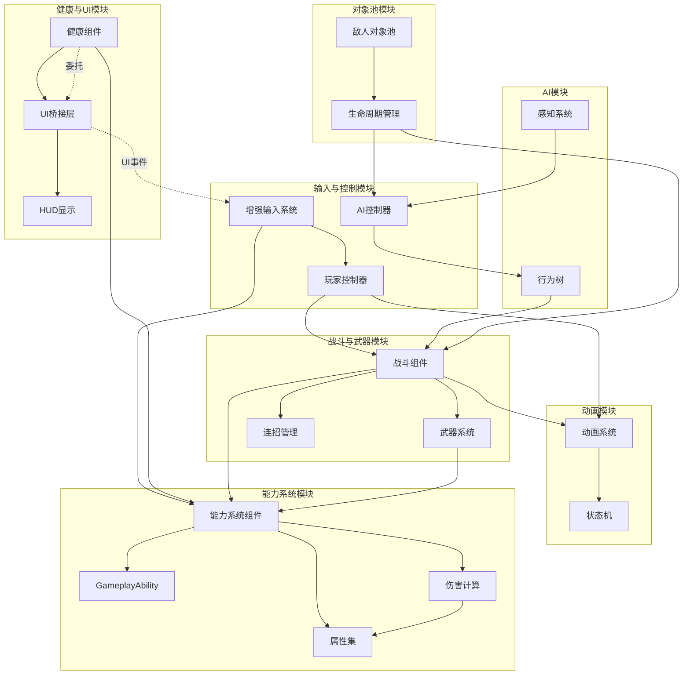

# 整体模块化架构图

**图 整体模块化架构图**

## 模块交互说明

### 1. 输入与控制流
- **玩家输入**：增强输入系统 → 玩家控制器 → 动画系统/战斗组件
- **能力输入**：增强输入系统 → 能力系统组件（通过GameplayTag）
- **AI控制**：感知系统 → AI控制器 → 行为树 → 战斗组件

### 2. 动画驱动流
- **移动动画**：玩家控制器 → 动画系统 → 状态机
- **战斗动画**：战斗组件 → 动画系统 → Linked Anim Layers

### 3. 健康与UI流
- **数据监听**：健康组件 → UI桥接层（委托） → HUD显示
- **属性同步**：健康组件 ↔ 能力系统组件（属性集）
- **输入屏蔽**：UI事件 → 输入系统（通过CommonUI输入路由）

### 4. 战斗与能力流
- **攻击触发**：战斗组件 → 武器系统 → 能力系统
- **连招管理**：战斗组件 → 连招管理 → 能力系统
- **伤害计算**：能力系统 → 伤害计算 → 属性集

### 5. 对象池管理流
- **敌人激活**：对象池 → 生命周期管理 → 战斗组件/AI控制器
- **敌人回收**：健康组件（死亡） → 对象池 → 生命周期管理

## 通信机制

### 动态多播委托
- 健康状态变化：`OnHealthChanged`
- UI数据更新：`OnHealthChangedForUI`
- 武器命中事件：`OnHitTargetActor`

### GameplayTag系统
- 输入标签：`Input.Move`、`Input.LightAttack`、`Input.HeavyAttack`
- 能力标签：`Ability.EquipSword`、`Ability.Fireball`
- 状态标签：`State.Attacking`、`State.Dead`

### 接口交互
- `IPawnUIInterface`：UI数据访问接口
- `IPawnCombatInterface`：战斗组件访问接口
- `IPawnDeathInterface`：死亡事件接口
