# RPG 项目核心系统设计文档 v1.0

> 基于 Lyra (Warrior) 架构的第三人称动作 RPG 游戏，采用 GAS (Gameplay Ability System) 驱动的战斗系统。

---

## 一、项目架构总览

### 1.1 整体架构分层图

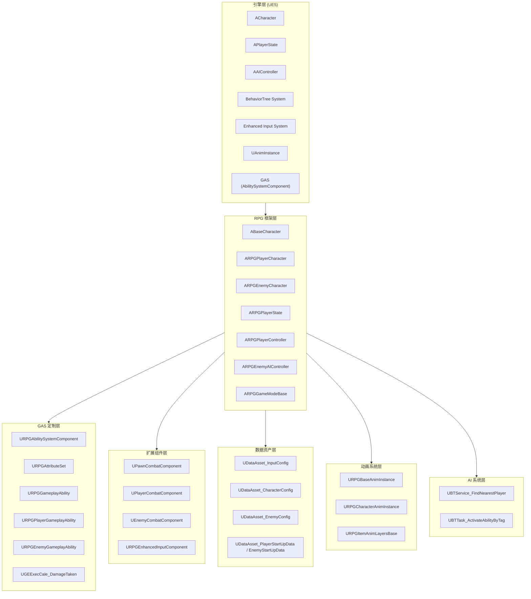
```mermaid
graph TB
    subgraph Engine["引擎层 (UE5)"]
        Character["ACharacter"]
        PlayerState["APlayerState"]
        AIController["AAIController"]
        BehaviorTree["BehaviorTree System"]
        EnhancedInput["Enhanced Input System"]
        AnimInstance["UAnimInstance"]
        GAS["GAS (AbilitySystemComponent)"]
    end

    subgraph Framework["RPG 框架层"]
        BaseCharacter["ABaseCharacter"]
        PlayerChar["ARPGPlayerCharacter"]
        EnemyChar["ARPGEnemyCharacter"]
        PlayerState_RPG["ARPGPlayerState"]
        PlayerCtrl["ARPGPlayerController"]
        EnemyCtrl["ARPGEnemyAIController"]
        GameMode["ARPGGameModeBase"]
    end

    subgraph GAS_Custom["GAS 定制层"]
        ASC["URPGAbilitySystemComponent"]
        AttrSet["URPGAttributeSet"]
        GA_Base["URPGGameplayAbility"]
        GA_Player["URPGPlayerGameplayAbility"]
        GA_Enemy["URPGEnemyGameplayAbility"]
        ExecCalc["UGEExecCale_DamageTaken"]
    end

    subgraph Component["扩展组件层"]
        PawnCombat["UPawnCombatComponent"]
        PlayerCombat["UPlayerCombatComponent"]
        EnemyCombat["UEnemyCombatComponent"]
        InputComp["URPGEnhancedInputComponent"]
    end

    subgraph DataAsset["数据资产层"]
        InputConfig["UDataAsset_InputConfig"]
        CharConfig["UDataAsset_CharacterConfig"]
        EnemyCfg["UDataAsset_EnemyConfig"]
        StartupData["UDataAsset_PlayerStartUpData / EnemyStartUpData"]
    end

    subgraph Animation["动画系统层"]
        BaseAnim["URPGBaseAnimInstance"]
        CharAnim["URPGCharacterAnimInstance"]
        ItemLayer["URPGItemAnimLayersBase"]
    end

    subgraph AI_System["AI 系统层"]
        BTService["UBTService_FindNearestPlayer"]
        BTTask["UBTTask_ActivateAbilityByTag"]
    end

    Engine --> Framework
    Framework --> GAS_Custom
    Framework --> Component
    Framework --> DataAsset
    Framework --> Animation
    Framework --> AI_System
```

### 1.2 核心模块依赖关系

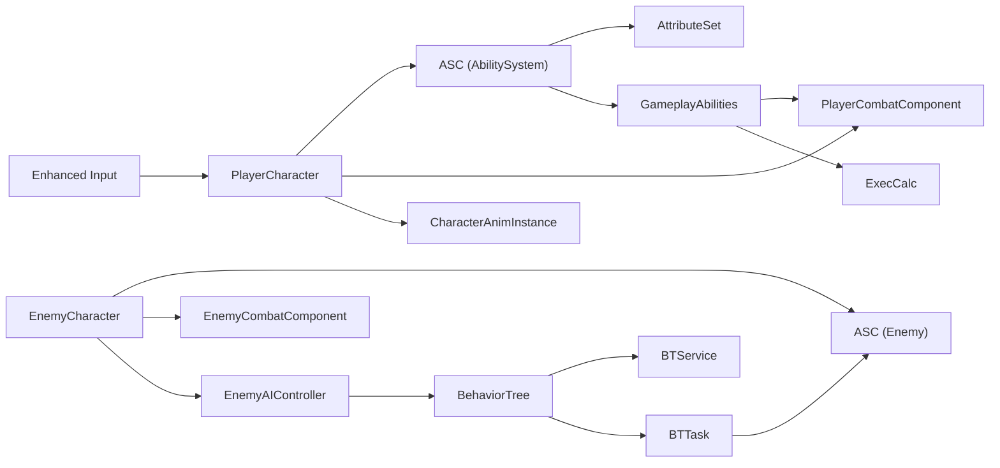
```mermaid
graph LR
    Input["Enhanced Input"] --> PlayerCharacter
    PlayerCharacter --> ASC["ASC (AbilitySystem)"]
    PlayerCharacter --> PlayerCombat["PlayerCombatComponent"]
    PlayerCharacter --> CharAnim["CharacterAnimInstance"]
    
    ASC --> AttributeSet
    ASC --> GA["GameplayAbilities"]
    GA --> PlayerCombat
    GA --> ExecCalc
    
    EnemyCharacter --> ASC_Enemy["ASC (Enemy)"]
    EnemyCharacter --> EnemyCombat["EnemyCombatComponent"]
    EnemyCharacter --> EnemyAI["EnemyAIController"]
    EnemyAI --> BehaviorTree
    BehaviorTree --> BTService
    BehaviorTree --> BTTask
    BTTask --> ASC_Enemy
```

---

## 二、角色系统 (Character System)

### 2.1 角色类图

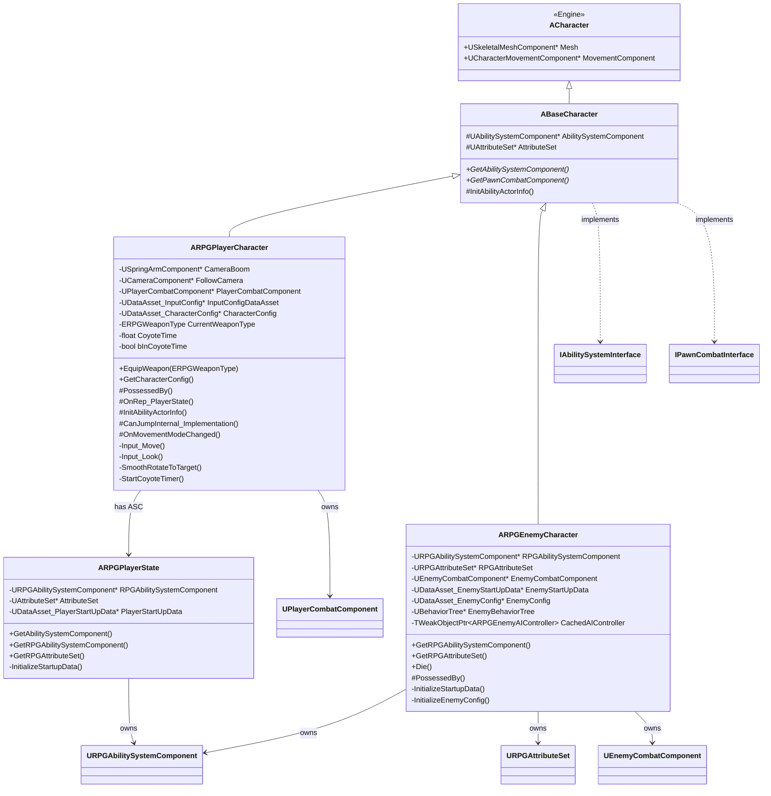
```mermaid
classDiagram
    class ACharacter {
        <<Engine>>
        +USkeletalMeshComponent* Mesh
        +UCharacterMovementComponent* MovementComponent
    }

    class ABaseCharacter {
        #UAbilitySystemComponent* AbilitySystemComponent
        #UAttributeSet* AttributeSet
        +GetAbilitySystemComponent()*
        +GetPawnCombatComponent()*
        #InitAbilityActorInfo()
    }

    class ARPGPlayerCharacter {
        -USpringArmComponent* CameraBoom
        -UCameraComponent* FollowCamera
        -UPlayerCombatComponent* PlayerCombatComponent
        -UDataAsset_InputConfig* InputConfigDataAsset
        -UDataAsset_CharacterConfig* CharacterConfig
        -ERPGWeaponType CurrentWeaponType
        -float CoyoteTime
        -bool bInCoyoteTime
        +EquipWeapon(ERPGWeaponType)
        +GetCharacterConfig()
        #PossessedBy()
        #OnRep_PlayerState()
        #InitAbilityActorInfo()
        #CanJumpInternal_Implementation()
        #OnMovementModeChanged()
        -Input_Move()
        -Input_Look()
        -SmoothRotateToTarget()
        -StartCoyoteTimer()
    }

    class ARPGEnemyCharacter {
        -URPGAbilitySystemComponent* RPGAbilitySystemComponent
        -URPGAttributeSet* RPGAttributeSet
        -UEnemyCombatComponent* EnemyCombatComponent
        -UDataAsset_EnemyStartUpData* EnemyStartUpData
        -UDataAsset_EnemyConfig* EnemyConfig
        -UBehaviorTree* EnemyBehaviorTree
        -TWeakObjectPtr~ARPGEnemyAIController~ CachedAIController
        +GetRPGAbilitySystemComponent()
        +GetRPGAttributeSet()
        +Die()
        #PossessedBy()
        -InitializeStartupData()
        -InitializeEnemyConfig()
    }

    class ARPGPlayerState {
        -URPGAbilitySystemComponent* RPGAbilitySystemComponent
        -UAttributeSet* AttributeSet
        -UDataAsset_PlayerStartUpData* PlayerStartUpData
        +GetAbilitySystemComponent()
        +GetRPGAbilitySystemComponent()
        +GetRPGAttributeSet()
        -InitializeStartupData()
    }

    ACharacter <|-- ABaseCharacter
    ABaseCharacter <|-- ARPGPlayerCharacter
    ABaseCharacter <|-- ARPGEnemyCharacter
    ABaseCharacter ..> IAbilitySystemInterface : implements
    ABaseCharacter ..> IPawnCombatInterface : implements
    
    ARPGPlayerCharacter --> ARPGPlayerState : has ASC
    ARPGPlayerCharacter --> UPlayerCombatComponent : owns
    ARPGEnemyCharacter --> URPGAbilitySystemComponent : owns
    ARPGEnemyCharacter --> URPGAttributeSet : owns
    ARPGEnemyCharacter --> UEnemyCombatComponent : owns
    ARPGPlayerState --> URPGAbilitySystemComponent : owns
```

### 2.2 角色初始化流程

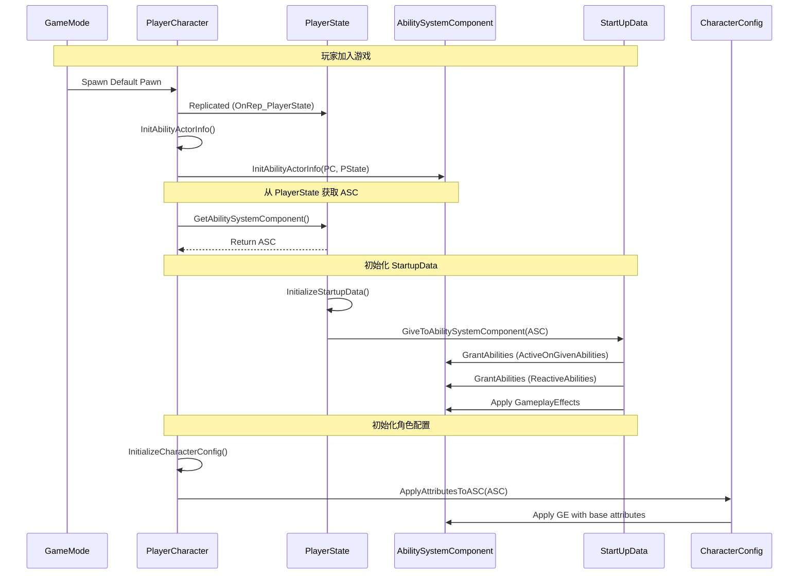
```mermaid
sequenceDiagram
    participant GM as GameMode
    participant PC as PlayerCharacter
    participant PState as PlayerState
    participant ASC as AbilitySystemComponent
    participant Startup as StartUpData

    Note over GM,Startup: 玩家加入游戏
    GM->>PC: Spawn Default Pawn
    PC->>PState: Replicated (OnRep_PlayerState)
    PC->>PC: InitAbilityActorInfo()
    PC->>ASC: InitAbilityActorInfo(PC, PState)
    
    Note over PC,ASC: 从 PlayerState 获取 ASC
    PC->>PState: GetAbilitySystemComponent()
    PState-->>PC: Return ASC
    
    Note over PC,Startup: 初始化 StartupData
    PState->>PState: InitializeStartupData()
    PState->>Startup: GiveToAbilitySystemComponent(ASC)
    Startup->>ASC: GrantAbilities (ActiveOnGivenAbilities)
    Startup->>ASC: GrantAbilities (ReactiveAbilities)
    Startup->>ASC: Apply GameplayEffects
    
    Note over PC,Startup: 初始化角色配置
    PC->>PC: InitializeCharacterConfig()
    PC->>CharacterConfig: ApplyAttributesToASC(ASC)
    CharacterConfig->>ASC: Apply GE with base attributes
```

### 2.3 敌人初始化流程

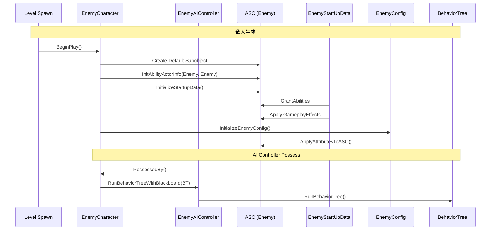
```mermaid
sequenceDiagram
    participant Level as Level Spawn
    participant Enemy as EnemyCharacter
    participant AICtrl as EnemyAIController
    participant ASC as ASC (Enemy)
    participant Startup as EnemyStartUpData
    participant Config as EnemyConfig
    participant BT as BehaviorTree

    Note over Level,BT: 敌人生成
    Level->>Enemy: BeginPlay()
    Enemy->>ASC: Create Default Subobject
    Enemy->>ASC: InitAbilityActorInfo(Enemy, Enemy)
    
    Enemy->>ASC: InitializeStartupData()
    Startup->>ASC: GrantAbilities
    Startup->>ASC: Apply GameplayEffects
    
    Enemy->>Config: InitializeEnemyConfig()
    Config->>ASC: ApplyAttributesToASC()
    
    Note over Enemy,BT: AI Controller Possess
    AICtrl->>Enemy: PossessedBy()
    Enemy->>AICtrl: RunBehaviorTreeWithBlackboard(BT)
    AICtrl->>BT: RunBehaviorTree()
```

### 2.4 网络同步策略

| 组件 | 所属 Actor | 同步方式 | 原因 |
|------|-----------|---------|------|
| ASC | PlayerState | 始终同步 | 玩家数据持久化，跨 Level 保留 |
| AttributeSet | PlayerState | Replicated | 属性变更自动同步到客户端 |
| ASC | EnemyCharacter | 始终同步 | 敌人生命周期短，跟随 Character |
| AttributeSet | EnemyCharacter | Replicated | 敌人属性同步 |
| CombatComponent | Character | 始终同步 | 战斗状态需要客户端预测 |

---

## 三、输入系统 (Input System)

### 3.1 输入系统架构图

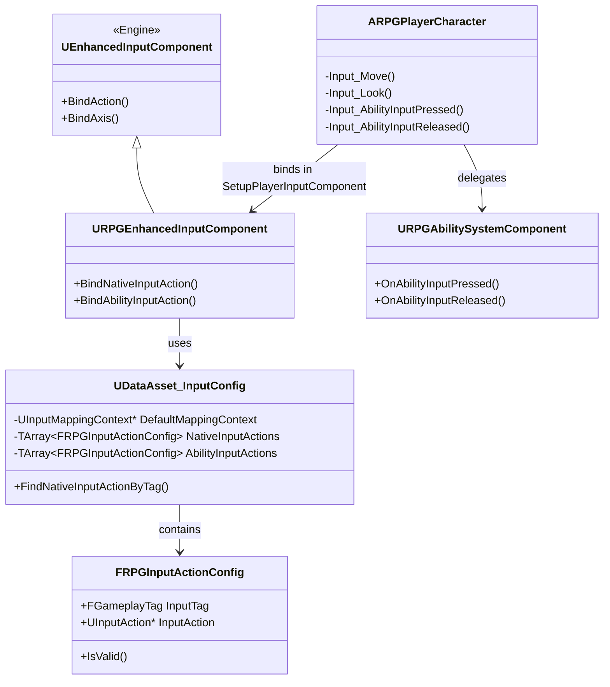
```mermaid
classDiagram
    class UEnhancedInputComponent {
        <<Engine>>
        +BindAction()
        +BindAxis()
    }

    class URPGEnhancedInputComponent {
        +BindNativeInputAction()
        +BindAbilityInputAction()
    }

    class UDataAsset_InputConfig {
        -UInputMappingContext* DefaultMappingContext
        -TArray~FRPGInputActionConfig~ NativeInputActions
        -TArray~FRPGInputActionConfig~ AbilityInputActions
        +FindNativeInputActionByTag()
    }

    class FRPGInputActionConfig {
        +FGameplayTag InputTag
        +UInputAction* InputAction
        +IsValid()
    }

    class ARPGPlayerCharacter {
        -Input_Move()
        -Input_Look()
        -Input_AbilityInputPressed()
        -Input_AbilityInputReleased()
    }

    class URPGAbilitySystemComponent {
        +OnAbilityInputPressed()
        +OnAbilityInputReleased()
    }

    UEnhancedInputComponent <|-- URPGEnhancedInputComponent
    URPGEnhancedInputComponent --> UDataAsset_InputConfig : uses
    UDataAsset_InputConfig --> FRPGInputActionConfig : contains
    ARPGPlayerCharacter --> URPGEnhancedInputComponent : binds in SetupPlayerInputComponent
    ARPGPlayerCharacter --> URPGAbilitySystemComponent : delegates
```

### 3.2 输入绑定与处理流程

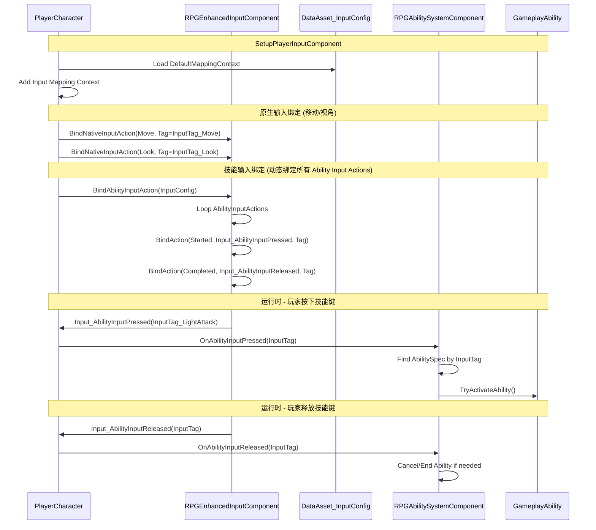
```mermaid
sequenceDiagram
    participant PC as PlayerCharacter
    participant InputComp as RPGEnhancedInputComponent
    participant InputCfg as DataAsset_InputConfig
    participant ASC as RPGAbilitySystemComponent
    participant GA as GameplayAbility

    Note over PC,GA: SetupPlayerInputComponent
    PC->>InputCfg: Load DefaultMappingContext
    PC->>PC: Add Input Mapping Context
    
    Note over PC,GA: 原生输入绑定 (移动/视角)
    PC->>InputComp: BindNativeInputAction(Move, Tag=InputTag_Move)
    PC->>InputComp: BindNativeInputAction(Look, Tag=InputTag_Look)
    
    Note over PC,GA: 技能输入绑定 (动态绑定所有 Ability Input Actions)
    PC->>InputComp: BindAbilityInputAction(InputConfig)
    InputComp->>InputComp: Loop AbilityInputActions
    InputComp->>InputComp: BindAction(Started, Input_AbilityInputPressed, Tag)
    InputComp->>InputComp: BindAction(Completed, Input_AbilityInputReleased, Tag)

    Note over PC,GA: 运行时 - 玩家按下技能键
    InputComp->>PC: Input_AbilityInputPressed(InputTag_LightAttack)
    PC->>ASC: OnAbilityInputPressed(InputTag)
    ASC->>ASC: Find AbilitySpec by InputTag
    ASC->>GA: TryActivateAbility()
    
    Note over PC,GA: 运行时 - 玩家释放技能键
    InputComp->>PC: Input_AbilityInputReleased(InputTag)
    PC->>ASC: OnAbilityInputReleased(InputTag)
    ASC->>ASC: Cancel/End Ability if needed
```

### 3.3 输入配置数据资产

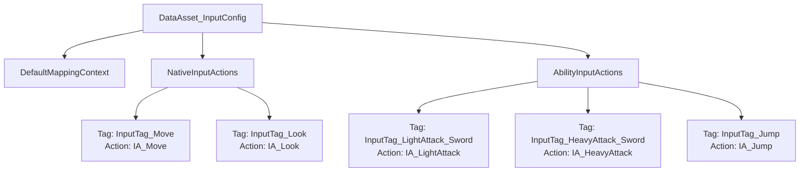
```mermaid
graph TB
    InputConfig["DataAsset_InputConfig"]
    InputConfig --> DMC["DefaultMappingContext"]
    InputConfig --> NativeActions["NativeInputActions"]
    InputConfig --> AbilityActions["AbilityInputActions"]
    
    NativeActions --> Move["Tag: InputTag_Move<br/>Action: IA_Move"]
    NativeActions --> Look["Tag: InputTag_Look<br/>Action: IA_Look"]
    
    AbilityActions --> LightAtk["Tag: InputTag_LightAttack_Sword<br/>Action: IA_LightAttack"]
    AbilityActions --> HeavyAtk["Tag: InputTag_HeavyAttack_Sword<br/>Action: IA_HeavyAttack"]
    AbilityActions --> Jump["Tag: InputTag_Jump<br/>Action: IA_Jump"]
```

---

## 四、GAS 技能系统 (Gameplay Ability System)

### 4.1 GAS 类图

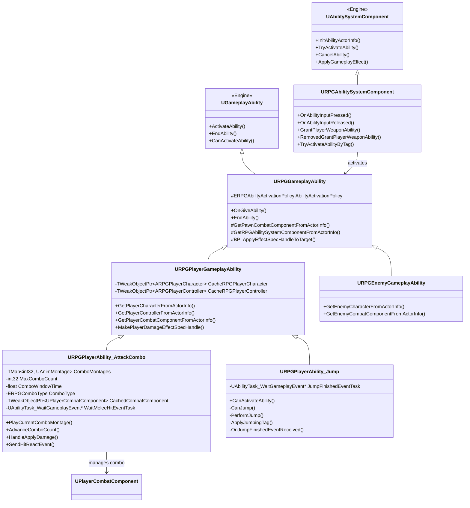
```mermaid
classDiagram
    class UAbilitySystemComponent {
        <<Engine>>
        +InitAbilityActorInfo()
        +TryActivateAbility()
        +CancelAbility()
        +ApplyGameplayEffect()
    }

    class URPGAbilitySystemComponent {
        +OnAbilityInputPressed()
        +OnAbilityInputReleased()
        +GrantPlayerWeaponAbility()
        +RemovedGrantPlayerWeaponAbility()
        +TryActivateAbilityByTag()
    }

    class UGameplayAbility {
        <<Engine>>
        +ActivateAbility()
        +EndAbility()
        +CanActivateAbility()
    }

    class URPGGameplayAbility {
        #ERPGAbilityActivationPolicy AbilityActivationPolicy
        +OnGiveAbility()
        +EndAbility()
        #GetPawnCombatComponentFromActorInfo()
        #GetRPGAbilitySystemComponentFromActorInfo()
        #BP_ApplyEffectSpecHandleToTarget()
    }

    class URPGPlayerGameplayAbility {
        +GetPlayerCharacterFromActorInfo()
        +GetPlayerControllerFromActorInfo()
        +GetPlayerCombatComponentFromActorInfo()
        +MakePlayerDamageEffectSpecHandle()
        -TWeakObjectPtr~ARPGPlayerCharacter~ CacheRPGPlayerCharacter
        -TWeakObjectPtr~ARPGPlayerController~ CacheRPGPlayerController
    }

    class URPGEnemyGameplayAbility {
        +GetEnemyCharacterFromActorInfo()
        +GetEnemyCombatComponentFromActorInfo()
    }

    class URPGPlayerAbility_AttackCombo {
        -TMap~int32, UAnimMontage~ ComboMontages
        -int32 MaxComboCount
        -float ComboWindowTime
        -ERPGComboType ComboType
        -TWeakObjectPtr~UPlayerCombatComponent~ CachedCombatComponent
        -UAbilityTask_WaitGameplayEvent* WaitMeleeHitEventTask
        +PlayCurrentComboMontage()
        +AdvanceComboCount()
        +HandleApplyDamage()
        +SendHitReactEvent()
    }

    class URPGPlayerAbility_Jump {
        -UAbilityTask_WaitGameplayEvent* JumpFinishedEventTask
        +CanActivateAbility()
        -CanJump()
        -PerformJump()
        -ApplyJumpingTag()
        -OnJumpFinishedEventReceived()
    }

    UAbilitySystemComponent <|-- URPGAbilitySystemComponent
    UGameplayAbility <|-- URPGGameplayAbility
    URPGGameplayAbility <|-- URPGPlayerGameplayAbility
    URPGGameplayAbility <|-- URPGEnemyGameplayAbility
    URPGPlayerGameplayAbility <|-- URPGPlayerAbility_AttackCombo
    URPGPlayerGameplayAbility <|-- URPGPlayerAbility_Jump
    
    URPGAbilitySystemComponent --> URPGGameplayAbility : activates
    URPGPlayerAbility_AttackCombo --> UPlayerCombatComponent : manages combo
```

### 4.2 AttributeSet 属性系统

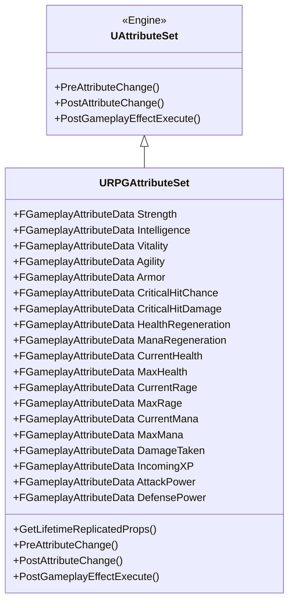
```mermaid
classDiagram
    class UAttributeSet {
        <<Engine>>
        +PreAttributeChange()
        +PostAttributeChange()
        +PostGameplayEffectExecute()
    }

    class URPGAttributeSet {
        +FGameplayAttributeData Strength
        +FGameplayAttributeData Intelligence
        +FGameplayAttributeData Vitality
        +FGameplayAttributeData Agility
        +FGameplayAttributeData Armor
        +FGameplayAttributeData CriticalHitChance
        +FGameplayAttributeData CriticalHitDamage
        +FGameplayAttributeData HealthRegeneration
        +FGameplayAttributeData ManaRegeneration
        +FGameplayAttributeData CurrentHealth
        +FGameplayAttributeData MaxHealth
        +FGameplayAttributeData CurrentRage
        +FGameplayAttributeData MaxRage
        +FGameplayAttributeData CurrentMana
        +FGameplayAttributeData MaxMana
        +FGameplayAttributeData DamageTaken
        +FGameplayAttributeData IncomingXP
        +FGameplayAttributeData AttackPower
        +FGameplayAttributeData DefensePower
        +GetLifetimeReplicatedProps()
        +PreAttributeChange()
        +PostAttributeChange()
        +PostGameplayEffectExecute()
    }

    UAttributeSet <|-- URPGAttributeSet
```

### 4.3 属性分类

| 类别 | 属性 | 用途 |
|------|------|------|
| **主属性 (Primary)** | Strength, Intelligence, Vitality, Agility | 核心战斗能力，派生次要属性 |
| **次要属性 (Secondary)** | Armor, CriticalHitChance, CriticalHitDamage, HealthRegeneration, ManaRegeneration | 进阶战斗特性 |
| **核心属性 (Vital)** | CurrentHealth/MaxHealth, CurrentMana/MaxMana, CurrentRage/MaxRage | 生存与资源管理 |
| **元属性 (Meta)** | DamageTaken, IncomingXP, AttackPower, DefensePower | 临时计算、事件传递 |

### 4.4 连招系统流程图

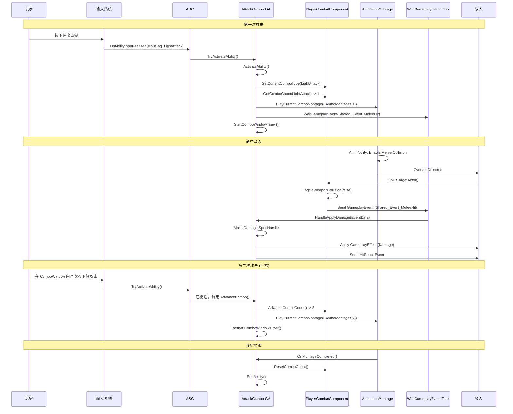
```mermaid
sequenceDiagram
    participant Player as 玩家
    participant Input as 输入系统
    participant ASC as ASC
    participant GA as AttackCombo GA
    participant Combat as PlayerCombatComponent
    participant Anim as AnimationMontage
    participant Event as WaitGameplayEvent Task
    participant Target as 敌人

    Note over Player,Target: 第一次攻击
    Player->>Input: 按下轻攻击键
    Input->>ASC: OnAbilityInputPressed(InputTag_LightAttack)
    ASC->>GA: TryActivateAbility()
    GA->>GA: ActivateAbility()
    GA->>Combat: SetCurrentComboType(LightAttack)
    GA->>Combat: GetComboCount(LightAttack) -> 1
    GA->>Anim: PlayCurrentComboMontage(ComboMontages[1])
    GA->>Event: WaitGameplayEvent(Shared_Event_MeleeHit)
    GA->>GA: StartComboWindowTimer()

    Note over Player,Target: 命中敌人
    Anim->>Anim: AnimNotify: Enable Melee Collision
    Anim->>Target: Overlap Detected
    Target->>Combat: OnHitTargetActor()
    Combat->>Combat: ToggleWeaponCollision(false)
    Combat->>Event: Send GameplayEvent (Shared_Event_MeleeHit)
    Event->>GA: HandleApplyDamage(EventData)
    GA->>GA: Make Damage SpecHandle
    GA->>Target: Apply GameplayEffect (Damage)
    GA->>Target: Send HitReact Event

    Note over Player,Target: 第二次攻击 (连招)
    Player->>Input: 在 ComboWindow 内再次按下轻攻击
    Input->>ASC: TryActivateAbility()
    ASC->>GA: 已激活，调用 AdvanceCombo()
    GA->>Combat: AdvanceComboCount() -> 2
    GA->>Anim: PlayCurrentComboMontage(ComboMontages[2])
    GA->>GA: Restart ComboWindowTimer()

    Note over Player,Target: 连招结束
    Anim->>GA: OnMontageCompleted()
    GA->>Combat: ResetComboCount()
    GA->>GA: EndAbility()
```

### 4.5 连招状态管理 (PlayerCombatComponent)

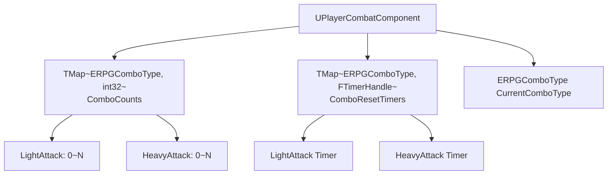
```mermaid
graph TB
    Combat["UPlayerCombatComponent"]
    Combat --> ComboMap["TMap~ERPGComboType, int32~<br/>ComboCounts"]
    Combat --> TimerMap["TMap~ERPGComboType, FTimerHandle~<br/>ComboResetTimers"]
    Combat --> CurrentType["ERPGComboType CurrentComboType"]
    
    ComboMap --> LightCount["LightAttack: 0~N"]
    ComboMap --> HeavyCount["HeavyAttack: 0~N"]
    
    TimerMap --> LightTimer["LightAttack Timer"]
    TimerMap --> HeavyTimer["HeavyAttack Timer"]
```

### 4.6 伤害计算系统 (UGEExecCale_DamageTaken)

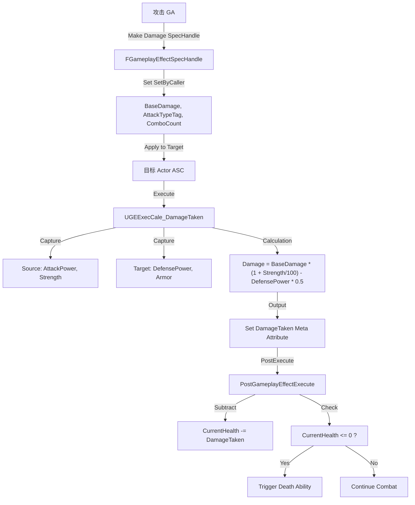
```mermaid
graph TB
    GA["攻击 GA"] -->|Make Damage SpecHandle| SpecHandle["FGameplayEffectSpecHandle"]
    SpecHandle -->|Set SetByCaller| SetByCaller["BaseDamage, AttackTypeTag, ComboCount"]
    SetByCaller -->|Apply to Target| Target["目标 Actor ASC"]
    Target -->|Execute| ExecCalc["UGEExecCale_DamageTaken"]
    ExecCalc -->|Capture| SourceAttrs["Source: AttackPower, Strength"]
    ExecCalc -->|Capture| TargetAttrs["Target: DefensePower, Armor"]
    ExecCalc -->|Calculation| DmgFormula["Damage = BaseDamage * (1 + Strength/100) - DefensePower * 0.5"]
    DmgFormula -->|Output| DamageTaken["Set DamageTaken Meta Attribute"]
    DamageTaken -->|PostExecute| PostExecute["PostGameplayEffectExecute"]
    PostExecute -->|Subtract| Health["CurrentHealth -= DamageTaken"]
    PostExecute -->|Check| DeathCheck["CurrentHealth <= 0 ?"]
    DeathCheck -->|Yes| Death["Trigger Death Ability"]
    DeathCheck -->|No| Continue["Continue Combat"]
```

### 4.7 装备系统 (武器切换)

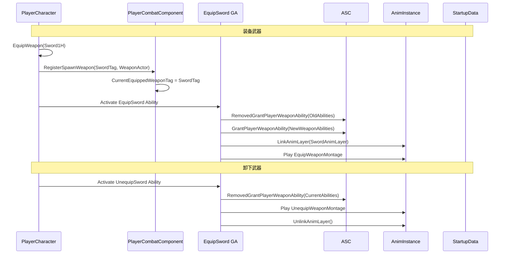
```mermaid
sequenceDiagram
    participant Player as PlayerCharacter
    participant Combat as PlayerCombatComponent
    participant GA as EquipSword GA
    participant ASC as ASC
    participant Anim as AnimInstance
    participant Startup as StartupData

    Note over Player,Startup: 装备武器
    Player->>Player: EquipWeapon(Sword1H)
    Player->>Combat: RegisterSpawnWeapon(SwordTag, WeaponActor)
    Combat->>Combat: CurrentEquippedWeaponTag = SwordTag
    
    Player->>GA: Activate EquipSword Ability
    GA->>ASC: RemovedGrantPlayerWeaponAbility(OldAbilities)
    GA->>ASC: GrantPlayerWeaponAbility(NewWeaponAbilities)
    GA->>Anim: LinkAnimLayer(SwordAnimLayer)
    GA->>Anim: Play EquipWeaponMontage
    
    Note over Player,Startup: 卸下武器
    Player->>GA: Activate UnequipSword Ability
    GA->>ASC: RemovedGrantPlayerWeaponAbility(CurrentAbilities)
    GA->>Anim: Play UnequipWeaponMontage
    GA->>Anim: UnlinkAnimLayer()
```

### 4.8 GAS 数据资产 - StartupData

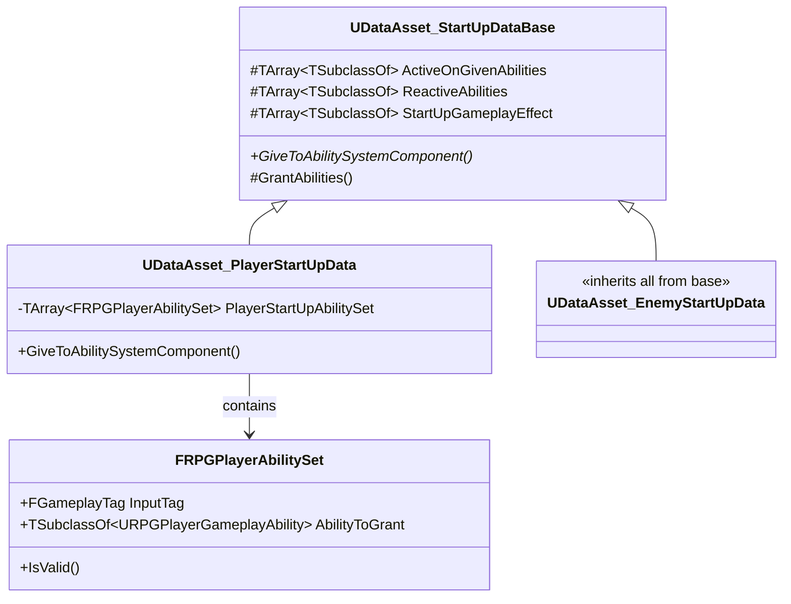
```mermaid
classDiagram
    class UDataAsset_StartUpDataBase {
        #TArray~TSubclassOf~ ActiveOnGivenAbilities
        #TArray~TSubclassOf~ ReactiveAbilities
        #TArray~TSubclassOf~ StartUpGameplayEffect
        +GiveToAbilitySystemComponent()*
        #GrantAbilities()
    }

    class UDataAsset_PlayerStartUpData {
        -TArray~FRPGPlayerAbilitySet~ PlayerStartUpAbilitySet
        +GiveToAbilitySystemComponent()
    }

    class FRPGPlayerAbilitySet {
        +FGameplayTag InputTag
        +TSubclassOf~URPGPlayerGameplayAbility~ AbilityToGrant
        +IsValid()
    }

    class UDataAsset_EnemyStartUpData {
        <<inherits all from base>>
    }

    UDataAsset_StartUpDataBase <|-- UDataAsset_PlayerStartUpData
    UDataAsset_StartUpDataBase <|-- UDataAsset_EnemyStartUpData
    UDataAsset_PlayerStartUpData --> FRPGPlayerAbilitySet : contains
```

---

## 五、战斗组件系统 (Combat Component System)

### 5.1 战斗组件继承体系

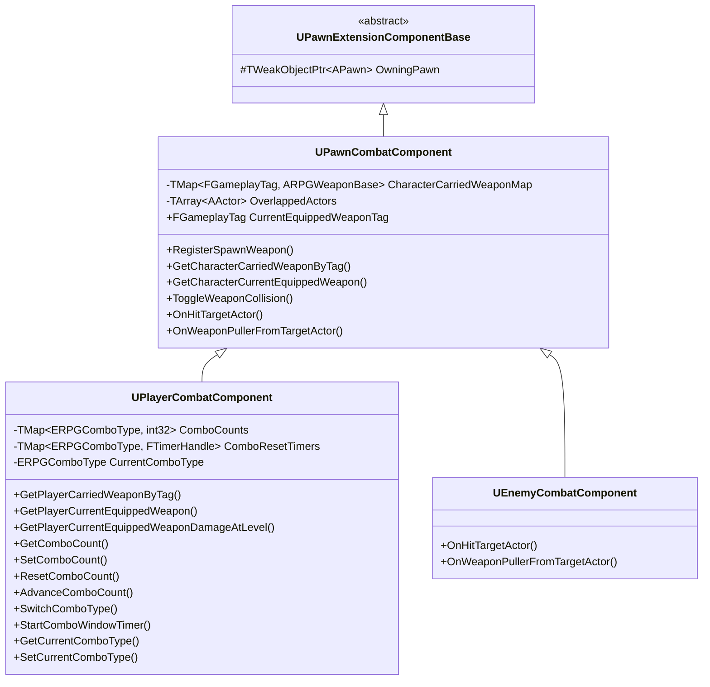
```mermaid
classDiagram
    class UPawnExtensionComponentBase {
        <<abstract>>
        #TWeakObjectPtr~APawn~ OwningPawn
    }

    class UPawnCombatComponent {
        -TMap~FGameplayTag, ARPGWeaponBase~ CharacterCarriedWeaponMap
        -TArray~AActor~ OverlappedActors
        +FGameplayTag CurrentEquippedWeaponTag
        +RegisterSpawnWeapon()
        +GetCharacterCarriedWeaponByTag()
        +GetCharacterCurrentEquippedWeapon()
        +ToggleWeaponCollision()
        +OnHitTargetActor()
        +OnWeaponPullerFromTargetActor()
    }

    class UPlayerCombatComponent {
        -TMap~ERPGComboType, int32~ ComboCounts
        -TMap~ERPGComboType, FTimerHandle~ ComboResetTimers
        -ERPGComboType CurrentComboType
        +GetPlayerCarriedWeaponByTag()
        +GetPlayerCurrentEquippedWeapon()
        +GetPlayerCurrentEquippedWeaponDamageAtLevel()
        +GetComboCount()
        +SetComboCount()
        +ResetComboCount()
        +AdvanceComboCount()
        +SwitchComboType()
        +StartComboWindowTimer()
        +GetCurrentComboType()
        +SetCurrentComboType()
    }

    class UEnemyCombatComponent {
        +OnHitTargetActor()
        +OnWeaponPullerFromTargetActor()
    }

    UPawnExtensionComponentBase <|-- UPawnCombatComponent
    UPawnCombatComponent <|-- UPlayerCombatComponent
    UPawnCombatComponent <|-- UEnemyCombatComponent
```

### 5.2 武器碰撞检测流程

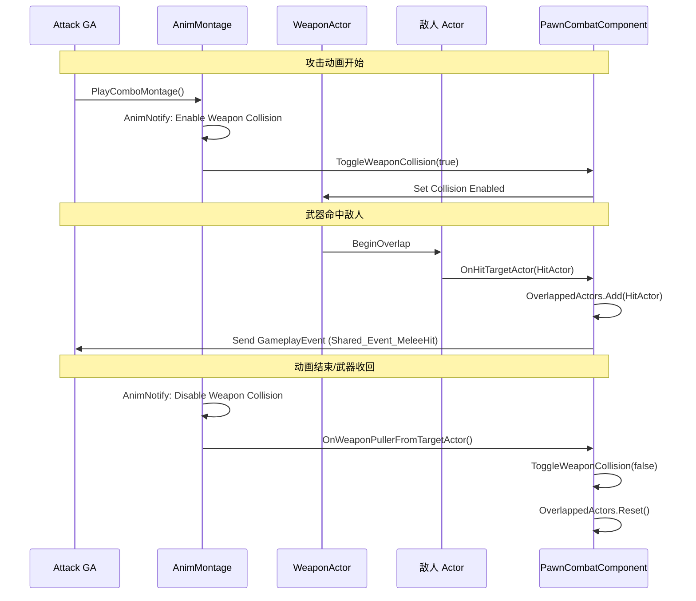
```mermaid
sequenceDiagram
    participant GA as Attack GA
    participant Anim as AnimMontage
    participant Weapon as WeaponActor
    participant Target as 敌人 Actor
    participant Combat as PawnCombatComponent

    Note over GA,Combat: 攻击动画开始
    GA->>Anim: PlayComboMontage()
    Anim->>Anim: AnimNotify: Enable Weapon Collision
    Anim->>Combat: ToggleWeaponCollision(true)
    Combat->>Weapon: Set Collision Enabled

    Note over GA,Combat: 武器命中敌人
    Weapon->>Target: BeginOverlap
    Target->>Combat: OnHitTargetActor(HitActor)
    Combat->>Combat: OverlappedActors.Add(HitActor)
    Combat->>GA: Send GameplayEvent (Shared_Event_MeleeHit)

    Note over GA,Combat: 动画结束/武器收回
    Anim->>Anim: AnimNotify: Disable Weapon Collision
    Anim->>Combat: OnWeaponPullerFromTargetActor()
    Combat->>Combat: ToggleWeaponCollision(false)
    Combat->>Combat: OverlappedActors.Reset()
```

---

## 六、动画系统 (Animation System)

### 6.1 动画实例类图

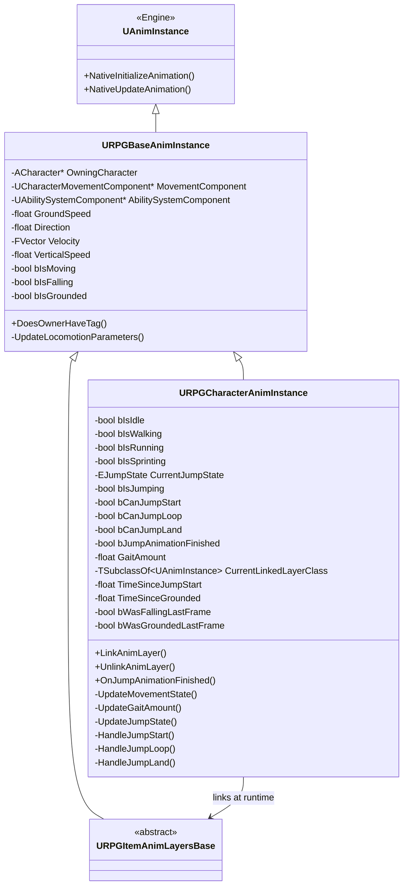
```mermaid
classDiagram
    class UAnimInstance {
        <<Engine>>
        +NativeInitializeAnimation()
        +NativeUpdateAnimation()
    }

    class URPGBaseAnimInstance {
        -ACharacter* OwningCharacter
        -UCharacterMovementComponent* MovementComponent
        -UAbilitySystemComponent* AbilitySystemComponent
        -float GroundSpeed
        -float Direction
        -FVector Velocity
        -float VerticalSpeed
        -bool bIsMoving
        -bool bIsFalling
        -bool bIsGrounded
        +DoesOwnerHaveTag()
        -UpdateLocomotionParameters()
    }

    class URPGCharacterAnimInstance {
        -bool bIsIdle
        -bool bIsWalking
        -bool bIsRunning
        -bool bIsSprinting
        -EJumpState CurrentJumpState
        -bool bIsJumping
        -bool bCanJumpStart
        -bool bCanJumpLoop
        -bool bCanJumpLand
        -bool bJumpAnimationFinished
        -float GaitAmount
        -TSubclassOf~UAnimInstance~ CurrentLinkedLayerClass
        -float TimeSinceJumpStart
        -float TimeSinceGrounded
        -bool bWasFallingLastFrame
        -bool bWasGroundedLastFrame
        +LinkAnimLayer()
        +UnlinkAnimLayer()
        +OnJumpAnimationFinished()
        -UpdateMovementState()
        -UpdateGaitAmount()
        -UpdateJumpState()
        -HandleJumpStart()
        -HandleJumpLoop()
        -HandleJumpLand()
    }

    class URPGItemAnimLayersBase {
        <<abstract>>
    }

    UAnimInstance <|-- URPGBaseAnimInstance
    URPGBaseAnimInstance <|-- URPGCharacterAnimInstance
    URPGBaseAnimInstance <|-- URPGItemAnimLayersBase
    
    URPGCharacterAnimInstance --> URPGItemAnimLayersBase : links at runtime
```

### 6.2 动画状态机流程

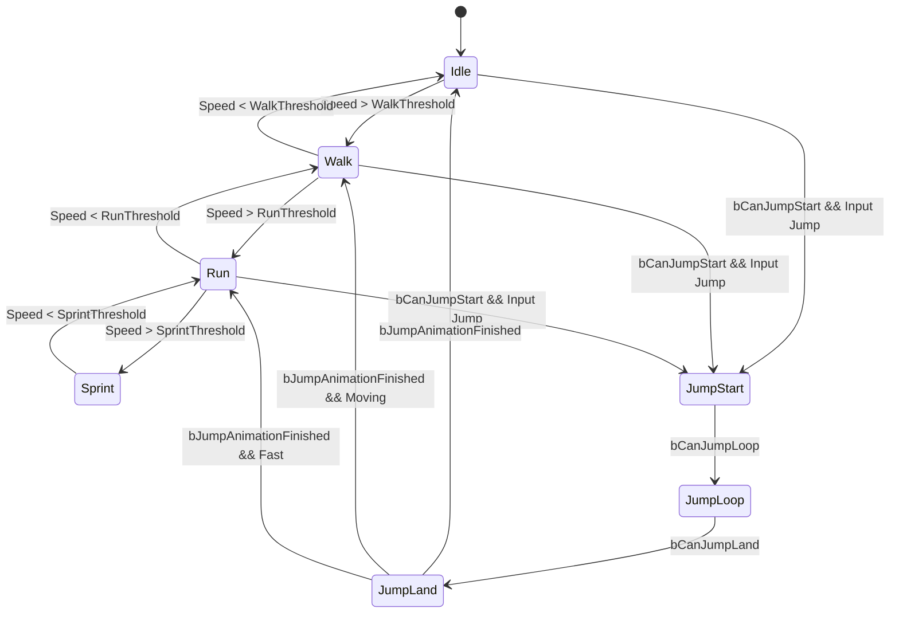
```mermaid
stateDiagram-v2
    [*] --> Idle
    
    Idle --> Walk: Speed > WalkThreshold
    Walk --> Run: Speed > RunThreshold
    Run --> Sprint: Speed > SprintThreshold
    
    Sprint --> Run: Speed < SprintThreshold
    Run --> Walk: Speed < RunThreshold
    Walk --> Idle: Speed < WalkThreshold
    
    Idle --> JumpStart: bCanJumpStart && Input Jump
    Walk --> JumpStart: bCanJumpStart && Input Jump
    Run --> JumpStart: bCanJumpStart && Input Jump
    
    JumpStart --> JumpLoop: bCanJumpLoop
    JumpLoop --> JumpLand: bCanJumpLand
    JumpLand --> Idle: bJumpAnimationFinished
    JumpLand --> Walk: bJumpAnimationFinished && Moving
    JumpLand --> Run: bJumpAnimationFinished && Fast
```

### 6.3 跳跃状态机

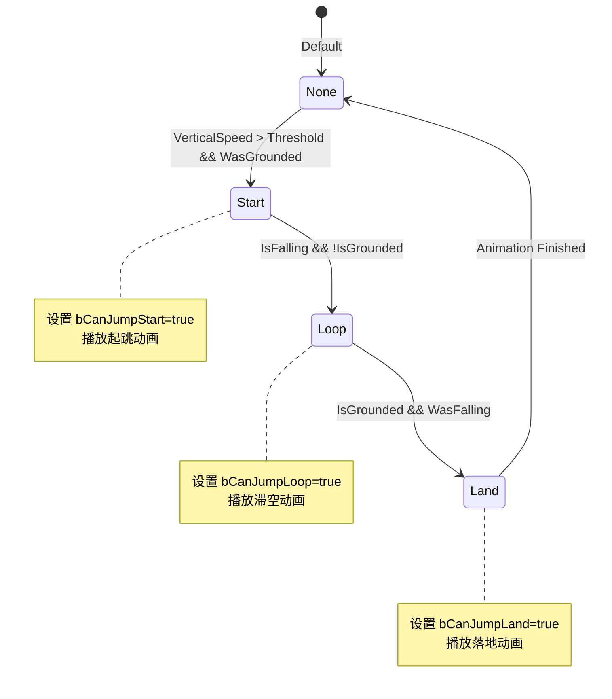
```mermaid
stateDiagram-v2
    [*] --> None: Default
    
    None --> Start: VerticalSpeed > Threshold && WasGrounded
    Start --> Loop: IsFalling && !IsGrounded
    Loop --> Land: IsGrounded && WasFalling
    
    Land --> None: Animation Finished
    
    note right of Start
        设置 bCanJumpStart=true
        播放起跳动画
    end note
    
    note right of Loop
        设置 bCanJumpLoop=true
        播放滞空动画
    end note
    
    note right of Land
        设置 bCanJumpLand=true
        播放落地动画
    end note
```

### 6.4 Linked Anim Layer 切换机制

```mermaid
sequenceDiagram
    participant Player as PlayerCharacter
    participant AnimInst as CharacterAnimInstance
    participant BaseLayer as BaseLayer (Locomotion)
    participant ItemLayer as ItemLayer (Weapon)

    Note over Player,ItemLayer: 装备武器
    Player->>Player: EquipWeapon(Sword1H)
    Player->>AnimInst: LinkAnimLayer(SwordAnimLayerClass)
    AnimInst->>AnimInst: CurrentLinkedLayerClass = SwordAnimLayerClass
    AnimInst->>BaseLayer: Add Linked Anim Layer
    BaseLayer->>ItemLayer: Create Instance
    
    Note over Player,ItemLayer: 切换武器
    Player->>AnimInst: LinkAnimLayer(StaffAnimLayerClass)
    AnimInst->>AnimInst: CurrentLinkedLayerClass = StaffAnimLayerClass
    AnimInst->>BaseLayer: Replace Linked Layer
    BaseLayer->>ItemLayer: Destroy Old Instance
    BaseLayer->>ItemLayer: Create New Instance
    
    Note over Player,ItemLayer: 卸下武器
    Player->>AnimInst: UnlinkAnimLayer()
    AnimInst->>BaseLayer: Remove Linked Layer
```

---

## 七、AI 系统 (Artificial Intelligence)

### 7.1 AI 系统类图

```mermaid
classDiagram
    class AAIController {
        <<Engine>>
        +RunBehaviorTree()
    }

    class ARPGEnemyAIController {
        -UBehaviorTreeComponent* BehaviorTreeComponent
        -UBlackboardComponent* BlackboardComp
        +RunBehaviorTreeWithBlackboard()
        +GetBehaviorTreeComponent()
    }

    class UBTService_FindNearestPlayer {
        -FBlackboardKeySelector TargetToFollowSelector
        -FBlackboardKeySelector DistanceToTargetSelector
        +TickNode()
    }

    class UBTTask_ActivateAbilityByTag {
        -FGameplayTag AbilityTag
        +ExecuteTask()
    }

    class ARPGEnemyCharacter {
        -UBehaviorTree* EnemyBehaviorTree
        -TWeakObjectPtr~ARPGEnemyAIController~ CachedAIController
        #PossessedBy()
        +Die()
    }

    AAIController <|-- ARPGEnemyAIController
    ARPGEnemyAIController --> UBehaviorTreeComponent : owns
    ARPGEnemyAIController --> UBlackboardComponent : owns
    ARPGEnemyCharacter --> ARPGEnemyAIController : possessed by
    ARPGEnemyCharacter --> UBehaviorTree : runs
    
    UBehaviorTree --> UBTService_FindNearestPlayer : contains
    UBehaviorTree --> UBTTask_ActivateAbilityByTag : contains
    UBTTask_ActivateAbilityByTag --> URPGAbilitySystemComponent : activates ability
```

### 7.2 行为树结构

```mermaid
graph TB
    Root["Root"] --> Selector_Main["Selector: Main Logic"]
    
    Selector_Main --> Sequence_Attack["Sequence: Attack Player"]
    Selector_Main --> Sequence_Patrol["Sequence: Patrol"]
    
    Sequence_Attack --> BTService_FindNearestPlayer["Service: FindNearestPlayer<br/>(持续更新目标与距离)"]
    Sequence_Attack --> Decorator_HasTarget["Decorator: Has Target?"]
    Decorator_HasTarget --> Selector_AttackType["Selector: Attack Type"]
    
    Selector_AttackType --> Decorator_MeleeRange["Decorator: In Melee Range?"]
    Decorator_MeleeRange --> BTTask_ActivateMelee["Task: ActivateAbility(Melee)"]
    
    Selector_AttackType --> Decorator_RangedRange["Decorator: In Ranged Range?"]
    Decorator_RangedRange --> BTTask_ActivateRanged["Task: ActivateAbility(Ranged)"]
    
    Sequence_Patrol --> BTTask_MoveTo["Task: MoveTo Patrol Point"]
```

### 7.3 AI 决策流程

```mermaid
sequenceDiagram
    participant BT as BehaviorTree
    participant Service as BTService_FindNearestPlayer
    participant BB as Blackboard
    participant AICtrl as EnemyAIController
    participant Enemy as EnemyCharacter
    participant Player as PlayerCharacter
    participant ASC as Enemy ASC
    participant GA as Enemy GA

    Note over BT,GA: BT Tick - 寻找玩家
    BT->>Service: TickNode()
    Service->>Service: Find Nearest Player (Overlap/Sphere Trace)
    Service->>BB: Set TargetActor = Player
    Service->>BB: Set DistanceToTarget
    
    Note over BT,GA: AI 决策攻击
    BT->>AICtrl: Execute BTTask_ActivateAbilityByTag
    AICtrl->>Enemy: Get AbilitySystemComponent
    Enemy->>ASC: TryActivateAbilityByTag(Enemy_Ability_Melee)
    ASC->>GA: Activate EnemyAttackCombo GA
    GA->>GA: PlayCurrentComboMontage()
    
    Note over BT,GA: 连招推进 (AI 驱动)
    GA->>GA: OnMontageCompleted()
    BT->>GA: AdvanceCombo()
    GA->>GA: PlayNextComboMontage()
```

---

## 八、数据驱动系统 (Data-Driven System)

### 8.1 DataAsset 体系图

```mermaid
classDiagram
    class UDataAsset {
        <<Engine>>
    }

    class UDataAsset_InputConfig {
        -UInputMappingContext* DefaultMappingContext
        -TArray~FRPGInputActionConfig~ NativeInputActions
        -TArray~FRPGInputActionConfig~ AbilityInputActions
        +FindNativeInputActionByTag()
    }

    class UDataAsset_StartUpDataBase {
        #TArray~TSubclassOf~ ActiveOnGivenAbilities
        #TArray~TSubclassOf~ ReactiveAbilities
        #TArray~TSubclassOf~ StartUpGameplayEffect
        +GiveToAbilitySystemComponent()
    }

    class UDataAsset_PlayerStartUpData {
        -TArray~FRPGPlayerAbilitySet~ PlayerStartUpAbilitySet
        +GiveToAbilitySystemComponent()
    }

    class UDataAsset_EnemyStartUpData {
        <<inherits from base>>
    }

    class UDataAsset_CharacterConfig {
        -FName CharacterName
        -ERPGCharacterClass CharacterClass
        -FText CharacterDescription
        -FCharacterBaseAttributes BaseAttributes
        +ApplyAttributesToASC()
    }

    class UDataAsset_EnemyConfig {
        -FName EnemyName
        -EEnemyType EnemyType
        -FText EnemyDescription
        -FEnemyBaseAttributes BaseAttributes
        +ApplyAttributesToASC()
    }

    UDataAsset <|-- UDataAsset_InputConfig
    UDataAsset <|-- UDataAsset_StartUpDataBase
    UDataAsset_StartUpDataBase <|-- UDataAsset_PlayerStartUpData
    UDataAsset_StartUpDataBase <|-- UDataAsset_EnemyStartUpData
    UDataAsset <|-- UDataAsset_CharacterConfig
    UDataAsset <|-- UDataAsset_EnemyConfig
```

### 8.2 DataAsset 职责对比

| DataAsset 类型 | 用途 | 应用时机 | 包含数据 |
|---------------|------|---------|---------|
| **InputConfig** | 输入映射配置 | Player BeginPlay | InputMappingContext, Native/Ability Input Actions |
| **PlayerStartUpData** | 玩家初始能力/G | PlayerState BeginPlay | Abilities, GameplayEffects |
| **EnemyStartUpData** | 敌人初始能力/G | Enemy BeginPlay | Abilities, GameplayEffects |
| **CharacterConfig** | 玩家角色属性 | Player Init | 主属性、次要属性、核心属性 |
| **EnemyConfig** | 敌人角色属性 | Enemy Init | HP、攻击力、防御力、抗性系统 |

### 8.3 配置数据流

```mermaid
graph LR
    Designer["策划配置"] --> InputConfig["InputConfig DA"]
    Designer --> StartupData["StartupData DA"]
    Designer --> CharacterConfig["CharacterConfig DA"]
    Designer --> EnemyConfig["EnemyConfig DA"]
    
    InputConfig --> Player["PlayerCharacter"]
    StartupData --> PlayerState["PlayerState"]
    StartupData --> Enemy["EnemyCharacter"]
    CharacterConfig --> PlayerState
    EnemyConfig --> Enemy
    
    PlayerState --> ASC["ASC"]
    Player --> ASC
    Enemy --> ASC_Enemy["ASC (Enemy)"]
```

---

## 九、Interface 接口系统

### 9.1 接口类图

```mermaid
classDiagram
    class IAbilitySystemInterface {
        <<Engine>>
        +GetAbilitySystemComponent()*
    }

    class IPawnCombatInterface {
        +GetPawnCombatComponent()*
    }

    class ABaseCharacter {
        +GetAbilitySystemComponent()
        +GetPawnCombatComponent()
    }

    class ARPGPlayerCharacter {
        +GetAbilitySystemComponent()
        +GetPawnCombatComponent()
    }

    class ARPGEnemyCharacter {
        +GetAbilitySystemComponent()
        +GetPawnCombatComponent()
    }

    IAbilitySystemInterface <|.. ABaseCharacter
    IPawnCombatInterface <|.. ABaseCharacter
    ABaseCharacter <|-- ARPGPlayerCharacter
    ABaseCharacter <|-- ARPGEnemyCharacter
```

### 9.2 接口使用场景

| 接口 | 实现者 | 调用者 | 用途 |
|------|-------|--------|------|
| **IAbilitySystemInterface** | BaseCharacter, PlayerState | GA, AI, UI | 统一获取 ASC |
| **IPawnCombatInterface** | PlayerCharacter, EnemyCharacter | GA, FunctionLibrary | 统一获取 CombatComponent |

---

## 十、GameplayTags 系统

### 10.1 Tag 分类体系

```
InputTag                    // 输入标签
  ├── Move
  ├── Look
  ├── EquipSword
  ├── UnequipSword
  ├── LightAttack_Sword
  ├── HeavyAttack_Sword
  ├── Roll
  └── Jump

Player                      // 玩家相关
  ├── Ability               // 玩家能力
  │   ├── Equip_Sword
  │   ├── Unequip_Sword
  │   ├── Attack_Light_Sword
  │   ├── Attack_Heavy_Sword
  │   ├── HitPause
  │   ├── Roll
  │   └── Jump
  ├── Weapon
  │   └── Sword
  ├── Event                 // 玩家事件
  │   ├── Equip_Sword
  │   ├── Unequip_Sword
  │   ├── HitPause
  │   └── Jump_Finished
  ├── Status                // 玩家状态
  │   ├── JumpToFinish
  │   ├── Jumping
  │   └── Rolling
  └── SetByCaller           // 动态参数
      ├── AttackType_Light
      └── AttackType_Heavy

Enemy                       // 敌人相关
  ├── Ability
  │   ├── Melee
  │   └── Ranged
  ├── Weapon
  └── Status
      ├── Strafing
      └── UnderAttack

Shared                      // 通用标签
  ├── Ability
  │   ├── HitReact
  │   └── Death
  ├── Event                 // 通用事件
  │   ├── MeleeHit
  │   ├── HitReact
  │   ├── ComboWindow_Open
  │   ├── ComboWindow_Close
  │   ├── Melee_CollisionEnable
  │   └── Melee_CollisionDisable
  ├── SetByCaller
  │   └── BaseDamage
  ├── Status
  │   ├── Dead
  │   └── HitReact_Direction
  │       ├── Front
  │       ├── Back
  │       ├── Left
  │       └── Right
```

---

## 十一、控制器系统 (Controller System)

### 11.1 控制器类图

```mermaid
classDiagram
    class AController {
        <<Engine>>
        +APawn* Pawn
    }

    class ARPGBaseController {
        <<abstract>>
    }

    class APlayerController {
        <<Engine>>
    }

    class ARPGPlayerController {
        -FGenericTeamId PlayerTeamId
        +GetGenericTeamId()
    }

    class AAIController {
        <<Engine>>
        +RunBehaviorTree()
    }

    class ARPGEnemyAIController {
        -UBehaviorTreeComponent* BehaviorTreeComponent
        -UBlackboardComponent* BlackboardComp
        +RunBehaviorTreeWithBlackboard()
        +GetBehaviorTreeComponent()
    }

    AController <|-- ARPGBaseController
    ARPGBaseController <|-- APlayerController
    APlayerController <|-- ARPGPlayerController
    
    AController <|-- AAIController
    AAIController <|-- ARPGEnemyAIController
```

### 11.2 团队系统

```mermaid
graph LR
    PlayerCtrl["ARPGPlayerController"] --> TeamId["FGenericTeamId = 0 (Friendly)"]
    EnemyCtrl["ARPGEnemyAIController"] --> TeamId_Enemy["FGenericTeamId = 1 (Hostile)"]
    
    PlayerCtrl --> PQS["Generic Team Interface"]
    EnemyCtrl --> PQS
    
    PQS --> IsHostile["IsTargetPawnHostile()"]
    IsHostile --> Result["TeamId != TargetTeamId"]
```

---

## 十二、完整战斗流程时序图

### 12.1 玩家攻击敌人完整流程

```mermaid
sequenceDiagram
    participant Player as 玩家输入
    participant Input as EnhancedInput
    participant PChar as PlayerCharacter
    participant ASC_P as Player ASC
    participant GA_P as Player Attack GA
    participant PCombat as PlayerCombatComponent
    participant Anim as AnimMontage
    participant Event as WaitGameplayEvent
    participant EChar as EnemyCharacter
    participant ECombat as EnemyCombatComponent
    participant ASC_E as Enemy ASC
    participant ExecCalc as GEExecCalc_DamageTaken
    participant HPAttr as AttributeSet.Health

    Player->>Input: Press Light Attack
    Input->>PChar: Input_AbilityInputPressed(InputTag_LightAttack)
    PChar->>ASC_P: OnAbilityInputPressed(InputTag)
    ASC_P->>GA_P: TryActivateAbility()
    
    GA_P->>GA_P: ActivateAbility()
    GA_P->>PCombat: SetCurrentComboType(LightAttack)
    GA_P->>PCombat: GetComboCount() -> 1
    GA_P->>Anim: PlayComboMontage[1]
    GA_P->>Event: WaitGameplayEvent(Shared_Event_MeleeHit)
    
    Anim->>Anim: AnimNotify: Enable Collision
    Anim->>EChar: Weapon Overlap
    EChar->>ECombat: OnHitTargetActor()
    ECombat->>GA_P: Send GameplayEvent (MeleeHit, Target=EChar)
    
    Event->>GA_P: HandleApplyDamage(EventData)
    GA_P->>GA_P: MakeDamageSpec(BaseDamage, AttackType, ComboCount)
    GA_P->>ASC_E: Apply GameplayEffect (Damage)
    
    ASC_E->>ExecCalc: Execute_Implementation()
    ExecCalc->>ExecCalc: Capture AttackPower, DefensePower
    ExecCalc->>ExecCalc: Calculate Final Damage
    ExecCalc->>HPAttr: Set DamageTaken
    ExecCalc->>HPAttr: CurrentHealth -= Damage
    
    HPAttr->>ASC_E: PostAttributeChange(Health)
    alt Health <= 0
        ASC_E->>GA_P: Activate Death Ability
        GA_P->>EChar: Die()
    else Health > 0
        ASC_E->>EChar: Apply HitReact
        EChar->>GA_P: Send HitReact Event
    end
    
    Anim->>Anim: Montage Completed
    Anim->>GA_P: OnMontageCompleted()
    GA_P->>PCombat: ResetComboCount()
    GA_P->>GA_P: EndAbility()
```

---

## 十三、土狼时间系统 (Coyote Time)

### 13.1 跳跃判定流程

```mermaid
graph TB
    Player["玩家按下跳跃键"] --> CanJump["CanJumpInternal()"]
    CanJump --> IsGrounded["IsGrounded()?"]
    IsGrounded -->|Yes| Jump["执行跳跃"]
    IsGrounded -->|No| InCoyote["bInCoyoteTime?"]
    
    InCoyote -->|Yes| Jump
    InCoyote -->|No| CannotJump["拒绝跳跃"]
    
    LeaveGround["离开地面"] --> OnMovementModeChanged["OnMovementModeChanged()"]
    OnMovementModeChanged --> StartTimer["StartCoyoteTimer()"]
    StartTimer --> CoyoteTime["CoyoteTime 秒后"]
    CoyoteTime --> Expire["OnCoyoteTimeExpired()"]
    Expire --> ResetCoyote["bInCoyoteTime = false"]
```

### 13.2 土狼时间时序图

```mermaid
sequenceDiagram
    participant Player as PlayerCharacter
    participant CMC as CharacterMovementComponent
    participant JumpGA as Jump Ability
    
    Player->>CMC: 离开地面
    CMC->>Player: OnMovementModeChanged(Falling)
    Player->>Player: StartCoyoteTimer()
    Player->>Player: bInCoyoteTime = true
    
    Note over Player,JumpGA: 土狼时间窗口内
    Player->>JumpGA: 按下跳跃键
    JumpGA->>Player: CanActivateAbility()
    Player->>Player: CanJumpInternal()
    Player->>Player: bInCoyoteTime == true -> Return true
    JumpGA->>JumpGA: PerformJump()
    
    Note over Player,JumpGA: 土狼时间到期
    Player->>Player: OnCoyoteTimeExpired()
    Player->>Player: bInCoyoteTime = false
```

---

## 十四、模块文件结构

```
Source/RPG/
├── Public/
│   ├── Character/                    // 角色系统
│   │   ├── BaseCharacter.h/cpp       // 角色基类
│   │   ├── RPGPlayerCharacter.h/cpp  // 玩家角色
│   │   ├── RPGPlayerState.h/cpp      // 玩家状态
│   │   └── RPGEnemyCharacter.h/cpp   // 敌人角色
│   │
│   ├── AbilitySystem/                // GAS 系统
│   │   ├── RPGAbilitySystemComponent.h/cpp
│   │   ├── RPGAttributeSet.h/cpp
│   │   └── Abilities/
│   │       ├── RPGGameplayAbility.h/cpp              // GA 基类
│   │       ├── RPGPlayerGameplayAbility.h/cpp        // 玩家 GA 基类
│   │       ├── RPGEnemyGameplayAbility.h/cpp         // 敌人 GA 基类
│   │       ├── Player/                               // 玩家技能
│   │       │   ├── RPGPlayerAbility_AttackCombo.h/cpp
│   │       │   ├── RPGPlayerAbility_Jump.h/cpp
│   │       │   ├── RPGPlayerAbility_EquipSword.h/cpp
│   │       │   ├── RPGPlayerAbility_UnequipSword.h/cpp
│   │       │   ├── RPGPlayerAbility_LightAttack.h/cpp
│   │       │   ├── RPGPlayerAbility_HeavyAttack.h/cpp
│   │       │   └── ...
│   │       ├── Enemy/                                // 敌人技能
│   │       │   ├── RPGAbility_EnemyAttackCombo.h/cpp
│   │       │   ├── RPGEnemyAbility_Melee1.h/cpp
│   │       │   ├── RPGEnemyAbility_Attack1.h/cpp
│   │       │   └── ...
│   │       ├── Share/                                // 通用技能
│   │       │   └── RPGShareAbility_SpawnWeapon.h/cpp
│   │       └── GEExecCale/                           // 伤害计算
│   │           └── GEExecCale_DamageTaken.h/cpp
│   │
│   ├── Component/                    // 扩展组件
│   │   ├── Combat/
│   │   │   ├── PawnCombatComponent.h/cpp
│   │   │   ├── PlayerCombatComponent.h/cpp
│   │   │   └── EnemyCombatComponent.h/cpp
│   │   ├── Input/
│   │   │   └── RPGEnhancedInputComponent.h
│   │   └── PawnExtensionComponentBase.h/cpp
│   │
│   ├── Animation/                    // 动画系统
│   │   └── AnimationInstances/
│   │       ├── RPGBaseAnimInstance.h/cpp
│   │       ├── RPGCharacterAnimInstance.h/cpp
│   │       ├── RPGItemAnimLayersBase.h/cpp
│   │       └── Enemy/
│   │           └── ...
│   │
│   ├── AI/                           // AI 系统
│   │   ├── Service/
│   │   │   └── BTService_FindNearestPlayer.h/cpp
│   │   └── Task/
│   │       └── BTTask_ActivateAbilityByTag.h/cpp
│   │
│   ├── Controllers/                  // 控制器
│   │   ├── RPGBaseController.h/cpp
│   │   ├── RPGPlayerController.h/cpp
│   │   ├── RPGEnemyAIController.h/cpp
│   │   └── Enemy/
│   │       └── ...
│   │
│   ├── DataAsset/                    // 数据资产
│   │   ├── Input/
│   │   │   └── DataAsset_InputConfig.h/cpp
│   │   ├── StartUpDate/
│   │   │   ├── DataAsset_StartUpDataBase.h/cpp
│   │   │   ├── DataAsset_PlayerStartUpData.h/cpp
│   │   │   └── DataAsset_EnemyStartUpData.h/cpp
│   │   └── Character/
│   │       ├── DataAsset_CharacterConfig.h/cpp
│   │       └── DataAsset_EnemyConfig.h/cpp
│   │
│   ├── Types/                        // 类型定义
│   │   ├── RPGEnumTypes.h            // 枚举类型
│   │   └── RPGStructTypes.h/cpp      // 结构体
│   │
│   ├── Interface/                    // 接口
│   │   └── PawnCombatInterface.h/cpp
│   │
│   ├── GameModes/                    // 游戏模式
│   │   └── RPGGameModeBase.h/cpp
│   │
│   ├── UI/                           // UI 系统 (待实现)
│   │   └── Subsystem/
│   │       └── RPGUIManagerSubsystem.h/cpp
│   │
│   ├── RPGGameplayTags.h/cpp         // GameplayTags
│   └── RPGFunctionLibrary.h/cpp      // 蓝图函数库
│
└── Private/
    └── [对应实现文件]
```

---

## 十五、设计原则与最佳实践

### 15.1 架构设计原则

1. **遵循 Lyra (Warrior) 架构**: 所有系统严格参照 Lyra 的项目结构与设计模式
2. **ASC 与 Character 分离**: 玩家 ASC 在 PlayerState，敌人 ASC 在 EnemyCharacter
3. **DataAsset 驱动配置**: 所有可调参数通过 DataAsset 配置，支持策划热更新
4. **Interface 解耦**: 通过 IAbilitySystemInterface 和 IPawnCombatInterface 统一访问
5. **Component 职责单一**: CombatComponent 只负责武器管理与命中检测，GA 负责技能逻辑

### 15.2 GAS 使用规范

| 场景 | 实现方式 | 原因 |
|------|---------|------|
| 玩家技能 | URPGPlayerGameplayAbility | 提供 PlayerCharacter/Controller/CombatComponent 快捷访问 |
| 敌人技能 | URPGEnemyGameplayAbility | 提供 EnemyCharacter/CombatComponent 快捷访问 |
| 伤害计算 | GEExecCale_DamageTaken | 执行期计算，支持复杂公式 |
| 属性初始化 | StartupData + CharacterConfig | 分离启动能力与基础属性 |
| 技能激活 | OnGive (Passive) / OnTriggered (Active) | 明确激活策略 |

### 15.3 网络同步策略

- **PlayerState 持久化**: 玩家 ASC 和 AttributeSet 在 PlayerState，跨 Level 保留
- **Replicated Using OnRep**: 所有关键属性都有 OnRep 回调，支持 UI 更新
- **GA 激活同步**: ASC 自动处理 GA 激活的网络同步
- **Montage 同步**: 使用 PlayMontageAndWait 任务确保动画网络同步

---

## 十六、后续扩展方向

| 模块 | 当前状态 | 计划功能 |
|------|---------|---------|
| **UI 系统** | 基础框架 (UIManagerSubsystem) | HUD、状态栏、敌人血条、库存、菜单 |
| **库存系统** | 未实现 | ItemDA、InventoryComponent、UI 面板 |
| **任务系统** | 未实现 | QuestDA、QuestManager、UI 追踪器 |
| **存档系统** | 未实现 | SaveGame、数据序列化 |
| **音效系统** | 未实现 | MetaSounds、战斗音效、环境音效 |
| **粒子特效** | 未实现 | 打击特效、技能特效、环境粒子 |
| **关卡设计** | 基础 | 场景搭建、敌人放置、宝箱、传送点 |

---

## 附录 A：枚举与结构体速查

### A.1 武器类型 (ERPGWeaponType)

| 值 | 说明 |
|----|------|
| None | 无武器 |
| Sword1H | 单手剑 |
| Sword2H | 双手剑 |
| Bow | 弓 |
| Staff | 法杖 |
| DualBlade | 双刀 |
| Spear | 长枪 |

### A.2 连招类型 (ERPGComboType)

| 值 | 说明 |
|----|------|
| LightAttack | 轻击连招 |
| HeavyAttack | 重击连招 |

### A.3 敌人类型 (EEnemyType)

| 值 | 说明 |
|----|------|
| Normal | 普通敌人 |
| Elite | 精英敌人 |
| Boss | Boss |
| Minion | 小怪 |

### A.4 角色职业 (ERPGCharacterClass)

| 值 | 说明 |
|----|------|
| None | 无职业 |
| Warrior | 战士 |
| Mage | 法师 |
| Archer | 弓箭手 |
| Assassin | 刺客 |
| Paladin | 圣骑士 |
