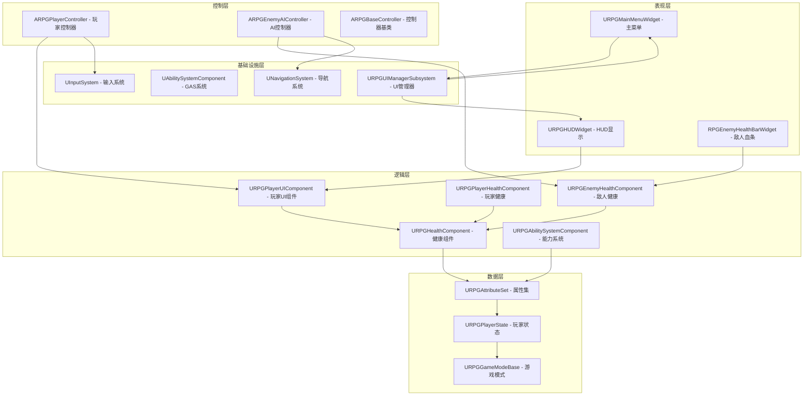
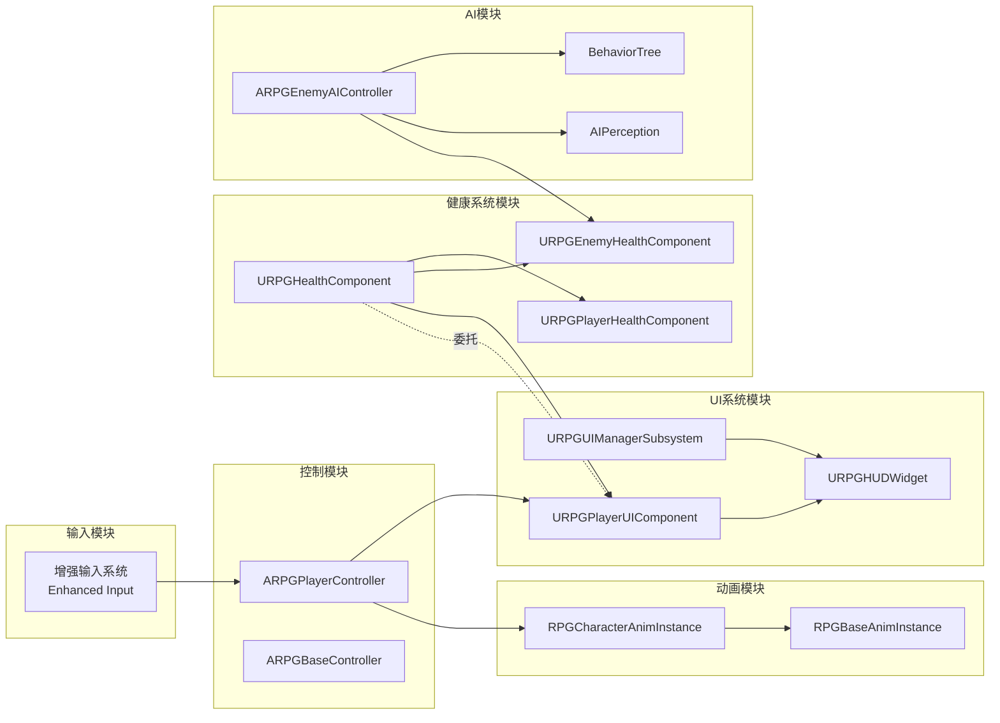
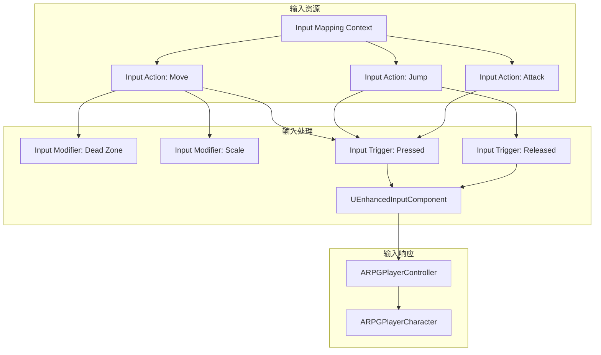
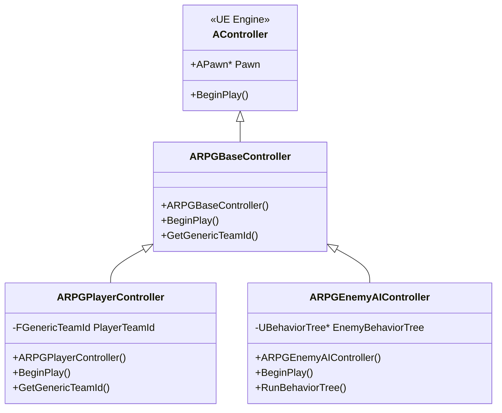
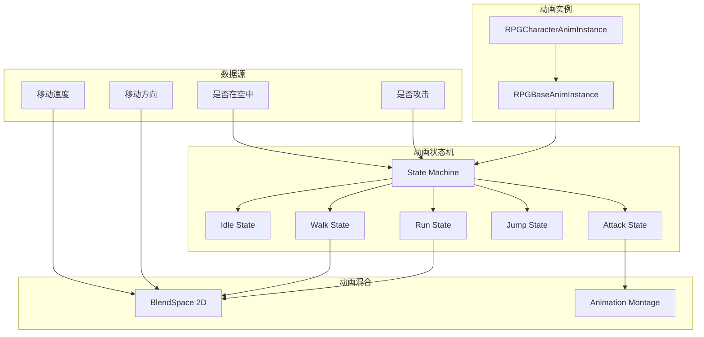
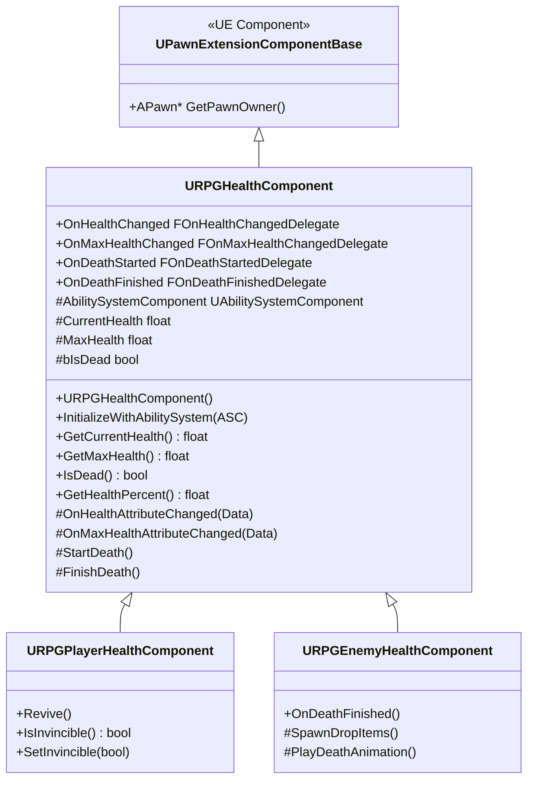
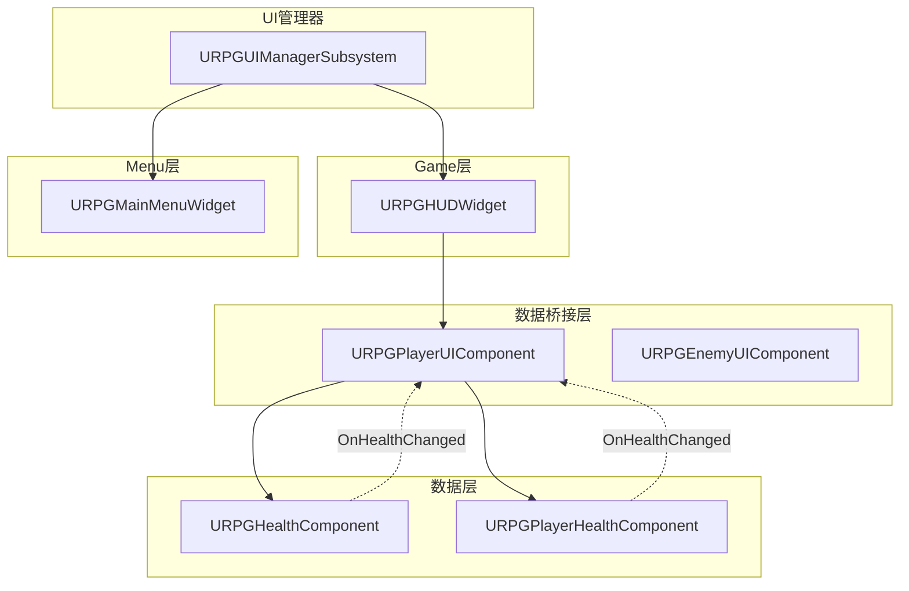
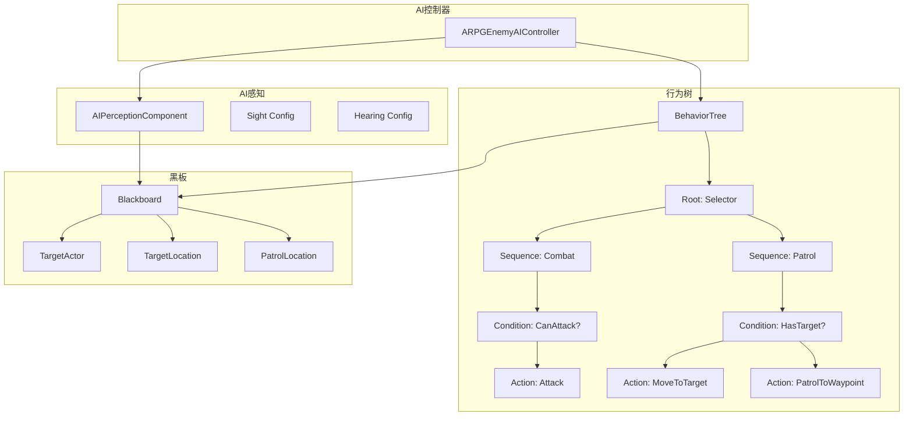

# 3 概要设计

## 3.1 系统总体架构设计

本课题基于Unreal Engine 5.6引擎开发第三人称角色扮演游戏，系统采用组件化架构（Component-Based Architecture）与事件驱动通信机制，实现高内聚低耦合的模块化设计。系统总体架构分为五个层次：表现层（Presentation Layer）、控制层（Control Layer）、逻辑层（Logic Layer）、数据层（Data Layer）和基础设施层（Infrastructure Layer）。

系统总体架构如图3.1所示：



**图3.1 系统总体架构图**

架构设计的核心原则包括：

（1）组件化设计，功能模块通过ActorComponent实现，按需挂载到Pawn或Character上。健康系统通过URPGHealthComponent组件实现，UI桥接通过URPGPlayerUIComponent组件实现，能力系统通过URPGAbilitySystemComponent组件实现。组件化设计支持功能的灵活组合和复用，不同角色可以挂载不同的组件集合实现差异化功能。

（2）事件驱动通信，模块间通过动态多播委托（Dynamic Multicast Delegate）和GameplayTag实现松耦合通信。健康组件通过OnHealthChanged委托广播生命值变化，UI组件订阅该委托并更新UI显示，避免直接引用和强耦合。事件驱动机制支持一对多的通知关系，多个监听器可以同时订阅同一事件。

（3）分层解耦，系统采用"数据组件 → UI组件 → UI Widget"的三层分离架构。URPGHealthComponent负责健康数据管理，URPGPlayerUIComponent负责数据转换和业务逻辑，URPGHUDWidget负责UI显示。三层之间通过接口和委托交互，任何一层的修改不影响其他层。

（4）全局子系统管理，跨模块的全局功能通过GameInstanceSubsystem管理。URPGUIManagerSubsystem作为UI管理器子系统，统一管理四层栈UI的生命周期（创建、激活、停用、销毁）。子系统在游戏实例化时创建，游戏全程可用，避免单例模式的滥用。

## 3.2 模块总体设计

根据系统总体架构，本课题将系统拆分为六大核心模块：输入模块、控制模块、动画模块、健康系统模块、UI系统模块和AI模块。各模块职责明确，通过接口和委托进行交互。

### 3.2.1 模块关系图



**图3.2 模块关系图**

### 3.2.2 模块职责说明

（1）输入模块（Input Module），负责处理玩家输入设备（键盘、鼠标、手柄）的输入信号，通过UE5增强输入系统（Enhanced Input）实现输入映射和输入动作绑定。输入模块将原始输入信号转换为游戏逻辑可用的输入动作（Input Action），如移动、跳跃、攻击等。输入模块通过Input Mapping Context（IMC）和Input Action（IA）资源定义输入映射规则，支持输入死区配置、输入优先级管理、输入防抖等功能。输入模块的输出传递给控制模块，由控制模块决定如何响应输入。

（2）控制模块（Control Module），负责接收输入模块的输入信号，协调角色移动、动画播放、能力释放等行为。控制模块包含ARPGPlayerController（玩家控制器）和ARPGBaseController（控制器基类）。ARPGPlayerController处理玩家特有的控制逻辑，如HUD显示控制、主菜单调用、玩家团队ID管理。ARPGBaseController封装控制器的通用逻辑，供玩家控制器和AI控制器继承。控制模块通过获取角色身上的组件（如UIComponent、HealthComponent）实现功能调用，避免直接操作角色属性。

（3）动画模块（Animation Module），负责管理角色动画状态机、动画混合空间和动画蒙太奇。动画模块通过RPGCharacterAnimInstance（角色动画实例）和RPGBaseAnimInstance（基础动画实例）实现动画逻辑。动画模块读取角色的移动速度、方向、状态等属性，驱动动画状态机的状态转换（如从Idle切换到Walk、从Walk切换到Run）。动画模块通过根运动（Root Motion）同步机制确保动画播放与角色物理移动的一致性，避免滑步现象。动画模块的输入来自控制模块的移动指令和状态变化，输出为动画姿态（Animation Pose）传递给渲染系统。

（4）健康系统模块（Health System Module），负责管理角色的生命值、死亡状态、复活逻辑等健康相关数据。健康系统采用分层继承架构，URPGHealthComponent作为基类，提供通用的健康数据管理功能（获取当前生命值、获取最大生命值、判断是否死亡、计算生命值百分比）。URPGPlayerHealthComponent继承自URPGHealthComponent，添加玩家特有的功能（复活机制、无敌状态控制）。URPGEnemyHealthComponent继承自URPGHealthComponent，添加敌人特有的功能（死亡动画触发、掉落物生成）。健康系统通过动态多播委托（OnHealthChanged、OnMaxHealthChanged、OnDeathStarted、OnDeathFinished）广播状态变化事件，供UI组件和其他模块订阅。

（5）UI系统模块（UI System Module），负责管理游戏的所有UI界面，包括HUD、主菜单、设置界面、敌人血条等。UI系统采用CommonUI框架和四层栈架构（Game层、LocalPlayer层、Modal层、Overlay层），通过URPGUIManagerSubsystem统一管理UI生命周期。UI系统通过URPGPlayerUIComponent作为数据桥接层，订阅健康系统的委托事件，将健康数据转换为UI可用的格式。URPGHUDWidget作为Game层的核心Widget，显示玩家的生命值、法力值、武器图标等关键信息。UI系统通过PushWidgetToLayerStack方法将Widget推送到指定层，确保UI层级关系的正确性。

（6）AI模块（AI Module），负责实现敌人的智能行为，包括寻路、巡逻、追逐、攻击、逃跑等。AI模块采用行为树（Behavior Tree）和黑板（Blackboard）架构，通过ARPGEnemyAIController控制AI行为逻辑。AI模块通过AIPerception系统感知玩家位置和环境信息，将感知数据存储到黑板中供行为树节点使用。AI模块根据黑板数据执行相应的行为节点（如MoveTo节点实现寻路、Attack节点执行攻击）。AI模块通过URPGEnemyHealthComponent获取敌人健康状态，当血量过低时触发逃跑行为。

## 3.3 输入模块概要设计

输入模块基于UE5增强输入系统（Enhanced Input）实现，相比旧版输入系统（Legacy Input），增强输入系统提供了更强大的输入映射、输入修饰符（Input Modifier）和输入触发器（Input Trigger）机制。

### 3.3.1 输入模块架构



**图3.3 输入模块架构图**

输入模块的核心组件包括：

（1）Input Mapping Context（IMC），定义输入动作与输入源的映射关系。本课题中定义了RPG_IMC输入映射上下文，将键盘WASD键映射到Move动作，将空格键映射到Jump动作，将鼠标左键映射到Attack动作。IMC支持多输入源绑定，如同时支持键盘和手柄输入。

（2）Input Action（IA），定义输入动作的类型和参数。Move动作采用Axis2D类型，返回二维向量（X轴控制前后移动，Y轴控制左右移动）。Jump动作采用Boolean类型，返回按下/释放状态。Attack动作采用Boolean类型，支持连击检测。

（3）Input Modifier，对输入信号进行预处理。Dead Zone修饰器用于处理摇杆死区，避免摇杆轻微偏移导致角色移动。Scale修饰器用于缩放输入值，调整移动速度或灵敏度。Negate修饰器用于反转输入轴，适配不同的控制习惯。

（4）Input Trigger，定义输入动作的触发条件。Pressed触发器在按键按下时触发一次。Released触发器在按键释放时触发一次。Hold触发器在按键持续按下时持续触发。Tap触发器检测快速点击，用于区分单击和长按。

（5）UEnhancedInputComponent，增强输入组件，负责绑定输入动作到回调函数。在ARPGPlayerCharacter的SetupPlayerInputComponent方法中，通过BindAction方法将输入动作绑定到对应的处理函数：

```cpp
InputComponent->BindAction(MoveAction, ETriggerEvent::Triggered, this, &ARPGPlayerCharacter::OnMoveInput);
InputComponent->BindAction(JumpAction, ETriggerEvent::Pressed, this, &ARPGPlayerCharacter::OnJumpInput);
InputComponent->BindAction(AttackAction, ETriggerEvent::Pressed, this, &ARPGPlayerCharacter::OnAttackInput);
```

### 3.3.2 输入优先级管理

输入模块通过输入优先级标签（Input Priority Tag）实现输入屏蔽。当UI界面打开时，UI层通过BlockInput机制屏蔽角色控制输入，避免玩家同时操作角色和UI。当UI界面关闭时，恢复角色控制输入。输入优先级的管理通过CommonUI框架自动处理，无需手动实现。

## 3.4 控制模块概要设计

控制模块负责协调输入模块、动画模块、健康系统模块和UI系统模块的工作，实现角色的整体控制逻辑。控制模块采用控制器（Controller）架构，通过ARPGPlayerController实现玩家控制，通过ARPGEnemyAIController实现AI控制。

### 3.4.1 控制器类结构



**图3.4 控制器类图**

ARPGPlayerController的核心职责包括：

（1）HUD显示控制，在BeginPlay方法中调用ShowHUD方法，通过URPGUIManagerSubsystem将URPGHUDWidget推送到Game层。ShowHUD方法的实现如下：

```cpp
void ARPGPlayerController::BeginPlay()
{
    Super::BeginPlay();
    
    if (URPGUIManagerSubsystem* UIManager = GetGameInstance()->GetSubsystem<URPGUIManagerSubsystem>())
    {
        UIManager->ShowHUD(this);
    }
}
```

（2）团队ID管理，通过GetGenericTeamId方法返回玩家的团队ID，用于AI感知系统的敌友识别。玩家团队ID设置为0（中立团队），AI感知系统通过启用bDetectNeutrals配置检测中立团队。

（3）输入屏蔽控制，当UI界面打开时，控制器暂时屏蔽角色的游戏输入，避免玩家同时操作角色和UI。CommonUI框架通过BlockInput机制自动处理输入屏蔽，控制器无需手动实现。

ARPGEnemyAIController的核心职责包括：

（1）行为树管理，在BeginPlay方法中调用RunBehaviorTree方法，启动敌人的行为树。行为树定义了敌人的行为逻辑（巡逻、追逐、攻击、逃跑）。

（2）AI感知管理，配置AIPerceptionComponent的感知范围和感知类型（视觉、听觉）。当感知到玩家时，将玩家位置写入黑板，触发行为树的追逐行为。

（3）目标追踪，通过黑板存储当前目标（TargetActor）和最后已知目标位置（TargetLocation）。行为树的MoveTo节点使用这些数据进行寻路。

## 3.5 动画模块概要设计

动画模块负责管理角色的动画状态机、动画混合空间和动画蒙太奇，实现角色行为与动画表现的精准匹配。动画模块通过Animation Blueprint实现动画逻辑，通过AnimInstance类提供动画数据接口。

### 3.5.1 动画模块架构



**图3.5 动画模块架构图**

RPGCharacterAnimInstance的核心职责包括：

（1）动画状态管理，通过State Machine管理角色的动画状态。状态机包含Idle、Walk、Run、Jump、Attack等状态，状态之间的转换由转换规则（Transition Rule）控制。转换规则基于角色属性（如移动速度、是否在空中）判断是否满足转换条件。

（2）动画混合控制，通过2D BlendSpace实现移动方向的动画混合。BlendSpace的X轴表示移动速度，Y轴表示移动方向（前进、后退、左移、右移）。根据角色的实际移动速度和方向，BlendSpace插值计算最终的动画姿态。

（3）动画蒙太奇播放，通过PlaySlotAnimationAsDynamicMontage方法播放攻击动画。攻击动画通过蒙太奇实现，支持动画分段（Section）和通知（Notify）。动画通知用于触发攻击判定、音效播放等事件。

（4）根运动同步，通过Root Motion同步机制确保动画播放与角色物理移动的一致性。当动画包含根运动时，角色的位置由动画驱动，而非物理系统。根运动同步避免滑步现象，提升动画表现的真实感。

RPGBaseAnimInstance的核心职责包括：

（1）基础动画数据接口，提供动画状态的查询方法（如IsIdle、IsMoving、IsAttacking）。这些方法供状态机的转换规则使用。

（2）动画初始化，在NativeInitializeAnimation方法中获取角色引用（Character Reference），建立动画实例与角色的关联。通过角色引用获取角色的移动速度、方向、状态等属性。

（3）动画更新逻辑，在NativeUpdateAnimation方法中更新动画状态。每帧调用该方法，根据角色的最新状态更新动画参数（如Speed、Direction、bIsInAir）。

## 3.6 健康系统模块概要设计

健康系统模块负责管理角色的生命值、死亡状态、复活逻辑等健康相关数据。健康系统采用分层继承架构，通过动态多播委托实现事件广播，支持UI组件和其他模块订阅健康状态变化。

### 3.6.1 健康系统类结构



**图3.6 健康系统类图**

URPGHealthComponent的核心职责包括：

（1）健康数据管理，通过CurrentHealth、MaxHealth、bIsDead属性管理角色的健康状态。提供GetCurrentHealth、GetMaxHealth、IsDead、GetHealthPercent等查询方法，供其他模块获取健康数据。

（2）ASC属性监听，通过InitializeWithAbilitySystem方法绑定Ability System Component（ASC），监听ASC的健康属性变化。当ASC的健康属性变化时，触发OnHealthAttributeChanged回调，更新CurrentHealth和MaxHealth属性。

（3）委托事件广播，通过OnHealthChanged、OnMaxHealthChanged、OnDeathStarted、OnDeathFinished四个动态多播委托广播健康状态变化。委托采用DECLARE_DYNAMIC_MULTICAST_DELEGATE宏声明，支持蓝图订阅。委托回调函数必须标记为UFUNCTION()，否则会导致编译错误。

（4）死亡状态机，通过StartDeath和FinishDeath方法实现死亡流程。StartDeath方法在生命值降至0时调用，触发OnDeathStarted委托，播放死亡动画。FinishDeath方法在死亡动画播放完成后调用，触发OnDeathFinished委托，销毁角色或生成掉落物。

URPGPlayerHealthComponent的核心职责包括：

（1）复活机制，通过Revive方法实现玩家复活逻辑。复活方法将CurrentHealth设置为MaxHealth的一定比例（如50%），将bIsDead设置为false，触发OnHealthChanged委托更新UI显示。

（2）无敌状态控制，通过SetInvincible和IsInvincible方法实现无敌状态。无敌状态下，玩家不受伤害，健康属性变化被忽略。无敌状态用于实现无敌帧（Invincibility Frames）机制，在玩家受到伤害后提供短暂的无敌时间，避免连续伤害。

URPGEnemyHealthComponent的核心职责包括：

（1）死亡动画触发，在FinishDeath方法中播放敌人死亡动画。死亡动画通过动画蒙太奇实现，支持不同的死亡类型（如普通死亡、爆头死亡）。

（2）掉落物生成，在FinishDeath方法中生成掉落物（如金币、道具）。掉落物的类型和数量通过配置表定义，支持随机掉落概率。

### 3.6.2 健康系统与ASC集成

健康系统通过Gameplay Ability System（GAS）实现属性管理。ASC负责管理角色的所有属性（Health、Mana、Attack、Defense等），通过URPGAttributeSet定义属性结构。健康组件通过ASC的属性变化委托监听健康属性变化，实现数据同步。

属性变化监听的核心代码：

```cpp
void URPGHealthComponent::InitializeWithAbilitySystem(UAbilitySystemComponent* ASC)
{
    AbilitySystemComponent = ASC;
    
    // 监听健康属性变化
    FGameplayAttribute HealthAttribute = UAbilitySystemBlueprintLibrary::MakeAttributeFromName(TEXT("Health"));
    ASC->GetGameplayAttributeValueChangeDelegate(HealthAttribute).AddUObject(this, &URPGHealthComponent::OnHealthAttributeChanged);
    
    // 监听最大健康属性变化
    FGameplayAttribute MaxHealthAttribute = UAbilitySystemBlueprintLibrary::MakeAttributeFromName(TEXT("MaxHealth"));
    ASC->GetGameplayAttributeValueChangeDelegate(MaxHealthAttribute).AddUObject(this, &URPGHealthComponent::OnMaxHealthAttributeChanged);
}
```

## 3.7 UI系统模块概要设计

UI系统模块负责管理游戏的所有UI界面，采用CommonUI框架和四层栈架构，通过URPGUIManagerSubsystem统一管理UI生命周期。UI系统通过URPGPlayerUIComponent作为数据桥接层，实现健康系统与UI Widget的解耦。

### 3.7.1 UI系统架构



**图3.7 UI系统架构图**

URPGUIManagerSubsystem的核心职责包括：

（1）UI生命周期管理，通过CreateWidget、InitializeWidget、ActivateWidget、DeactivateWidget、DestroyWidget方法管理UI Widget的生命周期。UI Widget的创建和销毁由UI管理器统一处理，避免手动管理导致的内存泄漏。

（2）四层栈管理，通过PushWidgetToLayerStack方法将Widget推送到指定层（Game层、Menu层、Modal层、Overlay层）。四层栈采用栈结构管理Widget，支持Widget的层级堆叠和弹出。当弹出顶层Widget时，自动激活次顶层Widget。

（3）输入屏蔽管理，当Modal层或Menu层的Widget激活时，自动屏蔽Game层的输入，避免玩家同时操作角色和UI。当Widget停用时，恢复Game层的输入。输入屏蔽通过CommonUI框架的BlockInput机制自动处理。

URPGHUDWidget的核心职责包括：

（1）HUD显示，通过HealthBar、ManaBar、HealthText、ManaText、WeaponIcon等UI元素显示玩家状态信息。UI元素通过UPROPERTY(BlueprintReadOnly, meta = (BindWidget))标记，与蓝图Widget绑定。

（2）委托订阅，在Initialize方法中获取URPGPlayerUIComponent引用，订阅OnHealthChanged、OnManaChanged等委托事件。当收到委托回调时，更新对应的UI元素。

（3）Widget激活/停用，在NativeOnActivated方法中初始化委托订阅，在NativeOnDeactivated方法中清理委托绑定。委托清理通过RemoveAll方法实现，避免悬空指针和无效回调。

URPGPlayerUIComponent的核心职责包括：

（1）数据桥接，订阅URPGHealthComponent的OnHealthChanged委托，将健康数据转换为UI可用的格式。当收到健康变化事件时，触发OnHealthChangedForUI委托，通知HUD Widget更新显示。

（2）法力值管理，通过CurrentMana和MaxMana属性管理玩家的法力值。提供UpdateMana方法更新法力值，触发OnManaChangedForUI委托通知HUD Widget。

（3）武器状态管理，通过OnCurrentWeaponChangedForUI委托广播武器变化事件。当玩家装备或卸下武器时，触发该委托，HUD Widget更新武器图标显示。

### 3.7.2 UI与数据层解耦

UI系统通过接口（Interface）和委托（Delegate）实现与数据层的解耦。URPGHUDWidget不直接引用URPGHealthComponent，而是通过URPGPlayerUIComponent获取数据。URPGPlayerUIComponent实现IPawnUIInterface接口，提供健康数据查询方法。

接口定义：

```cpp
UINTERFACE(MinimalAPI)
class UIPawnUIInterface : public UInterface
{
    GENERATED_BODY()
};

class IPawnUIInterface
{
    GENERATED_BODY()
    
public:
    UFUNCTION(BlueprintCallable, Category="UI Interface")
    virtual URPGHealthComponent* GetHealthComponent() const = 0;
};
```

URPGPlayerUIComponent实现接口：

```cpp
class RPG_API URPGPlayerUIComponent : public UPawnUIComponent, public IPawnUIInterface
{
    GENERATED_BODY()
    
public:
    virtual URPGHealthComponent* GetHealthComponent() const override
    {
        return GetHealthComponentInternal();
    }
};
```

通过接口抽象，HUD Widget可以处理任何实现IPawnUIInterface的组件，不依赖具体的组件类型。当需要添加新的UI数据源时，只需实现接口即可，无需修改HUD Widget代码。

## 3.8 AI模块概要设计

AI模块负责实现敌人的智能行为，采用行为树（Behavior Tree）和黑板（Blackboard）架构，通过AIPerception系统感知玩家位置和环境信息。AI模块通过ARPGEnemyAIController控制AI行为逻辑，实现巡逻、追逐、攻击、逃跑等多样化行为。

### 3.8.1 AI模块架构



**图3.8 AI模块架构图**

ARPGEnemyAIController的核心职责包括：

（1）行为树启动，在BeginPlay方法中调用RunBehaviorTree方法，启动敌人的行为树。行为树通过UBehaviorTree资源定义，支持可视化编辑。行为树的根节点为Selector节点，按优先级尝试执行子节点。

（2）黑板数据管理，通过黑板存储AI的目标、状态、巡逻点等数据。黑板数据由感知系统写入（如TargetActor、TargetLocation），由行为树节点读取和执行。黑板支持多种数据类型（Actor、Vector、Float、Bool等）。

（3）感知系统配置，配置AIPerceptionComponent的感知类型（视觉、听觉）和感知范围（Sight Radius、Peripheral Vision Angle）。当感知到玩家时，触发OnTargetPerceptionUpdated回调，将玩家信息写入黑板。

行为树的核心节点包括：

（1）Combat Sequence节点，处理战斗行为。通过CanAttack条件节点判断是否可以攻击（如玩家在攻击范围内、攻击冷却已结束）。如果条件满足，执行Attack动作节点，播放攻击动画并触发攻击判定。

（2）Patrol Sequence节点，处理巡逻行为。通过HasTarget条件节点判断是否有目标（如玩家进入感知范围）。如果有目标，执行MoveToTarget动作节点，寻路到目标位置。如果没有目标，执行PatrolToWaypoint动作节点，移动到下一个巡逻点。

（3）Condition节点，判断行为执行条件。CanAttack节点检查玩家距离和攻击冷却。HasTarget节点检查黑板中的TargetActor是否有效。条件节点返回Success或Failure，控制行为树的执行流程。

（4）Action节点，执行具体的行为逻辑。Attack节点播放攻击动画，通过动画通知触发攻击判定。MoveToTarget节点调用UNavigationSystem的FindPathToActor方法，寻路到目标位置。PatrolToWaypoint节点移动到预设的巡逻点，到达后选择下一个巡逻点。

### 3.8.2 AI感知与团队系统

AI感知系统通过TeamId实现敌友识别。玩家团队ID设置为0（中立团队），敌人团队ID设置为1（敌对团队）。AIPerceptionComponent通过bDetectNeutrals配置启用中立团队检测，确保敌人能够感知到玩家。

感知配置的核心代码：

```cpp
UAIPerceptionComponent* PerceptionComponent = CreateDefaultSubobject<UAIPerceptionComponent>(TEXT("PerceptionComponent"));

// 配置视觉感知
UAISenseConfig_Sight* SightConfig = CreateDefaultSubobject<UAISenseConfig_Sight>(TEXT("SightConfig"));
SightConfig->SightRadius = 1000.0f;
SightConfig->LoseSightRadius = 1200.0f;
SightConfig->PeripheralVisionAngleDegrees = 90.0f;
SightConfig->DetectionByAffiliation.bDetectEnemies = true;
SightConfig->DetectionByAffiliation.bDetectFriendlies = false;
SightConfig->DetectionByAffiliation.bDetectNeutrals = true;  // 检测中立团队（玩家）

PerceptionComponent->ConfigureSense(*SightConfig);
PerceptionComponent->SetDominantSense(USightSense::StaticClass());
```

当感知到玩家时，触发OnTargetPerceptionUpdated回调：

```cpp
void ARPGEnemyAIController::OnTargetPerceptionUpdated(AActor* Actor, FAIStimulus Stimulus)
{
    if (Stimulus.WasSuccessfullySensed() && Actor->ActorHasTag(TEXT("Player")))
    {
        // 将玩家写入黑板
        BlackboardComp->SetValueAsObject(TEXT("TargetActor"), Actor);
        BlackboardComp->SetValueAsVector(TEXT("TargetLocation"), Actor->GetActorLocation());
    }
}
```

行为树通过读取黑板数据执行相应的行为。当TargetActor有效时，执行追逐和攻击行为。当TargetActor无效时，执行巡逻行为。
