> 文档版本: v1.1  
> 最后更新: 2026-05-07  
> 修订说明: 增量同步至当前代码实现；新增对象池模块 3.13；校正 UI/动画/武器/GAS/控制器等章节的类图与描述；补齐基础设施层 UIManagerSubsystem、GEExecutionCalculation、共享能力层与 Gruntling 派生 AI 控制器等体现。

# 3 概要设计

## 3.1 系统总体架构设计

本课题基于Unreal Engine 5.6引擎开发第三人称角色扮演游戏，系统采用组件化架构与事件驱动通信机制，实现高内聚低耦合的模块化设计。系统总体架构分为五个层次：表现层负责UI显示与交互，控制层管理玩家和AI控制器，逻辑层实现核心游戏功能，数据层处理属性与配置管理，基础设施层提供输入、导航和对象池等底层支持。各层之间通过接口和委托交互，确保系统的可扩展性和可维护性。

系统总体架构如图3.1所示：

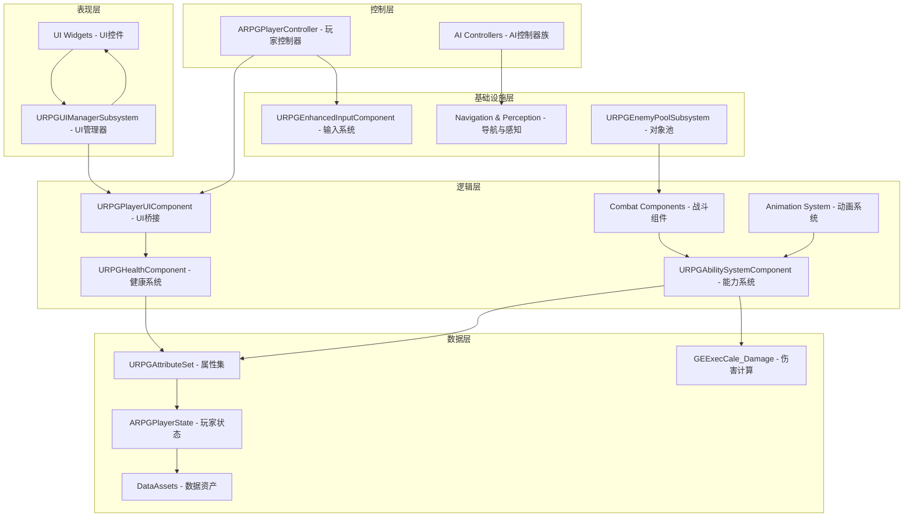

**图3.1 系统总体架构图**

图3.1展示了系统的五层架构设计。表现层包含UI控件和UI管理器，负责游戏界面的显示与交互。控制层包含玩家控制器和AI控制器族，处理输入指令和AI决策。逻辑层是系统的核心，包含UI桥接、健康系统、战斗组件、能力系统和动画系统，实现游戏的主要功能逻辑。数据层管理属性集、玩家状态、数据资产和伤害计算，为逻辑层提供数据支持。基础设施层提供输入系统、导航与感知、对象池等底层服务。数据流向表现为：表现层通过UI管理器与逻辑层的UI桥接交互，控制层接收输入并调度逻辑层组件，逻辑层依赖数据层的属性配置，基础设施层为各层提供底层支持。

架构设计的核心原则包括：

（1）组件化设计，功能模块通过ActorComponent实现，按需挂载到Pawn或Character上。健康系统通过URPGHealthComponent组件实现，战斗系统通过UPlayerCombatComponent组件实现，UI桥接通过URPGPlayerUIComponent组件实现，能力系统通过URPGAbilitySystemComponent组件实现。所有Pawn扩展组件继承自UPawnExtensionComponentBase基类，该基类提供类型安全的GetOwningPawn<T>()模板方法，用于获取Owner Pawn的强类型引用。

（2）事件驱动通信，模块间通过动态多播委托（Dynamic Multicast Delegate）和GameplayTag实现松耦合通信。健康组件通过OnHealthChanged委托广播生命值变化，UI组件订阅该委托并更新UI显示。战斗组件通过FOnTargetInteractDelegate委托通知武器命中事件。GameplayTag系统定义了完整的标签层次结构（Input/Player/Enemy/Shared/UI），用于能力系统的输入驱动和状态标记。

（3）分层解耦，系统采用"数据组件 → UI组件 → UI Widget"的三层分离架构。URPGHealthComponent负责健康数据管理，UPawnUIComponent负责数据转换和事件转发，URPGHUDWidget负责UI显示。三层之间通过接口（IPawnUIInterface、IPawnCombatInterface、IPawnDeathInterface）和委托交互，任何一层的修改不影响其他层。

（4）数据驱动配置，系统采用DataAsset资产实现数据驱动设计。角色属性通过UDataAsset_CharacterConfig配置，输入映射通过UDataAsset_InputConfig配置，启动能力通过UDataAsset_StartUpDataBase配置。运行时通过GameplayEffect将配置数据应用到ASC，支持编辑器内实时调整而无需重新编译。

## 3.2 模块总体设计

根据系统总体架构,本课题将系统拆分为七大核心模块：输入与控制模块、动画模块、健康与UI模块、AI模块、战斗与武器模块、能力系统模块和对象池模块。各模块职责明确,通过接口和委托进行交互。

### 3.2.1 模块关系图

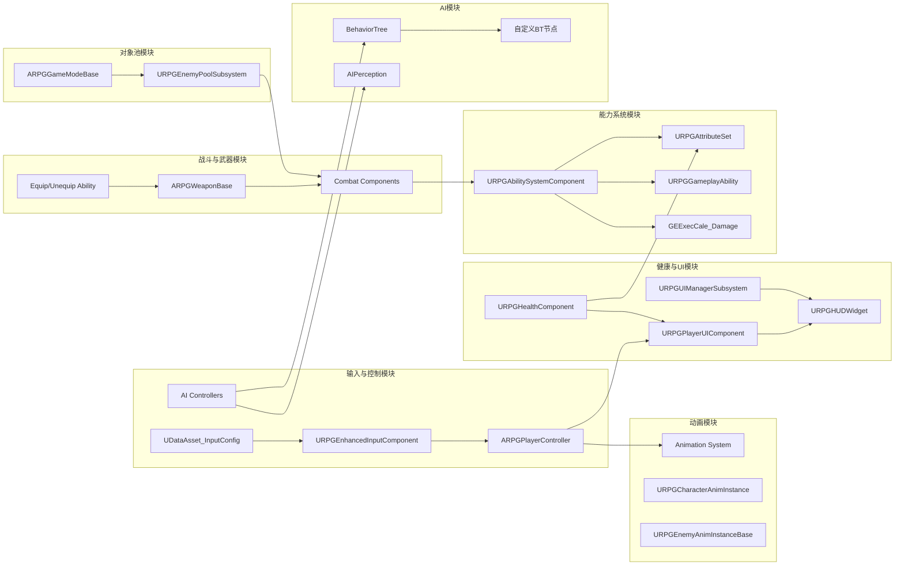

**图3.2 模块关系图**

### 3.2.2 模块职责说明

（1）输入与控制模块（Input & Control Module），整合了输入系统和控制器功能。输入部分基于UE5增强输入系统实现，通过URPGEnhancedInputComponent提供模板化的输入绑定方法，使用UDataAsset_InputConfig数据资产定义输入映射，将输入动作分为原生输入和能力驱动输入。控制部分包含ARPGPlayerController（玩家控制器）和AI Controllers（AI控制器族），玩家控制器管理团队ID和HUD显示，AI控制器通过行为树和感知系统驱动敌人决策，两者通过IGenericTeamAgentInterface实现敌友识别。

（2）动画模块（Animation Module），管理角色和敌人的动画状态机、动画混合空间和动画蒙太奇。包含URPGCharacterAnimInstance（角色动画，实现跳跃状态机、步态系统、Linked Anim Layers管理）和URPGEnemyAnimInstanceBase（敌人动画，暴露专用属性驱动状态机）。动画模块通过GaitAmount步态比例驱动BlendSpace混合，通过LinkAnimLayer方法实现运行时武器动画层的热切换。

（3）健康与UI模块（Health & UI Module），整合了健康系统和UI系统。健康系统采用分层继承架构，URPGHealthComponent作为基类绑定ASC并广播健康状态变化委托，URPGPlayerHealthComponent添加无敌状态和复活机制，URPGEnemyHealthComponent添加死亡动画和销毁延迟。UI系统采用CommonUI框架和四层栈架构，URPGUIManagerSubsystem管理UI生命周期，URPGPlayerUIComponent作为数据桥接层订阅HealthComponent事件并转发为UI友好格式，URPGHUDWidget负责最终显示。

（4）AI模块（AI Module），通过AI控制器管理行为树和AI感知。AI感知配置包含SightRadius（视觉半径）、LoseSightRadius（丢失视觉半径）、PeripheralVisionAngle（边缘视野角度）、PerceptionMaxAge（感知有效期）。行为树任务包含BTTask_RotateToFaceTarget（朝向目标）、BTTask_ActivateAbilityByTag（标签激活能力）、BTTask_FindRandomPatrolPoint（随机巡逻点）、BTTask_FindStrafingPoint_EQS（环境查询侧移点）。

（5）战斗与武器模块（Combat & Weapon Module），整合了战斗系统和武器系统。战斗系统采用分层组件架构，UPawnCombatComponent作为基类管理武器注册和碰撞切换，UPlayerCombatComponent添加连招管理系统（分通道管理连招计数和定时器），UEnemyCombatComponent提供敌人特有的碰撞控制。武器系统以ARPGWeaponBase为基类包含武器网格和碰撞盒，通过Equip/Unequip能力实现武器的装卸、动画层链接和能力授予。

（6）能力系统模块（GAS Module），基于UE5的Gameplay Ability System实现。URPGAbilitySystemComponent扩展UAbilitySystemComponent，提供输入标签处理、武器能力授予、标签激活能力。URPGAttributeSet定义四类属性：主属性（力量/智力/体质/敏捷）、次属性（护甲/暴击率/暴击伤害/生命回复/法力回复）、核心属性（当前/最大生命值/怒气值/法力值）、元属性（受到伤害/获得经验/攻击力/防御力）。URPGGameplayAbility提供OnTriggered/OnGive两种激活策略。UGEExecCale_Damage作为伤害执行计算，抓取攻击力和防御力等属性计算最终伤害。

（7）对象池模块（Pool Module），由URPGEnemyPoolSubsystem（UWorldSubsystem）统一管理敌人实例的预热、获取与归还，降低战斗高峰期的Spawn/Destroy开销。ARPGGameModeBase在BeginPlay阶段调用WarmPool按敌人配置批量预热；战斗期间通过AcquireEnemy从池中取出已沉睡的实例重置状态并置入关卡，死亡后通过ReleaseEnemy回收到池并重置ASC属性与位置。该模块与AI模块、战斗模块联动，保证同类敌人的快速循环复用。

## 3.3 输入模块概要设计

输入模块基于UE5增强输入系统实现，提供模板化的输入绑定方法和数据驱动的输入配置管理。系统将输入动作分为原生输入和能力驱动输入两类，原生输入直接控制角色移动和视角，能力输入通过GameplayTag标签驱动能力系统响应。输入配置资产集中管理所有输入映射，支持多套输入方案切换，实现输入与游戏逻辑的松耦合。

### 3.3.1 输入模块类结构

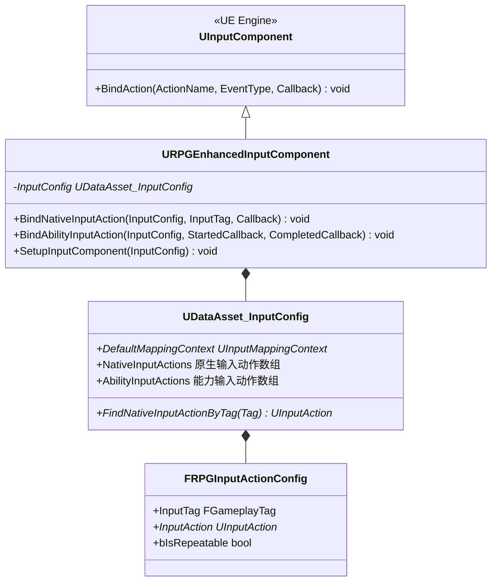

**图3.3 输入模块类图**

### 3.3.2 输入模块架构

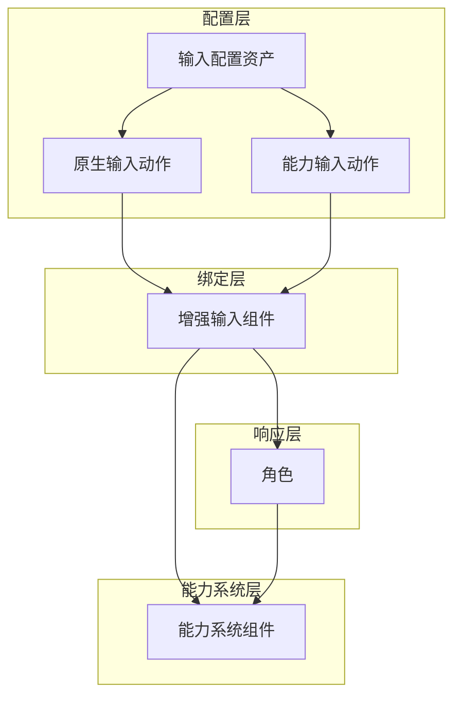

**图3.4 输入模块架构图**

图3.4展示了输入模块的四层架构与数据流向。配置层包含输入配置资产，管理原生输入动作和能力输入动作两类映射配置。绑定层通过增强输入组件读取配置并执行绑定逻辑，将输入动作与回调函数关联。响应层接收绑定后的输入事件，角色组件处理原生输入（移动、视角）并转发能力输入。能力系统层接收能力输入标签，通过标签匹配激活对应的GameplayAbility。核心数据流为：配置资产提供输入映射 → 增强输入组件执行绑定 → 角色响应原生输入并转发能力输入 → 能力系统处理标签驱动的能力激活。该架构实现了输入配置与响应逻辑的分离，支持灵活扩展新的输入行为。

输入模块的核心设计特点：

（1）**模板化绑定方法**，URPGEnhancedInputComponent通过C++模板方法实现类型安全的输入绑定。绑定原生输入方法接受输入配置、输入标签、触发事件和回调函数参数，通过标签查找对应的输入动作并绑定。绑定能力输入方法遍历能力输入动作数组，为每个有效配置分别绑定按下和释放事件。

（2）**GameplayTag驱动的能力输入**，能力输入动作使用输入动作配置结构，将输入标签与输入动作配对。当输入触发时，系统将输入标签传递给能力系统组件的处理方法，能力系统遍历已授予的能力找到匹配标签的能力并激活。这种设计实现了输入与能力的解耦，添加新能力只需配置数据资产，无需修改代码。

（3）**数据驱动的输入配置**，输入配置资产将所有输入映射集中管理，包含默认映射上下文、原生输入动作数组和能力输入动作数组。编辑器内可直接修改配置，支持多套输入方案切换。输入动作配置结构包含输入标签、输入动作和可重复标记等字段，实现灵活的输入行为定义。

## 3.4 控制模块概要设计

控制模块负责协调输入模块、动画模块、健康系统模块和UI系统模块的工作，实现角色的整体控制逻辑。控制模块包含两条独立的继承链：玩家控制器链（APlayerController → ARPGBaseController → ARPGPlayerController）和AI控制器链（AAIController → ARPGEnemyAIController）。

### 3.4.1 控制器类结构

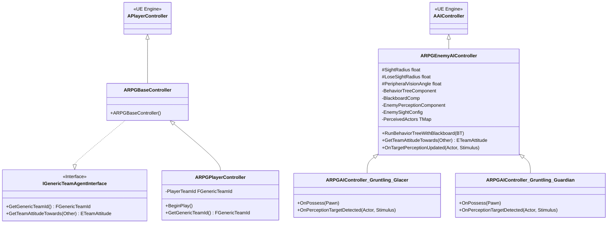

**图3.4 控制器类图**

ARPGPlayerController的核心职责包括团队ID管理（PlayerTeamId = 0，中立团队）和UI初始化。ARPGEnemyAIController独立继承AAIController，包含完整的AI感知配置（SightRadius、LoseSightRadius、PeripheralVisionAngle、PerceptionMaxAge）、感知目标缓存（PerceivedActors TMap）和黑板数据更新（UpdateNearestTarget）。Gruntling派生层（ARPGAIController_Gruntling_Glacer与ARPGAIController_Gruntling_Guardian）重写OnPossess用于绑定特定行为树与黑板资产，重写OnPerceptionTargetDetected用于调优不同兵种的感知响应。

## 3.5 动画模块概要设计

动画模块负责管理角色的动画状态机、动画混合空间和动画蒙太奇。动画模块采用三层动画实例架构：URPGBaseAnimInstance提供基础运动参数，URPGCharacterAnimInstance实现角色动画状态管理，URPGItemAnimLayersBase实现武器动画层数据同步。

### 3.5.1 动画模块架构

```mermaid
graph TB
    subgraph 动画实例层次
        BAI[URPGBaseAnimInstance]
        CAI[URPGCharacterAnimInstance]
        IAL[URPGItemAnimLayersBase]
        EAI[URPGEnemyAnimInstanceBase]
    end
    
    subgraph 基础运动参数
        GS[GroundSpeed]
        Dir[Direction]
        Vel[Velocity]
        VS[VerticalSpeed]
        bMoving[bIsMoving]
        bFalling[bIsFalling]
    end
    
    subgraph 角色动画状态
        MS[移动状态 Idle/Walk/Run/Sprint]
        JS[跳跃状态 None/Start/Loop/Land]
        GA[GaitAmount 步态比例]
        LAL[Linked Anim Layers]
    end
    
    subgraph 武器动画层
        WT[WeaponType]
        CS[CombatState]
        CI[ComboIndex]
        ASM[AttackSpeedMultiplier]
    end
    
    subgraph 敌人动画属性
        EIdle[bIsIdle]
        EMove[MovementSpeed]
        EHit[bIsHitReacting]
        EHitDir[HitReactDirection]
        EDead[bIsDead]
        EAtk[bIsAttacking]
    end
    
    BAI --> GS
    BAI --> Dir
    BAI --> Vel
    BAI --> VS
    BAI --> bMoving
    BAI --> bFalling
    CAI --> BAI
    CAI --> MS
    CAI --> JS
    CAI --> GA
    CAI --> LAL
    IAL --> BAI
    IAL --> WT
    IAL --> CS
    IAL --> CI
    IAL --> ASM
    EAI --> BAI
    EAI --> EIdle
    EAI --> EMove
    EAI --> EHit
    EAI --> EHitDir
    EAI --> EDead
    EAI --> EAtk
```

**图3.5 动画模块架构图**

动画模块的核心设计特点：

（1）跳跃状态机（Jump State Machine），通过EJumpState枚举（None/Start/Loop/Land）管理跳跃动画阶段。URPGCharacterAnimInstance维护TimeSinceJumpStart、TimeSinceGrounded等内部跟踪变量，配置JumpStartVerticalSpeedThreshold和LandDetectionDelay等参数，实现精确的跳跃动画切换。

（2）GaitAmount步态系统，通过GaitAmount浮点值（0.0-3.0）驱动BlendSpace混合。Idle对应0.0，Walk对应1.0，Run对应2.0，Sprint对应3.0。步态系统通过速度阈值（WalkSpeedThreshold/RunSpeedThreshold/SprintSpeedThreshold）计算当前GaitAmount，实现平滑的步态过渡。

（3）Linked Anim Layers武器动画切换，通过LinkAnimLayer/UnlinkAnimLayer方法实现运行时动画层的热切换。当玩家装备不同武器时，URPGCharacterAnimInstance链接对应的URPGItemAnimLayersBase子类，该子类每帧从PlayerCombatComponent同步战斗状态数据（CombatState、ComboIndex、bIsInComboWindow等），驱动武器特有的动画逻辑。

（4）敌人动画专用分支，URPGEnemyAnimInstanceBase直接继承自URPGBaseAnimInstance，不使用Linked Anim Layers机制，转而暴露bIsIdle/MovementSpeed/bIsHitReacting/HitReactDirection/bIsDead/bIsAttacking等属性，由该实例暂存的EnemyCombatComponent与RPGFunctionLibrary推导结果驱动对应的状态机过渡。

## 3.6 健康系统模块概要设计

健康系统模块负责管理角色的生命值、死亡状态、复活逻辑等健康相关数据。健康系统采用分层继承架构，通过动态多播委托实现事件广播，支持UI组件和其他模块订阅健康状态变化。

### 3.6.1 健康系统类结构

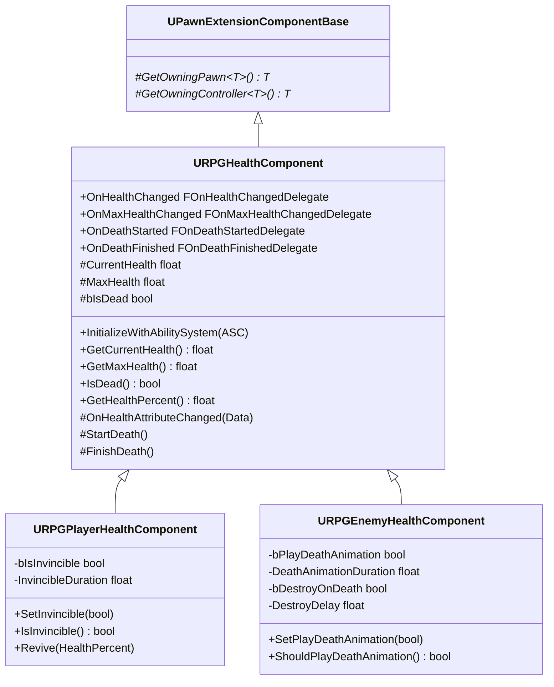

**图3.6 健康系统类图**

## 3.7 UI系统模块概要设计

UI系统模块负责管理游戏的所有UI界面，采用CommonUI框架和四层栈架构，通过UI管理器子系统统一管理UI生命周期。系统通过PawnUIComponent作为数据桥接层，实现健康系统与UI控件的解耦，支持软引用异步加载和Widget栈管理。四层栈分别处理前端菜单、游戏HUD、游戏内模态弹窗和模态确认界面，通过输入路由自动屏蔽底层交互，确保UI层级关系的正确性。

### 3.7.1 UI系统类结构

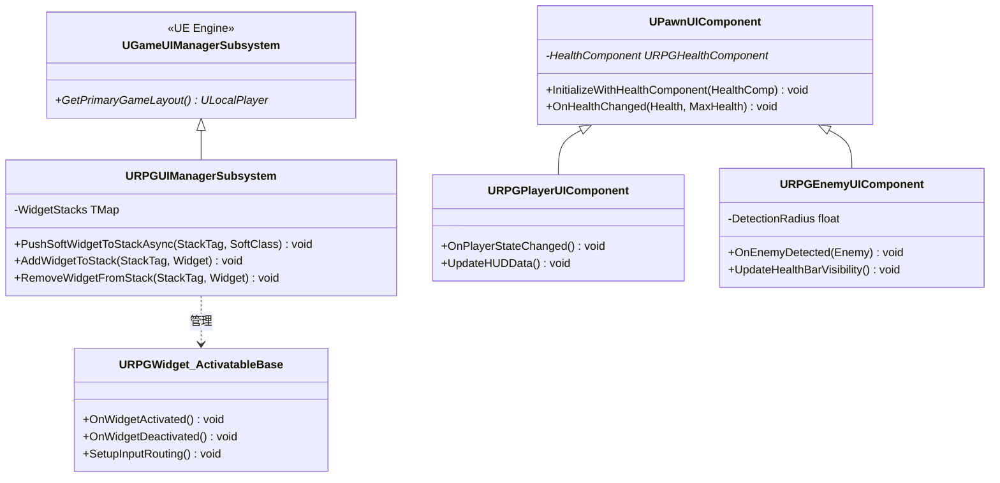

**图3.7 UI系统类图**

图3.7展示了UI系统的核心组件与继承关系。URPGUIManagerSubsystem扩展自UE引擎的UGameUIManagerSubsystem，提供Widget栈管理和异步加载方法，通过PushSoftWidgetToStackAsync实现软引用异步加载Widget。UPawnUIComponent作为数据桥接层基类，订阅健康组件的状态变化委托，将底层数据转换为UI友好格式。URPGPlayerUIComponent处理玩家状态更新和HUD数据刷新，URPGEnemyUIComponent添加距离检测和血条可见性控制。URPGWidget_ActivatableBase作为可激活控件基类，提供激活/停用生命周期钩子和输入路由配置，确保所有UI控件具有一致的行为。

### 3.7.2 UI系统架构

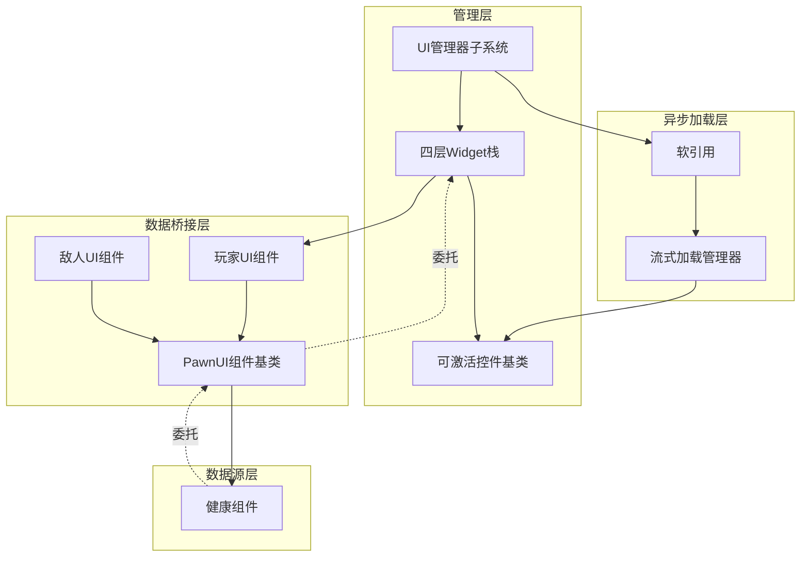

**图3.8 UI系统架构图**

图3.8展示了UI系统的四层架构与数据流向。管理层包含UI管理器子系统、可激活控件基类和四层Widget栈，负责UI生命周期管理和栈调度。异步加载层通过软引用和流式加载管理器实现Widget的按需加载，避免资源常驻内存。数据桥接层包含PawnUI组件基类、玩家UI组件和敌人UI组件，订阅健康组件数据并转发给UI控件。数据源层提供健康组件作为数据源。核心数据流为：健康组件通过委托通知PawnUI组件 → PawnUI组件转换数据并转发给UI控件 → UI控件更新显示。管理层通过软引用异步加载Widget并推入对应栈，栈通过输入路由控制交互优先级。该架构实现了数据源、桥接层和UI显示的三层分离，支持灵活的UI扩展和性能优化。

UI系统模块的核心设计特点：

（1）**四层Widget栈架构**，UI系统通过GameplayTag标签管理四层栈：模态栈（置顶且拦截输入，用于确认弹窗）、游戏菜单栈（暂停菜单和设置界面）、游戏HUD栈（游戏中HUD显示，包含玩家血条和敌人血条）、前端栈（Loading界面和主菜单）。UI管理器提供异步推入Widget方法，支持软引用加载，避免资源常驻内存。

（2）**数据桥接层解耦设计**，PawnUIComponent作为数据桥接层基类，订阅健康组件的状态变化委托，将底层数据转换为UI友好的格式并转发给UI控件。玩家UI组件处理玩家状态更新和HUD数据刷新，敌人UI组件添加距离检测和血条可见性控制，根据玩家与敌人的距离动态显示/隐藏血条。

（3）**可激活控件生命周期管理**，URPGWidget_ActivatableBase作为可激活控件的项目基类，统一提供激活/停用生命周期钩子、输入路由配置和动画驱动入场效果。所有UI控件继承自该基类，确保一致的激活/停用行为，支持输入拦截和焦点管理。

（4）**软引用异步加载机制**，UI管理器通过软引用指针（TSoftClassPtr）异步加载Widget类，加载完成后通过回调实例化并推入对应的栈。这种设计避免了UI资源在启动时全部加载到内存，支持按需加载和卸载，优化内存使用和加载性能。

## 3.8 AI模块概要设计

AI模块负责实现敌人的智能行为决策、环境感知和战术执行。系统采用行为树作为核心决策框架，结合黑板实现数据共享，通过多通道感知系统检测玩家位置和环境信息。AI控制器派生体系支持不同兵种的差异化行为模式，通过重写感知响应和行为树配置实现战术差异。模块与战斗系统、对象池模块协同工作，确保敌人行为的连贯性和性能优化。

### 3.8.1 AI控制器层次结构

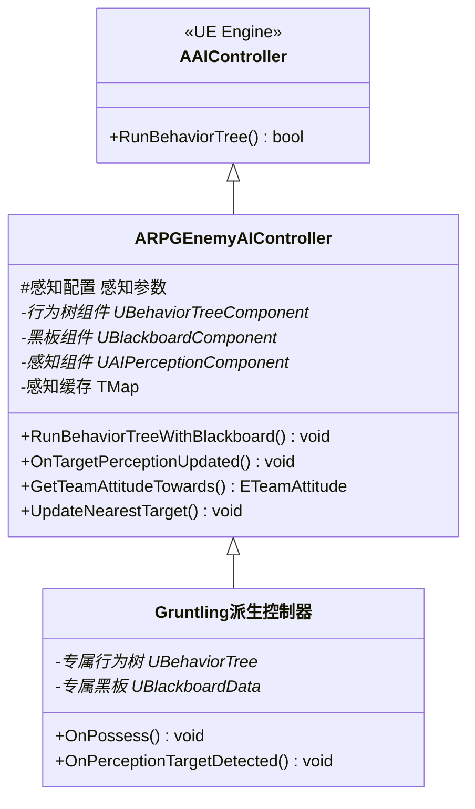

**图3.8 AI控制器类图**

图3.8展示了AI控制器的三层继承体系。AAIController为UE引擎基类，提供行为树运行和黑板管理的基础功能。ARPGEnemyAIController作为项目基类，封装完整的感知配置（视觉半径、边缘视野角度等）、感知缓存管理和目标选择算法，实现RunBehaviorTreeWithBlackboard和OnTargetPerceptionUpdated等核心方法。Gruntling派生控制器重写OnPossess绑定专属行为树和黑板资产，重写OnPerceptionTargetDetected实现特定兵种的感知响应逻辑。该继承体系保证了AI基础功能的复用，同时支持不同兵种的差异化配置。

### 3.8.2 行为树与感知系统架构

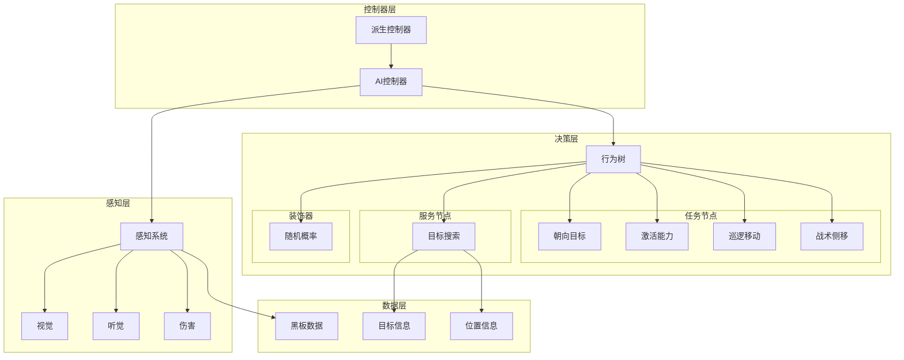

**图3.8 AI模块架构图**

图3.8展示了AI模块的四层架构与决策流程。控制器层包含AI基类控制器和派生控制器，负责整体AI生命周期管理。决策层以行为树为核心，包含任务节点（朝向目标、激活能力、巡逻移动、战术侧移）、服务节点（目标搜索）和装饰器（随机概率），实现分层决策逻辑。数据层通过黑板存储目标信息、位置信息等共享数据，供行为树节点读写。感知层包含视觉、听觉、伤害三种感知通道，检测玩家位置和环境变化并更新黑板数据。核心数据流为：感知层检测目标 → 更新黑板数据 → 服务节点扫描感知缓存 → 装饰器判断条件 → 任务节点执行动作。该架构实现了感知、决策、执行的分离，支持灵活的AI行为配置。

AI模块的核心设计特点：

（1）**多层感知融合系统**，AI控制器配置三种感知通道：视觉感知（检测视线范围内的目标）、听觉感知（检测玩家奔跑和攻击声音）、伤害感知（响应受到的攻击）。感知系统通过回调更新感知缓存，并通过目标选择算法将最近目标写入黑板的目标信息键。

（2）**行为树分层决策架构**，行为树采用“服务节点持续更新→装饰器条件判断→任务节点执行动作”的运行机制。目标搜索服务定期扫描感知缓存，更新黑板中的目标信息；随机概率装饰器为巡逻和侧移行为添加随机性；战术侧移任务通过环境查询系统寻找掩体位置，实现战术性移动。

（3）**黑板数据共享机制**，黑板作为行为树节点间的数据枢纽，包含目标信息、位置信息等关键数据。服务节点负责写入数据，任务节点负责读取数据，装饰器节点负责条件判断，实现节点间的松耦合通信。

（4）**派生兵种差异化行为**，不同兵种控制器绑定专属行为树，实现差异化的战斗逻辑和警戒模式。派生控制器通过重写感知响应方法调优感知阈值，实现不同兵种的战术差异。

## 3.9 战斗系统模块概要设计

战斗系统模块负责管理角色的武器注册、碰撞检测、连招计数和命中处理。战斗系统采用分层组件架构，UPawnCombatComponent作为基类提供通用功能，子类添加角色特有逻辑。

### 3.9.1 战斗系统类结构

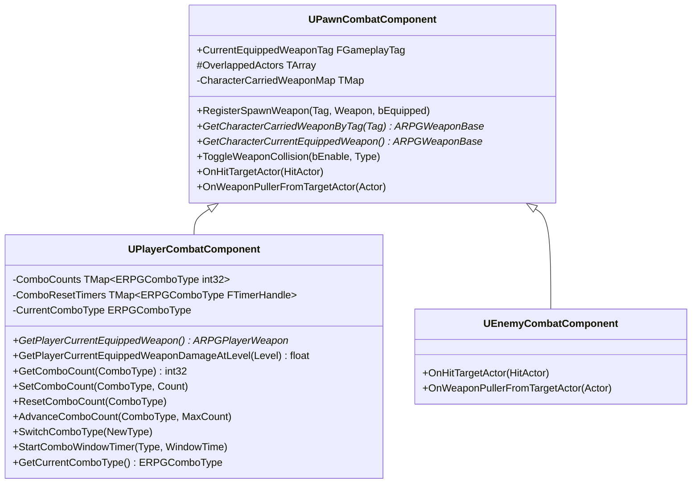

**图3.9 战斗系统类图**

战斗系统的连招管理采用分通道设计，通过ERPGComboType枚举（LightAttack/HeavyAttack）区分攻击类型。每个通道维护独立的连招计数和定时器。当玩家切换攻击类型时，SwitchComboType方法重置对方通道的计数器。连招窗口通过定时器控制，窗口关闭后自动重置连招计数。

## 3.10 武器系统模块概要设计

武器系统模块负责管理武器实体的创建、碰撞检测和能力授予。武器采用Actor架构，支持挂载到角色骨骼插槽。

### 3.10.1 武器系统架构

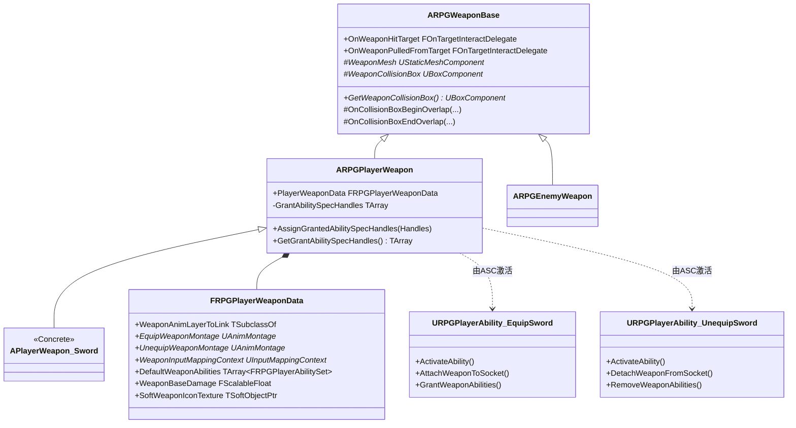

**图3.10 武器系统类图**

FRPGPlayerWeaponData结构封装了武器的完整配置：WeaponAnimLayerToLink指定武器对应的动画层类、EquipWeaponMontage/UnequipWeaponMontage定义装卸动画、WeaponInputMappingContext提供武器专属输入映射、DefaultWeaponAbilities定义武器授予的能力集合、WeaponBaseDamage提供可缩放的基础伤害值。武器的装备与卸下整体建模为符号对称的两个GameplayAbility（URPGPlayerAbility_EquipSword与URPGPlayerAbility_UnequipSword）：装备时由InputTag_EquipSword驱动ASC激活，执行Socket附加、武器动画层链接、IMC追加和DefaultWeaponAbilities授予；卸下时由InputTag_UnequipSword驱动对称地执行解附加、动画层解链、IMC移除与AbilitySpec移除。APlayerWeapon_Sword是ARPGPlayerWeapon的具体破剑子类，仅对特定参数进行覆盖。

## 3.11 能力系统模块概要设计

能力系统模块基于UE5的Gameplay Ability System实现，提供属性管理、能力授予与激活、GameplayEffect应用和伤害计算等核心功能。系统采用分层能力架构，通过三支派生体系支持玩家、敌人和共享能力的差异化配置。数据驱动的属性集定义四类属性，配合伤害执行计算实现完整的战斗数值体系，支持网络复制和分布式计算。

### 3.11.1 能力系统核心组件

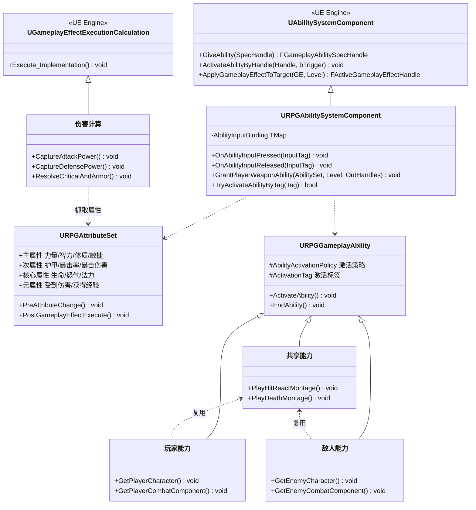

**图3.11 能力系统类图**

图3.11展示了能力系统的核心组件与继承关系。URPGAbilitySystemComponent扩展自UE引擎的UAbilitySystemComponent，添加输入标签处理、武器能力授予和标签激活能力等方法。URPGAttributeSet定义四类属性：主属性（力量/智力/体质/敏捷）、次属性（护甲/暴击率/暴击伤害）、核心属性（生命/怒气/法力）和元属性（受到伤害/获得经验），通过PreAttributeChange和PostGameplayEffectExecute处理属性变化。URPGGameplayAbility派生为玩家能力、敌人能力和共享能力三个分支，玩家和敌人能力提供对应角色的快捷接口，共享能力复用受击反应和死亡等通用逻辑。UGEExecCale_Damage继承自伤害执行计算基类，实现伤害公式的具体计算逻辑。

### 3.11.2 能力系统架构

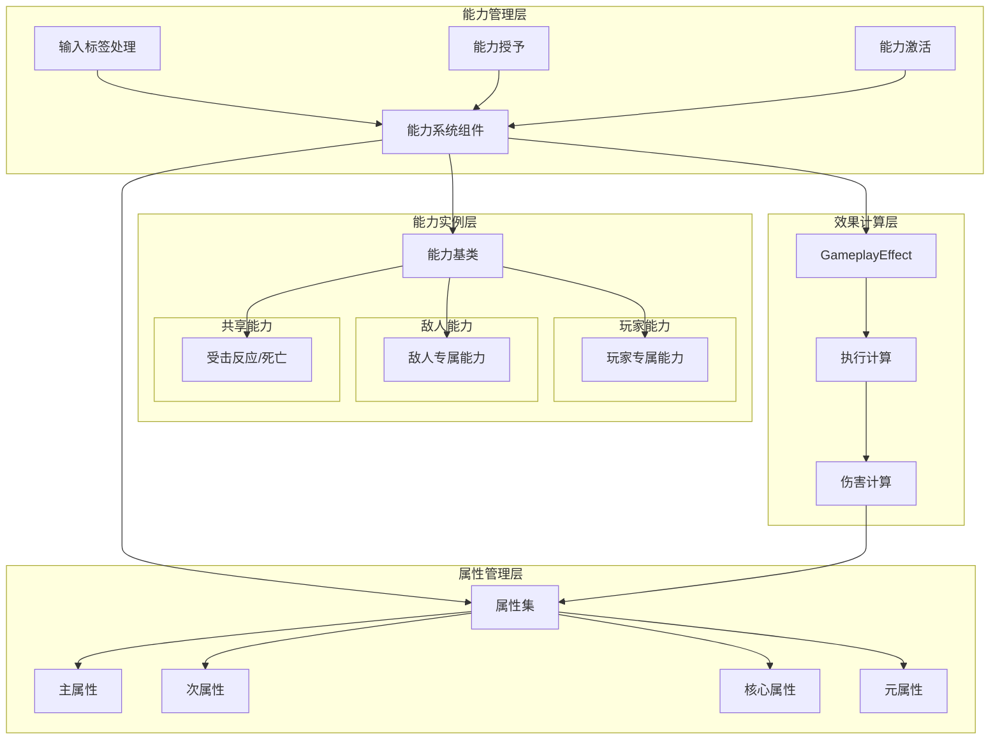

**图3.12 能力系统架构图**

图3.12展示了能力系统的四层架构与数据流向。能力管理层通过能力系统组件处理输入标签、能力授予和能力激活，是能力系统的控制中心。属性管理层包含属性集及四类属性，管理角色的所有数值属性，支持属性派生和网络复制。能力实例层包含能力基类及三支派生，玩家能力处理玩家专属逻辑，敌人能力处理敌人专属逻辑，共享能力复用受击反应和死亡动画等通用行为。效果计算层包含GameplayEffect、执行计算和伤害计算，负责属性修改和伤害公式计算。核心数据流为：输入标签触发能力激活 → 能力系统读取属性数据 → 执行GameplayEffect → 伤害计算抓取属性并计算最终伤害 → 写回元属性。该架构实现了能力管理、属性存储、实例逻辑和效果计算的分离，支持灵活的能力扩展。

能力系统模块的核心设计特点：

（1）**扩展能力系统组件**，URPGAbilitySystemComponent继承自UAbilitySystemComponent，添加输入标签处理能力（OnAbilityInputPressed/Released），将输入动作映射到对应的GameplayAbility。提供武器能力授予方法（GrantPlayerWeaponAbility）支持动态能力管理，以及标签激活能力方法（TryActivateAbilityByTag）实现行为树驱动的能力触发。

（2）**分层属性集设计**，URPGAttributeSet定义四类属性：主属性（力量/智力/体质/敏捷）影响角色基础能力值，次属性（护甲/暴击率/暴击伤害/生命回复/法力回复）由主属性派生或通过装备修改，核心属性（当前/最大生命值、怒气值、法力值）管理角色战斗资源，元属性（受到伤害、获得经验、攻击力、防御力）用于临时计算和数据传递。所有核心属性支持网络复制。

（3）**三支能力派生体系**，URPGGameplayAbility派生为玩家能力、敌人能力和共享能力三个分支。玩家能力提供玩家角色和战斗组件的快捷接口，敌人能力提供敌人角色和战斗组件的快捷接口，共享能力为受击反应和死亡等通用行为提供复用实现，避免玩家和敌人重复实现相同逻辑。

（4）**伤害执行计算**，UGEExecCale_Damage继承自UGameplayEffectExecutionCalculation，从源和目标ASC抓取攻击力、防御力、护甲、暴击率、暴击伤害等属性，结合SetByCaller传递的基础伤害值，通过临界值和护甲减免公式计算最终伤害，并写回受到伤害元属性。支持暴击判定和护甲减伤的双重计算逻辑。

URPGGameplayAbility派生为三支：URPGPlayerGameplayAbility为玩家能力提供玩家角色与战斗组件的快捷接口；URPGEnemyGameplayAbility为敌人能力提供敌人角色与战斗组件的快捷接口；URPGSharedGameplayAbility为Shared_Ability_HitReact与Shared_Ability_Death等通用行为提供复用实现，玩家和敌人通过集成共享分支避免重复实现。URPGAttributeSet定义四类属性：主属性（力量、智力、体质、敏捷）影响角色基础能力；次属性（护甲、暴击率、暴击伤害、生命回复、法力回复）由主属性派生；核心属性（当前/最大生命值、怒气值、法力值）管理角色资源；元属性（受到伤害、获得经验、攻击力、防御力）用于临时计算。所有核心属性支持网络复制（ReplicatedUsing）。UGEExecCale_Damage作为伤害执行计算，从源/目标ASC抓取AttackPower、DefensePower、Armor、CriticalHitChance、CriticalHitDamage等属性，结合SetByCaller的基础伤害计算最终伤害并写回DamageTaken元属性。

## 3.12 数据资产模块概要设计

数据资产模块采用UDataAsset实现数据驱动设计，将角色属性、输入配置、启动能力等运行时数据从代码中分离，支持编辑器内配置和平衡性调整。系统通过继承体系管理不同类型的数据资产，包含输入配置资产、角色配置资产、敌人配置资产和启动能力资产，所有配置数据通过GameplayEffect在运行时应用到能力系统，实现数据与逻辑的完全解耦。

### 3.12.1 数据资产体系

**图3.12 数据资产类图**

图3.12展示了数据资产的继承体系与核心类结构。UDataAsset_InputConfig管理输入映射配置，包含默认映射上下文、原生输入动作数组和能力输入动作数组，通过FindNativeInputActionByTag方法实现标签查找。UDataAsset_CharacterConfig定义玩家角色属性，包含角色名称、职业类型和基础属性结构，通过ApplyAttributesToASC方法将属性应用到能力系统。UDataAsset_EnemyConfig针对敌人配置，包含敌人名称、类型和基础属性，支持抗性系统和掉落配置。UDataAsset_StartUpDataBase作为启动能力基类，定义已激活能力数组、被动能力数组和启动GameplayEffect数组，子类UDataAsset_PlayerStartUpData添加玩家专属能力集合，UDataAsset_EnemyStartUpData用于敌人启动配置。FCharacterBaseAttributes结构包含主属性（力量/智力/体质/敏捷）、次属性（护甲/暴击率/暴击伤害）和核心属性（生命/怒气/法力），FEnemyBaseAttributes包含核心资源、战斗属性、抗性系统和掉落配置。

### 3.12.2 数据驱动架构图

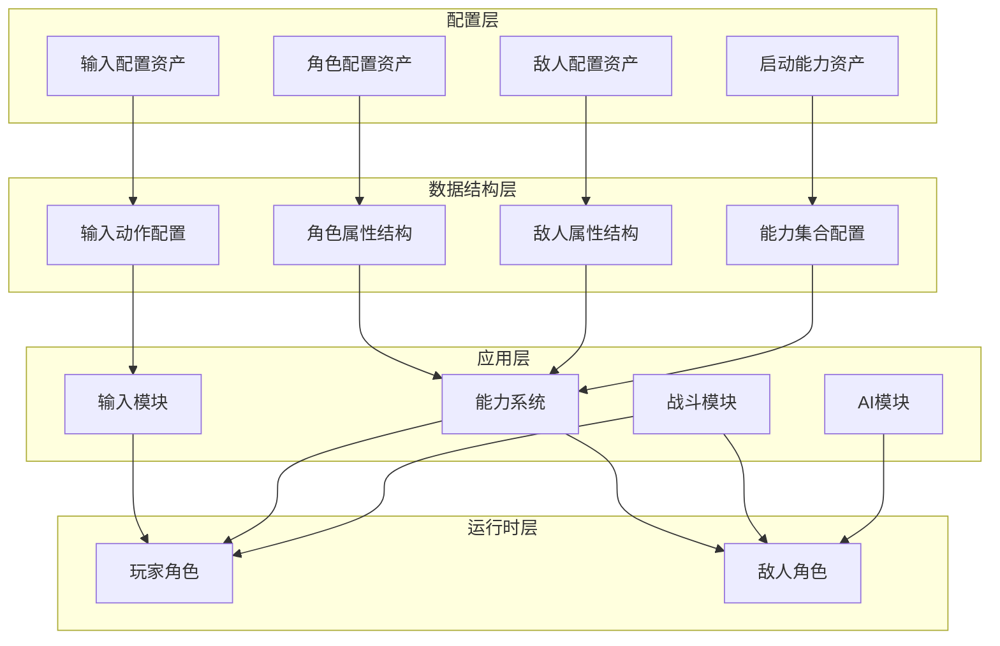

**图3.13 数据驱动架构图**

图3.13展示了数据资产如何驱动游戏各模块的运行机制。配置层包含四类数据资产：输入配置资产管理输入映射，角色配置资产定义玩家属性，敌人配置资产定义敌人属性，启动能力资产管理初始能力配置。数据结构层将配置数据组织为结构化数据，包含角色属性结构、敌人属性结构、输入动作配置和能力集合配置。应用层读取配置数据并应用到对应模块，输入模块读取输入动作配置实现输入绑定，能力系统读取角色和敌人属性通过GameplayEffect应用，战斗模块和AI模块读取配置实现差异化行为。运行时层根据配置数据实例化玩家和敌人角色。核心数据流为：编辑器配置数据资产 → 数据结构化组织 → 运行时读取并应用到模块 → 模块根据配置驱动角色行为。该架构实现了数据与逻辑的完全解耦，支持策划人员通过编辑器调整配置而无需修改代码，提升开发效率和游戏平衡性调整速度。

## 3.13 对象池与生命周期模块概要设计

为应对战斗高峰期大量敌人实例的创建/销毁性能压力，系统提供对象池与生命周期模块。URPGEnemyPoolSubsystem继承自UWorldSubsystem，随UWorld创建/销毁（编辑器预览环境通过ShouldCreateSubsystem过滤），管理当前世界的敌人实例池，降低运行时SpawnActor与DestroyActor的频率。

### 3.13.1 对象池模块架构

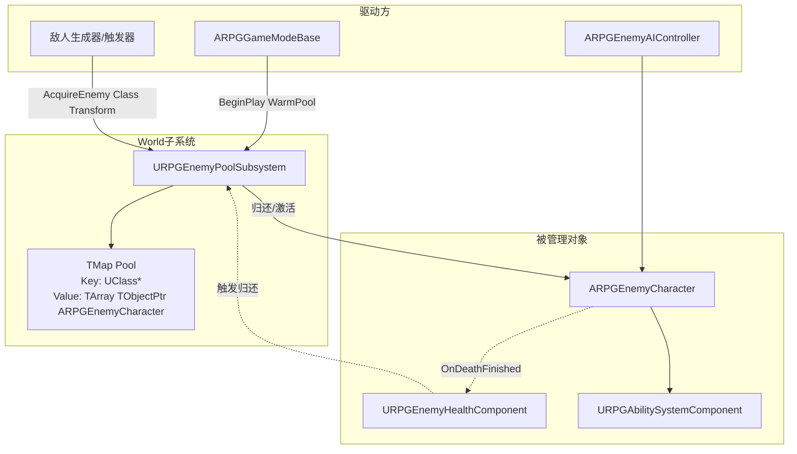

**图3.13 对象池与生命周期架构图**

对象池的核心设计要点：

（1）按类分桶存储，以TSubclassOf<ARPGEnemyCharacter>为键维护独立Bucket，避免不同克隆之间的状态污染，同时使返回和取出达到O(1)复杂度。

（2）预热阶段由ARPGGameModeBase驱动，在BeginPlay时按配置批量调用WarmPool，每个敌人类型按预设数量SpawnActor以默认参数（零变换、禁用碰撞）实例化，随后立即置为休眠状态（隐藏、禁用碰撞、禁用Tick）并挂入Bucket。

（3）获取阶段由关卡触发器通过AcquireEnemy(Class, Transform)请求：如相应Bucket有空闲实例则弹出一个并Teleport到目标位姿、重置ASC属性与Tag、重新启用碰撞与Tick、重新初始化行为树；如Bucket为空则回退到标准的SpawnActor路径并记录扩容。

（4）归还阶段由敌人死亡流程触发：URPGEnemyHealthComponent在死亡动画/DestroyDelay结束后调用归还接口，对象池重置属性、清理Effect/Tag、停用碰撞与Tick、并挂回Bucket；由于实例不销毁，AI感知与UIManager对该实例的弱引用缓存可在后续被复用时重用。

（5）与数据资产联动，预热数量来自ARPGGameModeBase的配置表（按敌人类/环境难度设定上限），新增敌人时只需新增条目无需代码修改，维持数据驱动的一致风格。
