# 3 概要设计

## 3.1 系统总体架构设计

本课题基于Unreal Engine 5.6引擎开发第三人称角色扮演游戏，系统采用组件化架构（Component-Based Architecture）与事件驱动通信机制，实现高内聚低耦合的模块化设计。系统总体架构分为五个层次：表现层（Presentation Layer）、控制层（Control Layer）、逻辑层（Logic Layer）、数据层（Data Layer）和基础设施层（Infrastructure Layer）。

系统总体架构如图3.1所示：

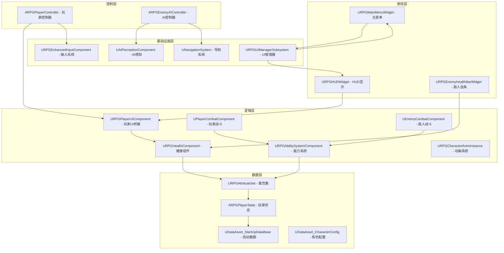

**图3.1 系统总体架构图**

架构设计的核心原则包括：

（1）组件化设计，功能模块通过ActorComponent实现，按需挂载到Pawn或Character上。健康系统通过URPGHealthComponent组件实现，战斗系统通过UPlayerCombatComponent组件实现，UI桥接通过URPGPlayerUIComponent组件实现，能力系统通过URPGAbilitySystemComponent组件实现。所有Pawn扩展组件继承自UPawnExtensionComponentBase基类，该基类提供类型安全的GetOwningPawn<T>()模板方法，用于获取Owner Pawn的强类型引用。

（2）事件驱动通信，模块间通过动态多播委托（Dynamic Multicast Delegate）和GameplayTag实现松耦合通信。健康组件通过OnHealthChanged委托广播生命值变化，UI组件订阅该委托并更新UI显示。战斗组件通过FOnTargetInteractDelegate委托通知武器命中事件。GameplayTag系统定义了完整的标签层次结构（Input/Player/Enemy/Shared/UI），用于能力系统的输入驱动和状态标记。

（3）分层解耦，系统采用"数据组件 → UI组件 → UI Widget"的三层分离架构。URPGHealthComponent负责健康数据管理，UPawnUIComponent负责数据转换和事件转发，URPGHUDWidget负责UI显示。三层之间通过接口（IPawnUIInterface、IPawnCombatInterface、IPawnDeathInterface）和委托交互，任何一层的修改不影响其他层。

（4）数据驱动配置，系统采用DataAsset资产实现数据驱动设计。角色属性通过UDataAsset_CharacterConfig配置，输入映射通过UDataAsset_InputConfig配置，启动能力通过UDataAsset_StartUpDataBase配置。运行时通过GameplayEffect将配置数据应用到ASC，支持编辑器内实时调整而无需重新编译。

## 3.2 模块总体设计

根据系统总体架构，本课题将系统拆分为十大核心模块：输入模块、控制模块、动画模块、健康系统模块、UI系统模块、AI模块、战斗系统模块、武器系统模块、能力系统模块和数据资产模块。各模块职责明确，通过接口和委托进行交互。

### 3.2.1 模块关系图

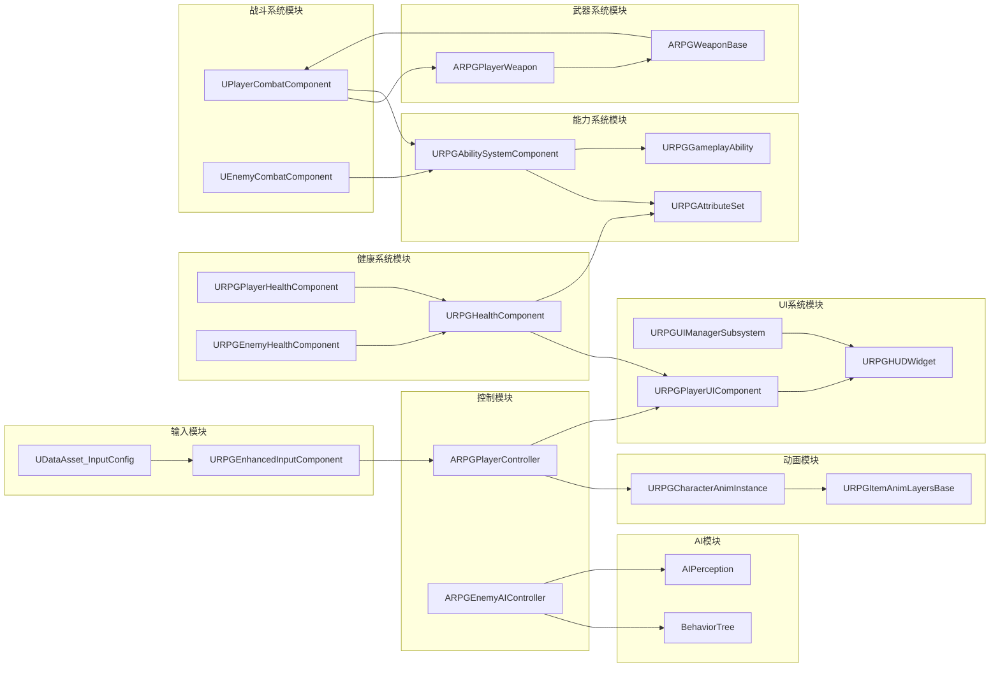

**图3.2 模块关系图**

### 3.2.2 模块职责说明

（1）输入模块（Input Module），基于UE5增强输入系统（Enhanced Input）实现，通过URPGEnhancedInputComponent提供模板化的输入绑定方法。输入模块使用UDataAsset_InputConfig数据资产定义输入映射，将输入动作分为NativeInputActions（移动、视角等原生输入）和AbilityInputActions（能力驱动的输入），后者通过GameplayTag标签驱动能力系统响应。

（2）控制模块（Control Module），包含ARPGPlayerController（玩家控制器）和ARPGEnemyAIController（AI控制器）。ARPGPlayerController继承自ARPGBaseController（实现IGenericTeamAgentInterface），管理玩家团队ID和HUD显示。ARPGEnemyAIController独立继承自AAIController，包含BehaviorTreeComponent、BlackboardComponent和AIPerceptionComponent，驱动敌人AI决策。两者通过IGenericTeamAgentInterface实现团队系统的敌友识别。

（3）动画模块（Animation Module），包含三层动画实例：URPGBaseAnimInstance（基础运动参数计算）、URPGCharacterAnimInstance（跳跃状态机、步态系统、Linked Anim Layers管理）、URPGItemAnimLayersBase（武器动画层数据同步）。动画模块通过跳跃状态机（EJumpState: None/Start/Loop/Land）管理跳跃动画阶段，通过GaitAmount步态比例驱动BlendSpace混合，通过LinkAnimLayer方法实现运行时武器动画层的热切换。

（4）健康系统模块（Health System Module），采用分层继承架构。URPGHealthComponent作为基类通过InitializeWithAbilitySystem方法绑定ASC，监听属性变化并广播四个动态多播委托（OnHealthChanged、OnMaxHealthChanged、OnDeathStarted、OnDeathFinished）。URPGPlayerHealthComponent添加无敌状态（InvincibleDuration）和复活机制（Revive）。URPGEnemyHealthComponent添加死亡动画（DeathAnimationDuration）和销毁延迟（DestroyDelay）。

（5）UI系统模块（UI System Module），采用CommonUI框架和四层栈架构。URPGUIManagerSubsystem继承自UGameUIManagerSubsystem，通过GameplayTag标签（RPGCommonUI_WidgetStack_Modal/GameMenu/GameHUD/Frontend）管理四层栈。URPGPlayerUIComponent作为数据桥接层，继承自UPawnUIComponent基类，订阅HealthComponent事件并转发为UI友好格式。URPGEnemyUIComponent添加距离检测和血条可见性控制。

（6）AI模块（AI Module），通过ARPGEnemyAIController管理行为树和AI感知。AI感知配置包含SightRadius（视觉半径）、LoseSightRadius（丢失视觉半径）、PeripheralVisionAngle（边缘视野角度）、PerceptionMaxAge（感知有效期）。行为树任务包含BTTask_RotateToFaceTarget（朝向目标）、BTTask_ActivateAbilityByTag（标签激活能力）、BTTask_FindRandomPatrolPoint（随机巡逻点）、BTTask_FindStrafingPoint_EQS（环境查询侧移点）。

（7）战斗系统模块（Combat System Module），采用分层组件架构。UPawnCombatComponent作为基类管理武器注册（CharacterCarriedWeaponMap）和碰撞切换（ToggleWeaponCollision）。UPlayerCombatComponent添加连招管理系统，通过TMap<ERPGComboType, int32>分通道（轻击/重击）管理连招计数，通过定时器控制连招窗口。UEnemyCombatComponent重写命中检测逻辑，提供敌人特有的碰撞控制。

（8）武器系统模块（Weapon System Module），ARPGWeaponBase作为武器基类包含WeaponMesh（静态网格）和WeaponCollisionBox（碰撞盒），通过FOnTargetInteractDelegate委托通知命中和拔出事件。ARPGPlayerWeapon持有FRPGPlayerWeaponData结构（动画层、装卸蒙太奇、武器输入映射、基础伤害、武器图标），并管理GrantedAbilitySpecHandles用于能力授予和移除。

（9）能力系统模块（GAS Module），URPGAbilitySystemComponent扩展UAbilitySystemComponent，提供OnAbilityInputPressed/Released输入标签处理、GrantPlayerWeaponAbility武器能力授予、TryActivateAbilityByTag标签激活能力。URPGAttributeSet定义四类属性：主属性（Strength/Intelligence/Vitality/Agility）、次属性（Armor/CriticalHitChance/CriticalHitDamage/HealthRegeneration/ManaRegeneration）、核心属性（CurrentHealth/MaxHealth/CurrentRage/MaxRage/CurrentMana/MaxMana）、元属性（DamageTaken/IncomingXP/AttackPower/DefensePower）。URPGGameplayAbility提供两种激活策略（OnTriggered/OnGive）。

（10）数据资产模块（Data Asset Module），采用数据驱动设计。UDataAsset_InputConfig定义输入映射（DefaultMappingContext、NativeInputActions、AbilityInputActions）。UDataAsset_CharacterConfig定义玩家角色属性（FCharacterBaseAttributes）。UDataAsset_EnemyConfig定义敌人属性（FEnemyBaseAttributes，包含抗性系统）。UDataAsset_StartUpDataBase定义启动能力（ActiveOnGivenAbilities、ReactiveAbilities、StartUpGameplayEffect），子类UDataAsset_PlayerStartUpData添加PlayerStartUpAbilitySet（InputTag + AbilityToGrant配对）。

## 3.3 输入模块概要设计

输入模块基于UE5增强输入系统（Enhanced Input）实现，通过URPGEnhancedInputComponent提供模板化的输入绑定方法，并使用UDataAsset_InputConfig数据资产实现输入配置的数据驱动。

### 3.3.1 输入模块架构

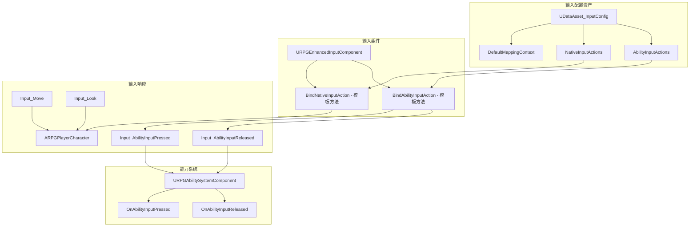

**图3.3 输入模块架构图**

输入模块的核心设计特点：

（1）模板化绑定方法，URPGEnhancedInputComponent通过C++模板方法BindNativeInputAction和BindAbilityInputAction实现类型安全的输入绑定。BindNativeInputAction接受InputConfig、InputTag、TriggerEvent和回调函数参数，通过FindNativeInputActionByTag查找对应的UInputAction并绑定。BindAbilityInputAction遍历AbilityInputActions数组，为每个有效配置分别绑定Started和Completed事件。

（2）GameplayTag驱动的能力输入，AbilityInputActions使用FRPGInputActionConfig结构，将InputTag与InputAction配对。当输入触发时，系统将InputTag传递给ASC的OnAbilityInputPressed方法，ASC遍历已授予的能力找到匹配标签的能力并激活。这种设计实现了输入与能力的解耦，添加新能力只需配置数据资产，无需修改代码。

（3）数据驱动的输入配置，UDataAsset_InputConfig将所有输入映射集中管理，包含DefaultMappingContext（默认输入映射上下文）、NativeInputActions（原生输入动作数组）和AbilityInputActions（能力输入动作数组）。编辑器内可直接修改配置，支持多套输入方案切换。

## 3.4 控制模块概要设计

控制模块负责协调输入模块、动画模块、健康系统模块和UI系统模块的工作，实现角色的整体控制逻辑。控制模块包含两条独立的继承链：玩家控制器链（APlayerController → ARPGBaseController → ARPGPlayerController）和AI控制器链（AAIController → ARPGEnemyAIController）。

### 3.4.1 控制器类结构

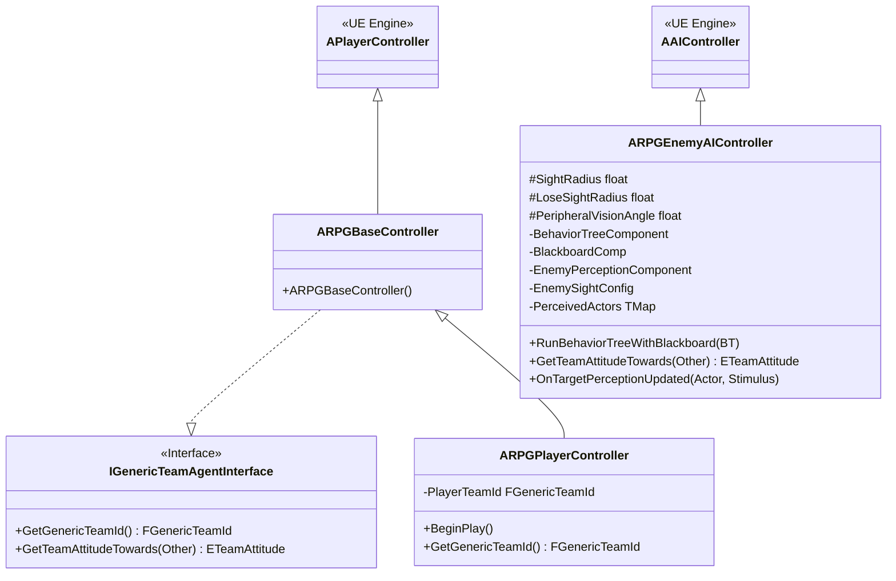

**图3.4 控制器类图**

ARPGPlayerController的核心职责包括团队ID管理（PlayerTeamId = 0，中立团队）和UI初始化。ARPGEnemyAIController独立继承AAIController，包含完整的AI感知配置（SightRadius、LoseSightRadius、PeripheralVisionAngle、PerceptionMaxAge）、感知目标缓存（PerceivedActors TMap）和黑板数据更新（UpdateNearestTarget）。

## 3.5 动画模块概要设计

动画模块负责管理角色的动画状态机、动画混合空间和动画蒙太奇。动画模块采用三层动画实例架构：URPGBaseAnimInstance提供基础运动参数，URPGCharacterAnimInstance实现角色动画状态管理，URPGItemAnimLayersBase实现武器动画层数据同步。

### 3.5.1 动画模块架构

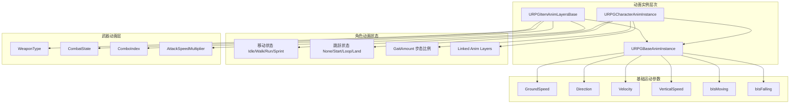

**图3.5 动画模块架构图**

动画模块的核心设计特点：

（1）跳跃状态机（Jump State Machine），通过EJumpState枚举（None/Start/Loop/Land）管理跳跃动画阶段。URPGCharacterAnimInstance维护TimeSinceJumpStart、TimeSinceGrounded等内部跟踪变量，配置JumpStartVerticalSpeedThreshold和LandDetectionDelay等参数，实现精确的跳跃动画切换。

（2）GaitAmount步态系统，通过GaitAmount浮点值（0.0-3.0）驱动BlendSpace混合。Idle对应0.0，Walk对应1.0，Run对应2.0，Sprint对应3.0。步态系统通过速度阈值（WalkSpeedThreshold/RunSpeedThreshold/SprintSpeedThreshold）计算当前GaitAmount，实现平滑的步态过渡。

（3）Linked Anim Layers武器动画切换，通过LinkAnimLayer/UnlinkAnimLayer方法实现运行时动画层的热切换。当玩家装备不同武器时，URPGCharacterAnimInstance链接对应的URPGItemAnimLayersBase子类，该子类每帧从PlayerCombatComponent同步战斗状态数据（CombatState、ComboIndex、bIsInComboWindow等），驱动武器特有的动画逻辑。

## 3.6 健康系统模块概要设计

健康系统模块负责管理角色的生命值、死亡状态、复活逻辑等健康相关数据。健康系统采用分层继承架构，通过动态多播委托实现事件广播，支持UI组件和其他模块订阅健康状态变化。

### 3.6.1 健康系统类结构

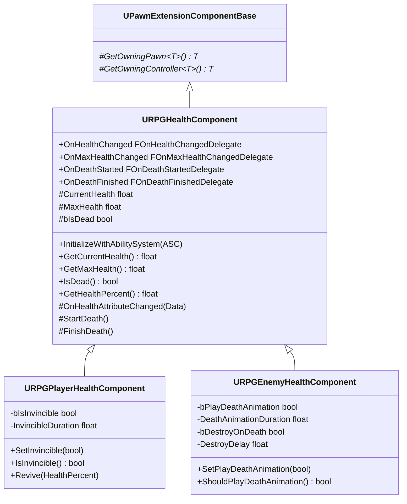

**图3.6 健康系统类图**

## 3.7 UI系统模块概要设计

UI系统模块负责管理游戏的所有UI界面，采用CommonUI框架和四层栈架构，通过URPGUIManagerSubsystem统一管理UI生命周期。UI系统通过UPawnUIComponent作为数据桥接层基类，实现健康系统与UI Widget的解耦。

### 3.7.1 UI系统架构

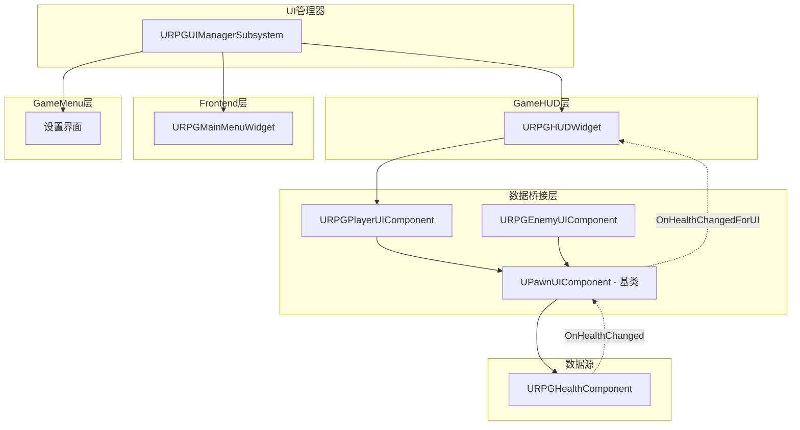

**图3.7 UI系统架构图**

UI系统通过GameplayTag标签管理四层栈：RPGCommonUI_WidgetStack_Modal（模态层）、RPGCommonUI_WidgetStack_GameMenu（游戏菜单层）、RPGCommonUI_WidgetStack_GameHUD（游戏HUD层）、RPGCommonUI_WidgetStack_Frontend（前端层）。URPGUIManagerSubsystem提供PushSoftWidgetToStackAsync方法异步加载和推送Widget，支持软引用避免资源常驻内存。

## 3.8 AI模块概要设计

AI模块负责实现敌人的智能行为，采用行为树（Behavior Tree）和黑板（Blackboard）架构，通过AIPerception系统感知玩家位置和环境信息。

### 3.8.1 AI模块架构

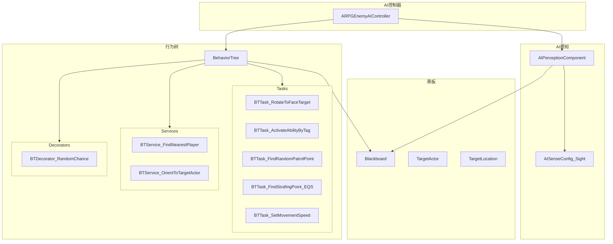

**图3.8 AI模块架构图**

ARPGEnemyAIController配置的AI感知参数包括：SightRadius（视觉感知半径）、LoseSightRadius（丢失视觉半径）、PeripheralVisionAngle（边缘视野角度）、PerceptionMaxAge（感知信息有效期）、bDetectEnemies（是否检测敌人）。感知系统通过OnTargetPerceptionUpdated回调更新PerceivedActors缓存，并通过UpdateNearestTarget方法将最近目标写入黑板。

## 3.9 战斗系统模块概要设计

战斗系统模块负责管理角色的武器注册、碰撞检测、连招计数和命中处理。战斗系统采用分层组件架构，UPawnCombatComponent作为基类提供通用功能，子类添加角色特有逻辑。

### 3.9.1 战斗系统类结构

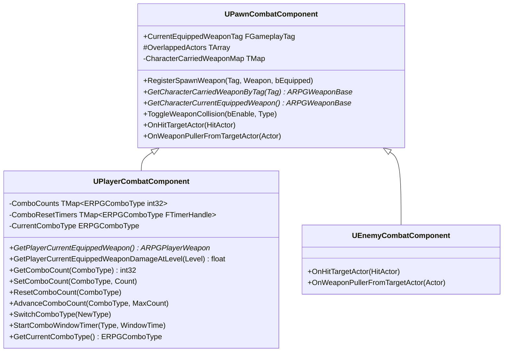

**图3.9 战斗系统类图**

战斗系统的连招管理采用分通道设计，通过ERPGComboType枚举（LightAttack/HeavyAttack）区分攻击类型。每个通道维护独立的连招计数和定时器。当玩家切换攻击类型时，SwitchComboType方法重置对方通道的计数器。连招窗口通过定时器控制，窗口关闭后自动重置连招计数。

## 3.10 武器系统模块概要设计

武器系统模块负责管理武器实体的创建、碰撞检测和能力授予。武器采用Actor架构，支持挂载到角色骨骼插槽。

### 3.10.1 武器系统架构

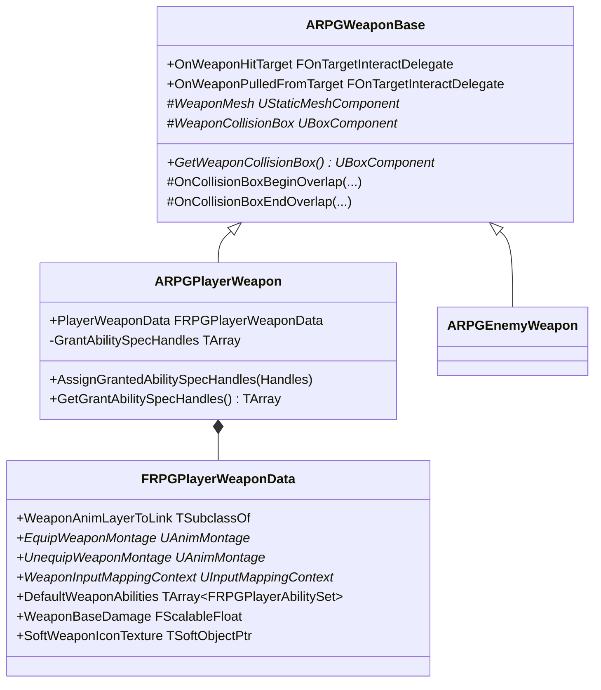

**图3.10 武器系统类图**

FRPGPlayerWeaponData结构封装了武器的完整配置：WeaponAnimLayerToLink指定武器对应的动画层类、EquipWeaponMontage/UnequipWeaponMontage定义装卸动画、WeaponInputMappingContext提供武器专属输入映射、DefaultWeaponAbilities定义武器授予的能力集合、WeaponBaseDamage提供可缩放的基础伤害值。

## 3.11 能力系统模块概要设计

能力系统模块基于UE5的Gameplay Ability System（GAS）实现，提供属性管理、能力授予/激活、GameplayEffect应用等功能。

### 3.11.1 能力系统架构

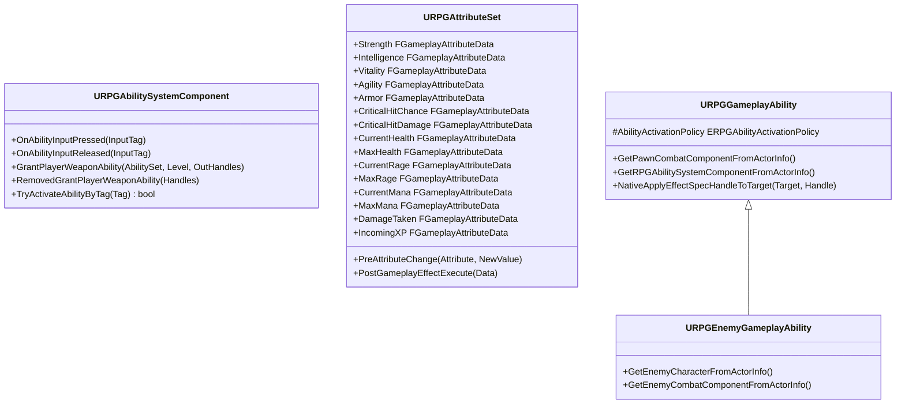

**图3.11 能力系统类图**

URPGAttributeSet定义四类属性：主属性（力量、智力、体质、敏捷）影响角色基础能力；次属性（护甲、暴击率、暴击伤害、生命回复、法力回复）由主属性派生；核心属性（当前/最大生命值、怒气值、法力值）管理角色资源；元属性（受到伤害、获得经验、攻击力、防御力）用于临时计算。所有核心属性支持网络复制（ReplicatedUsing）。

## 3.12 数据资产模块概要设计

数据资产模块采用UDataAsset实现数据驱动设计，将角色属性、输入配置、启动能力等运行时数据从代码中分离，支持编辑器内配置和热更新。

### 3.12.1 数据资产体系

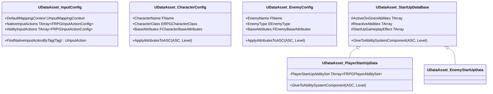

**图3.12 数据资产类图**

FCharacterBaseAttributes结构包含主属性（Strength/Intelligence/Vitality/Agility）、次属性（Armor/CriticalHitChance/CriticalHitDamage/HealthRegeneration/ManaRegeneration）和核心属性（MaxHealth/MaxRage/MaxMana/AttackPower/DefensePower）。FEnemyBaseAttributes针对敌人简化设计，包含核心资源（MaxHealth）、战斗属性（AttackPower/DefensePower）、抗性系统（Armor/MagicResistance/StaggerResistance/PoisonResistance/BleedResistance）和掉落配置（GoldDrop/EXPDrop）。
